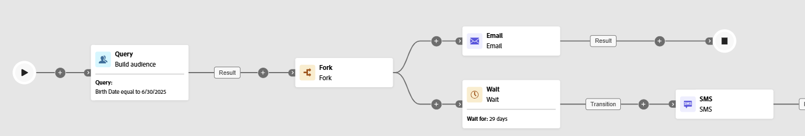

# Aguardar {#wait}

>[!CONTEXTUALHELP]
>id="ajo_orchestration_wait"
>title="Atividade aguardar"
>abstract="A atividade **Aguardar** é usada para atrasar a transição de uma atividade para outra."

+++ Índice 

| Bem-vindo(a) às campanhas orquestradas | Lançar a sua primeira campanha orquestrada | Consultar o banco de dados | Atividades de campanhas orquestradas |
|---|---|---|---|
| [Introdução a campanhas orquestradas](../gs-orchestrated-campaigns.md)  Criar e gerenciar Esquemas e Conjuntos de Dados relacionais:  <ul><li>[Introdução a Esquemas e Conjuntos de Dados](../gs-schemas.md)</li><li>[Esquema manual](../manual-schema.md)</li><li>[Esquema de carregamento de arquivo](../file-upload-schema.md)</li><li>[Assimilar dados](../ingest-data.md)</li></ul>[Acessar e gerenciar campanhas orquestradas](../access-manage-orchestrated-campaigns.md) | [Etapas principais para criar uma campanha orquestrada](../gs-campaign-creation.md)  [Criar e programar a campanha](../create-orchestrated-campaign.md)  [Orquestrar atividades](../orchestrate-activities.md)  [Iniciar e monitorar a campanha](../start-monitor-campaigns.md)  [Geração de relatórios](../reporting-campaigns.md) | [Trabalhar com o construtor de regras](../orchestrated-rule-builder.md)  [Criar a sua primeira consulta](../build-query.md)  [Editar expressões](../edit-expressions.md)  [Redirecionamento](../retarget.md) | [Introdução às atividades](about-activities.md)  Atividades: [Associação](and-join.md) - [Criar público-alvo](build-audience.md) - [Mudar dimensão](change-dimension.md) - [Atividades de canal](channels.md) - [Combinar](combine.md) - [Desduplicação](deduplication.md) - [Enriquecimento](enrichment.md) - [Bifurcação](fork.md) - [Reconciliação](reconciliation.md) - [Salvar público-alvo](save-audience.md) - [Divisão](split.md) - <b>[Aguardar](wait.md)</b> |

{style="table-layout:fixed"}

+++

 

>[!BEGINSHADEBOX]

 

O conteúdo desta página não é final e pode estar sujeito a alterações.

>[!ENDSHADEBOX]

A atividade **[!UICONTROL Aguardar]** é um componente de **[!UICONTROL Controle do fluxo]** usado para introduzir um atraso entre duas atividades de uma campanha orquestrada. Isso ajuda a garantir que as atividades de acompanhamento sejam cronometradas melhor e mais relevantes para o engajamento do usuário.

Por exemplo, você pode aguardar alguns dias após a entrega de um email para rastrear aberturas e cliques antes de enviar uma mensagem de acompanhamento.

## Configuração{#wait-configuration}

Siga estas etapas para configurar a atividade **[!UICONTROL Aguardar]**:

1. Adicione uma atividade **[!UICONTROL Aguardar]** à sua campanha orquestrada.

1. Selecione o tipo de espera que melhor supre as suas necessidades:

   * **[!UICONTROL Duração]**: especifique um atraso em segundos, minutos, horas ou dias antes de prosseguir para a próxima atividade.

   * **[!UICONTROL Hora fixa]**: defina uma data e uma hora específicas após as quais a próxima atividade iniciará.

   

## Exemplo{#wait-example}

O exemplo a seguir ilustra a atividade **[!UICONTROL Aguardar]** em um caso de uso típico. Um email com um código promocional é enviado a perfis que estão comemorando seus aniversários. Após 29 dias, um SMS é enviado ao mesmo grupo como lembrete de que o código promocional de aniversário está prestes a vencer.

