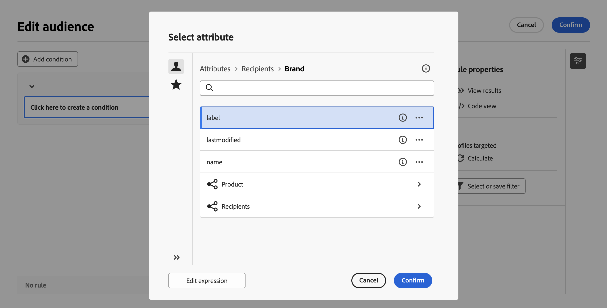

# Criar a sua primeira regra {#build-query}

+++ Índice 

| Bem-vindo às campanhas orquestradas | Iniciar sua primeira campanha orquestrada | Consultar o banco de dados | Atividades de campanhas orquestradas |
|---|---|---|---|
| [Introdução às campanhas orquestradas](gs-orchestrated-campaigns.md)  Criar e gerenciar esquemas e conjuntos de dados relacionais:  <ul><li>[Introdução a Esquemas e Conjuntos de Dados](gs-schemas.md)</li><li>[Esquema manual](manual-schema.md)</li><li>[Esquema de carregamento de arquivo](file-upload-schema.md)</li><li>[Assimilar dados](ingest-data.md)</li></ul>[Acesse e gerencie campanhas orquestradas](access-manage-orchestrated-campaigns.md)  [Etapas principais para criar uma campanha orquestrada](gs-campaign-creation.md) | [Criar e programar a campanha](create-orchestrated-campaign.md)  [Orquestrar atividades](orchestrate-activities.md)  [Iniciar e monitorar a campanha](start-monitor-campaigns.md)  [Geração de relatórios](reporting-campaigns.md) | [Trabalhar com o construtor de regras](orchestrated-rule-builder.md)  <b>[Criar a sua primeira consulta](build-query.md)</b>  [Editar expressões](edit-expressions.md)  [Redirecionamento](retarget.md) | [Introdução às atividades](activities/about-activities.md)  Atividades: [Associação](activities/and-join.md) - [Criar público-alvo](activities/build-audience.md) - [Mudar dimensão](activities/change-dimension.md) - [Atividades de canal](activities/channels.md) - [Combinar](activities/combine.md) - [Desduplicação](activities/deduplication.md) - [Enriquecimento](activities/enrichment.md) - [Bifurcação](activities/fork.md) - [Reconciliação](activities/reconciliation.md) - [Salvar público-alvo](activities/save-audience.md) - [Divisão](activities/split.md) - [Aguardar](activities/wait.md) |

{style="table-layout:fixed"}

+++

 

>[!BEGINSHADEBOX]

 

O conteúdo desta página não é final e pode estar sujeito a alterações.

>[!ENDSHADEBOX]

As principais etapas para criar regras para suas campanhas orquestradas são as seguintes:

1. **Adicionar condições**: crie condições personalizadas para filtrar a sua consulta, criando a sua própria condição com atributos do banco de dados e expressões avançadas.
1. **Combinar condições**: organize as condições na tela, usando grupos e operadores lógicos.
1. **Verificar e validar a regra**: verifique os dados resultantes da regra antes de salvá-la.

## Adicionar uma condição {#conditions}

Para adicionar condições à sua consulta, siga estas etapas:

1. Acesse o construtor de regras a partir de uma atividade **[!UICONTROL Criar público-alvo]**.

1. Clique no botão **Adicionar condição** para criar a primeira condição da sua consulta.

   Você também pode iniciar a consulta com um filtro predefinido. Para isso, clique no botão **[!UICONTROL Selecionar ou salvar filtro]** e escolha **[!UICONTROL Selecionar filtro predefinido]**.

   

1. Identifique o atributo do banco de dados a ser usado como critério para a sua condição. O ícone “i” ao lado de um atributo fornece informações sobre a tabela em que ele está armazenado e seu tipo de dado.

   

   >[!NOTE]
   >
   >O botão **Editar expressão** permite usar o editor de expressão para definir manualmente uma expressão, usando campos do banco de dados e funções auxiliares. [Saiba como editar expressões](../orchestrated/edit-expressions.md)

1. Clique na  ao lado de um atributo para acessar estas opções adicionais:

+++ Distribuição de valores

   Analise a distribuição de valores referente a um determinado atributo dentro da tabela. Esse recurso é útil para entender os valores disponíveis, suas contagens e porcentagens. Isso também ajuda a evitar problemas como inconsistências no uso de maiúsculas e minúsculas ou na ortografia ao criar consultas ou expressões.

   Para atributos com um grande número de valores, a ferramenta exibe apenas os primeiros vinte. Nesses casos, uma notificação de **[!UICONTROL Carregamento parcial]** é exibida para indicar essa limitação. É possível aplicar filtros avançados para refinar os resultados exibidos e concentrar-se em valores ou subconjuntos de dados específicos.

   

+++

+++ Adicionar aos favoritos

   Adicionar atributos ao menu de favoritos agiliza o acesso aos atributos usados com mais frequência. Você pode adicionar até 20 atributos aos favoritos. Atributos favoritos e recentes são associados a cada usuário dentro de uma organização, garantindo acessibilidade em diferentes computadores e proporcionando uma experiência contínua em todos os dispositivos.

   Para acessar os atributos adicionados aos favoritos, use o menu **[!UICONTROL Favoritos e recentes]**. Os atributos favoritos aparecem primeiro, seguidos pelos usados recentemente, o que facilita a localização dos atributos desejados. Para remover um atributo dos favoritos, clique no ícone de estrela novamente.

   

+++

1. Clique em **[!UICONTROL Confirmar]** para adicionar o atributo selecionado à sua condição.

1. Um painel de propriedades é exibido, onde você pode configurar o valor desejado para o atributo.

   

1. Selecione o **[!UICONTROL Operador]** a ser aplicado na lista suspensa. Vários operadores estão disponíveis para uso. Os operadores disponíveis na lista suspensa dependem do tipo de dado do atributo.

   +++Lista de operadores disponíveis

   | Operador | Finalidade | Exemplo |
   |---|---|---|
   | Igual a | Retorna um resultado idêntico aos dados inseridos na segunda coluna de valor. | Um sobrenome (@lastName) igual a “Jones” retornará apenas destinatários cujo sobrenome seja Jones. |
   | Não é igual a | Retorna todos os valores não idênticos ao valor inserido. | Um idioma (@language) diferente de “inglês”. |
   | Maior que | Retorna um valor maior que o valor digitado. | Uma idade (@age) maior que 50 retornará todos os valores maiores que “50”, como “51” ou “52”. |
   | Menor que | Retorna um valor menor que o valor digitado. | Uma data de criação (@created) anterior a “DaysAgo(100)” retornará todos os destinatários criados menos de 100 dias atrás. |
   | Maior que ou igual a | Retorna todos os valores iguais ou superiores ao valor digitado. | Uma idade (@age) maior ou igual a “30” retornará todos os destinatários com 30 anos ou mais. |
   | Menor que ou igual a | Retorna todos os valores iguais ou inferiores ao valor inserido. | Uma idade (@age) menor ou igual a “60” retornará todos os destinatários com 60 anos ou menos. |
   | Incluído em | Retorna resultados incluídos nos valores indicados. Esses valores precisam ser separados por vírgula. | Uma data de nascimento (@birthDate) que está incluída em “12/10/1979,12/10/1984” retornará os destinatários nascidos entre essas datas. |
   | Não está em | Funciona como o operador “Está incluído em”. Aqui, os destinatários são excluídos com base nos valores inseridos. | A data de nascimento (@birthDate) não está incluída em “12/10/1979,12/10/1984”. Os destinatários nascidos entre essas datas não serão retornados. |
   | Está vazio | Retorna os resultados que correspondem a um valor vazio na segunda coluna de valor. | Celular (@mobilePhone) ficando em branco, retornará todos os destinatários que não tiverem um número de celular. |
   | Não está vazio | Funciona ao contrário do operador “Está vazio”. Não é necessário inserir dados na segunda coluna de valor. | O email (@email) não está vazio. |
   | Começa com | Retorna os resultados que começam com o valor inserido. | O n.° da conta (@account) começa com “32010”. |
   | Não inicia com | Retorna os resultados que não começam com o valor inserido. | O n.° da conta (@account) não começa com “20”. |
   | Contains | Retorna os resultados que contêm pelo menos o valor inserido. | Um domínio de email (@domain) que contém “mail” retornará todos os nomes de domínio que contiverem “mail”, como “gmail.com”. |
   | Não contém | Retorna resultados que não contêm o valor digitado. | Um domínio de email (@domain) não contém “vo”. Nomes de domínio que contiverem “vo”, como “voila.fr”, não aparecerão nos resultados. |
   | É como | Semelhante ao operador “Contém”, permite inserir um caractere curinga % no valor. | O sobrenome (@lastName) é como “Jon%s”. O caractere atua como um “curinga” para encontrar nomes como “Jones”. |
   | Não é como | Semelhante ao operador “Contém”, permite inserir um caractere curinga % no valor. | O sobrenome (@lastName) não é como “Smi%h”. Destinatários cujo sobrenome for “Smi%h” não serão retornados. |

   +++

1. No campo **Valor**, defina o valor esperado. Você também pode usar o editor de expressão para definir manualmente uma expressão, usando campos do banco de dados e funções auxiliares. Para isso, clique no ícone . [Saiba como editar expressões](../orchestrated/edit-expressions.md)

   Para atributos do tipo data, os valores predefinidos estão disponíveis por meio da opção **[!UICONTROL Predefinições]**.

   +++Veja o exemplo

   

   +++

### Condições personalizadas em tabelas vinculadas (vínculos 1-1 e 1-N){#links}

As condições personalizadas permitem consultar tabelas vinculadas à tabela usada atualmente pela sua regra. Isso inclui tabelas com um vínculo de cardinalidade 1-1 ou tabelas de coleção (vínculo 1-N).

Para um vínculo **1-1**, navegue até a tabela vinculada, selecione o atributo desejado e defina o valor esperado.

Você também pode selecionar diretamente um vínculo de tabela no seletor de **Valor** e confirmar. Nesse caso, os valores disponíveis para a tabela selecionada precisam ser selecionados com um seletor dedicado, como mostrado no exemplo abaixo.

+++Exemplo de consulta

Aqui, a consulta é direcionada a marcas cujo rótulo é “corrida”.

1. Navegue dentro da tabela **Marca** e selecione o atributo **Rótulo**.

   

1. Defina o valor esperado para o atributo.

   

Esta é uma amostra de consulta em que um vínculo de tabela foi selecionado diretamente. Os valores disponíveis para a tabela devem ser selecionados em um seletor dedicado.

+++

Para um vínculo **1-N**, você pode definir subcondições para refinar a sua consulta, como mostrado no exemplo abaixo.

+++Exemplo de consulta

Aqui, a consulta é direcionada a destinatários que fizeram compras relacionadas ao produto Brewmsaster de mais de USD 100.

1. Selecione a tabela **Compras** e confirme.

1. Clique em **[!UICONTROL Adicionar condição]** para definir as subcondições a serem aplicadas à tabela selecionada.

   

1. Adicione subcondições para suprir as suas necessidades.

   

+++

### Condições personalizadas com dados agregados {#aggregate}

As condições personalizadas permitem executar operações agregadas. Para isso, você precisa selecionar diretamente um atributo de uma tabela de coleção:

1. Navegue dentro da tabela da coleção desejada e selecione o atributo no qual deseja executar uma operação agregada.

1. No painel de propriedades, ative a opção **Dados agregados** e selecione a função de agregação desejada.

   

## Combinar condições com operadores {#operators}

Sempre que você adiciona uma nova condição à regra, ela é automaticamente vinculada à condição existente por um operador **E**. Isso significa que os resultados das duas condições são combinados.

Para alterar o operador entre condições, clique nele e selecione o operador desejado.

Os operadores disponíveis são:

* **E (interseção)**: combina resultados que correspondem a todos os componentes de filtragem nas transições de saída.
* **OU (união)**: inclui resultados que correspondem a pelo menos um dos componentes de filtragem nas transições de saída.
* **EXCETO (exclusão)**: exclui resultados que correspondem a todos os componentes de filtragem na transição de saída.

## Manipular condições {#manipulate}

A barra de ferramentas da tela do construtor de regras permite manipular facilmente as condições da sua regra:

| Ícone da barra de ferramentas | Descrição |
|--- |--- |
|  | Mova o componente uma linha para cima. |
|  | Mova o componente uma linha para baixo. |
|  | Coloque dois componentes em um grupo. |
|  | Separe os componentes de um grupo. |
|  | Expanda todos os grupos. |
|  | Recolha todos os grupos. |
|  | Remova todos os grupos e componentes. |

Dependendo das suas necessidades, pode ser necessário criar grupos intermediários de componentes, agrupando os componentes em um mesmo grupo e vinculando-os.

* Para agrupar duas condições existentes, selecione uma das duas condições e clique no  ou  para agrupá-la com a condição acima ou abaixo.

* Para agrupar uma condição existente com uma nova condição, selecione a condição, clique na  e selecione **[!UICONTROL Adicionar grupo]**. Selecione o novo atributo a ser adicionado ao grupo e confirme.

  

No exemplo abaixo, criamos um grupo intermediário para segmentar os clientes que compraram o produto BrewMaster ou VanillaVelvet.

## Verificar e validar sua consulta

Depois de criar a consulta na tela, é possível verificá-la por meio do painel **Propriedades da regra**. As operações disponíveis são:

* **Visualizar resultados:** exibe os dados resultantes da sua consulta.
* **Visualização do código**: exibe uma versão baseada no código da consulta em SQL.
* **Calcular**: atualiza e exibe o número de registros aos quais a regra se direciona.
* **Selecionar ou salvar filtro**: escolha um filtro predefinido existente para usar na tela ou salve a sua consulta como um filtro predefinido para reutilização no futuro.

 

    >[!IMPORTANT]
    >
    >Selecione um filtro predefinido no painel “Propriedades da regra” para substituir a regra criada na tela pelo filtro selecionado.

Quando a regra estiver pronta, clique no botão **[!UICONTROL Confirmar]** para salvá-la.
