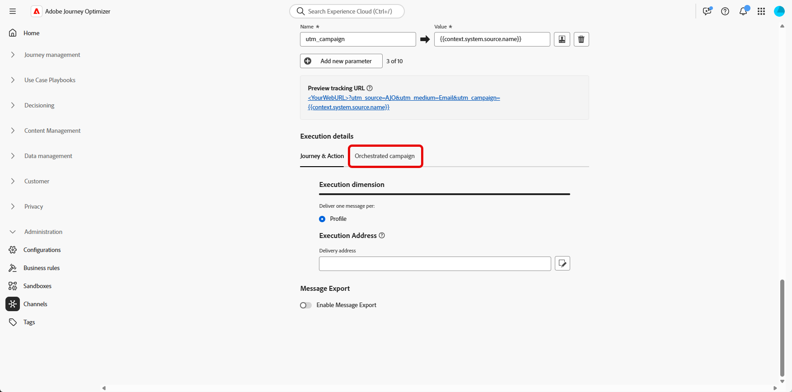
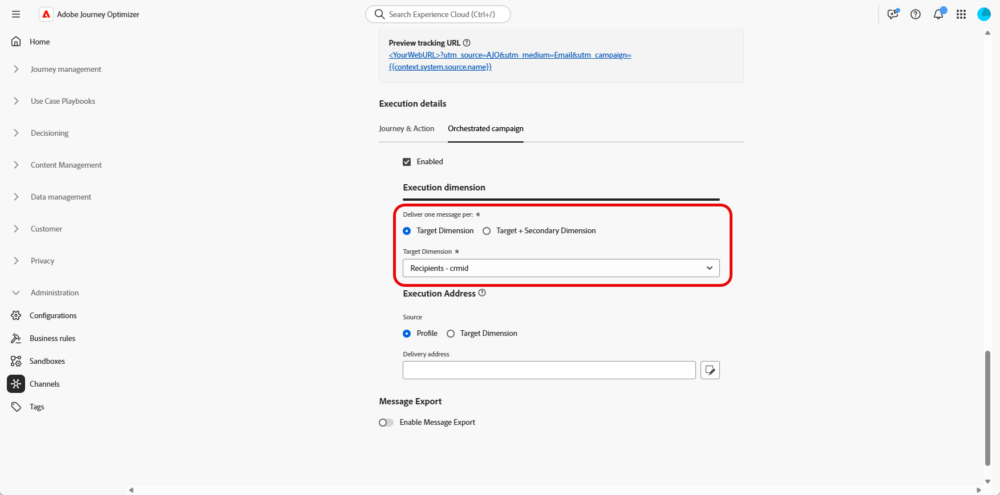

# Definir a configuração do canal {#channel-configuration}

>[!BEGINSHADEBOX]

**Nesta página:** saiba como definir uma configuração de canal para campanhas orquestradas, definindo o nível de entrega, a dimensão de destino e o endereço de execução, e como adicionar parâmetros de rastreamento de URL aos seus links.

>[!ENDSHADEBOX]

Após configurar seu [Dimension de Destino](target-dimension.md), é necessário definir sua **[!UICONTROL Configuração de Canal]** e os **[!UICONTROL Detalhes de Execução]** apropriados. Isso permite definir :

* **O nível de entrega de mensagens**: por exemplo, enviar uma mensagem por destinatário, como um único email por indivíduo.

* **O endereço de execução**: o campo de contato específico a ser usado para envio, como um endereço de email ou número de telefone.

Para definir a configuração do canal:

1. Comece criando e configurando sua **[!UICONTROL Configuração de canal]**.

   Você também pode atualizar uma **[!UICONTROL Configuração de canal]** existente.

   ➡️ [Siga as etapas detalhadas nesta página](../email/surface-personalization.md)

1. Na seção **[!UICONTROL Detalhes da execução]** da sua **[!UICONTROL Configuração do canal]**, acesse a guia **[!UICONTROL Campanhas orquestradas]**.

   

1. Clique em **[!UICONTROL Habilitado]** para torná-lo compatível com as campanhas Orquestradas.

1. Escolha seu método de delivery:

   * **[!UICONTROL Dimension de Destino]**: enviar para a entidade principal, por exemplo, destinatário.

   * **[!UICONTROL Target + Secondary Dimension]**: enviar usando entidades primárias e secundárias, por exemplo, recipient + contrato.

1. Selecione no menu suspenso seu [Dimension de Destino](#targeting-dimension) criado anteriormente.

   

1. Se você selecionou **[!UICONTROL Target + Secondary Dimension]** como método de entrega, escolha um **[!UICONTROL Secondary Dimension]** para definir o contexto de entrega de mensagem.

1. Na seção **[!UICONTROL Endereço de Execução]**, escolha qual **[!UICONTROL Source]** deve ser usada para buscar o endereço de entrega, como o endereço de email ou o número de telefone:

   * **[!UICONTROL Perfil]**: selecione essa opção se o endereço de entrega, por exemplo, email, for armazenado diretamente no perfil principal do cliente.

     Útil ao enviar mensagens ao cliente principal, não a uma entidade associada específica.

   * **[!UICONTROL Dimension de Destino]**: escolha essa opção se o endereço de entrega estiver armazenado na entidade primária, por exemplo, um destinatário.

     Útil quando cada recipient tem seu próprio endereço de entrega, como um email ou número de telefone diferente.

   * **[!UICONTROL Dimension Secundário]**: ao usar **[!UICONTROL Target + Dimension Secundário]** como método de entrega, selecione o **[!UICONTROL Dimension Secundário]** relevante que você configurou anteriormente.

     Por exemplo, se a dimensão secundária representar uma reserva ou assinatura, o endereço de execução, como um email, poderá ser retirado desse nível. Isso é útil nos casos em que os perfis usam um detalhe de contato diferente ao reservar ou assinar um serviço.

1. No campo **[!UICONTROL Endereço de entrega]**, clique em  para escolher o campo específico a ser usado para a entrega de mensagens.

   

1. Depois de configurado, clique em **[!UICONTROL Enviar]**.

Seu canal agora está pronto para uso com **campanhas orquestradas**, e as mensagens serão entregues de acordo com o target dimension selecionado.

## Parâmetros de rastreamento de URL {#url-tracking}

Ao configurar seu canal, você pode definir parâmetros de rastreamento de URL para monitorar o desempenho de suas campanhas de email anexando metadados aos links rastreados, para fins de análise e relatórios.

Para fazer isso, atributos contextuais específicos para campanhas orquestradas estão disponíveis usando a sintaxe `{{context.system.source.*}}`:

* **`context.system.source.id`**: ID de campanha orquestrada
* **`context.system.source.name`**: nome de campanha orquestrada
* **`context.system.source.versionId`**: ID da versão da campanha orquestrada
* **`context.system.source.actionId`**: ID do nó da ação de canal
* **`context.system.source.actionName`**: nome do nó da ação de canal
* **`context.system.source.channel`**: Tipo de canal (Email, SMS, Push)
* **`context.system.IdentityNamespace`**: Namespace de identidade usado

Por exemplo:

```
www.YourLandingURL.com?utm_source=AJO&utm_campaign={{context.system.source.id}}&utm_content={{context.system.source.actionName}}
```

Saiba mais sobre parâmetros de rastreamento de URL em [esta seção](../email/url-tracking.md).
