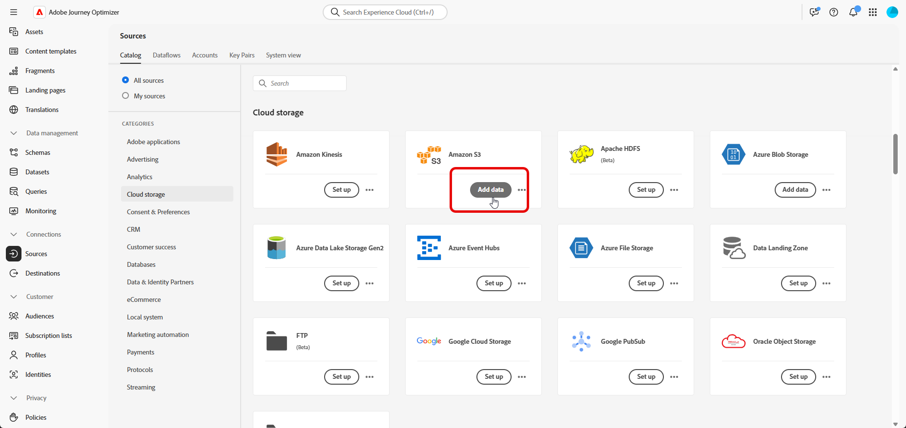

# Etapas de configuração {#configuration-steps}

+++ Sumário

| Bem-vindo às campanhas orquestradas | Lançar a primeira campanha orquestrada | Consultar o banco de dados | Atividades de campanhas orquestradas |
|---|---|---|---|
| [Introdução a campanhas orquestradas](gs-orchestrated-campaigns.md)<br/><br/><b>[Etapas de configuração](configuration-steps.md)</b><br/><br/>[Acessar e gerenciar campanhas orquestradas](access-manage-orchestrated-campaigns.md) | [Etapas principais para a criação de campanha orquestrada](gs-campaign-creation.md)<br/><br/>[Criar e agendar a campanha](create-orchestrated-campaign.md)<br/><br/>[Orquestrar atividades](orchestrate-activities.md)<br/><br/>[Enviar mensagens com campanhas orquestradas](send-messages.md)<br/><br/>[Iniciar e monitorar a campanha](start-monitor-campaigns.md)<br/><br/>[Relatórios](reporting-campaigns.md) | [Trabalhar com o construtor de regras](orchestrated-rule-builder.md)<br/><br/>[Criar a primeira consulta](build-query.md)<br/><br/>[Editar expressões](edit-expressions.md) | [Introdução às atividades](activities/about-activities.md)<br/><br/>Atividades:<br/>[And-join](activities/and-join.md) - [Criar público](activities/build-audience.md) - [Alterar dimensão](activities/change-dimension.md) - [Combinar](activities/combine.md) - [Eliminação de Duplicação](activities/deduplication.md) - [Enriquecimento](activities/enrichment.md) - [Bifurcação](activities/fork.md) - [Reconciliação](activities/reconciliation.md) - [Divisão](activities/split.md) - [Espera](activities/wait.md) |

{style="table-layout:fixed"}

+++

</br>

>[!BEGINSHADEBOX]

Documentação em andamento

>[!ENDSHADEBOX]

Este guia o orienta pelo processo de criação de um esquema relacional, configuração de um conjunto de dados para campanhas orquestradas, assimilação de dados por meio de uma fonte S3 e consulta dos dados assimilados na plataforma AP.

Neste exemplo, a configuração inclui a integração de duas entidades principais, **Transações de Fidelidade** e **Recompensas de Fidelidade**, e os vincula às entidades principais existentes **Destinatários** e **Marcas**.

1. [Fazer upload do arquivo DDL](#upload-ddl)

   Defina o modelo de dados relacionais para campanhas orquestradas, incluindo as entidades **Transações de Fidelidade** e **Recompensas de Fidelidade**, juntamente com as chaves e os atributos de controle de versão necessários.

1. [Selecionar Entidades](#entities)

   Estabeleça relações significativas entre tabelas no esquema para criar um modelo de dados coeso e interconectado.

1. [Esquema de link](#link-schema)

   Vincule a entidade **Transações de Fidelidade** a **Destinatários** e **Recompensas de Fidelidade** a **Marcas** para criar um modelo de dados conectado que ofereça suporte a jornadas personalizadas de clientes.

1. [Dados de assimilação](#ingest)

   Traga dados para a Adobe Experience Platform de fontes compatíveis, como SFTP, armazenamento na nuvem ou bancos de dados.

## Fazer upload do arquivo DDL {#upload-ddl}

Esta seção fornece orientação passo a passo sobre como criar um esquema relacional no Adobe Experience Platform fazendo upload de um arquivo DDL (Data Definition Language). Usar um arquivo DDL permite definir a estrutura do modelo de dados antecipadamente, incluindo tabelas, atributos, chaves e relacionamentos.

1. Faça logon na Plataforma AP.

1. Navegue até **Gerenciamento de Dados** > **Esquema**.

1. Clique em **Criar esquema**.

1. Você será solicitado a selecionar entre dois tipos de esquema:

   * **Padrão**
   * **Relational**, usado especificamente para campanhas orquestradas

   

1. Selecione **Carregar arquivo DDL** para definir um diagrama de relação de entidade e criar esquemas.

   A estrutura da tabela deve conter:
   * Pelo menos uma chave primária
   * Um identificador de versão, como um campo `lastmodified` do tipo `datetime` ou `number`.

1. Arraste e solte seu arquivo DDL e clique em **[!UICONTROL Próximo]**.

1. Digite seu **[!UICONTROL Nome do esquema]**.

1. Configure cada esquema e suas colunas, garantindo que uma chave primária seja especificada.

   Um atributo, como `lastmodified`, deve ser designado como descritor de versão. Este atributo, normalmente do tipo `datetime`, `long` ou `int`, é essencial para processos de assimilação para garantir que o conjunto de dados seja atualizado com a versão de dados mais recente.

   

1. Clique em **[!UICONTROL Concluído]** depois de concluído.

Agora é possível verificar a tabela e as definições de campo na tela. [Saiba mais na seção abaixo](#entities)

## Selecionar entidades {#entities}

Para definir conexões lógicas entre tabelas no esquema, siga as etapas abaixo.

1. Acesse a visualização da tela do modelo de dados e escolha as duas tabelas que deseja vincular

1. Clique no botão  ao lado do Source Join e arraste e guie a seta em direção ao Target Join para estabelecer a conexão.

   

1. Preencha o formulário fornecido para definir o link e clique em **Aplicar** depois de configurado.

   

   **Cardinalidade**:

   * **1-N**: uma ocorrência da tabela de origem pode ter várias ocorrências correspondentes da tabela de destino, mas uma ocorrência da tabela de destino pode ter no máximo uma ocorrência correspondente da tabela de origem.

   * **N-1**: uma ocorrência da tabela de destino pode ter várias ocorrências correspondentes da tabela de origem, mas uma ocorrência da tabela de origem pode ter no máximo uma ocorrência correspondente da tabela de destino.

   * **1-1**: uma ocorrência da tabela de origem pode ter no máximo uma ocorrência correspondente da tabela de destino.

1. Todos os links definidos no modelo de dados são representados como setas na exibição da tela. Clique em uma seta entre duas tabelas para exibir detalhes, fazer edições ou remover o link, conforme necessário.

   

1. Use a barra de ferramentas para personalizar e ajustar a tela.

   

   * **Ampliar**: aumente a tela para ver mais detalhes do seu modelo de dados com mais clareza.

   * **Reduzir**: reduza o tamanho da tela para obter uma exibição mais ampla do seu modelo de dados.

   * **Ajustar exibição**: ajuste o zoom para ajustar todos os esquemas dentro da área visível.

   * **Filtro**: escolha o esquema a ser exibido na tela.

   * **Forçar layout automático**: Organiza esquemas automaticamente para uma melhor organização.

   * **Exibir mapa**: alternar uma sobreposição de minimapa para ajudar a navegar mais facilmente por layouts de esquema grandes ou complexos.

1. Clique em **Salvar** depois de concluído. Essa ação cria os esquemas e conjuntos de dados associados e habilita o conjunto de dados para uso em Campanhas orquestradas.

1. Clique em **[!UICONTROL Abrir trabalhos]** para monitorar o progresso do trabalho de criação. Esse processo pode levar alguns minutos, dependendo do número de tabelas definidas no arquivo DDL.

   

## Esquema de link {#link-schema}

Estabeleça uma relação entre o esquema **transações de fidelidade** e o esquema **Destinatários** para associar cada transação ao registro de cliente correto.

1. Navegue até **[!UICONTROL Esquemas]** e abra as **transações de fidelidade** criadas anteriormente.

1. Clique em **[!UICONTROL Adicionar relacionamento]** nas **[!UICONTROL Propriedades do campo]** do cliente.

   

1. Selecione **[!UICONTROL De muitos para um]** como o **[!UICONTROL Tipo]** de relação.

1. Link para o esquema existente **Recipients**.

   

1. Insira um **[!UICONTROL Nome do relacionamento do esquema atual]** e **[!UICONTROL Nome do relacionamento do esquema de referência]**.

1. Clique em **[!UICONTROL Aplicar]** para salvar as alterações.

Continue criando uma relação entre o esquema **recompensas de fidelidade** e o esquema **Marcas** para associar cada entrada de recompensa à marca apropriada.


## Assimilar dados {#ingest}

O Adobe Experience Platform permite que os dados sejam assimilados de fontes externas e, ao mesmo tempo, fornece a capacidade de estruturar, rotular e aprimorar os dados recebidos usando os serviços da Experience Platform. Você pode assimilar dados de várias fontes, como aplicativos Adobe, armazenamentos baseados na nuvem, bancos de dados e muitas outras.

1. No menu **[!UICONTROL Conexões]**, acesse o menu **[!UICONTROL Fontes]**.

1. Selecione a categoria **[!UICONTROL Armazenamento na nuvem]**, depois o Amazon S3 e clique em **[!UICONTROL Adicionar dados]**.

   

1. Conectar sua Conta S3:

   * Com uma conta existente

   * Com uma nova conta

   [Saiba mais na documentação do Adobe Experience Platform](https://experienceleague.adobe.com/pt-br/docs/experience-platform/destinations/catalog/cloud-storage/amazon-s3#connect)

   

1. Navegue pela origem S3 conectada até localizar as duas pastas criadas anteriormente, ou seja, **recompensas de fidelidade** e **transações de fidelidade**.

1. Clique em sua pasta.

   A seleção de uma pasta garante que todos os arquivos atuais e futuros com a mesma estrutura sejam processados automaticamente, enquanto a seleção de um arquivo requer atualizações manuais para cada novo incremento de dados.

   

1. Escolha o formato de Dados e clique em Próximo.


<!--manual
## Create a relational schema manual


1. Log in to the AP Platform.
1. Navigate to the **Schema Management** section.
1. Click on **Create Schema**.

1. You will be prompted to select between two schema types:
    * **Standard**
    * **Relational** (used specifically for AGO campaigns)

1. Click on **Create Manual**.
1. Provide a **Schema Name** (e.g., `test_demo_ck001`).
1. Choose **Schema Type**:
    - **Record Type** (required for AGO campaigns)
    - **Time Series** (not applicable here)
1. Click **Finish** to proceed to the schema design canvas.

## Select entities and fields to import

1. In the canvas, add attributes (fields) to your schema.
1. Add a **Primary Key** (mandatory).
1. Add a **Version Descriptor** attribute (for CDC support):
    - This must be of type **DateTime** or **Numeric** (Integer, Long, Short, Byte).
    - Common example: `last_modified`

> **Why?** The **Primary Key** uniquely identifies each record, and the **Version Descriptor** tracks changes, supporting CDC (Change Data Capture) and data mirroring.

1. Mark the appropriate fields as **Primary Key** and **Version Descriptor**.
1. Click **Save**.

---


## 5. Creating a Dataset

1. Navigate to **Datasets**.
1. Click on **Create Dataset**.
1. Select the schema you just created.
1. Assign a **Dataset Name** (same as schema is fine).
1. Optionally, add tags (e.g., `AGO_campaigns`).
6. Ensure the checkbox **"Relational Schema"** is checked.
7. Click **Finish**.

> **Note:** Only one dataset can be created per relational schema.


## 6. Enabling the Dataset

1. Click **Enable** for the dataset.
1. Wait a few moments for the status to show **Enabled**.

> **Why?** Without enabling, the dataset cannot be used in orchestrated campaigns or ingest data.

## 7. Creating a Data Source (S3)

1. Navigate to **Sources**.
1. Click **Create Source**.
1. Choose the source type (e.g., **S3 Bucket**).
1. Provide connection details:
    - Bucket Path (optionally include subfolder path)
1. Save the source.

## 8. Preparing and Uploading Data

1. Prepare your CSV file with:
    - Column headers matching your schema attributes
    - `last_modified` column
    - `change_type` column (`U`/`DU` for upsert, `D` for delete)

> **Important:** `change_type` is required but does not need to be defined in the schema.

1. Save the file as `.csv`.

1. Upload the file to the specified folder in your S3 bucket.


## 9. Ingesting Data from S3

1. Go to **Sources** and find your S3 source.
1. Click **Add Data**.
1. Select the uploaded file.
1. Specify the file format as **CSV** and any compression type if applicable.
1. Review the data preview (ensure `change_type`, `last_modified`, and primary key are visible).
1. Click **Next**.

### Enable Change Data Capture (CDC)

- Check **Enable Change Data Capture**.
- Select the dataset enabled for AGO campaigns.

### Field Mapping

- Fields are auto-mapped (note that `change_type` is not mapped and that's expected).
- Click **Next**.

### Scheduling

- Schedule ingestion frequency (minute, hour, day, week).
- Set start time (immediate or future).
- Click **Finish** to create the data flow.

## 10. Monitoring Data Flow

1. Navigate back to **Sources > Data Flows**.
1. Wait 4–5 minutes for the first run (initial overhead).
1. Monitor:
    - Status (Started, Completed)
    - Number of records ingested
    - Errors (if any)

> **Tip:** Ingested data first lands in the **Data Lake**.

## 11. Data Replication to Data Store

The **Data Store** is updated:

- Every **15 minutes**, or

- If **Data Lake size exceeds 5MB**

This is a background replication process.


## 12. Querying the Dataset

1. Navigate to **Query Services**.
1. Click **Create Query**.
1. Example query:

   ```sql
   SELECT * FROM test_demo_ck001;
   ```

1. Run the query.

> **Note:** If ingestion is incomplete, query will return an error. Check data flow status.

-->