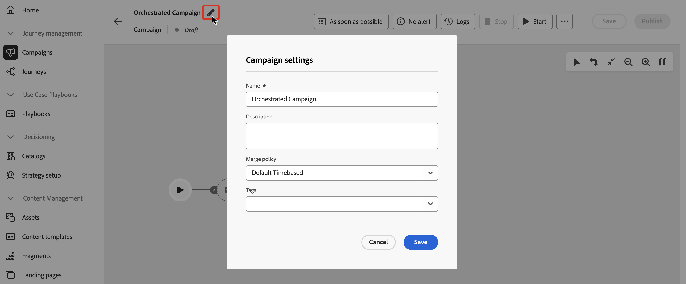

# Criar e agendar uma campanha orquestrada {#create-first-campaign}

>[!CONTEXTUALHELP]
>id="ajo_campaign_creation_workflow"
>title="Lista de campanhas orquestradas"
>abstract="A guia **Orquestração** lista todas as campanhas orquestradas. Clique no nome de uma campanha orquestrada para editá-la. Use o botão **Criar campanha orquestrada** para adicionar uma nova campanha orquestrada. "

+++ Sumário

| Bem-vindo às campanhas orquestradas | Iniciar sua primeira campanha orquestrada | Consultar o banco de dados | Atividades de campanhas orquestradas |
|---|---|---|---|
| [Introdução a campanhas orquestradas](gs-orchestrated-campaigns.md)  [Etapas de configuração](configuration-steps.md)  [Acessar e gerenciar campanhas orquestradas](access-manage-orchestrated-campaigns.md) | [Etapas principais para a criação de campanha orquestrada](gs-campaign-creation.md)  <b>[Criar e agendar a campanha](create-orchestrated-campaign.md)</b>  [Orquestrar atividades](orchestrate-activities.md)  [Enviar mensagens com campanhas orquestradas](send-messages.md)  [Iniciar e monitorar a campanha](start-monitor-campaigns.md)  [Relatórios](reporting-campaigns.md) | [Trabalhar com o construtor de regras](orchestrated-rule-builder.md)  [Criar a primeira consulta](build-query.md)  [Editar expressões](edit-expressions.md) | [Introdução às atividades](activities/about-activities.md)  Atividades: [And-join](activities/and-join.md) - [Criar público](activities/build-audience.md) - [Alterar dimensão](activities/change-dimension.md) - [Combinar](activities/combine.md) - [Eliminação de Duplicação](activities/deduplication.md) - [Enriquecimento](activities/enrichment.md) - [Bifurcação](activities/fork.md) - [Reconciliação](activities/reconciliation.md) - [Divisão](activities/split.md) - [Espera](activities/wait.md) |

{style="table-layout:fixed"}

+++

 

>[!BEGINSHADEBOX]

Documentação em andamento

>[!ENDSHADEBOX]

## Criar a campanha {#create}

Para criar uma campanha orquestrada, siga estas etapas:

1. Navegue até o menu **[!UICONTROL Campanhas]**, selecione a guia **[!UICONTROL Orquestração]** e selecione **[!UICONTROL Criar campanha]**.

   

1. Insira um nome para a campanha orquestrada. Além disso, recomendamos que você adicione uma descrição no campo dedicado.

1. (opcional) Use o campo **Tags** para atribuir Tags unificadas do Adobe Experience Platform à sua campanha orquestrada. Isso permite classificá-las facilmente e melhorar a pesquisa na lista de campanhas. [Saiba como trabalhar com marcas](../start/search-filter-categorize.md#tags).

1. Clique no botão **[!UICONTROL Criar]** para confirmar.

Sua campanha orquestrada agora está criada e disponível na lista de campanhas. Você pode alterar essas propriedades a qualquer momento clicando no ícone  na tela de campanha.

## Programar a campanha {#schedule}

Por padrão, as campanhas orquestradas começam assim que são ativadas manualmente e terminam assim que suas atividades são executadas.

Se não quiser executar uma campanha orquestrada logo após a ativação, especifique uma data e hora em que ela deverá ser executada. Você também pode executar a campanha em frequências regulares com base em vários critérios.

Para configurar a programação da campanha, abra a campanha orquestrada e clique no botão **[!UICONTROL Assim que possível]**.

<!--In the Execution frequency field, select 

time zone

daily, weekly, monthly
several times a day based on specific hours or periodically

recurring frequencies (all except as soon and once)
preview launch times
validity period

>[!NOTE]
>
>When scheduling campaigns in [!DNL Adobe Journey Optimizer], ensure your start date/time aligns with the desired first delivery. For recurring campaigns, if the initial scheduled time has already passed, the campaigns will roll over to the next available time slot according to their recurrence rules.

## Work with orchestrated campaign templates {#campaign-templates}

>[!CONTEXTUALHELP]
>id="ajo_workflow_template_for_campaign"
>title="Orchestrated campaign templates"
>abstract="Orchestrated campaign templates contain pre-configured settings and activities which can be reused for creating new orchestrated campaign."

>[!CONTEXTUALHELP]
>id="ajo_workflow_template_creation_properties"
>title="Orchestrated campaign properties"
>abstract="Orchestrated campaign templates contain pre-configured settings and activities which can be reused for creating new orchestrated campaigns. In this screen, enter the label of the orchestrated campaign template and configure its settings such as its internal name, folder and execution folders, timezone, and supervisor group."

Orchestrated campaign templates contain pre-configured settings and activities which can be reused for creating new orchestrated campaigns. You can select the template of your orchestrated campaign from the orchestrated campaign properties, when creating an orchestrated campaign. An empty template is provided by default.

You can create a template from an existing orchestrated campaign, or create a new template from scratch. Both methods are detailed below.

>[!BEGINTABS]

>[!TAB Create a template from an existing orchestrated campaign]

To create an orchestrated campaign template from an existing orchestrated campaign, follow these steps:

1. Open to the **Campaign** menu and browse to the orchestrated campaign to save as a template.
1. Click the three dots on the right of the name of the orchestrated campaign, and choose **Copy as template**.
1. In the popup window, confirm the template creation.
1. In the orchestrated campaign template canvas, check, add, and configure the activities as needed.
1. Browse to the settings, from the **Settings** button, to change the name of the orchestrated campaign template, and enter a description.
1. Select the **folder** and **execution folder** of the template. The folder is the location where the orchestrated campaign template is saved. The execution folder is the folder where orchestrated campaigns created based on this template are saved.
1. Save your changes. 

The orchestrated campaign template is now available in the template list. You can create an orchestrated campaign based on this template. This orchestrated campaign will be pre-configured with the settings and activities defined in the template.

>[!TAB Create a template from scratch]

To create an orchestrated campaign template from scratch, follow these steps:

1. Open to the **Campaign** menu and browse to the **Templates** tab. You can see the list of available orchestrated campaign templates.
1. Click the **[!UICONTROL Create template]** button in the upper-right corner of the screen.
1. Enter the label and open the additional options to enter a description of your orchestrated campaign template.
1. Select the folder and execution folder of the template. The folder is the location where the orchestrated campaign template is saved. The execution folder is the folder where orchestrated campaigns created based on this template are saved.
1. Click the **Create** button to confirm your settings.
1. In the orchestrated campaign template canvas, add and configure the activities as needed.

     {zoomable="yes"}

1. Save your changes. 

The orchestrated campaign template is now available in the template list. You can create an orchestrated campaign based on this template. This orchestrated campaign will be pre-configured with the settings and activities defined in the template.

>[!ENDTABS]

## Next steps {#next}

Once your campaign configuration and content are ready, you can review and activate it. [Learn more](review-activate-campaign.md)

-->