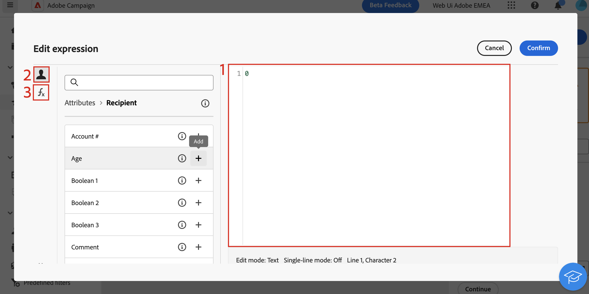

# Editar expressões {#edit-expressions}

>[!NOTE]
>
>A seção abaixo fornece informações sobre como trabalhar com o editor de expressão para criar regras. Lembre-se de que a sintaxe usada para criar regras é diferente da usada para adicionar personalização.

## Trabalhar com o editor de expressão {#edit}

A edição de uma expressão envolve a inserção manual de condições para formar uma regra. Esse modo permite usar funções avançadas, que permitem manipular os valores usados para realizar consultas específicas, como manipular datas, sequências de caracteres, campos numéricos e classificação.

O editor de expressão está disponível no botão **[!UICONTROL Editar expressão]** do construtor de regras, disponível para os campos **[!UICONTROL Atributo]** e **[!UICONTROL Valor]** ao configurar uma condição personalizada.

| Acesso pelo campo **Atributo** | Acesso do campo **Value** |
| --- | --- |
| {zoomable="yes"}{width="200" align="center" zoomable="yes"} | {zoomable="yes"}{width="200" align="center" zoomable="yes"} |

O editor de expressão fornece:

* Um **campo de entrada (1)** onde a expressão é definida.
* Uma lista de **campos (2)** disponíveis que podem ser usados na expressão e correspondem à dimensão de direcionamento da consulta.
* **Funções auxiliares (3)**, classificadas por categoria.

Edite a expressão inserindo uma expressão diretamente no campo de entrada. Para adicionar um campo ou uma função auxiliar, coloque o cursor na expressão em que deseja adicioná-lo e clique no botão +.

{zoomable="yes"}

## Funções de ajuda

A ferramenta de edição de query permite usar funções avançadas para fazer filtragens complexas dependendo dos resultados desejados e dos tipos de dados manipulados. Os recursos abaixo estão disponíveis.

### Agregado

Funções agregadas executam cálculos em um conjunto de valores.

<table>
<tbody>
<tr>
<td><strong>Nome</strong></td>
<td><strong>Descrição</strong></td>
<td><strong>Sintaxe</strong></td>
</tr>
<tr>
<td><strong>Avg</strong></td>
<td>Retorna a média de uma coluna do tipo número</td>
<td>Avg(&lt;value&gt;)</td>
</tr>
<tr>
<td><strong>Contagem</strong></td>
<td>Conta os valores não nulos de uma coluna</td>
<td>Count(&lt;value&gt;)</td>
</tr>
<tr>
<td><strong>CountAll</strong></td>
<td>Conta os valores retornados (todos os campos)</td>
<td>CountAll()</td>
</tr>
<tr>
<td><strong>Countdistinct</strong></td>
<td>Conta os valores não nulos distintos de uma coluna</td>
<td>Countdistinct(&lt;value&gt;)</td>
</tr>
<tr>
<td><strong>Máx</strong></td>
<td>Retorna o valor máximo de uma coluna, cadeira de caracteres ou coluna de tipo de data</td>
<td>Max(&lt;value&gt;)</td>
</tr>
<tr>
<td><strong>Min</strong></td>
<td>Retorna o valor mínimo de uma coluna, cadeira de caracteres ou coluna de tipo de data</td>
<td>Min(&lt;value&gt;)</td>
</tr>
<tr>
<td><strong>StdDev</strong></td>
<td>Retorna o desvio padrão de uma coluna do tipo número, cadeira de caracteres ou dados</td>
<td>StdDev(&lt;value&gt;)</td>
</tr>
<tr>
<td><strong>StringAgg</strong></td>
<td>Retorna a concatenação dos valores de uma coluna do tipo string, separados pelo caractere no segundo argumento</td>
<td>StringAgg(&lt;Value&gt;, &lt;String&gt;)</td>
</tr>
<tr>
<td><strong>Somar</strong></td>
<td>Retorna a soma dos valores de uma coluna do tipo número, cadeira de caracteres ou dados</td>
<td>Sum(&lt;value&gt;)</td>
</tr>
</tbody>
</table>

### Data

Funções de data manipulam valores de data ou hora.

<table>
<tbody>
<tr>
<td><strong>Nome</strong></td>
<td><strong>Descrição</strong></td>
<td><strong>Sintaxe</strong></td>
</tr>
<tr>
<td><strong>AddDays</strong></td>
<td>Adiciona um número de dias a uma data</td>
<td>AddDays(&lt;date&gt;, &lt;number&gt;)</td>
</tr>
<tr>
<td><strong>AddHours</strong></td>
<td>Adiciona um número de horas a uma data</td>
<td>AddHours(&lt;date&gt;, &lt;number&gt;)</td>
</tr>
<tr>
<td><strong>AddMinutes</strong></td>
<td>Adiciona um número de minutos a uma data</td>
<td>AddMinutes(&lt;data&gt;, &lt;número&gt;)</td>
</tr>
<tr>
<td><strong>AddMonths</strong></td>
<td>Adiciona um número de meses a uma data</td>
<td>AddMonths(&lt;data&gt;, &lt;número&gt;)</td>
</tr>
<tr>
<td><strong>AddSeconds</strong></td>
<td>Adiciona um número de segundos a uma data</td>
<td>AddSeconds(&lt;date&gt;, &lt;number&gt;)</td>
</tr>
<tr>
<td><strong>AddYears</strong></td>
<td>Adiciona um número de anos a uma data</td>
<td>AddYears(&lt;date&gt;, &lt;number&gt;)</td>
</tr>
<tr>
<td><strong>ConvertNTZ</strong></td>
<td>Converte o carimbo de data e hora NTZ (carimbo de data e hora sem fuso horário) em TZ (carimbo de data e hora com fuso horário) usando a sessão definida TZ</td>
<td>ConvertNTZ(&lt;date+time&gt;)</td>
</tr>
<tr>
<td><strong>DateCmp</strong></td>
<td>Compara duas datas</td>
<td>DateCmp(&lt;data&gt;, &lt;data&gt;)</td>
</tr>
<tr>
<td><strong>DateOnly</strong></td>
<td>Retorna somente a data (com a hora 00:00)</td>
<td>DateOnly(&lt;date&gt;)</td>
</tr>
<tr>
<td><strong>Dia</strong></td>
<td>Retorna o número que representa o dia da data</td>
<td>Day(&lt;date&gt;)</td>
</tr>
<tr>
<td><strong>DayOfYear</strong></td>
<td>Retorna o número do dia no ano da data</td>
<td>DayOfYear(&lt;data&gt;)</td>
</tr>
<tr>
<td><strong>DaysAgo</strong></td>
<td>Retorna a data correspondente à data atual menos n dias</td>
<td>DaysAgo(&lt;number&gt;)</td>
</tr>
<tr>
<td><strong>DaysAgoInt</strong></td>
<td>Retorna a data (inteiro aaaammdd) correspondente à data atual menos n dias</td>
<td>DaysAgoInt(&lt;number&gt;)</td>
</tr>
<tr>
<td><strong>DaysDiff</strong></td>
<td>Retorna o número de dias entre duas datas</td>
<td>DaysDiff(&lt;data final&gt;, &lt;data inicial&gt;)</td>
</tr>
<tr>
<td><strong>DaysOld</strong></td>
<td>Retorna a idade em dias de uma data</td>
<td>DaysOld(&lt;data&gt;)</td>
</tr>
<tr>
<td><strong>GetDate</strong></td>
<td>Retorna a data atual do sistema do servidor</td>
<td>GetDate()</td>
</tr>
<tr>
<td><strong>Hora</strong></td>
<td>Retorna a hora da data</td>
<td>Hour(&lt;date&gt;)</td>
</tr>
<tr>
<td><strong>HoursDiff</strong></td>
<td>Retorna o número de horas entre duas datas</td>
<td>HoursDiff(&lt;data final&gt;, &lt;data inicial&gt;)</td>
</tr>
<tr>
<td><strong>Minuto</strong></td>
<td>Retorna os minutos da data</td>
<td>Minute(&lt;date&gt;)</td>
</tr>
<tr>
<td><strong>MinutesDiff</strong></td>
<td>Retorna o número de minutos entre duas datas</td>
<td>MinutesDiff(&lt;data final&gt;, &lt;data inicial&gt;)</td>
</tr>
<tr>
<td><strong>Mês</strong></td>
<td>Retorna o número que representa o mês da data</td>
<td>Month(&lt;data&gt;)</td>
</tr>
<tr>
<td><strong>MonthsAgo</strong></td>
<td>Retorna a data correspondente à data atual menos n meses</td>
<td>MonthsAgo(&lt;number&gt;)</td>
</tr>
<tr>
<td><strong>MonthsDiff</strong></td>
<td>Retorna o número de meses entre duas datas</td>
<td>MonthsDiff(&lt;data final&gt;, &lt;data inicial&gt;)</td>
</tr>
<tr>
<td><strong>MonthsOld</strong></td>
<td>Retorna a idade em meses de uma data</td>
<td>MonthsOld(&lt;data&gt;)</td>
</tr>
<tr>
<td><strong>Oldest</strong></td>
<td>Retorna a data mais antiga em um intervalo</td>
<td>Oldest(&lt;data, data&gt;)</td>
</tr>
<tr>
<td><strong>Segundo</strong></td>
<td>Retorna os segundos da data</td>
<td>Second(&lt;data&gt;)</td>
</tr>
<tr>
<td><strong>SecondsDiff</strong></td>
<td>Retorna o número de segundos entre duas datas</td>
<td>SecondsDiff(&lt;data final&gt;, &lt;data inicial&gt;)</td>
</tr>
<tr>
<td><strong>SubDays</strong></td>
<td>Subtrai um número de dias a partir de uma data</td>
<td>SubDays(&lt;date&gt;, &lt;number&gt;)</td>
</tr>
<tr>
<td><strong>SubHours</strong></td>
<td>Subtrai um número de horas a partir de uma data</td>
<td>SubHours(&lt;date&gt;, &lt;number&gt;)</td>
</tr>
<tr>
<td><strong>SubMinutes</strong></td>
<td>Subtrai um número de minutos de uma data</td>
<td>SubMinutes(&lt;date&gt;, &lt;number&gt;)</td>
</tr>
<tr>
<td><strong>SubMonths</strong></td>
<td>Subtrai um número de meses a partir de uma data</td>
<td>SubMonths(&lt;date&gt;, &lt;number&gt;)</td>
</tr>
<tr>
<td><strong>SubSeconds</strong></td>
<td>Subtrai um número de segundos a partir de uma data</td>
<td>SubSeconds(&lt;date&gt;, &lt;number&gt;)</td>
</tr>
<tr>
<td><strong>SubYears</strong></td>
<td>Subtrai um número de anos a partir de uma data</td>
<td>SubYears(&lt;date&gt;, &lt;number&gt;)</td>
</tr>
<tr>
<td><strong>ToDate</strong></td>
<td>Converte uma data + hora em uma data</td>
<td>ToDate(&lt;data + hora&gt;)</td>
</tr>
<tr>
<td><strong>ToDateTime</strong></td>
<td>Converte uma cadeia de caracteres em uma data + hora</td>
<td>ToDateTime(&lt;cadeia de caracteres&gt;)</td>
</tr>
<tr>
<td><strong>ToTimestamp</strong></td>
<td>Converte uma cadeia de caracteres em um carimbo de data e hora</td>
<td>ToTimestamp(&lt;string&gt;)</td>
</tr>
<tr>
<td><strong>ToTimeZone</strong></td>
<td>Converte uma data + hora em um fuso horário</td>
<td>ToTimeZone(&lt;data&gt;, &lt;fuso horário&gt;)</td>
</tr>
<tr>
<td><strong>TruncDate</strong></td>
<td>Arredonda uma data e hora para o segundo mais próximo</td>
<td>TruncDate(@lastModified, &lt;número de segundos&gt;)</td>
</tr>
<tr>
<td><strong>TruncDateTZ</strong></td>
<td>Arredonda uma data e hora para uma determinada precisão expressa em segundos</td>
<td>TruncDateTZ(&lt;data&gt;, &lt;número de segundos&gt;, &lt;fuso horário&gt;)</td>
</tr>
<tr>
<td><strong>TruncQuarter</strong></td>
<td>Arredonda uma data para o trimestre</td>
<td>TruncQuarter(&lt;data&gt;)</td>
</tr>
<tr>
<td><strong>TruncTime</strong></td>
<td>Arredonda a parte de horário para cima até o próximo segundo</td>
<td>TruncTime(&lt;data&gt;, &lt;número de segundos&gt;)</td>
</tr>
<tr>
<td><strong>TruncWeek</strong></td>
<td>Arredonda uma data para a semana</td>
<td>TruncWeek(&lt;date&gt;)</td>
</tr>
<tr>
<td><strong>TruncYear</strong></td>
<td>Arredonda uma data + hora para 1º de janeiro do ano</td>
<td>TruncYear(&lt;data&gt;)</td>
</tr>
<tr>
<td><strong>WeekDay</strong></td>
<td>Retorna o número que representa o dia na semana da data (0=segunda-feira, 6=domingo)</td>
<td>WeekDay(&lt;date&gt;)</td>
</tr>
<tr>
<td><strong>Ano</strong></td>
<td>Retorna o número que representa o ano da data</td>
<td>Year(&lt;date&gt;)</td>
</tr>
<tr>
<td><strong>YearAndMonth</strong></td>
<td>Retorna o número que representa o ano e o mês da data</td>
<td>YearAndMonth(&lt;data&gt;)</td>
</tr>
<tr>
<td><strong>YearsAgo</strong></td>
<td>Retorna o número de anos entre uma determinada data e a data atual</td>
<td>YearsAgo(&lt;date&gt;)</td>
</tr>
<tr>
<td><strong>YearsDiff</strong></td>
<td>Retorna o número de anos entre duas datas</td>
<td>YearsDiff(&lt;data final&gt;, &lt;data inicial&gt;)</td>
</tr>
<tr>
<td><strong>YearsOld</strong></td>
<td>Retorna a idade em anos de uma data</td>
<td>YearsOld(&lt;data&gt;)</td>
</tr>
</tbody>
</table>

>[!NOTE]
>
>Observe que a função **DateOnly** considera o fuso horário do servidor e não do operador.

### Geomarketing

As funções de geomarketing são usadas para manipular valores geográficos.

<table> 
 <tbody> 
  <tr> 
   <td> <strong>Nome</strong>  </td> 
   <td> <strong>Descrição</strong>  </td> 
   <td> <strong>Sintaxe</strong>  </td> 
  </tr> 
  <tr> 
   <td> <strong>Distance</strong>  </td> 
   <td> Retorna a distância entre dois pontos definidos por sua longitude e latitude, expresso em graus.  </td> 
   <td> Distance(&lt;Longitude A&gt;, &lt;Latitude A&gt;, &lt;Longitude B&gt;, &lt;Latitude B&gt;)  </td>  
  </tr> 
 </tbody> 
</table>

### Numérico

As funções numéricas são usadas para converter texto em números.

<table> 
 <tbody> 
  <tr> 
   <td> <strong>Nome</strong>  </td> 
   <td> <strong>Descrição</strong>  </td> 
   <td> <strong>Sintaxe</strong>  </td> 
  </tr> 
  <tr> 
   <td> <strong>Abs</strong>  </td> 
   <td> Retorna o valor absoluto de um número  </td> 
   <td> Abs(&lt;número&gt;)  </td>  
  </tr> 
  <tr> 
   <td> <strong>Ceil</strong>  </td> 
   <td> Retorna o número inteiro mais baixo maior ou igual a um número  </td> 
   <td> Ceil(&lt;número&gt;)  </td>  
  </tr> 
  <tr> 
   <td> <strong>Floor</strong>  </td> 
   <td> Retorna o maior inteiro maior ou igual a um número  </td> 
   <td> Floor(&lt;number&gt;)  </td>  
  </tr> 
  <tr> 
   <td> <strong>Greatest</strong>  </td> 
   <td> Retorna o maior número de dois números  </td> 
   <td> Greatest(&lt;número 1&gt;, &lt;número 2&gt;)  </td>  
  </tr> 
  <tr> 
   <td> <strong>Least</strong>  </td> 
   <td> Retorna o menor de dois números  </td> 
   <td> Least(&lt;número 1&gt;, &lt;número 2&gt;)  </td>  
  </tr> 
  <tr> 
   <td> <strong>Mod</strong>  </td> 
   <td> Retorna o restante da divisão inteira de n1 por n2  </td> 
   <td> Mod(&lt;number 1&gt;, &lt;number 2&gt;)  </td>  
  </tr> 
  <tr> 
   <td> <strong>Percent</strong>  </td> 
   <td> Retorna a proporção de dois números expressos como uma porcentagem  </td> 
   <td> Percent(&lt;número 1&gt;, &lt;número 2&gt;)  </td>  
  </tr> 
  <tr> 
   <td> <strong>Random</strong>  </td> 
   <td> Retorna o valor aleatório  </td> 
   <td> Random()  </td> 
  </tr> 
  <tr> 
   <td> <strong>Round</strong>  </td> 
   <td> Arredonda um número para decimais n  </td> 
   <td> Round(&lt;número&gt;, &lt;número de decimais&gt;)  </td>  
  </tr> 
  <tr> 
   <td> <strong>Sign</strong>  </td> 
   <td> Retorna o sinal do número  </td> 
   <td> Sign(&lt;número&gt;)  </td>  
  </tr> 
  <tr> 
   <td> <strong>ToDouble</strong>  </td> 
   <td> Converte um inteiro em um flutuante  </td> 
   <td> ToDouble(&lt;número&gt;)  </td>  
  </tr> 
  <tr> 
   <td> <strong>ToInt64</strong>  </td> 
   <td> Converte um flutuante em um inteiro de 64 bits  </td> 
   <td> ToInt64(&lt;número&gt;)  </td>  
  </tr> 
  <tr> 
   <td> <strong>ToInteger</strong>  </td> 
   <td> Converte um flutuante em um inteiro  </td> 
   <td> ToInteger(&lt;número&gt;)  </td>  
  </tr> 
  <tr> 
   <td> <strong>Trunc</strong>  </td> 
   <td> Corta o n1 para o decimal n2  </td> 
   <td> Trunc(&lt;n1&gt;, &lt;n2&gt;)  </td>  
  </tr> 
 </tbody> 
</table>

### Outros

Esta tabela contém as funções restantes disponíveis.

<table> 
 <tbody> 
  <tr> 
   <td> <strong>Nome</strong>  </td> 
   <td> <strong>Descrição</strong>  </td> 
   <td> <strong>Sintaxe</strong>  </td> 
  </tr> 
  <tr> 
   <td> <strong>CriptografiaAEM</strong>  </td> 
   <td> Cadeia de caracteres criptografada fornecida no argumento   </td> 
   <td> AESEncrypt(&lt;valor&gt;)  </td> 
  </tr>
  <tr> 
   <td> <strong>Case</strong>  </td> 
   <td> Retorna o valor 1 se a condição for verdadeira. Caso contrário, retornará o valor 2.  </td> 
   <td> Case(When(&lt;condition&gt;, &lt;value 1&gt;), Else(&lt;value 2&gt;))  </td> 
  </tr> 
  <tr> 
   <td> <strong>ClearBit</strong>  </td> 
   <td> Exclui o Sinalizador no valor  </td> 
   <td> ClearBit(&lt;identificador&gt;, &lt;sinalizador&gt;)  </td>  
  </tr> 
  <tr> 
   <td> <strong>Coalesce</strong>  </td> 
   <td> Retorna o valor 2 se o valor 1 for zero ou nulo, caso contrário retorna o valor 1  </td> 
   <td> Coalesce(&lt;valor 1&gt;, &lt;valor 2&gt;)  </td>  
  </tr> 
  <tr> 
   <td> <strong>Decode</strong>  </td> 
   <td> Retorna o valor 3 se o valor 1 for igual ao valor 2. Caso contrário, retorna o valor 4.  </td> 
   <td> Decode(&lt;value 1&gt;, &lt;value 2&gt;, &lt;value 3&gt;, &lt;value 4&gt;)  </td>  
  </tr>

<tr> 
   <td> <strong>Else</strong>  </td> 
   <td> Retorna o valor 1 (só pode ser usado como parâmetro da função case)  </td> 
   <td> Else(&lt;value 1&gt;, &lt;value 2&gt;)  </td>  
  </tr> 
  <tr> 
   <td> <strong>GetEmailDomain</strong>  </td> 
   <td> Extrai o domínio de um endereço de email  </td> 
   <td> GetEmailDomain(&lt;valor&gt;)  </td>  
  </tr> 
  <tr> 
   <td> <strong>GetMirrorURL</strong>  </td> 
   <td> Recupera o URL do servidor da mirror page  </td> 
   <td> GetMirrorURL(&lt;valor&gt;)  </td>  
  </tr> 
  <tr> 
   <td> <strong>Iif</strong>  </td> 
   <td> Retorna o valor 1 se a expressão for verdadeira. Caso contrário, retorna o valor 2  </td> 
   <td> Iif(&lt;condition&gt;, &lt;value 1&gt;, &lt;value 2&gt;)  </td>  
  </tr> 
  <tr> 
   <td> <strong>IsBitSet</strong>  </td> 
   <td> Indica se o Sinalizador está no valor  </td> 
   <td> IsBitSet(&lt;identificador&gt;, &lt;sinalizador&gt;)  </td>  
  </tr> 
  <tr> 
   <td> <strong>IsEmptyString</strong>  </td> 
   <td> Retorna o valor 2 se a string 1 estiver vazia, caso contrário, retorna o valor 3.  </td> 
   <td> IsEmptyString(&lt;value 1&gt;, &lt;value 2&gt;, &lt;value 3&gt;)  </td>  
  </tr> 
  <tr> 
   <td> <strong>NovoUUID</strong>  </td> 
   <td> Retorna uma ID exclusiva   </td> 
   <td> NewUUID()  </td>  
  </tr> 
  <tr> 
   <td> <strong>NoNull</strong>  </td> 
   <td> Retorna a string vazia se o argumento for NULL.  </td> 
   <td> NoNull(&lt;valor&gt;)  </td>   
  </tr> 
  <tr> 
   <td> <strong>RowId</strong>  </td> 
   <td> Retorna o número da linha.  </td> 
   <td> RowId  </td> 
  </tr> 
  <tr> 
   <td> <strong>SetBit</strong>  </td> 
   <td> Força o Sinalizador no valor.  </td> 
   <td> SetBit(&lt;identificador&gt;, &lt;sinalizador&gt;)  </td>  
  </tr> 
  <tr> 
   <td> <strong>ToBoolean</strong>  </td> 
   <td> Converte um número em um booleano  </td> 
   <td> ToBoolean(&lt;número&gt;)  </td>   
  </tr> 
  <tr> 
   <td> <strong>When</strong>  </td> 
   <td> Retorna o valor 1 se a expressão for verdadeira. Se não, ele retorna o valor 2 (só pode ser usado como parâmetro da função case)  </td> 
   <td> When(&lt;condition&gt;, &lt;value 1&gt;)  </td>  
  </tr> 
 </tbody> 
</table>

### String

As funções de string são usadas para manipular um conjunto de strings.

<table> 
 <tbody> 
  <tr> 
   <td> <strong>Nome</strong>  </td> 
   <td> <strong>Descrição</strong>  </td> 
   <td> <strong>Sintaxe</strong>  </td> 
  </tr> 
  <tr> 
   <td> <strong>AllNonNull2</strong>  </td> 
   <td> Indica se todos os parâmetros são não nulos e não estão vazios  </td> 
   <td> AllNonNull2(&lt;string&gt;, &lt;string&gt;) </td> 
  </tr> 
  <tr> 
   <td> <strong>AllNonNull3</strong>  </td> 
   <td> Indica se todos os parâmetros são não nulos e não estão vazios  </td> 
   <td> AllNonNull3(&lt;string&gt;, &lt;string&gt;, &lt;string&gt;) </td> 
  </tr> 
  <tr> 
   <td> <strong>Ascii</strong>  </td> 
   <td> Retorna o valor ASCII do primeiro caractere na string.  </td> 
   <td> Ascii(&lt;string&gt;) </td> 
  </tr> 
  <tr> 
   <td> <strong>Char</strong>  </td> 
   <td> Retorna o caractere correspondente ao código ASCII 'n'  </td> 
   <td> Char(&lt;number&gt;) </td>  
  </tr> 
  <tr> 
   <td> <strong>Charindex</strong>  </td> 
   <td> Retorna a posição da string 2 na string 1.  </td> 
   <td> Charindex(&lt;string&gt;, &lt;string&gt;) </td> 
  </tr> 
  <tr> 
   <td> <strong>dataLength</strong>  </td> 
   <td> Retorna o tamanho em bytes da cadeia de caracteres   </td> 
   <td> dataLength(&lt;cadeia de caracteres&gt;) </td> 
  </tr> 
  <tr> 
   <td> <strong>GetLine</strong>  </td> 
   <td> Retorna a linha enésima (de 1 a n) da string  </td> 
   <td> GetLine(&lt;string&gt;) </td> 
  </tr> 
  <tr> 
   <td> <strong>IfEquals</strong>  </td> 
   <td> Retorna o terceiro parâmetro se os dois primeiros parâmetros forem iguais. Caso contrário, retorna o último parâmetro  </td> 
   <td> IfEquals(&lt;string&gt;, &lt;string&gt;, &lt;string&gt;, &lt;string&gt;) </td> 
  </tr> 
  <tr> 
   <td> <strong>IsMemoNull</strong>  </td> 
   <td> Indica se o memorando passado como parâmetro é nulo  </td> 
   <td> IsMemoNull(&lt;memo&gt;) </td> 
  </tr> 
  <tr> 
   <td> <strong>JuxtWords</strong>  </td> 
   <td> Concatena a string transmitidas como parâmetros. Adiciona espaços entre a string, se necessário.  </td> 
   <td> JuxtWords(&lt;string&gt;, &lt;string&gt;) </td> 
  </tr> 
  <tr> 
   <td> <strong>JuxtWords3</strong>  </td> 
   <td> Concatena a string transmitidas como parâmetros. Adiciona espaços entre a string, se necessário  </td> 
   <td> JuxtWords3(&lt;string&gt;, &lt;string&gt;, &lt;string&gt;) </td>  
  </tr> 
  <tr> 
   <td> <strong>Left</strong>  </td> 
   <td> Retorna os primeiros n caracteres da string  </td> 
   <td> Left(&lt;string&gt;, &lt;number&gt;) </td> 
  </tr> 
  <tr> 
   <td> <strong>Length</strong>  </td> 
   <td> Retorna o comprimento da string  </td> 
   <td> Length(&lt;string&gt;) </td> 
  </tr> 
  <tr> 
   <td> <strong>Linha</strong>  </td> 
   <td> Extrair linha n da cadeia de caracteres  </td> 
   <td> Line(&lt;string&gt;,&lt;number&gt;) </td> 
  </tr>
  <tr> 
   <td> <strong>Lower</strong>  </td> 
   <td> Retorna a string em minúsculas  </td> 
   <td> Lower(&lt;string&gt;) </td> 
  </tr> 
  <tr> 
   <td> <strong>LPad</strong>  </td> 
   <td> Retorna a string concluída à esquerda  </td> 
   <td> LPad (&lt;Cadeia de caracteres&gt;, &lt;Número&gt;, &lt;Caractere&gt;) </td> 
  </tr> 
  <tr> 
   <td> <strong>Ltrim</strong>  </td> 
   <td> Remove espaços à esquerda da string  </td> 
   <td> Ltrim(&lt;string&gt;) </td> 
  </tr> 
  <tr> 
   <td> <strong>Md5Digest</strong>  </td> 
   <td> Retorna uma representação hexadecimal da chave MD5 de uma string  </td> 
   <td> Md5Digest(&lt;string&gt;) </td> 
  </tr> 
  <tr> 
   <td> <strong>MemoContains</strong>  </td> 
   <td> Especifica se o memorando contém a string aprovada como um parâmetro  </td> 
   <td> MemoContains(&lt;memorando&gt;, &lt;string&gt;) </td> 
  </tr> 
  <tr> 
   <td> <strong>ValorDoNó</strong>  </td> 
   <td> Extrai o valor de um campo XML de seu XPath e dos dados do campo   </td> 
   <td> NodeValue (&lt;String&gt;, &lt;String&gt;) </td> 
  </tr> 
  <tr> 
   <td> <strong>Replace</strong>  </td> 
   <td> Substitui todas as ocorrências de um valor de cadeia de caracteres especificado por outro valor de cadeia de caracteres.  </td> 
   <td> Replace(&lt;String&gt;,&lt;String&gt;,&lt;String&gt;) </td> 
  </tr> 
  <tr> 
   <td> <strong>Right</strong>  </td> 
   <td> Retorna os últimos n caracteres da string  </td> 
   <td> Right(&lt;string&gt;)  </td> 
  </tr> 
  <tr> 
   <td> <strong>RPad</strong>  </td> 
   <td> Retorna a string concluída à direita  </td> 
   <td> RPad(&lt;string&gt;, &lt;número&gt;, &lt;caractere&gt;) </td> 
  </tr> 
  <tr> 
   <td> <strong>Rtrim</strong>  </td> 
   <td> Remove espaços à direita da string  </td> 
   <td> Rtrim(&lt;string&gt;)  </td> 
  </tr> 
  <tr> 
   <td> <strong>Sha256Digest</strong>  </td> 
   <td> Representação hexadecimal da chave SHA256 de uma cadeia de caracteres.  </td> 
   <td> Sha256Digest (&lt;Cadeia de caracteres&gt;)  </td> 
  </tr> 
  <tr> 
   <td> <strong>Sha512Digest</strong>  </td> 
   <td> Representação hexadecimal da chave SHA512 de uma cadeia de caracteres.  </td> 
   <td> Sha512Digest (&lt;Cadeia de caracteres&gt;)  </td> 
  </tr> 
  <tr> 
   <td> <strong>Smart</strong>  </td> 
   <td> Retorna a string com a primeira letra de cada palavra em maiúsculas  </td> 
   <td> Smart(&lt;string&gt;)  </td> 
  </tr> 
  <tr> 
   <td> <strong>Substring</strong>  </td> 
   <td> Extrai a substring iniciando no caractere n1 da cadeira de caracteres e de comprimento n2  </td> 
   <td> Substring(&lt;string&gt;, &lt;offset&gt;, &lt;length&gt;)  </td>  
  </tr> 
  <tr> 
   <td> <strong>ToString</strong>  </td> 
   <td> Converte o número em uma string  </td> 
   <td> ToString(&lt;number&gt;, &lt;number&gt;)  </td>  
  </tr> 
  <tr> 
   <td> <strong>Upper</strong>  </td> 
   <td> Retorna a string em maiúsculas  </td> 
   <td> Upper(&lt;string&gt;)  </td>  
  </tr> 
  <tr> 
   <td> <strong>VirtualLink</strong>  </td> 
   <td> Retorna a chave externa de um link passado como um parâmetro se os outros dois parâmetros forem iguais  </td> 
   <td> VirtualLink(&lt;número&gt;, &lt;número&gt;, &lt;número&gt;)  </td>  
  </tr> 
  <tr> 
   <td> <strong>VirtualLinkStr</strong>  </td> 
   <td> Retorna a chave externa (texto) de um link passado como um parâmetro se os outros dois parâmetros forem iguais  </td> 
   <td> VirtualLinkStr(&lt;string&gt;, &lt;número&gt;, &lt;número&gt;)  </td>  
  </tr> 
 </tbody> 
</table>

### Janela

<table> 
 <tbody> 
  <tr> 
   <td> <strong>Nome</strong>  </td> 
   <td> <strong>Descrição</strong>  </td> 
   <td> <strong>Sintaxe</strong>  </td> 
  </tr> 
  <tr> 
   <td> <strong>_Sobre__</strong>  </td> 
   <td> Execute a chamada de função SQL inserida como o primeiro parâmetro, em Partição ou Ordenar pelos campos inseridos como o segundo parâmetro  </td> 
   <td> _Over_ (&lt;Value&gt;, &lt;Value&gt;)  </td>  
  </tr> 
  <tr> 
   <td> <strong>Desc</strong>  </td> 
   <td> Aplica uma classificação decrescente  </td> 
   <td> Desc(&lt;valor 1&gt;)  </td>  
  </tr> 
  <tr> 
   <td> <strong>OrderBy</strong>  </td> 
   <td> Classifica o resultado dentro da partição  </td> 
   <td> OrderBy(&lt;valor 1&gt;)  </td>  
  </tr> 
  <tr> 
   <td> <strong>PartitionBy</strong>  </td> 
   <td> Partições do resultado de um query em uma tabela  </td> 
   <td> PartitionBy(&lt;valor 1&gt;)  </td>  
  </tr> 
  <tr> 
   <td> <strong>RowNum</strong>  </td> 
   <td> Gera um número de linha com base na partição da tabela e em uma sequência de classificação.  </td> 
   <td> RowNum(PartitionBy(&lt;value 1&gt;), OrderBy(&lt;value 1&gt;))  </td> 
  </tr> 
 </tbody> 
</table>
