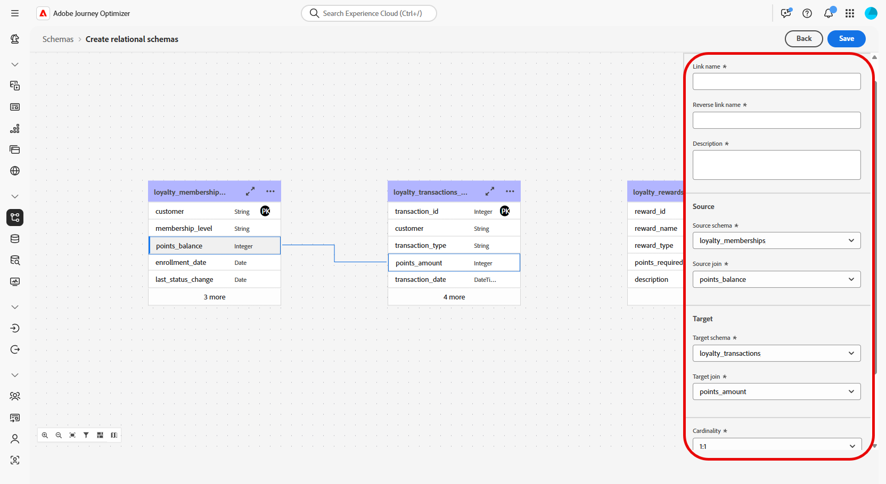

# Criar esquemas relacionais usando um arquivo DDL {#file-upload-schema}

+++ Índice 

| Bem-vindo às campanhas orquestradas | Iniciar sua primeira campanha orquestrada | Consultar o banco de dados | Atividades de campanhas orquestradas |
|---|---|---|---|
| [Introdução às campanhas orquestradas](gs-orchestrated-campaigns.md)  Criar e gerenciar esquemas e conjuntos de dados relacionais:  <ul><li>[Introdução a Esquemas e Conjuntos de Dados](gs-schemas.md)</li><li>[Esquema manual](manual-schema.md)</li><li>[Esquema de carregamento de arquivo](file-upload-schema.md)</li><li>[Assimilar dados](ingest-data.md)</li></ul>[Acesse e gerencie campanhas orquestradas](access-manage-orchestrated-campaigns.md)  [Etapas principais para criar uma campanha orquestrada](gs-campaign-creation.md) | [Criar e programar a campanha](create-orchestrated-campaign.md)  [Orquestrar atividades](orchestrate-activities.md)  [Iniciar e monitorar a campanha](start-monitor-campaigns.md)  [Geração de relatórios](reporting-campaigns.md) | [Trabalhar com o construtor de regras](orchestrated-rule-builder.md)  [Criar a sua primeira consulta](build-query.md)  [Editar expressões](edit-expressions.md)  [Redirecionamento](retarget.md) | [Introdução às atividades](activities/about-activities.md)  Atividades: [Associação](activities/and-join.md) - [Criar público-alvo](activities/build-audience.md) - [Mudar dimensão](activities/change-dimension.md) - [Atividades de canal](activities/channels.md) - [Combinar](activities/combine.md) - [Desduplicação](activities/deduplication.md) - [Enriquecimento](activities/enrichment.md) - [Bifurcação](activities/fork.md) - [Reconciliação](activities/reconciliation.md) - [Salvar público-alvo](activities/save-audience.md) - [Divisão](activities/split.md) - [Aguardar](activities/wait.md) |

{style="table-layout:fixed"}

+++

 

>[!BEGINSHADEBOX]

 

O conteúdo desta página não é final e pode estar sujeito a alterações.

>[!ENDSHADEBOX]

Defina o modelo de dados relacionais necessário para campanhas orquestradas, criando esquemas como **Associações de Fidelidade**, **Transações de Fidelidade** e **Recompensas de Fidelidade**. Cada esquema deve incluir uma chave primária, um atributo de controle de versão e relações apropriadas com entidades de referência, como **Destinatários** ou **Marcas**.

Os esquemas podem ser criados manualmente por meio da interface ou importados em massa usando um arquivo DDL.

Esta seção apresenta um passo a passo de como criar um esquema relacional na Adobe Experience Platform por meio do upload de um arquivo de linguagem de definição de dados (DDL, na sigla em inglês). Usar um arquivo DDL permite definir a estrutura do modelo de dados com antecedência, incluindo tabelas, atributos, chaves e relacionamentos.

1. [Carregue um arquivo DDL](#ddl-upload) para criar esquemas relacionais e definir sua estrutura.

1. [Definir relações](#relationships) entre tabelas no modelo de dados.

1. [Vincular esquemas](#link-schema) para conectar seus dados relacionais a entidades de perfil existentes, como Destinatários ou Marcas.

1. [Assimilar dados](ingest-data.md) em seu conjunto de dados de fontes compatíveis.

## Fazer upload de um arquivo DDL{#ddl-upload}

Ao fazer upload de um arquivo DDL, você pode definir a estrutura do modelo de dados antecipadamente, incluindo tabelas, atributos, chaves e relacionamentos.

Os uploads de arquivo de esquema baseados em Excel são compatíveis. Baixe o [modelo fornecido](assets/template.zip) para preparar facilmente as definições do esquema.

+++Os seguintes recursos são compatíveis ao criar esquemas relacionais no Adobe Experience Platform

* **ENUMERAÇÃO**\
  Os campos ENUM são suportados na criação de esquema manual e baseado em DDL, permitindo que você defina atributos com um conjunto fixo de valores permitidos.

* **Rótulo do esquema para governança de dados**\
  A rotulagem é compatível no nível do campo de esquema para aplicar políticas de governança de dados, como controle de acesso e restrições de uso. Para obter mais detalhes, consulte a [documentação do Adobe Experience Platform](https://experienceleague.adobe.com/docs/experience-platform/xdm/home.html?lang=pt-BR).

* **Chave Composta**\
  As chaves primárias compostas são suportadas em definições de esquema relacional, permitindo o uso de vários campos juntos para identificar registros de forma exclusiva.

+++

1. Faça logon no Adobe Experience Platform.

1. Navegue até o menu **Gerenciamento de Dados** > **Esquema**.

1. Clique em **Criar Esquema**.

1. Selecione **[!UICONTROL Relacional]** como seu **Tipo de esquema**.

   

1. Selecione **[!UICONTROL Fazer upload de arquivo DDL]** para definir um diagrama de relações de entidades e criar esquemas.

   A estrutura da tabela precisa conter:
   * Pelo menos uma chave primária
   * Um identificador de versão, como um campo `lastmodified` do tipo `datetime` ou `number`.
   * Para assimilação do Change Data Capture (CDC), uma coluna especial chamada `_change_request_type` do tipo `String`, que indica o tipo de alteração de dados (por exemplo, inserir, atualizar, excluir) e habilita processamento incremental

   >[!IMPORTANT]
   >
   > Qualquer esquema usado para direcionamento deve incluir pelo menos um campo de identidade do tipo `String` com um **namespace de identidade** associado.\
   >Isso garante a compatibilidade com os recursos de definição de metas e resolução de identidade da Adobe Journey Optimizer.

1. Arraste e solte o arquivo DDL, e clique em **[!UICONTROL Próximo]**.

   Observe que o tamanho máximo suportado para um arquivo DDL é 10 MB.

1. Digite o **[!UICONTROL Nome do esquema]**.

1. Configure cada esquema e suas colunas, certificando-se de que uma chave primária seja especificada.

   Um atributo, como `lastmodified`, precisa ser designado como descritor de versão. Esse atributo, normalmente do tipo `datetime`, `long` ou `int`, é essencial para processos de ingestão, a fim de garantir que o conjunto de dados seja atualizado com a versão mais recente dos dados.

   

1. Clique em **[!UICONTROL Concluído]** quando terminar.

Agora, é possível verificar a tabela e as definições de campos na tela. [Saiba mais na seção abaixo](#entities)

## Definir relacionamentos {#relationships}

Para definir conexões lógicas entre tabelas no esquema, siga as etapas abaixo.

1. Acesse a visualização da tela do seu modelo de dados e escolha as duas tabelas que deseja vincular

1. Clique no botão  ao lado da associação de origem e arraste e guie a seta em direção à associação de público-alvo para estabelecer a conexão.

   

1. Preencha o formulário fornecido para definir o vínculo e clique em **Aplicar** depois de configurar.

   

   **Cardinalidade**:

   * **1-N**: uma ocorrência da tabela de público-alvo pode ter várias ocorrências correspondentes da tabela de destino, mas uma ocorrência da tabela de destino pode ter, no máximo, uma ocorrência correspondente da tabela de origem.

   * **N-1**: uma ocorrência da tabela de destino pode ter várias ocorrências correspondentes da tabela de origem, mas uma ocorrência da tabela de origem pode ter, no máximo, uma ocorrência correspondente da tabela de público-alvo.

   * **1-1**: uma ocorrência da tabela de origem pode ter, no máximo, uma ocorrência correspondente da tabela de público-alvo.

1. Todos os vínculos definidos no modelo de dados são representados como setas na visualização da tela. Clique em uma seta entre duas tabelas para visualizar os detalhes, fazer edições ou remover o vínculo, conforme necessário.

   

1. Use a barra de ferramentas para personalizar e ajustar a tela.

   

   * **Aumentar zoom**: amplie a tela para ver mais detalhes do seu modelo de dados com mais clareza.

   * **Diminuir zoom**: reduza o tamanho da tela para obter uma visualização mais ampla do seu modelo de dados.

   * **Ajustar visualização**: ajuste o zoom para ajustar todos os esquemas à área visível.

   * **Filtro**: escolha qual esquema será exibido na tela.

   * **Forçar layout automático**: ordena os esquemas automaticamente para uma melhor organização.

   * **Exibir mapa**: ative uma sobreposição de minimapa para ajudar a navegar mais facilmente por layouts de esquema grandes ou complexos.

1. Clique em **Salvar** quando terminar. Esta ação cria os esquemas e conjuntos de dados associados, e habilita o conjunto de dados para uso em campanhas orquestradas.

1. Clique em **[!UICONTROL Abrir trabalhos]** para monitorar o progresso da tarefa de criação. Esse processo pode levar alguns minutos, dependendo do número de tabelas definidas no arquivo DDL.

   Você também pode acessar seus trabalhos relacionais abrindo a janela **[!UICONTROL Carregar arquivo DDL]** e selecionando **[!UICONTROL Exibir todos os Trabalhos relacionais]**.

   

## Vincular esquemas {#link-schema}

>[!IMPORTANT]
>
> Somente as relações explicitamente definidas no arquivo DDL são reconhecidas pelo sistema. Qualquer relação de entidade que exista fora do arquivo DDL será ignorada e não processada.

Estabeleça uma relação entre o esquema de **Transações de fidelidade** e o esquema de **Destinatários** para associar cada transação ao registro de cliente correto.

1. Navegue até **[!UICONTROL Esquemas]** e abra as **Transações de fidelidade** criadas anteriormente.

1. Clique em **[!UICONTROL Adicionar relacionamento]** nas **[!UICONTROL Propriedades do campo]** do cliente.

   

1. Selecione **[!UICONTROL De muitos para um]** como o **[!UICONTROL Tipo]** de relação.

1. Vincule ao esquema de **Destinatários** existente.

   

1. Insira o **[!UICONTROL Nome da relação do esquema atual]** e o **[!UICONTROL Nome da relação do esquema de referência]**.

1. Clique em **[!UICONTROL Aplicar]** para salvar as alterações.

Continue criando um relacionamento entre o esquema de **Recompensas por fidelidade** e o esquema de **Marcas** para associar cada entrada de recompensa à marca apropriada.

<!--### Setting Up Change data capture ingestion {#cdc-ingestion}

If you need to change the data source, you must delete the existing dataflow and create a new one pointing to the same dataset with the new source.

When using Change Data Capture (CDC), it is essential that the source and dataset remain in sync to ensure accurate incremental updates. Follow the steps below:

1. **Schema Requirements**
   - Your schema must include:
     - A **primary key** (e.g., `transaction_id`)
     - A **versioning field** (e.g., `lastmodified` or an incrementing `version_id`)
   - Enable the dataset for **Orchestrated Campaigns** if needed.

2. **CDC Dataflow Setup**
   - During dataflow creation, after choosing your source and files:
     - **Enable the CDC option**
     - Select your CDC-ready dataset
     - Confirm field mappings (especially version field)

3. **Keep Source and Target in Sync**
   - The source system must consistently update the version field so the platform can detect changes accurately.

Once set up, the platform will automatically ingest **only changed or new records** each time the flow runs.
-->
