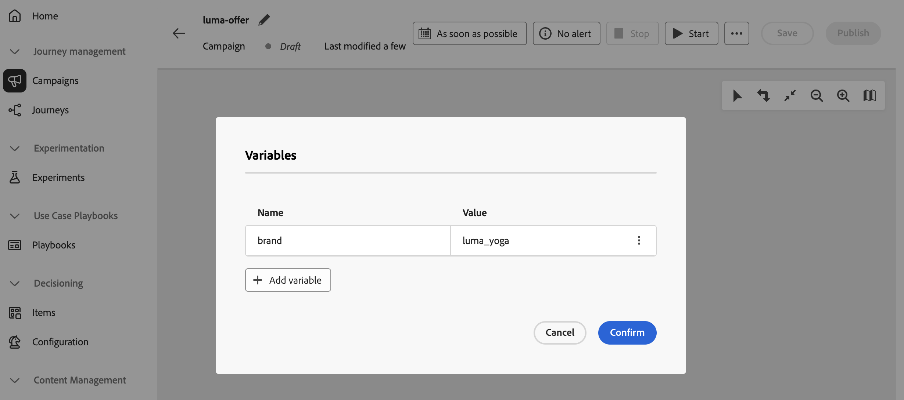

# Definir variáveis globais em campanhas orquestradas {#define-global-variables}

>[!BEGINSHADEBOX]

**Nesta página:** saiba como adicionar e gerenciar variáveis globais em uma campanha Orquestrada para poder reutilizar pares de nome-valor compartilhados no construtor de regras, condições de teste e outras lógicas de tela.

>[!ENDSHADEBOX]

**As variáveis globais** são pares de nome-valor que você define em uma única campanha Orquestrada e reutiliza em cada execução, para que possa orientar as condições de **[!UICONTROL Teste]**, o construtor de regras e outras lógicas de tela com valores compartilhados (por exemplo, um canal padrão ou email de teste) sem colar o mesmo valor em cada atividade.

Esta página explica como definir variáveis globais. Depois que estiverem disponíveis, para obter detalhes sobre como usá-las em regras e condições de **[!UICONTROL Teste]**, consulte [Usar variáveis em campanhas orquestradas](variables-orchestrated-campaigns.md).

Para adicionar ou editar uma variável global a uma campanha orquestrada, siga estas etapas:

1. Abra a Campanha orquestrada.

1. Clique no ícone **...** ao lado de **[!UICONTROL Salvar]** e selecione **[!UICONTROL Editar variáveis]**.

   {zoomable="yes"}

1. Clique em **[!UICONTROL Adicionar variável]** e defina o nome e o valor da variável. Para editar uma variável existente, clique no botão **...** e selecione **[!UICONTROL Editar]**.

   {zoomable="yes"}

Para saber como usar variáveis globais em regras e condições de **[!UICONTROL Teste]** depois de definidas, consulte [Usar variáveis em campanhas orquestradas](variables-orchestrated-campaigns.md#use).
