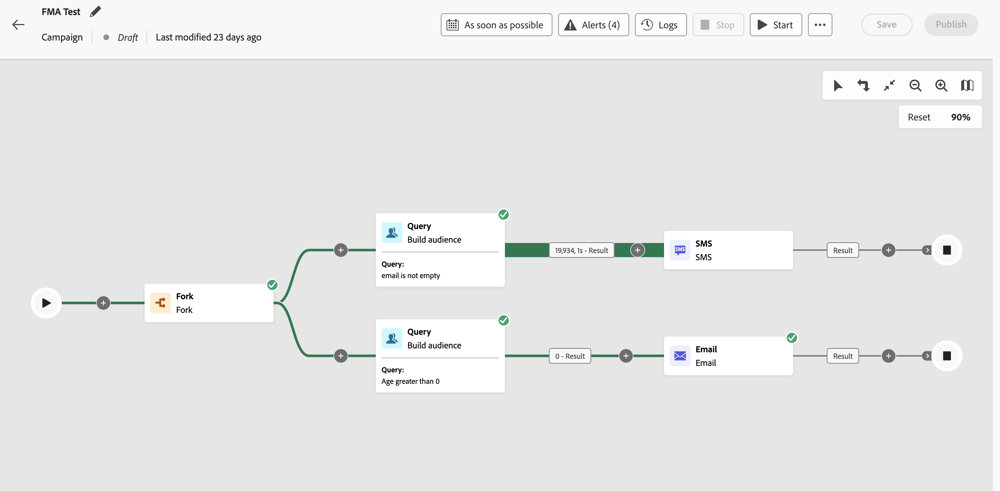

# Introdução às campanhas orquestradas {#orchestrated-camp}

>[!BEGINSHADEBOX]

**Nesta página:** descubra como as campanhas orquestradas no Adobe Journey Optimizer permitem que você consulte conjuntos de dados relacionais, crie públicos-alvo com contagens exatas e entregue mensagens de marketing e transacionais em vários canais.

>[!ENDSHADEBOX]

>[!CONTEXTUALHELP]
>id="campaigns_overview_orchestrated"
>title="campaigns_overview_orchestrated"
>abstract="<b>Orquestração de campanha</b> Dividir, combinar, enriquecer e manipular conjuntos de dados relacionais para definir o público-alvo   <b>Aproveite dados multientidade</b> Saiba como as campanhas orquestradas podem aproveitar os conjuntos de dados relacionais no enriquecimento de dados para segmentação e personalização  <b>Segmentação ad-hoc e contagens exatas</b> Crie seu segmento passo a passo com contagens exatas  <b>Canais disponíveis</b> Email, SMS, Notificações por push, Correspondência direta"

A Orquestração de campanha no [!DNL Adobe Journey Optimizer] possibilita campanhas sofisticadas iniciadas pela marca em todos os canais, tanto de **marketing** quanto **transacional**. As campanhas de marketing ajudam a impulsionar o engajamento, a receita e a fidelização do cliente em grande escala. As mensagens transacionais não exigem aceitação e são adequadas para comunicações urgentes, como interrupções, emergências ou cancelamentos.

>[!IMPORTANT]
>
>Para acessar a Orquestração de campanha, sua licença deve incluir o pacote **Journey Optimizer – Campanhas e jornadas** ou **Journey Optimizer – Campanhas**. Entre em contato com o representante da Adobe para confirmar sua licença e atualizá-la, se necessário.

Embora o marketing entre canais seja essencial, as campanhas orquestradas permitem que ele flua melhor. Com uma interface visual do tipo arrastar e soltar, você pode projetar e automatizar fluxos de trabalho de marketing complexos, desde a segmentação até a entrega de mensagens, em vários canais. Tudo acontece em um ambiente intuitivo, criado para proporcionar velocidade, controle e eficiência.

{zoomable="yes"}

➡️ [Descubra campanhas orquestradas nesse vídeo](#video-oc)

## Principais recursos

A Orquestração de campanhas é construída em torno de quatro pilares principais:

<table style="table-layout:auto">
<tr style="border: 0;">
<td></a></td><td><b>Públicos-alvo sob demanda</b> Consulte instantaneamente os conjuntos de dados para criar segmentos de público-alvo usando qualquer combinação de tipos de dados e dimensões.</td></tr>
<tr style="border: 0;">
<td></a></td><td><b>Segmentação e envio de várias entidades</b> Vá além das campanhas com base em pessoas. Use entidades como catálogos de produtos, locais de lojas ou dados de serviço para direcionar com precisão.  
Ofereça suporte ao envio de vários níveis, em que uma mensagem é enviada por Perfil e por entidade secundária associada. Essas entidades secundárias podem incluir endereços de contato, reservas, assinaturas, contratos ou outros dados vinculados. Por exemplo, permite que campanhas sejam enviadas para todos os endereços conhecidos de um Perfil ou para cada reserva associada a esse Perfil.</td></tr>
<tr style="border: 0;">
<td></a></td><td><b>Visibilidade e precisão de pré-envio</b> Obtenha contagens exatas de segmentação e o escopo completo da campanha antes do lançamento, garantindo precisão e confiança.</td></tr>
<tr style="border: 0;">
<td></a></td><td><b>Fluxos de trabalho da campanha em várias etapas</b> Crie campanhas em várias etapas, desde mensagens diárias até campanhas complexas, como promoções sazonais ou grandes lançamentos de produtos.</td></tr>
</table>

>[!NOTE]
>
>Para obter mais informações sobre os canais compatíveis, consulte a tabela nesta seção: [canais em jornadas e campanhas](../channels/gs-channels.md#channels).
>
>Os canais disponíveis variam com base no modelo de licenciamento e nos complementos.

## Campanhas orquestradas e jornadas

Embora a visualização de campanhas orquestradas tenha semelhanças com as jornadas, ela tem diferentes objetivos e casos de uso:

* **Jornadas** - tela 1 para 1 onde cada perfil percorre as diferentes etapas em seu próprio ritmo. O estado de cada cliente é mantido em seu contexto para iniciar ações em tempo real.

* **Campanhas orquestradas** - Ao contrário de jornadas, as campanhas orquestradas operam usando uma tela em lote que calcula segmentos. Todos os perfis são processados juntos e ao mesmo tempo.

Ambas as telas são otimizadas para seus respectivos casos de uso: a tela de jornada publica jornadas que tendem a permanecer por um período mais longo, enquanto a tela de campanha é projetada para execuções iterativas e incrementais de uma campanha em lote.

## O que há dentro de uma campanha orquestrada? {#gs-ms-campaign-inside}

A tela da campanha orquestrada é uma representação do que deve acontecer. Ela descreve as várias tarefas a serem executadas e como elas estão vinculadas.

Cada campanha orquestrada contém:

* **Atividades**: uma atividade é uma tarefa a ser executada. As [várias atividades](activities/about-activities.md) são representadas na tela por ícones. Cada atividade tem propriedades específicas e outras propriedades que são comuns a todas as atividades.

  Na tela de uma campanha orquestrada, uma determinada atividade pode gerar várias tarefas, principalmente quando há um ciclo ou ações recorrentes.

* **Transições**: as transições vinculam uma atividade de origem a uma atividade de destino e definem sua sequência.

* **Tabelas de trabalho**: as tabelas de trabalho contêm todas as informações transportadas pela transição. Cada campanha orquestrada usa várias tabelas de trabalho. Os dados transmitidos nessas tabelas podem ser usados durante todo o ciclo de vida da campanha orquestrada.

Uma campanha orquestrada típica de nível de entrada segue este padrão: **Criar público-alvo → Bifurcação → Canal A + Canal B**.

Essa abordagem permite direcionar o mesmo público-alvo com duas ramificações paralelas em uma única execução de campanha — por exemplo, uma ramificação usando um email de marketing e outra usando um email transacional. Cada ramificação é independente e pode usar uma configuração de canais, conteúdo de mensagem ou categoria diferente.

➡️ [Aprenda a usar a atividade Bifurcação](activities/fork.md)

➡️ [Entenda a diferença entre mensagens de marketing e mensagens transacionais](activities/channels.md#marketing-vs-transactional)

## Vídeo de introdução {#video-oc}

Saiba mais sobre os principais conceitos e recursos disponíveis com campanhas orquestradas.

>[!VIDEO](https://video.tv.adobe.com/v/3471538/?learn=on&enablevpops)

## Vamos nos aprofundar um pouco mais

Agora que você entende o que são campanhas orquestradas, é hora de se aprofundar nestas seções da documentação para começar a trabalhar com o recurso.

<table><tr style="border: 0; text-align: center;">
<td>

<a href="gs-campaign-creation.md"><strong>Etapas de configuração</strong></a>

</td>
<td>

<a href="create-orchestrated-campaign.md"><strong>Criar uma campanha orquestrada</strong>

</td>
<td>

<a href="activities/about-activities.md"><strong>Trabalhar com atividades</strong></a>

</td>
</tr></table>

## Recursos adicionais

* **[Crie sua primeira regra](build-query.md)**: domine o construtor de regras para criar consultas direcionadas e segmente públicos-alvo com precisão usando dados relacionais.
* **[Crie esquemas relacionais](gs-schemas.md)**: entenda como configurar esquemas relacionais para aproveitar dados de várias entidades nas campanhas.
* **[Relatórios de campanhas orquestradas](reporting-campaigns.md)**: acompanhe e analise o desempenho da campanha com métricas e insights detalhados de relatórios.
* **[Iniciar e monitorar campanhas](start-monitor-campaigns.md)**: conheça as práticas recomendadas para iniciar campanhas e monitorar sua execução em tempo real.
* **[Medidas de proteção e limitações](guardrails.md)**: revise medidas de proteção, limitações e práticas recomendadas importantes para garantir o desempenho ideal da campanha.
* **[Perguntas frequentes](orchestrated-campaigns-faq.md)**: encontre respostas para perguntas comuns sobre recursos, funcionalidades e casos de uso de campanhas orquestradas.
* **[Tutoriais da campanha orquestrada](https://experienceleague.adobe.com/pt-br/docs/journey-optimizer-learn/tutorials/create-campaigns/orchestrated-campaigns/introduction-to-orchestrated-campaigns){target="_blank"}**: explore tutoriais em vídeo passo a passo que abrangem recursos e práticas recomendadas.
* **[Engaje os clientes por meio da atividade de navegação](engage-customers-uc.md)**: reengaje perfis que navegaram, mas não compraram, usando uma campanha orquestrada em várias etapas.
* **[Notifique os usuários sobre a disponibilidade do produto](product-availability-uc.md)**: alerte os clientes quando um produto em que eles demonstraram interesse voltar ao estoque.
* **[Enviar atualizações de itens da lista de desejos](wishlist-uc.md)**: acione mensagens personalizadas quando os itens da lista de desejos entrarem em promoção ou ficarem disponíveis.
