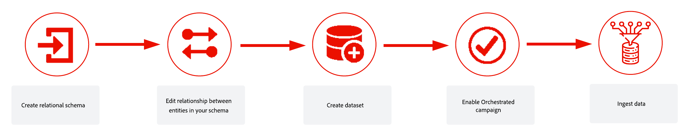

# Introdução a esquemas e conjuntos de dados{#gs-schemas}

+++ Índice 

| Bem-vindo às campanhas orquestradas | Iniciar sua primeira campanha orquestrada | Consultar o banco de dados | Atividades de campanhas orquestradas |
|---|---|---|---|
| [Introdução às campanhas orquestradas](gs-orchestrated-campaigns.md)  Criar e gerenciar esquemas e conjuntos de dados relacionais:  <ul><li>[Introdução a Esquemas e Conjuntos de Dados](gs-schemas.md)</li><li>[Esquema manual](manual-schema.md)</li><li>[Esquema de carregamento de arquivo](file-upload-schema.md)</li><li>[Assimilar dados](ingest-data.md)</li></ul>[Acesse e gerencie campanhas orquestradas](access-manage-orchestrated-campaigns.md)  [Etapas principais para criar uma campanha orquestrada](gs-campaign-creation.md) | [Criar e programar a campanha](create-orchestrated-campaign.md)  [Orquestrar atividades](orchestrate-activities.md)  [Iniciar e monitorar a campanha](start-monitor-campaigns.md)  [Geração de relatórios](reporting-campaigns.md) | [Trabalhar com o construtor de regras](orchestrated-rule-builder.md)  [Criar a sua primeira consulta](build-query.md)  [Editar expressões](edit-expressions.md)  [Redirecionamento](retarget.md) | [Introdução às atividades](activities/about-activities.md)  Atividades: [Associação](activities/and-join.md) - [Criar público-alvo](activities/build-audience.md) - [Mudar dimensão](activities/change-dimension.md) - [Atividades de canal](activities/channels.md) - [Combinar](activities/combine.md) - [Desduplicação](activities/deduplication.md) - [Enriquecimento](activities/enrichment.md) - [Bifurcação](activities/fork.md) - [Reconciliação](activities/reconciliation.md) - [Salvar público-alvo](activities/save-audience.md) - [Divisão](activities/split.md) - [Aguardar](activities/wait.md) |

{style="table-layout:fixed"}

+++

 

>[!BEGINSHADEBOX]

 

O conteúdo desta página não é final e pode estar sujeito a alterações.

>[!ENDSHADEBOX]

Este guia orienta você pelo processo de criação de um esquema relacional, configuração de um conjunto de dados para campanhas orquestradas e assimilação de dados.

1. Criar [esquema relacional manualmente](manual-schema.md) ou [usando um arquivo DDL](file-upload-schema.md)

   Defina a estrutura do modelo de dados, incluindo tabelas, atributos e relações. Opte por criar o esquema manualmente na interface do usuário ou fazer upload de um arquivo DDL para uma configuração mais rápida.

1. [Vincular esquema](file-upload-schema.md)

   Estabeleça relacionamentos entre seus esquemas para garantir a consistência dos dados e habilitar consultas entre entidades. Por exemplo, vincule transações de fidelidade a recipients ou recompensas a marcas.

1. [Assimilar dados](ingest-data.md)

   Traga dados para a Adobe Experience Platform a partir de fontes compatíveis, como SFTP, armazenamento na nuvem ou bancos de dados.

