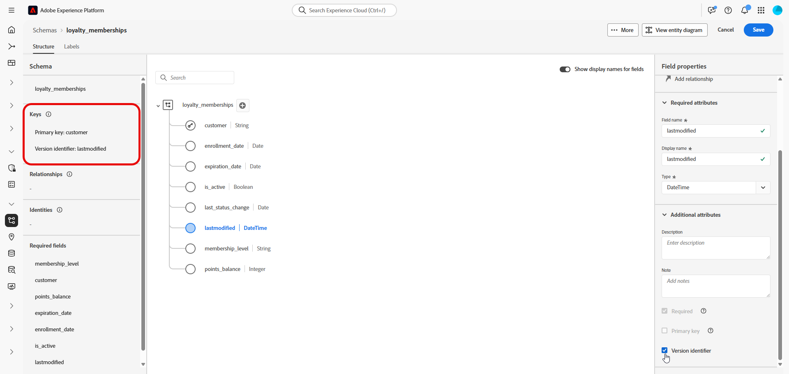

# Configurar um esquema relacional manual {#manual-schema}

+++ Índice 

| Bem-vindo às campanhas orquestradas | Iniciar sua primeira campanha orquestrada | Consultar o banco de dados | Atividades de campanhas orquestradas |
|---|---|---|---|
| [Introdução às campanhas orquestradas](gs-orchestrated-campaigns.md)  Criar e gerenciar esquemas e conjuntos de dados relacionais: <ul><li>[Introdução a Esquemas e Conjuntos de Dados](gs-schemas.md)</li><li>[Esquema manual](manual-schema.md)</li><li>[Esquema de carregamento de arquivo](file-upload-schema.md)</li><li>[Assimilar dados](ingest-data.md)</li></ul>[Acesse e gerencie campanhas orquestradas](access-manage-orchestrated-campaigns.md)  [Etapas principais para criar uma campanha orquestrada](gs-campaign-creation.md) | [Criar e programar a campanha](create-orchestrated-campaign.md)  [Orquestrar atividades](orchestrate-activities.md)  [Iniciar e monitorar a campanha](start-monitor-campaigns.md)  [Geração de relatórios](reporting-campaigns.md) | [Trabalhar com o construtor de regras](orchestrated-rule-builder.md)  [Criar a sua primeira consulta](build-query.md)  [Editar expressões](edit-expressions.md)  [Redirecionamento](retarget.md) | [Introdução às atividades](activities/about-activities.md)  Atividades: [Associação](activities/and-join.md) - [Criar público-alvo](activities/build-audience.md) - [Mudar dimensão](activities/change-dimension.md) - [Atividades de canal](activities/channels.md) - [Combinar](activities/combine.md) - [Desduplicação](activities/deduplication.md) - [Enriquecimento](activities/enrichment.md) - [Bifurcação](activities/fork.md) - [Reconciliação](activities/reconciliation.md) - [Salvar público-alvo](activities/save-audience.md) - [Divisão](activities/split.md) - [Aguardar](activities/wait.md) |

{style="table-layout:fixed"}

+++

 

>[!BEGINSHADEBOX]

 

O conteúdo desta página não é final e pode estar sujeito a alterações.

>[!ENDSHADEBOX]

Esquemas relacionais podem ser criados diretamente por meio da interface do usuário, permitindo a configuração detalhada de atributos, chaves primárias, campos de versionamento e relacionamentos.

O exemplo a seguir define manualmente o esquema **Associações de fidelidade** para ilustrar a estrutura necessária para campanhas orquestradas.

1. [Crie um esquema relacional manualmente](#schema) usando a interface do Adobe Experience Platform.

1. [Adicionar atributos](#schema-attributes), como ID de cliente, nível de associação e campos de status.

1. [Vincule seu esquema](#link-schema) a esquemas internos, como Recipients para direcionamento de campanha.

1. [Crie um conjunto de dados](#dataset) com base no seu esquema e habilite-o para uso em campanhas orquestradas.

1. [Assimilar dados](ingest-data.md) em seu conjunto de dados de fontes compatíveis.

## Criar seu esquema {#schema}

Comece criando um novo esquema relacional manualmente no Adobe Experience Platform. Esse processo permite definir a estrutura do schema do zero, incluindo seu nome e comportamento.

1. Faça logon no Adobe Experience Platform.

1. Navegue até o menu **[!UICONTROL Gerenciamento de Dados]** > **[!UICONTROL Esquema]**.

1. Clique em **[!UICONTROL Criar Esquema]**.

1. Selecione **[!UICONTROL Relacional]** como seu **Tipo de esquema**.

   {zoomable="yes"}

1. Escolha **[!UICONTROL Criar manualmente]** para criar o esquema adicionando campos manualmente.

1. Insira seu **[!UICONTROL nome para exibição do esquema]**.

1. Escolha **[!UICONTROL Registro]** como seu **[!UICONTROL Comportamento de esquema]**.

   {zoomable="yes"}

1. Clique em **Concluir** para prosseguir para a criação do esquema.

Agora é possível começar a adicionar atributos ao esquema para definir sua estrutura.

## Adicionar atributos ao esquema {#schema-attributes}

Em seguida, adicione atributos para definir a estrutura do esquema. Esses campos representam os principais pontos de dados usados em campanhas orquestradas, como identificadores de clientes, detalhes de associação e datas de atividade. Defini-los com precisão garante personalização, segmentação e rastreamento confiáveis.

Qualquer esquema usado para direcionamento deve incluir pelo menos um campo de identidade do tipo `String` com um namespace de identidade associado. Isso garante a compatibilidade com os recursos de definição de metas e resolução de identidade da Adobe Journey Optimizer.

+++Os seguintes recursos são compatíveis ao criar esquemas relacionais no Adobe Experience Platform

* **ENUMERAÇÃO**\
  Os campos ENUM são suportados na criação de esquema manual e baseado em DDL, permitindo que você defina atributos com um conjunto fixo de valores permitidos.

* **Rótulo do esquema para governança de dados**\
  A rotulagem é compatível no nível do campo de esquema para aplicar políticas de governança de dados, como controle de acesso e restrições de uso. Para obter mais detalhes, consulte a [documentação do Adobe Experience Platform](https://experienceleague.adobe.com/docs/experience-platform/xdm/home.html?lang=pt-BR).

* **Chave Composta**\
  As chaves primárias compostas são suportadas em definições de esquema relacional, permitindo o uso de vários campos juntos para identificar registros de forma exclusiva.

+++

1. Na tela, clique em  ao lado do seu **Nome do esquema** para começar a adicionar atributos.

   {zoomable="yes"}

1. Insira seu atributo **[!UICONTROL Nome do campo]**, **[!UICONTROL Nome de exibição]** e **[!UICONTROL Tipo]**.

   Neste exemplo, adicionamos os atributos detalhados na tabela abaixo ao esquema **Associações de fidelidade**.

+++ Exemplos de atributos

   | Nome do atributo | Tipo de dados | Atributos Adicionais |
   |-|-|-|
   | cliente | STRING | Chave primária |
   | nível_de_associação | STRING | Obrigatório |
   | points_balance | INTEIRO | Obrigatório |
   | enrollment_date | DATA | Obrigatório |
   | last_status_change | DATA | Obrigatório |
   | data_expiração | DATA | - |
   | is_ative | BOOLEANO | Obrigatório |
   | última modificação | DATETIME | Obrigatório |

+++

1. Atribua os campos apropriados como a **[!UICONTROL Chave Primária]** e o **[!UICONTROL Descritor de Versão]**.

   Ao criar um schema manual, verifique se os seguintes campos essenciais estão incluídos:

   * Pelo menos uma chave primária
   * Um identificador de versão, como um campo `lastmodified` do tipo `datetime` ou `number`.
   * Para a assimilação do CDC (Change Data Capture), uma coluna especial chamada `_change_request_type` do tipo `String`, que indica o tipo de alteração de dados (por exemplo, inserir, atualizar, excluir) e habilita o processamento incremental.

   {zoomable="yes"}

1. Clique em **[!UICONTROL Salvar]**.

Depois que os atributos forem criados, é necessário vincular o esquema recém-criado a um esquema incorporado.

## Vincular esquemas {#link-schema}

Criar uma relação entre dois esquemas permite enriquecer suas campanhas orquestradas com dados armazenados fora do esquema de perfil primário.

1. Em seu esquema recém-criado, selecione o atributo que deseja usar como link e clique em **[!UICONTROL Adicionar relacionamento]**.

   {zoomable="yes"}

1. Escolha o **[!UICONTROL Esquema de referência]** e o **[!UICONTROL Campo de referência]** para estabelecer a relação com.

   Neste exemplo, o atributo `customer` está vinculado ao esquema `recipients`.

   {zoomable="yes"}

1. Insira um nome de Relacionamento do esquema atual e do esquema de referência.

1. Clique em **[!UICONTROL Aplicar]** depois de configurado.

Depois que a relação for estabelecida, é necessário criar um conjunto de dados com base no esquema.

## Criar um conjunto de dados para o esquema {#dataset}

Depois de definir seu esquema, a próxima etapa é criar um conjunto de dados com base nele. Esse conjunto de dados armazena seus dados assimilados e deve ser ativado para Campanhas orquestradas para torná-lo acessível no Adobe Journey Optimizer. Habilitar essa opção garante que o conjunto de dados seja reconhecido para uso em workflows de orquestração e personalização em tempo real.

1. Navegue até o menu **[!UICONTROL Data Management]** > **[!UICONTROL Datasets]** e clique em **[!UICONTROL Criar conjunto de dados]**.

   {zoomable="yes"}

1. Selecione **[!UICONTROL Criar conjunto de dados do esquema]**.

1. Escolha o esquema criado anteriormente, aqui **Associações de fidelidade**, e clique em **[!UICONTROL Avançar]**.

   {zoomable="yes"}

1. Insira um **[!UICONTROL Nome]** para seu **[!UICONTROL Conjunto de Dados]** e clique em **[!UICONTROL Concluir]**.

Agora é necessário ativar seu conjunto de dados para Orquestrar campanhas.

## Habilitar conjunto de dados para campanhas orquestradas {#enable}

Depois de criar seu conjunto de dados, é necessário ativá-lo explicitamente para Campanhas orquestradas. Essa etapa garante que seu conjunto de dados esteja disponível para orquestração e personalização em tempo real no Adobe Journey Optimizer.

1. Localize seu conjunto de dados na lista **[!UICONTROL Conjuntos de dados]**.

1. Nas configurações de **[!UICONTROL Conjuntos de dados]**, habilite a opção **Campanhas orquestradas** para disponibilizar o conjunto de dados para uso em suas Campanhas orquestradas.

   {zoomable="yes"}

1. Aguarde alguns minutos para que o processo de ativação seja concluído. Observe que a assimilação de dados e o uso da campanha só serão possíveis depois que essa configuração for totalmente ativada.

Agora é possível começar a assimilar dados no esquema usando a fonte de sua escolha.

➡️ [Saiba como assimilar dados](ingest-data.md)
