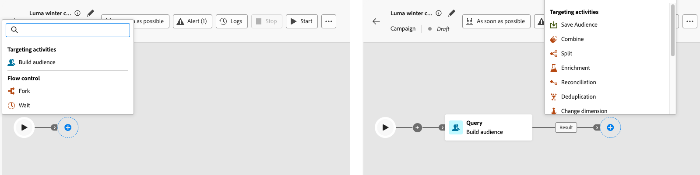

# Atividades da campanha orquestrada {#orchestrate}

+++ Índice 

| Bem-vindo(a) às campanhas orquestradas | Lançar a sua primeira campanha orquestrada | Consultar o banco de dados | Atividades de campanhas orquestradas |
|---|---|---|---|
| [Introdução a campanhas orquestradas](gs-orchestrated-campaigns.md)  Criar e gerenciar Esquemas e Conjuntos de Dados relacionais:  <ul><li>[Introdução a Esquemas e Conjuntos de Dados](gs-schemas.md)</li><li>[Esquema manual](manual-schema.md)</li><li>[Esquema de carregamento de arquivo](file-upload-schema.md)</li><li>[Assimilar dados](ingest-data.md)</li></ul>[Acesse e gerencie campanhas orquestradas](access-manage-orchestrated-campaigns.md)  [Etapas principais para criar uma campanha orquestrada](gs-campaign-creation.md) | [Criar e programar a campanha](create-orchestrated-campaign.md)  <b>[Orquestrar atividades](orchestrate-activities.md)</b>  [Iniciar e monitorar a campanha](start-monitor-campaigns.md)  [Geração de relatórios](reporting-campaigns.md) | [Trabalhar com o construtor de regras](orchestrated-rule-builder.md)  [Criar a sua primeira consulta](build-query.md)  [Editar expressões](edit-expressions.md)  [Redirecionamento](retarget.md) | [Introdução às atividades](activities/about-activities.md)  Atividades: [Associação](activities/and-join.md) - [Criar público-alvo](activities/build-audience.md) - [Mudar dimensão](activities/change-dimension.md) - [Atividades de canal](activities/channels.md) - [Combinar](activities/combine.md) - [Desduplicação](activities/deduplication.md) - [Enriquecimento](activities/enrichment.md) - [Bifurcação](activities/fork.md) - [Reconciliação](activities/reconciliation.md) - [Salvar público-alvo](activities/save-audience.md) - [Divisão](activities/split.md) - [Aguardar](activities/wait.md) |

{style="table-layout:fixed"}

+++

 

>[!BEGINSHADEBOX]

 

O conteúdo desta página não é final e pode estar sujeito a alterações.

>[!ENDSHADEBOX]

Depois de [criar uma campanha orquestrada](gs-campaign-creation.md), você pode começar a orquestrar as diferentes tarefas que ela realizará. Para isso, uma tela visual é fornecida, permitindo que você construa um diagrama da campanha orquestrado. Nesse diagrama, é possível adicionar várias atividades e conectá-las em ordem sequencial.

## Adicionar atividades {#add}

Nesta etapa da configuração, o diagrama é exibido com um ícone de início, representando o início da campanha orquestrada. Para adicionar a primeira atividade, clique no botão **+** conectado ao ícone de início.

Uma lista de atividades que podem ser adicionadas ao diagrama é exibida. As atividades disponíveis dependem da sua posição no diagrama da campanha orquestrada. Por exemplo, ao adicionar a primeira atividade, é possível iniciar a campanha orquestrada por meio do direcionamento a um público-alvo, divisão do caminho da campanha orquestrada ou definição de uma atividade **Aguardar** para atrasar a execução da campanha orquestrada. Por outro lado, depois de uma atividade **Criar público-alvo**, você pode refinar o seu público-alvo com atividades de direcionamento, enviar uma entrega ao seu público-alvo com atividades de canal ou organizar o processo da campanha orquestrada com atividades de controle do fluxo.

{zoomable="yes"}

Depois que uma atividade é adicionada ao diagrama, aparece um painel à direita, permitindo que você a ajuste com configurações específicas. Informações detalhadas de como configurar cada atividade estão disponíveis [nesta seção](activities/about-activities.md).

{zoomable="yes"}

Repita esse processo para adicionar quantas atividades desejar, dependendo das tarefas que você quer que a sua campanha orquestrada realize. Observe que você também pode inserir uma nova atividade entre duas atividades. Para isso, clique no botão **+** na transição entre as atividades, selecione a atividade desejada e configure-a no painel direito.

Você tem a opção de personalizar o nome das transições entre cada atividade. Para isso, selecione a transição e altere seu rótulo no painel direito.

### A barra de ferramentas da tela {#toolbar}

A barra de ferramentas da tela permite manipular facilmente as atividades e navegar pela tela:

 Selecione várias atividades para excluí-las de uma vez ou copiá-las e colá-las. [Saiba como usar as atividades de copiar e colar](#copy)

 Coloque a tela na vertical.

 Ajuste o nível de zoom da tela conforme a tela atual.

  Diminua ou aumente o zoom na tela.

 Abre um instantâneo da tela, mostrando onde você se encontra.

### Gerenciar atividades {#manage}

Ao adicionar atividades, os botões de ação ficam disponíveis no painel de propriedades, permitindo que você execute várias operações.

 Exclua a atividade da tela.

  Desabilite/habilite a atividade. Quando a campanha orquestrada é executada, as atividades desabilitadas e as atividades seguintes no mesmo caminho não são executadas, e a campanha orquestrada é interrompida.

  Pause/retome a atividade. Quando a campanha orquestrada é executada, ela pausa na atividade pausada. A tarefa correspondente e todas as seguintes no mesmo caminho não são executadas.

    Você pode usar qualquer atividade na tela como um ponto de interrupção para pausar a execução da campanha. Isso significa que a campanha será executada somente até essa atividade e, em seguida, pausará a execução. Ao pausar a execução, o mecanismo de segmentação mantém os dados temporários disponíveis para visualização. É possível selecionar a transição de entrada antes da atividade pausada para visualizar os dados transportados. Saiba mais nesta seção: [Monitoramento de fluxo visual](../orchestrated/start-monitor-campaigns.md#flow).

 Copie a atividade. [Saiba como usar as atividades de copiar e colar](#copy)

 Acesse os logs e tarefas da atividade.

Várias atividades de **Direcionamento**, como **Combinar** ou **Desduplicação**, permitem processar a população restante e incluí-la em uma transição de saída adicional. Por exemplo, se você estiver usando uma atividade **Divisão**, o complemento consiste na população que não correspondeu a nenhum dos subconjuntos definidos anteriormente. Para usar este recurso, ative a opção **[!UICONTROL Gerar complemento]**.

### Atividades de copiar e colar {#copy}

Você pode copiar e colar atividades em qualquer tela da campanha orquestrada. A campanha de destino pode estar em uma guia do navegador diferente.

* Para copiar uma atividade, clique no botão do , no painel de propriedades da atividade.
* Para copiar mais de uma atividade, clique no , na barra de ferramentas da tela.

| Copiar uma atividade | Copiar várias atividades |
|  ---  |  ---  |
| {width="200" align="center" zoomable="yes"} | {width="200" align="center" zoomable="yes"} |

Para colar as atividades, clique no botão **+** em uma transição e selecione “Colar atividade x”.

{zoomable="yes"}{width="50%"}

## Exemplo de diagrama {#example}

Este é um exemplo de campanha orquestrada criada para enviar um email a todos os clientes que fizeram uma compra de pelo menos USD 100, excluindo todos os clientes que têm menos de 50 pontos de fidelidade.

{zoomable="yes"}

Para isso, as atividades abaixo foram adicionadas:

* Uma atividade **[!UICONTROL Bifurcação]** divide a campanha orquestrada em três caminhos.
* As atividades **[!UICONTROL Criar público-alvo]** dirigem-se aos três conjuntos de clientes:

   * Clientes com um email,
   * Clientes que fizeram uma compra de pelo menos USD 100,
   * Clientes que têm menos de 50 pontos de fidelidade.

* Uma atividade **[!UICONTROL Combinar]** agrupa os clientes com email e os que fizeram uma compra de pelo menos USD 100,
* Uma atividade **[!UICONTROL Combinar]** exclui os clientes que têm menos de 50 pontos de fidelidade,
* Uma atividade **[!UICONTROL Entrega de email]** envia um email aos clientes resultantes.

## Próximas etapas {#next}

Depois de criar com sucesso o diagrama da campanha orquestrada, você pode executar a campanha orquestrada e acompanhar o progresso de suas várias tarefas. [Saiba como iniciar uma campanha orquestrada e monitorar sua execução](start-monitor-campaigns.md)
