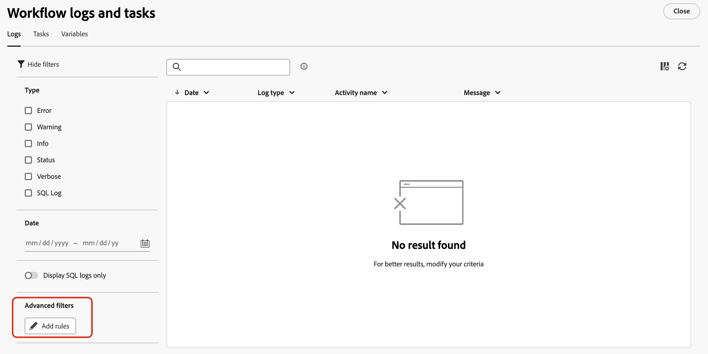

# Trabalhar com o construtor de regras {#orchestrated-rule-builder}

+++ Sumário

| Bem-vindo às campanhas orquestradas | Lançar a primeira campanha orquestrada | Consultar o banco de dados | Atividades de campanhas orquestradas |
|---|---|---|---|
| [Introdução a campanhas orquestradas](gs-orchestrated-campaigns.md)  [Etapas de configuração](configuration-steps.md)  [Acessar e gerenciar campanhas orquestradas](access-manage-orchestrated-campaigns.md) | [Etapas principais para a criação de campanha orquestrada](gs-campaign-creation.md)  [Criar e agendar a campanha](create-orchestrated-campaign.md)  [Orquestrar atividades](orchestrate-activities.md)  [Iniciar e monitorar a campanha](start-monitor-campaigns.md)  [Relatórios](reporting-campaigns.md) | <b>[Trabalhar com o construtor de regras](orchestrated-rule-builder.md)</b>  [Criar a primeira consulta](build-query.md)  [Editar expressões](edit-expressions.md) | [Introdução às atividades](activities/about-activities.md)  Atividades: [And-join](activities/and-join.md) - [Criar público](activities/build-audience.md) - [Alterar dimensão](activities/change-dimension.md) - [Atividades de canal](activities/channels.md) - [Combinar](activities/combine.md) - [Eliminação de Duplicação](activities/deduplication.md) - [Enriquecimento](activities/enrichment.md) - [Bifurcação](activities/fork.md) - [Reconciliação](activities/reconciliation.md) - [Divisão](activities/split.md) - [Aguardar](activities/wait.md) |

{style="table-layout:fixed"}

+++

 

As campanhas orquestradas vêm com um construtor de regras que simplifica o processo de filtragem do banco de dados com base em vários critérios. O construtor de regras gerencia consultas muito complexas e longas com eficiência, oferecendo flexibilidade e precisão aprimoradas.

Ele também oferece suporte a filtros predefinidos em condições, permitindo que você refine as consultas com facilidade enquanto usa expressões e operadores avançados para estratégias abrangentes de direcionamento e segmentação de público.

## Acessar o construtor de regras

O modelador de consultas está disponível em todo contexto onde é preciso definir regras para filtrar dados.

| Uso | Exemplo |
|  ---  |  ---  |
| **Criar públicos-alvo**: especifique a população que deseja direcionar em suas campanhas orquestradas usando uma atividade **[!UICONTROL Criar público-alvo]** e crie facilmente novos públicos-alvo adaptados às suas necessidades. [Saiba como criar públicos-alvo](../orchestrated/activities/build-audience.md) | {width="200" align="center" zoomable="yes"} |
| **Criar condição na tela de campanha**: aplique regras na tela de campanha usando uma atividade **[!UICONTROL Split]** para alinhar-se aos seus requisitos específicos. [Saiba como usar uma atividade de Split](../orchestrated/activities/split.md) | {width="200" align="center" zoomable="yes"} |
| **Criar filtros avançados**: crie regras para filtrar os dados exibidos em listas, como logs de fluxo de trabalho ou dimensões de direcionamento. | {width="200" align="center" zoomable="yes"} |

## Interface do construtor de regras {#interface}

O construtor de regras fornece uma tela central onde você cria sua consulta e um painel de propriedades que fornece informações sobre a regra.

* A **tela central** é onde você adiciona e combina os diferentes componentes para criar sua regra. [Saiba como criar uma regra](../orchestrated/build-query.md)

* O painel **[!UICONTROL Propriedades da regra]** fornece informações sobre a regra. Ele permite executar várias operações para verificar a regra e garantir que ela atenda às suas necessidades.

  Este painel é exibido ao criar uma consulta para criar um público-alvo. [Saiba como verificar e validar sua consulta](build-query.md#check-and-validate-your-query)
