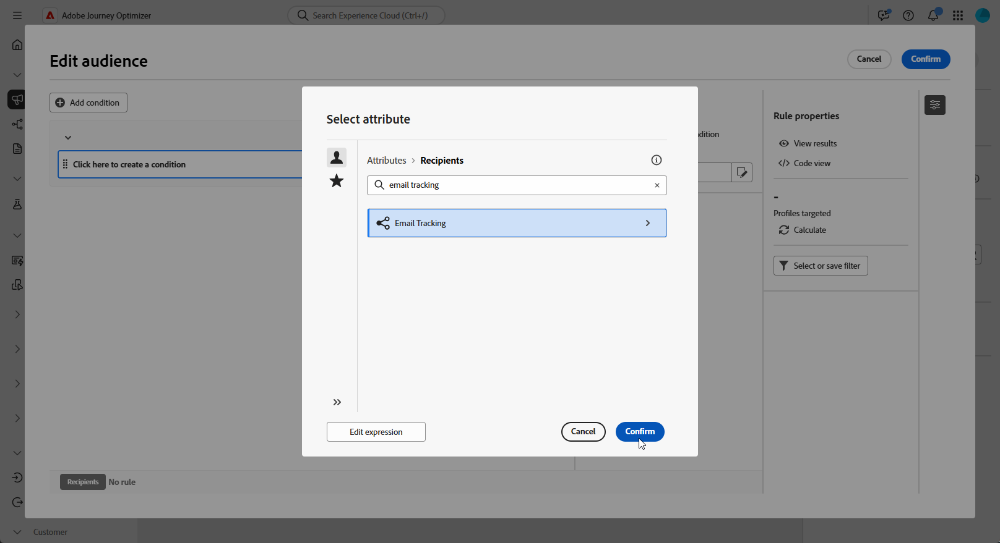

# Criação de consultas de redirecionamento {#retarget}

+++ Sumário

| Bem-vindo às campanhas orquestradas | Lançar a primeira campanha orquestrada | Consultar o banco de dados | Atividades de campanhas orquestradas |
|---|---|---|---|
| [Introdução a campanhas orquestradas](gs-orchestrated-campaigns.md)  [Etapas de configuração](configuration-steps.md)  [Acesse e gerencie campanhas orquestradas](access-manage-orchestrated-campaigns.md)  [Etapas principais para criar uma campanha orquestrada](gs-campaign-creation.md) | [Criar e agendar a campanha](create-orchestrated-campaign.md)  [Orquestrar atividades](orchestrate-activities.md)  [Iniciar e monitorar a campanha](start-monitor-campaigns.md)  [Relatórios](reporting-campaigns.md) | [Trabalhar com o construtor de regras](orchestrated-rule-builder.md)  [Criar a primeira consulta](build-query.md)  [Editar expressões](edit-expressions.md)  <b>[Redirecionamento](retarget.md)</b> | [Introdução às atividades](activities/about-activities.md)  Atividades: [And-join](activities/and-join.md) - [Criar público](activities/build-audience.md) - [Alterar dimensão](activities/change-dimension.md) - [Atividades de canal](activities/channels.md) - [Combinar](activities/combine.md) - [Desduplicação](activities/deduplication.md) - [Enriquecimento](activities/enrichment.md) - [Bifurcação](activities/fork.md) - [Reconciliação](activities/reconciliation.md) - [Salvar público](activities/save-audience.md) - [Divisão](activities/split.md) - [Espera](activities/wait.md) |

{style="table-layout:fixed"}

+++

 

>[!BEGINSHADEBOX]

Documentação em andamento

>[!ENDSHADEBOX]

O redirecionamento permite acompanhar os recipients com base em como eles responderam a uma campanha orquestrada anterior. Por exemplo, você pode enviar um segundo email para recipients que receberam, mas não clicaram no primeiro.

A **[!UICONTROL Campanha Orquestrada]** fornece dois atributos principais para isso:

* **[!UICONTROL Feedback de Mensagem]**: captura eventos relacionados à entrega, por exemplo, mensagem enviada, aberta, rejeitada, etc.
* **[!UICONTROL Acompanhamento de email]**: captura as ações do usuário, por exemplo, cliques e aberturas.

{zoomable="yes"}

## Criar uma regra de redirecionamento baseada em comentários {#feedback-retarget}

A Regra de Redirecionamento Baseada em Comentários permite redirecionar destinatários com base em eventos de entrega de mensagens capturados no atributo **[!UICONTROL Comentários de Mensagens]**. Esses eventos incluem resultados como mensagens que estão sendo enviadas, abertas, rejeitadas ou marcadas como spam.

Usando esses dados, você pode definir regras para identificar os recipients que receberam uma mensagem anterior, permitindo a comunicação de acompanhamento com base em status de delivery específicos.

1. Crie uma nova **[!UICONTROL Campanha orquestrada]**.

1. Adicione uma atividade **[!UICONTROL Criar Público]** e defina o targeting dimension como **[!UICONTROL Recipient (caas)]**.

1. No **[!UICONTROL Construtor de Regras]**, clique em **[!UICONTROL Adicionar Condição]** e selecione **[!UICONTROL Comentários sobre a Mensagem]** no **[!UICONTROL Seletor de Atributos]**. Clique em **[!UICONTROL Confirmar]** para criar uma **Condição Feedback de Mensagem como**.

   {zoomable="yes"}

1. Escolha o atributo **[!UICONTROL Status de Feedback]** para direcionar eventos de entrega de mensagens.

+++ Passo a passo detalhado

   1. Adicione outra condição vinculada ao atributo **[!UICONTROL Feedback da mensagem]**.

   1. Procure o atributo **[!UICONTROL Status do feedback]** e clique em **[!UICONTROL Confirmar]**.

      {zoomable="yes"}

   1. No menu suspenso **[!UICONTROL Condição personalizada]**, escolha qual status de entrega rastrear no menu suspenso **[!UICONTROL Valor]**.

      {zoomable="yes"}

+++

1. Escolha o atributo **[!UICONTROL Nome da Campanha Orquestrada]** para direcionar uma campanha orquestrada específica.

+++ Passo a passo detalhado

   1. Adicione outra condição vinculada ao atributo **[!UICONTROL Feedback da mensagem]**, pesquise por **[!UICONTROL entidade]** e navegue até:

      `_experience > CustomerJourneyManagement > Entities > AJO Orchestrated Campaign entity`.

   1. Selecione **[!UICONTROL Nome da Campanha Orquestrada]**.

      {zoomable="yes"}

   1. No menu **[!UICONTROL Condição personalizada]**, especifique o nome da campanha no campo **[!UICONTROL Valor]**.

+++

1. Escolha o atributo **[!UICONTROL Nome da Ação da Campanha Orquestrada]** para direcionar uma mensagem ou atividade específica em uma campanha orquestrada.

+++ Passo a passo detalhado

   1. Adicione outra condição vinculada ao atributo **[!UICONTROL Feedback da mensagem]**, pesquise por **[!UICONTROL entidade]** e navegue até:

      `_experience > CustomerJourneyManagement > Entities > AJO Orchestrated Campaign entity`.

   1. Selecione **[!UICONTROL Nome da Ação de Campanha Orquestrada]**.

      {zoomable="yes"}

   1. No menu **[!UICONTROL Condição personalizada]**, especifique o nome da ação de campanha no campo **[!UICONTROL Valor]**.

      Nomes de ações podem ser encontrados clicando no ícone  ao lado do campo Rótulo da sua atividade.

+++

1. Como alternativa, você também pode filtrar pela **[!UICONTROL ID da campanha]** (UUID), que pode ser encontrada nas propriedades da campanha.

Agora você configurou uma regra de redirecionamento baseada em comentários para identificar destinatários com base no status de entrega de uma mensagem anterior, como enviada, aberta, rejeitada ou marcada como spam. Com esse público definido, você pode adicionar um email de acompanhamento ou refinar ainda mais seu direcionamento [configurando uma regra de redirecionamento baseada em Rastreamento](#tracking-based), que usa dados de interação do usuário.

{zoomable="yes"}

## Criar uma regra de redirecionamento baseada em rastreamento {#tracking-based}

A regra de redirecionamento baseada em rastreamento segmenta os destinatários com base em suas interações com uma mensagem, usando dados do atributo **[!UICONTROL Acompanhamento de email]**. Ele captura as ações do usuário, como aberturas de email e cliques em links.

Para redirecionar destinatários com base nas interações de mensagem (por exemplo, abrir ou clicar), use a entidade **[!UICONTROL Acompanhamento de email]** da seguinte maneira:

1. Crie uma nova **[!UICONTROL Campanha orquestrada]**.

1. Adicione uma atividade **[!UICONTROL Build Audience]** e defina o targeting dimension como **[!UICONTROL Recipient (caas)]** para se concentrar em recipients de campanhas orquestradas anteriores.

1. No **[!UICONTROL Construtor de Regras]**, clique em **[!UICONTROL Adicionar Condição]** e selecione **[!UICONTROL Acompanhamento de Email]** no **[!UICONTROL Seletor de Atributos]**.

   Clique em **[!UICONTROL Confirmar]** para criar uma **Condição**.

   {zoomable="yes"}

1. Para direcionar as interações dos destinatários com uma mensagem, adicione outra condição vinculada ao atributo **[!UICONTROL Acompanhamento de email]** e procure pelo atributo **[!UICONTROL Tipo de Interação]**.

   {zoomable="yes"}

1. Nas opções de condição personalizadas, use **[!UICONTROL Incluído em]** como operador e selecione um ou mais valores dependendo do seu caso de uso, por exemplo, **[!UICONTROL Mensagem Aberta]** ou **[!UICONTROL Link de Mensagem Clicado]**.

   {zoomable="yes"}

Agora você configurou uma regra de redirecionamento baseada em Rastreamento para direcionar destinatários com base em suas interações com uma mensagem anterior, como aberturas de email ou cliques em links, usando dados do atributo **[!UICONTROL Rastreamento de email]**. Com esse público definido, você pode adicionar uma ação de acompanhamento ou refinar ainda mais seu direcionamento combinando-o com uma [regra de redirecionamento baseada em comentários](#feedback-retarget) para incluir resultados de mensagens como enviados, rejeitados ou marcados como spam.

{zoomable="yes"}
