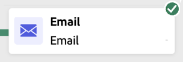

# Iniciar e monitorar campanhas orquestradas {#start-monitor}

>[!CONTEXTUALHELP]
>id="ajo_campaign_publication"
>title="Publicar campanha orquestrada"
>abstract="Para iniciar a campanha, você deve publicá-la. Certifique-se de que todos os erros tenham sido resolvidos antes da publicação."

+++ Sumário

| Bem-vindo às campanhas orquestradas | Lançar a primeira campanha orquestrada | Consultar o banco de dados | Atividades de campanhas orquestradas |
|---|---|---|---|
| [Introdução a campanhas orquestradas](gs-orchestrated-campaigns.md)  [Etapas de configuração](configuration-steps.md)  [Acesse e gerencie campanhas orquestradas](access-manage-orchestrated-campaigns.md)  [Etapas principais para criar uma campanha orquestrada](gs-campaign-creation.md) | [Criar e agendar a campanha](create-orchestrated-campaign.md)  [Orquestrar atividades](orchestrate-activities.md)  <b>[Iniciar e monitorar a campanha](start-monitor-campaigns.md)</b>  [Relatórios](reporting-campaigns.md) | [Trabalhar com o construtor de regras](orchestrated-rule-builder.md)  [Criar a primeira consulta](build-query.md)  [Editar expressões](edit-expressions.md)  [Redirecionamento](retarget.md) | [Introdução às atividades](activities/about-activities.md)  Atividades: [And-join](activities/and-join.md) - [Criar público](activities/build-audience.md) - [Alterar dimensão](activities/change-dimension.md) - [Atividades de canal](activities/channels.md) - [Combinar](activities/combine.md) - [Desduplicação](activities/deduplication.md) - [Enriquecimento](activities/enrichment.md) - [Bifurcação](activities/fork.md) - [Reconciliação](activities/reconciliation.md) - [Salvar público](activities/save-audience.md) - [Divisão](activities/split.md) - [Espera](activities/wait.md) |

{style="table-layout:fixed"}

+++

 

>[!BEGINSHADEBOX]

Documentação em andamento

>[!ENDSHADEBOX]

Depois de criar as tarefas orquestradas e projetadas para execução na tela, é possível publicá-las e monitorar como elas estão sendo executadas.

Você também pode executar a campanha no modo de teste para verificar sua execução e o resultado das diferentes atividades.

## Teste sua campanha antes de publicar {#test}

O [!DNL Journey Optimizer] permite que você teste campanhas orquestradas antes de entrar em produção. Quando uma campanha é criada, ela entra no estado **Rascunho** por padrão. Nesse estado, é possível executar a campanha manualmente para testar o fluxo.

Todas as atividades na tela são executadas, exceto **[!UICONTROL Salvar público-alvo]** atividades e atividades de canal. Não há impacto funcional nos seus dados ou público-alvo.

Para testar uma campanha:

1. Abra a campanha orquestrada.
2. Clique em **[!UICONTROL Start]**.

{zoomable="yes"}

Cada atividade na campanha é executada sequencialmente até que o final do diagrama seja atingido.

Durante o teste, é possível controlar a execução da campanha usando a barra de ação na tela. A partir daí, você pode:

* **Parar** a execução a qualquer momento.
* **Inicie** a execução novamente.
* **Retomar** a execução se ela tiver sido pausada anteriormente devido a um problema.

Se ocorrer um erro ou aviso durante a execução, você será notificado por meio do ícone **[!UICONTROL Alertas]** / **[!UICONTROL Aviso]** na barra de ferramentas da tela.

{zoomable="yes"}

Você também pode identificar rapidamente as atividades com falha usando os [indicadores visuais de status](#activities) exibidos diretamente em cada atividade. Para obter uma solução de problemas detalhada, abra os [logs da campanha](#logs-tasks), que fornecem informações detalhadas sobre o erro e seu contexto.

Depois de validada, a campanha pode ser publicada.

## Publicar a campanha {#publish}

Depois que sua campanha for testada e estiver pronta, clique em **[!UICONTROL Publicar]** para ativá-la.

{zoomable="yes"}

>[!NOTE]
>
>Se o botão **[!UICONTROL Publicar]** estiver desabilitado (esmaecido), acesse os logs na barra de ações e verifique as mensagens de erro. Todos os erros devem ser corrigidos antes de poder publicar uma campanha.

O fluxo visual é reiniciado e os perfis reais começam a fluir pela jornada em tempo real.

Se a ação de publicação falhar (por exemplo, devido à falta de conteúdo da mensagem), você será alertado e deverá corrigir o problema antes de tentar novamente. Após a publicação bem-sucedida, a campanha começa a ser executada (imediatamente ou de acordo com o agendamento), muda do status de **Rascunho** para **Online** e torna-se &quot;Somente leitura&quot;.

## Monitorar a execução da campanha {#monitor}

### Monitoramento visual de fluxo {#flow}

Durante a execução (no modo de teste ou em tempo real), o fluxo visual mostra como os perfis se movem pela jornada em tempo real. O número de perfis que estão fazendo a transição entre tarefas é exibido.

{zoomable="yes"}

Os dados transportados de uma atividade para outra por meio de transições são armazenados em uma tabela de trabalho temporária. Esses dados podem ser exibidos para cada transição. Para inspecionar dados transmitidos entre atividades:

1. Selecione uma transição.
1. No painel de propriedades, clique em **[!UICONTROL Visualizar esquema]** para exibir o esquema da tabela de trabalho. Selecione **[!UICONTROL Visualizar resultados]** para ver os dados transportados.

{zoomable="yes"}

### Indicadores de execução da atividade {#activities}

Os indicadores visuais de status ajudam você a entender o desempenho de cada atividade:

| Indicador visual | Descrição |
|-----|------------|
| {zoomable="yes"}{width="70%"} | A atividade está sendo executada no momento. |
| {zoomable="yes"}{width="70%"} | A atividade requer sua atenção. Isso pode envolver a confirmação do envio de um delivery ou a tomada de uma ação necessária. |
| {zoomable="yes"}{width="70%"} | A atividade encontrou um erro. Para resolver o problema, abra os logs de campanha orquestradas para obter mais informações. |
| {zoomable="yes"}{width="70%"} | A atividade foi executada com sucesso. |

### Logs e tarefas {#logs-tasks}

>[!CONTEXTUALHELP]
>id="ajo_campaign_logs"
>title="Logs e tarefas"
>abstract="A tela **Logs e tarefas** fornece um histórico da execução orquestrada da campanha, registrando todas as ações do usuário e erros encontrados."

O monitoramento de logs e tarefas é uma etapa essencial para analisar campanhas orquestradas e garantir que elas estejam sendo executadas corretamente. Os logs e as tarefas podem ser acessados pelo botão **[!UICONTROL Logs]**, que está disponível nos modos de teste e ativo na barra de ferramentas da tela ou no painel de propriedades de cada atividade.

A tela **[!UICONTROL Logs and tasks]** fornece um histórico completo da execução de campanha, registrando todas as ações de usuário e erros encontrados.

{zoomable="yes"}

Dois tipos de informações estão disponíveis:

* A guia **[!UICONTROL Log]** contém o histórico cronológico de todas as operações e erros.
* A guia **[!UICONTROL Tasks]** detalha a sequência de execução passo a passo das atividades.

Em ambas as guias, você pode escolher as colunas exibidas e sua ordem, aplicar filtros e usar o campo de pesquisa para localizar rapidamente as informações desejadas.
