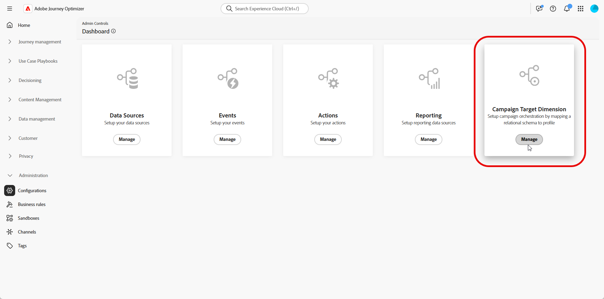

# Configurar uma Targeting dimension {#configuration}

+++ Índice 

| Bem-vindo(a) às campanhas orquestradas | Lançar a sua primeira campanha orquestrada | Consultar o banco de dados | Atividades de campanhas orquestradas |
|---|---|---|---|
| [Introdução a campanhas orquestradas](gs-orchestrated-campaigns.md)  Criar e gerenciar Esquemas e Conjuntos de Dados relacionais:  <ul><li>[Introdução a Esquemas e Conjuntos de Dados](gs-schemas.md)</li><li>[Esquema manual](manual-schema.md)</li><li>[Esquema de carregamento de arquivo](file-upload-schema.md)</li><li>[Assimilar dados](ingest-data.md)</li></ul>[Acesse e gerencie campanhas orquestradas](access-manage-orchestrated-campaigns.md)  [Etapas principais para criar uma campanha orquestrada](gs-campaign-creation.md)  [Configure uma dimensão de Destino](target-dimension.md) | <b>[Criar e programar a campanha](create-orchestrated-campaign.md)</b>  [Orquestrar atividades](orchestrate-activities.md)  [Iniciar e monitorar a campanha](start-monitor-campaigns.md)  [Geração de relatórios](reporting-campaigns.md) | [Trabalhar com o construtor de regras](orchestrated-rule-builder.md)  [Criar a sua primeira consulta](build-query.md)  [Editar expressões](edit-expressions.md)  [Redirecionamento](retarget.md) | [Introdução às atividades](activities/about-activities.md)  Atividades: [Associação](activities/and-join.md) - [Criar público-alvo](activities/build-audience.md) - [Mudar dimensão](activities/change-dimension.md) - [Atividades de canal](activities/channels.md) - [Combinar](activities/combine.md) - [Desduplicação](activities/deduplication.md) - [Enriquecimento](activities/enrichment.md) - [Bifurcação](activities/fork.md) - [Reconciliação](activities/reconciliation.md) - [Salvar público-alvo](activities/save-audience.md) - [Divisão](activities/split.md) - [Aguardar](activities/wait.md) |

{style="table-layout:fixed"}

+++

 

>[!BEGINSHADEBOX]

 

O conteúdo desta página não é final e pode estar sujeito a alterações.

>[!ENDSHADEBOX]

Em muitos casos, um único perfil de cliente pode ser vinculado a várias entidades relacionadas, como assinaturas, contratos de serviço ou dispositivos, cada uma com seu próprio identificador exclusivo e necessidades de comunicação.

Com as **Campanhas orquestradas**, agora é possível projetar e fornecer comunicações direcionadas no nível da entidade, usando os **recursos de esquema relacional da Adobe Experience Platform**. Isso permite segmentar, personalizar e gerar relatórios por entidade em vez de por recipient.

## Crie sua Targeting dimension {#targeting-dimension}

Um único perfil de cliente pode ser associado a várias entidades relacionadas, como contratos, dispositivos ou assinaturas, cada uma com seu próprio identificador exclusivo. Essa configuração permite direcionar, segmentar e gerar relatórios para cada entidade individualmente.

Comece configurando a orquestração de campanhas, mapeando um esquema relacional para o perfil do cliente.

1. Em **[!UICONTROL Administration]**, acesse o menu **[!UICONTROL Configurations]** e selecione **[!UICONTROL Campaign Target Dimension]**.

   

1. Clique em **[!UICONTROL Criar]** para começar a criar sua **[!UICONTROL Targeting dimension]**.

1. Escolha seu [Esquema](gs-schemas.md) configurado anteriormente &#x200B;no menu suspenso.

1. Selecione o **[!UICONTROL Valor de identidade]** que representa a entidade que você deseja direcionar.

   Neste exemplo, o perfil do cliente está vinculado a várias assinaturas, cada uma representada por um único `crmID` no esquema `Recipient`. Ao configurar o **[!UICONTROL Dimension de Destino]** para usar o esquema `Recipient` e sua identidade `crmID`, você poderá enviar mensagens no nível de assinatura, em vez de no perfil principal do cliente, garantindo que cada contrato ou linha receba sua própria mensagem personalizada.

   [Saiba mais na documentação da Adobe Experience Platform](https://experienceleague.adobe.com/pt-br/docs/experience-platform/xdm/schema/composition#identity)

   

1. Clique em **[!UICONTROL Salvar]** para concluir a instalação.

Após configurar o **[!UICONTROL Dimension de Destino]**, prossiga para criar e configurar sua **[!UICONTROL Configuração de Canal]** e defina os **[!UICONTROL Detalhes de Execução]** correspondentes.

## Definir a configuração do canal {#channel-configuration}

Após configurar seu **[!UICONTROL Target Dimension]**, é necessário definir sua **[!UICONTROL Configuração de Canal]** de email ou SMS e definir os **[!UICONTROL Detalhes de Execução]** apropriados. Isso garante que as mensagens sejam enviadas usando a identidade e a lógica de direcionamento corretas.

1. Comece criando e configurando sua **[!UICONTROL Configuração de canal]**.

   Você também pode atualizar uma **[!UICONTROL Configuração de canal]** existente.

   ➡️ [Siga as etapas detalhadas nesta página](../email/surface-personalization.md)

1. Na seção **[!UICONTROL Detalhes da execução]** da sua **[!UICONTROL Configuração do canal]**, acesse a guia **[!UICONTROL Campanhas orquestradas]**.

   

1. Clique em **[!UICONTROL Habilitado]** para torná-lo compatível com as campanhas Orquestradas.

1. Escolha seu método de delivery:

   * **[!UICONTROL Dimension de Destino]**: enviar para a entidade principal, por exemplo, destinatário.

   * **[!UICONTROL Target + Secondary Dimension]**: enviar usando entidades primárias e secundárias, por exemplo, recipient + contrato.

1. Selecione no menu suspenso seu [Dimension de Destino](#targeting-dimension) criado anteriormente.

   

1. Na seção **[!UICONTROL Endereço de Execução]**, escolha qual **[!UICONTROL Source]** deve ser usada para buscar o endereço de entrega, como o endereço de email ou o número de telefone:

   * **[!UICONTROL Perfil]**: selecione essa opção se o endereço de entrega, por exemplo, email, for armazenado diretamente no perfil principal do cliente.

     Útil ao enviar mensagens ao cliente principal, não a uma entidade associada específica.

   * **[!UICONTROL Dimension de Destino]**: escolha essa opção se o endereço de entrega estiver armazenado na entidade relacionada, por exemplo, um destinatário ou uma assinatura.

     Útil quando cada recipient tem seu próprio endereço de entrega, como um email ou número de telefone diferente.

1. No campo **[!UICONTROL Endereço de entrega]**, clique em  para escolher o campo específico a ser usado para a entrega de mensagens.

   

1. Depois de configurado, clique em **[!UICONTROL Enviar]**.

Seu canal agora está pronto para uso com Campanhas orquestradas e as mensagens serão entregues de acordo com o target dimension selecionado.
