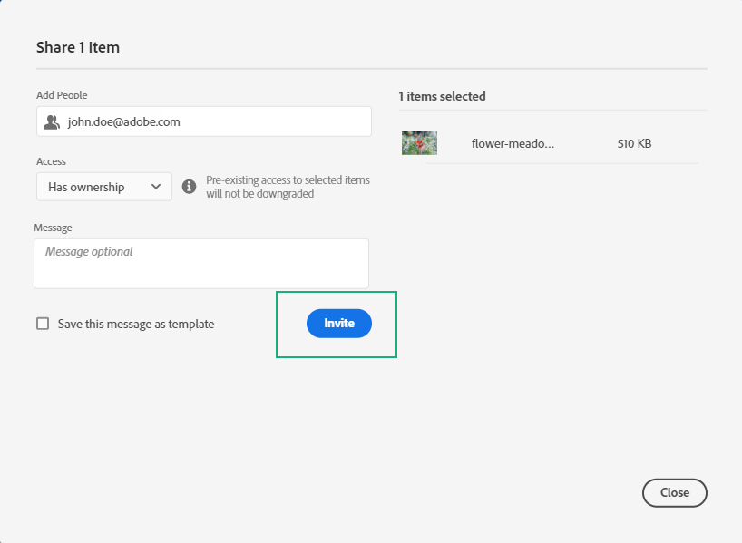

# Gerenciar permissões {#manage-permissions}

## Acesso ao Journey Optimizer {#access-CJM}

O [!DNL Journey Optimizer] permite atribuir um conjunto de permissões aos usuários para definir qual parte da interface pode ser acessada.

Eles podem ser gerenciados por administradores com acesso ao Admin Console. [Saiba mais sobre o Adobe Admin Console](https://helpx.adobe.com/br/enterprise/managing/user-guide.html).

Para acessar o [!DNL Journey Optimizer], o usuário deve ser:

* parte de um [!DNL Journey Optimizer] **[!UICONTROL product profile]** associado às permissões [!DNL Journey Optimizer].

* parte de um [!DNL Adobe Experience Platform] **[!UICONTROL product profile]**. Não há uma permissão obrigatória. O usuário deve ter a permissão **[!UICONTROL profile management]** para criar e editar segmentos da plataforma na interface do [!DNL Journey Optimizer]. [Saiba mais sobre o controle de acesso](https://experienceleague.adobe.com/docs/experience-platform/access-control/home.html?lang=en#adobe-admin-console).

No Admin Console, é possível atribuir um dos seguintes perfis de produto prontos para uso aos usuários:

* **[!UICONTROL Limited Access User]**: usuário com acesso somente leitura a jornadas e relatórios. Este perfil de produto conta com as seguintes permissões:
   * Ler jornadas
   * Ler relatórios

* **[!UICONTROL Administrators]**: usuário com acesso aos menus de administração com a possibilidade de gerenciar jornadas, eventos e relatórios. Este perfil de produto conta com as seguintes permissões:
   * Gerenciar jornadas
   * Publicar jornadas
   * Gerenciar eventos, fontes de dados e ações
   * Gerenciar relatórios

* **[!UICONTROL Standard User]**: usuário com acesso básico, como gestão de jornada. Este perfil de produto conta com as seguintes permissões:
   * Gerenciar jornadas
   * Publicar jornadas
   * Gerenciar relatórios
   * Ler eventos, fontes de dados e ações

Você também pode criar seus próprios perfis de produtos se os perfis prontos para uso não forem suficientes para gerenciar os usuários.
Os usuários devem estar sempre vinculados a um perfil de produto, permitindo que você atribua a eles permissões de criação específicas, como:

* **[!UICONTROL Read journeys]**
* **[!UICONTROL Read reports]**
* **[!UICONTROL Manage events, data sources and actions]**
* **[!UICONTROL Read events, data sources and actions]**
* **[!UICONTROL Manage journeys]**
* **[!UICONTROL Publish journeys]**
* **[!UICONTROL Manage reports]**

>[!NOTE]
>
> O gerenciamento de permissões não inclui mensagens: cada usuário pode criar ou modificar mensagens.

### Criação de um perfil de produto {#create-product-profile}

O [!DNL Journey Optimizer] permite criar seus próprios perfis de produtos e atribuir um conjunto de permissões e sandboxes aos usuários. Com perfis de produtos, você pode autorizar ou negar acesso a determinadas funcionalidades ou objetos na interface.

Para obter mais informações sobre como criar e gerenciar sandboxes, consulte a [documentação da Adobe Experience Platform](https://experienceleague.adobe.com/docs/experience-platform/sandbox/ui/user-guide.html).

Para criar um perfil de produto e atribuir um conjunto de permissões e sandboxes:

1. No Admin Console, selecione **[!UICONTROL Journey Orchestration]**. Na guia **[!UICONTROL Product profile]**, clique em **[!UICONTROL New Profile]**.

   

1. Adicione um **[!UICONTROL Profile Name]** e **[!UICONTROL Description]** para o novo perfil de produto. Se você quiser que seu perfil **[!UICONTROL Display name]** seja diferente, desmarque **[!UICONTROL Same as Profile Name]** e digite seu **[!UICONTROL Display name]**.

1. Na categoria **[!UICONTROL User Notifications]**, escolha se os usuários serão notificados por email quando forem adicionados ou removidos do perfil de produto.

1. Quando terminar, clique em **[!UICONTROL Done]**. O novo perfil de produto foi criado.

   

1. Selecione o novo perfil de produto para iniciar o gerenciamento de permissões. Na guia **[!UICONTROL Users]**, adicione usuários ao perfil de produto. [Saiba como atribuir perfil](permissions.md#assigning-product-profile) de produto.

1. Siga as mesmas etapas descritas acima para adicionar **[!UICONTROL Admin]** ao perfil de produto.

1. Na guia **[!UICONTROL Permissions]**, selecione uma das duas categorias **[!UICONTROL Sandbox]** ou **[!UICONTROL Authoring]** para abrir a página **[!UICONTROL Edit Permissions]** e adicionar ou remover permissões do perfil de produto.

   

1. Na categoria de permissões **[!UICONTROL Sandboxes]**, escolha as sandboxes que serão atribuídas ao perfil do produto. Em **[!UICONTROL Available Permissions Items]**, clique no ícone de adição (+) para atribuir sandboxes ao perfil. [Saiba mais sobre sandboxes](https://experienceleague.adobe.com/docs/experience-platform/sandbox/home.html).

   

1. Se necessário, no **[!UICONTROL Included Permission Items]**, clique no ícone X ao lado de remover permissões do perfil do produto.

   

1. Na categoria de permissões **[!UICONTROL Authoring]**, siga as mesmas etapas descritas acima para adicionar permissões ao perfil do produto.

   

1. Quando terminar, clique em **[!UICONTROL Save]**.

O perfil de produto foi criado e está configurado. Os usuários vinculados a este perfil podem agora se conectar ao [!DNL Journey Optimizer].

### Atribuição de um perfil de produto {#assigning-product-profile}

Os perfis de produtos são atribuídos a um conjunto de usuários que compartilham as mesmas permissões em sua organização.
Você encontra a lista de cada perfil de produto pronto para uso com permissões atribuídas nesta seção.

Para atribuir um perfil de produto a um usuário para acessar o jornada:

1. No Admin Console, selecione **[!UICONTROL Journey Orchestration]**.

   

1. Selecione o perfil do produto ao qual o novo usuário será vinculado.

   

1. Clique em **[!UICONTROL Add user]**.

   Você também pode adicionar seu novo usuário a um grupo de usuários para ajustar o conjunto compartilhado de permissões. [Saiba mais sobre grupos](https://helpx.adobe.com/br/enterprise/using/user-groups.html) de usuários.

   

1. Digite o email do novo usuário e clique em **[!UICONTROL Save]**.

   

Seu usuário deve receber um email de redirecionamento para sua instância .

## Uso de sandboxes {#sandboxes}

O [!DNL Journey Optimizer] permite particionar sua instância em ambientes virtuais separados chamados de sandboxes.
As sandboxes são atribuídas por meio de perfis de produto no Admin Console. [Saiba como atribuir sandboxes](permissions.md#create-product-profile).

[!DNL Journey Optimizer] O reflete sandboxes da Adobe Experience Platform que foram criadas para uma determinada organização.
As sandboxes da Adobe Experience Platform podem ser criadas ou redefinidas pela instância da Adobe Experience Platform. [Saiba mais no guia](https://experienceleague.adobe.com/docs/experience-platform/sandbox/ui/user-guide.html) de usuário de sandbox.

Você pode encontrar o controle do alternador de sandbox na parte superior esquerda da tela. Para alternar a sandbox, clique na sandbox atualmente ativa no alternador e selecione outra sandbox na lista suspensa.

## Acesso ao conteúdo {#content-access}

Para configurar a acessibilidade do conteúdo, é necessário atribuir uma pasta compartilhada de conteúdo a cada uma das sandboxes. Você pode criar e configurar a pasta compartilhada na guia **[!UICONTROL Storage]** exibida no [!DNL Admin Console] para administradores. Se você tiver acesso ao [!DNL Admin Console] como administrador do sistema, poderá criar pastas compartilhadas e adicionar delegados com nível de acesso diferente às suas pastas compartilhadas.

Observe que para que o conteúdo seja sincronizado com a sandbox correta, é necessário seguir a mesma sintaxe da sandbox. Por exemplo, se a sandbox for chamada de desenvolvimento, a pasta compartilhada deverá ter o mesmo nome.

[Saiba como gerenciar pastas](https://helpx.adobe.com/enterprise/admin-guide.html/enterprise/using/manage-adobe-storage.ug.html) compartilhadas.

## Permissões do Assets Essentials {#assets-permissions}

O Adobe Experience Manager Assets Essentials fornece um repositório único e centralizado de ativos que você pode usar para preencher suas mensagens.
Cada ativo é salvo em pastas ou subpastas. Você pode optar por compartilhar suas pastas e qual nível de acesso deve ser atribuído.

1. Na guia **[!UICONTROL Assets]** , navegue pelas pastas para encontrar aquela que precisa compartilhar.

1. Selecione a pasta ou o ativo e clique em **[!UICONTROL Share]**.

   

1. Insira o endereço de email da pessoa diferente com a qual você deseja compartilhar acesso à sua pasta.

1. Escolha entre o diferente nível de acesso:

   * **[!UICONTROL Can view]**
   * **[!UICONTROL Can edit]**
   * **[!UICONTROL Has ownership (can share, edit, and delete)]**

   

1. Adicione uma mensagem ao convite, se necessário.

1. Clique em **[!UICONTROL Invite]**.

   
