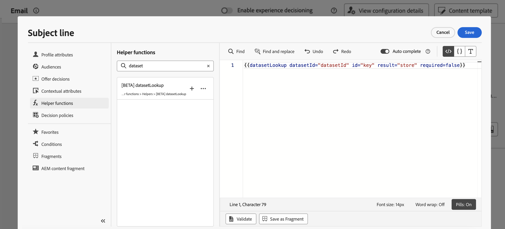
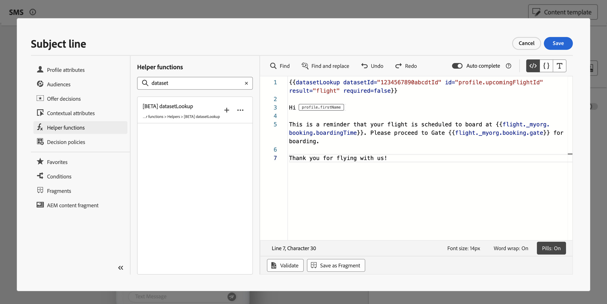

# Usar dados da Adobe Experience Platform para personalização{#aep-data}

>[!AVAILABILITY]
>
>No momento, esse recurso está disponível para todos os clientes como um beta público.
>
>Para usar esse recurso, primeiro você deve aceitar os termos beta para sua organização exibidos ao adicionar as novas funções auxiliares &quot;datasetLookup&quot; no editor de personalização.

O Journey Optimizer permite aproveitar os dados do Adobe Experience Platform no editor de personalização para [personalizar seu conteúdo](../personalization/personalize.md). Para fazer isso, os conjuntos de dados necessários para a personalização da pesquisa devem ser habilitados primeiro por meio de uma chamada de API, conforme descrito abaixo. Depois de concluído, você poderá usar os dados para personalizar o conteúdo no [!DNL Journey Optimizer].

## Restrições e diretrizes do Beta {#guidelines}

Antes de começar, reveja as seguintes restrições e diretrizes:

* **Canais com suporte**: por enquanto, esse recurso só está disponível para uso em canais de email, SMS e correspondência direta.
* **Fragmentos**: no momento, a personalização da pesquisa do conjunto de dados não pode ser colocada dentro de expressões ou fragmentos visuais.

### Decisão {#decisioning}

A capacidade de aproveitar [!DNL Adobe Experience Platform] conjuntos de dados nas fórmulas e regras de classificação do Experience Decisioning será disponibilizada em breve.

Entretanto, reveja as medidas de proteção atuais descritas abaixo:

* Uma política de decisão é limitada a três conjuntos de dados,
* Uma regra de decisão pode usar três conjuntos de dados,
* Uma fórmula de classificação pode usar três conjuntos de dados,
* Uma política de decisão é limitada a 1000 consultas de registro.

>[!NOTE]
>
>Entre em contato com seu representante de conta se desejar ter acesso a esse recurso

## Ativar um conjunto de dados para pesquisa de dados {#enable}

Para aproveitar os dados do conjunto de dados para personalização, é necessário usar uma chamada de API para recuperar o status e habilitar o serviço de pesquisa. Informações detalhadas estão disponíveis nesta seção: [Aproveitar conjuntos de dados do Adobe Experience Platform [!DNL Journey Optimizer]](../data/lookup-aep-data.md)

## Aproveitar um conjunto de dados para personalização {#leverage}

Depois que um conjunto de dados for habilitado para personalização de pesquisa usando uma chamada de API, você poderá usar seus dados para personalizar seu conteúdo no [!DNL Journey Optimizer].

1. Abra o editor de personalização, que está disponível em todos os contextos, onde é possível definir personalização, como mensagens. [Saiba como trabalhar com o editor de personalização](../personalization/personalization-build-expressions.md)

1. Navegue até a lista de funções auxiliares e adicione a função auxiliar **datasetLookup** ao painel de código.

   

1. Essa função fornece uma sintaxe predefinida para permitir que você chame campos a partir de conjuntos de dados da Adobe Experience Platform. A sintaxe é a seguinte:

   ```
   {{datasetLookup datasetId="datasetId" id="key" result="store" required=false}}
   ```

   * **datasetId** é a ID do conjunto de dados com o qual você está trabalhando.
   * **id** é a identificação da coluna de origem que deve ser unida à identidade primária do conjunto de dados de pesquisa.

     >[!NOTE]
     >
     >O valor inserido para este campo pode ser uma ID de campo (*profile.packages.packageSKU*), um campo passado em um evento de jornada (*context.jornada.events.event_ID.productSKU*) ou um valor estático (*sku007653*). Em qualquer caso, o sistema usará o valor e pesquisará no conjunto de dados para verificar se ele corresponde a uma chave.
     >
     >Se estiver usando um valor de sequência literal para a chave, mantenha o texto entre aspas. Por exemplo: `{{datasetLookup datasetId="datasetId" id="SKU1234" result="store" required=false}}`. Se estiver usando um valor de atributo como uma chave dinâmica, remova as aspas. Por exemplo: `{{datasetLookup datasetId="datasetId" id=category.product.SKU result="SKU" required=false}}`

   * **resultado** é um nome arbitrário que você precisa fornecer para fazer referência a todos os valores de campo que você vai recuperar do conjunto de dados. Esse valor será usado no código para chamar cada campo.

   * **required=false**: se o valor required for definido como TRUE, a mensagem só será entregue se uma chave correspondente for encontrada. Se definido como false, uma chave correspondente não será necessária e a mensagem ainda poderá ser entregue. Observe que, se definido como falso, é recomendável levar em conta os valores de fallback ou padrão no conteúdo da mensagem.

   +++Onde recuperar uma ID de conjunto de dados?

   As IDs dos conjuntos de dados podem ser recuperadas na interface do usuário do Adobe Experience Platform. Saiba como trabalhar com conjuntos de dados na [documentação do Adobe Experience Platform](https://experienceleague.adobe.com/en/docs/experience-platform/catalog/datasets/user-guide#view-datasets){target="_blank"}.

   

   +++

1. Adapte a sintaxe de acordo com suas necessidades. Neste exemplo, queremos recuperar dados relacionados aos voos dos passageiros. A sintaxe é a seguinte:

   ```
   {{datasetLookup datasetId="1234567890abcdtId" id=profile.upcomingFlightId result="flight"}}
   ```

   * Estamos trabalhando no conjunto de dados cuja ID é &quot;1234567890abcdtId&quot;,
   * O campo que queremos usar para fazer uma associação com o conjunto de dados de pesquisa é *profile.comingFlightId*,
   * Queremos incluir todos os valores de campo sob a referência &quot;flight&quot;.

1. Depois que a sintaxe a ser chamada no conjunto de dados do Adobe Experience Platform for configurada, você poderá especificar quais campos deseja recuperar. A sintaxe é a seguinte:

   ```
   {{result.fieldId}}
   ```

   >[!NOTE]
   >
   >Ao referenciar um campo do conjunto de dados, verifique se você corresponde ao caminho de campo completo, conforme definido no esquema.

   * **resultado** é o valor atribuído ao parâmetro **resultado** na função auxiliar **MultiEntity**. Neste exemplo, &quot;voo&quot;.
   * **fieldID** é a identificação do campo que você deseja recuperar. Esta ID é visível na interface do usuário [!DNL Adobe Experience Platform] ao navegar pelo esquema de registro relacionado ao seu conjunto de dados:

     +++Onde recuperar uma ID de campo?

     As IDs de campos podem ser recuperadas ao visualizar um conjunto de dados na interface do usuário do Adobe Experience Platform. Saiba como visualizar conjuntos de dados na [documentação do Adobe Experience Platform](https://experienceleague.adobe.com/en/docs/experience-platform/catalog/datasets/user-guide#preview){target="_blank"}.

     

     +++

   Neste exemplo, queremos usar informações relacionadas ao horário e ao portão de embarque dos passageiros. Portanto, adicionamos estas duas linhas:

   * `{{flight._myorg.booking.boardingTime}}`
   * `{{flight._myorg.booking.gate}}`

1. Agora que o código está pronto, você pode concluir o conteúdo como de costume e testá-lo usando o botão **Simular conteúdo** para verificar a personalização. [Saiba como visualizar e testar o conteúdo](../content-management/preview-test.md)


   
