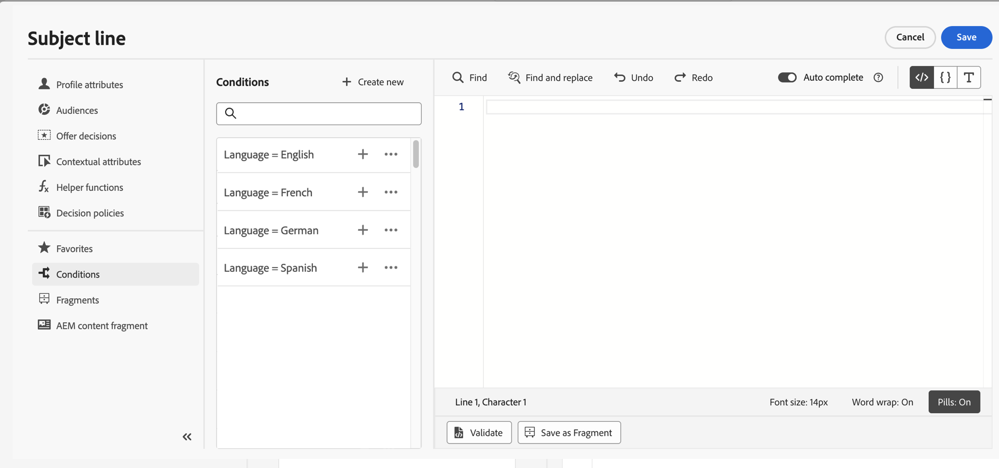
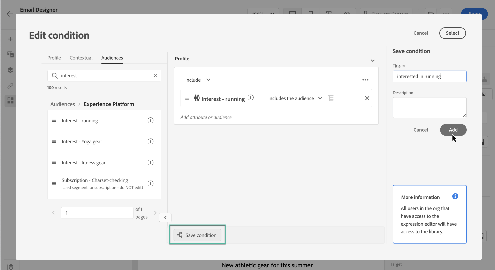

# Trabalhar com regras condicionais {#conditions}

As regras condicionais são conjuntos de regras que definem qual conteúdo deve ser exibido nas mensagens, dependendo de vários critérios, como atributos de perfis, associação de segmentos ou eventos contextuais.

As regras condicionais são criadas usando o editor de expressão e podem ser armazenadas se você quiser reutilizá-las em seu conteúdo. [Saiba como salvar uma regra condicional na biblioteca](#save)

>[!NOTE]
>
>Os indivíduos precisarão da [Gerenciar itens da biblioteca](../administration/ootb-product-profiles.md) permissão para salvar ou excluir regras condicionais. As condições salvas estão disponíveis para uso por todos os usuários em uma organização.

## Acessar o construtor de regras condicionais {#access}

As regras condicionais são criadas a partir da variável **[!UICONTROL Condições]** no editor de expressão, que pode ser acessado do seguinte modo:

* No Designer de email, ao ativar o conteúdo dinâmico de um componente no corpo do email. [Saiba como adicionar conteúdo dinâmico aos emails](dynamic-content.md#emails)

   

* Em qualquer campo em que você pode adicionar personalização usando a variável [Editor de expressão](personalization-build-expressions.md).

   

## Criar uma regra condicional {#create-condition}

>[!CONTEXTUALHELP]
>id="ajo_expression_editor_conditions_create"
>title="Criar condição"
>abstract="Combine atributos de perfil, eventos contextuais ou públicos-alvo para criar regras que definem qual conteúdo deve ser exibido nas mensagens."

>[!CONTEXTUALHELP]
>id="ajo_expression_editor_conditions"
>title="Criar condição"
>abstract="Combine atributos de perfil, eventos contextuais ou públicos-alvo para criar regras que definem qual conteúdo deve ser exibido nas mensagens."

As etapas para criar uma regra condicional são as seguintes:

1. Acesse o **[!UICONTROL Condições]** no Editor de expressão ou no Designer de email, em seguida, clique em **[!UICONTROL Criar novo]**.

1. Crie a regra condicional de acordo com suas necessidades. Para fazer isso, arraste e solte e organize os atributos desejados do menu esquerdo para a tela.

   As etapas para combinar atributos na tela são semelhantes à experiência de criação de segmento. Para obter mais informações sobre como trabalhar com a tela do construtor de regras, consulte [esta documentação](https://experienceleague.adobe.com/docs/experience-platform/segmentation/ui/segment-builder.html?lang=en#rule-builder-canvas).

   

   Os atributos são organizados em três guias:

   * **[!UICONTROL Perfil]**:
      * **[!UICONTROL Associação de segmento]** lista todos os atributos do segmento (ou seja, status, versão etc.) para [Serviço de segmentação da Adobe Experience Platform](https://experienceleague.adobe.com/docs/experience-platform/segmentation/home.html),
      * **[!UICONTROL Perfis individuais XDM]** lista todos os atributos de perfil associados à variável [Esquema do Experience Data Model (XDM)](https://experienceleague.adobe.com/docs/experience-platform/xdm/home.html) definido no Adobe Experience Platform.
   * **[!UICONTROL Contextual]**: quando a mensagem é usada em uma jornada, campos de jornada contextual ficam disponíveis por meio dessa guia.
   * **[!UICONTROL Públicos-alvo]**: lista todos os públicos-alvo gerados a partir de segmentos criados no [Serviço de segmentação da Adobe Experience Platform](https://experienceleague.adobe.com/docs/experience-platform/segmentation/home.html).

1. Quando a regra condicional estiver pronta, você poderá adicioná-la à mensagem para criar conteúdo dinâmico. [Saiba como adicionar conteúdo dinâmico](dynamic-content.md)

   Também é possível salvar a regra para permitir mais reutilização. [Saiba como salvar uma condição](#save)

## Salvar uma regra condicional {#save}

Se houver regras de condição que serão reutilizadas com frequência, você poderá salvá-las na biblioteca de condições. Todas as regras salvas são compartilhadas e podem ser acessadas e usadas por indivíduos em sua organização.

>[!NOTE]
>
>Regras condicionais que aproveitam atributos contextuais do jornada não podem ser salvas na biblioteca.

1. Na tela de edição de condição, clique no botão **[!UICONTROL Salvar condição]** botão.

1. Dê um nome e uma descrição (opcional) à regra, em seguida, clique em **[!UICONTROL Adicionar]**.

   

1. A regra condicional é salva na biblioteca. Agora você pode usá-lo para criar conteúdo dinâmico em suas mensagens. [Saiba como adicionar conteúdo dinâmico](dynamic-content.md)

## Editar e excluir regras condicionais salvas {#edit-delete}

É possível excluir uma regra condicional a qualquer momento usando o botão de elipse.

Regras condicionais salvas na biblioteca não podem ser modificadas. No entanto, você ainda pode usá-las para criar novas regras. Para fazer isso, abra a regra condicional, faça as alterações desejadas e salve-a na biblioteca. [Saiba como salvar uma condição na biblioteca](#save)
