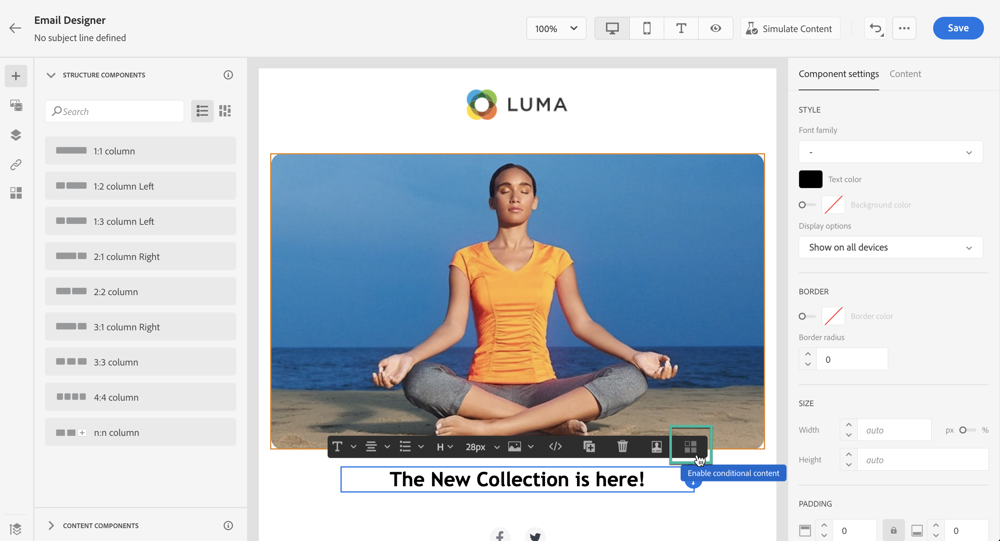

# Criar conteúdo dinâmico {#dynamic-content}

>[!BEGINSHADEBOX]

**Nesta página:** Saiba como usar regras condicionais para adicionar conteúdo dinâmico às suas mensagens, tanto em expressões de personalização quanto como variantes de componentes de conteúdo no Designer de email.

>[!ENDSHADEBOX]

O Adobe Journey Optimizer permite aproveitar as regras condicionais criadas na biblioteca para adicionar conteúdo dinâmico às suas mensagens.

O conteúdo dinâmico pode ser criado em qualquer campo em que você pode adicionar personalização usando o editor de personalização. Isso inclui linha de assunto, links, conteúdo de notificações por push ou representações de ofertas do tipo texto. [Saiba mais sobre a personalização](personalize.md)

Além disso, você pode usar regras condicionais no Designer de email para criar várias variantes de um componente de conteúdo.

## Adicionar conteúdo dinâmico em expressões {#perso-expressions}

As etapas para adicionar conteúdo dinâmico nas expressões são as seguintes:

1. Navegue até o campo onde deseja adicionar conteúdo dinâmico e abra o editor de personalização.

1. Selecione o menu **[!UICONTROL Condições]** para exibir a lista de regras condicionais disponíveis. Clique no botão + ao lado de uma regra para adicioná-la à expressão atual.

   Você também pode criar uma nova regra selecionando **[!UICONTROL Criar novo]**. [Saiba como criar condições](create-conditions.md)

   

1. Adicione entre as marcas `{%if}` e `{%/if}` o conteúdo que você deseja exibir se a regra condicional for atendida. É possível adicionar quantas regras forem necessárias para criar várias variantes de uma expressão.

   No exemplo abaixo, duas variantes foram criadas para um conteúdo SMS, dependendo do idioma preferencial do recipient.

   

1. Quando o conteúdo estiver pronto, você poderá visualizar as diferentes variantes usando os métodos de simulação: clique em **[!UICONTROL Simular conteúdo]** para testar as variações de conteúdo com dados de entrada de exemplo ou geração automática de IA, ou clique em **[!UICONTROL Simular conteúdo]** e selecione **[!UICONTROL Simular conteúdo (perfis do AEP)]** na lista suspensa para visualizar com perfis de teste. [Saiba como testar e visualizar mensagens](../content-management/preview-test.md)

   

>[!CAUTION]
>
>Se o Designer de email não for renderizado corretamente após a adição de blocos condicionais, verifique se a sintaxe de cada nova condição está correta e se não existem instruções duplicadas ou conflitantes. Se os problemas persistirem, considere reconstruir seções problemáticas em um novo modelo e testar cada bloco condicional de forma incremental.

## Adicionar conteúdo dinâmico a emails {#emails}

>[!CONTEXTUALHELP]
>id="ac_conditional_content"
>title="Conteúdo condicional"
>abstract="Use regras condicionais para criar diversas variantes de um componente de conteúdo. Se nenhuma das condições for atendida ao enviar a mensagem, o conteúdo da variante padrão será exibido."

>[!CONTEXTUALHELP]
>id="ac_conditional_content_select"
>title="Conteúdo condicional"
>abstract="Use uma regra condicional salva na biblioteca ou crie uma nova."

As etapas para criar variantes de um componente de conteúdo no Designer de email são as seguintes:

1. No [Designer de Email](../email/content-from-scratch.md), selecione um componente de conteúdo e clique em **[!UICONTROL Habilitar conteúdo condicional]**.

   

1. O painel **[!UICONTROL Conteúdo Condicional]** é exibido à esquerda. Nesse painel, você pode criar várias variantes do componente de conteúdo selecionado usando condições.

   Configure sua primeira variante selecionando o botão **[!UICONTROL Selecionar condição]**.

   

1. A biblioteca de condições é exibida. Selecione a regra condicional a ser associada à variante e clique em **[!UICONTROL Selecionar]**. Neste exemplo, queremos adaptar o texto do componente dependendo do idioma preferencial do recipient.

   

   Você também pode criar uma nova regra clicando em **[!UICONTROL Criar novo]**. [Saiba como criar condições](create-conditions.md)

1. A regra condicional está associada à variante. Para facilitar a leitura, renomeie a variante selecionando a ação **[!UICONTROL Renomear]** do ícone Mais ações.

   

1. Configure como o componente deve ser exibido se a regra for atendida ao enviar a mensagem. Neste exemplo, queremos exibir o texto em francês se for o idioma preferencial do recipient.

   

1. Adicione quantas variantes forem necessárias para o componente de conteúdo. Você pode alternar a qualquer momento entre as diferentes variantes para verificar como o componente de conteúdo será exibido, dependendo das regras condicionais.

   >[!NOTE]
   >
   >* Se nenhuma das regras definidas nas variantes for atendida ao enviar a mensagem, o componente de conteúdo exibirá o conteúdo definido na **[!UICONTROL Variante padrão]**.
   >
   >* O conteúdo condicional será avaliado em relação às regras associadas na ordem em que as variantes forem exibidas. A variante padrão é sempre exibida se nenhuma outra condição for atendida.
   >
   >* Ao simular ou renderizar provas para emails que contêm diversas variantes condicionais, o Journey Optimizer pode exigir mais tempo de processamento. Se você observar falhas de tempo-limite ou mensagens de erro, considere reduzir o número total de variantes ou simplificar as regras condicionais. Saiba mais sobre como testar seu conteúdo [nesta página](../content-management/preview-test.md).

1. Para excluir uma variante, clique no ícone Mais ações ao lado da variante desejada e selecione **[!UICONTROL Excluir]**.

   

## Referência rápida {#quick-reference}

Esta seção contém conhecimento estruturado destinado a oferecer suporte à interpretação, recuperação e resposta a perguntas relacionadas a este tópico.

Para uma compreensão completa, essas informações devem ser combinadas com a documentação desta página. Nenhuma das origens deve ser independente; a página descreve o recurso, enquanto esta seção fornece um contexto adicional que ajuda a desfazer a ambiguidade da terminologia, intenção, aplicabilidade e restrições.

>[!BEGINTABS]

>[!TAB Visão geral]

**TL;DR**

Esta página explica como usar regras condicionais para adicionar conteúdo dinâmico a mensagens — por meio de tags de expressão no editor de personalização ou como variantes de componente de conteúdo no Designer de email.

**Intenções**

* Adicionar conteúdo dinâmico a expressões de personalização usando `` / `` tags condicionais
* Visualizar várias variantes de conteúdo dinâmico usando simulação
* Ativar conteúdo condicional em um componente de conteúdo do Email Designer
* Criar várias variantes de componentes, cada uma vinculada a uma regra condicional
* Gerenciar a variante padrão exibida quando nenhuma condição é atendida no momento do envio

>[!TAB Glossário]

* **Conteúdo dinâmico**: conteúdo da mensagem que varia com base em regras condicionais; conteúdo diferente é exibido, dependendo se as condições definidas são atendidas no momento do envio. *(específico do produto)*
* **Conteúdo condicional**: um recurso do Designer de email que aplica regras condicionais a um componente de conteúdo, criando várias variantes de exibição. *(específico do produto)*
* **Variante padrão**: o conteúdo exibido para um componente quando nenhuma das regras condicionais definidas é atendida ao enviar a mensagem. *(específico do produto)*
* **``/ `` marcas**: sintaxe de expressão do editor Personalization usada para envolver blocos de conteúdo que são exibidos somente quando uma regra condicional é atendida.

>[!TAB Terminologia]

* **Nome canônico:** conteúdo dinâmico — variantes: conteúdo condicional, conteúdo personalizado
* **Sinônimos:** &quot;conteúdo condicional&quot; (rótulo da interface do usuário do Designer de email) = &quot;conteúdo dinâmico&quot; (termo geral usado em todo o documento)
* **Não confunda:** adicionar conteúdo dinâmico em expressões (usando `` tags no editor de personalização) ≠ adicionar conteúdo dinâmico em emails (criando variantes de componentes no Designer de email — dois fluxos de trabalho distintos)
* **Não confunda:** &quot;Variante padrão&quot; (exibida quando nenhuma regra condicional é atendida) ≠ uma variante nomeada (cada uma associada a uma regra condicional específica)

>[!TAB Medidas de proteção e limitações]

* As variantes de conteúdo condicional são avaliadas em relação às regras associadas na ordem em que são exibidas; a variante padrão é sempre exibida se nenhuma outra condição for atendida.
* Ao simular ou renderizar provas para emails com várias variantes condicionais, o Journey Optimizer pode exigir mais tempo de processamento; considere reduzir o número de variantes ou simplificar regras condicionais se ocorrerem tempos limite ou erros.
* Se o Designer de email não for renderizado corretamente após a adição de blocos condicionais, verifique se a sintaxe de cada condição está correta e se não existem instruções duplicadas ou conflitantes.

>[!TAB Perguntas frequentes]

**P: O que acontece se nenhuma das condições definidas for atendida quando a mensagem for enviada?**

O componente de Conteúdo exibe o conteúdo definido na variante Padrão.

**P: Em que ordem as variantes de conteúdo condicional são avaliadas?**

As variantes são avaliadas em relação às regras associadas na ordem em que são exibidas. A variante padrão é sempre mostrada se nenhuma outra condição for atendida.

**P: Onde o conteúdo dinâmico pode ser adicionado ao Journey Optimizer?**

Em qualquer campo onde a personalização possa ser adicionada — incluindo linhas de assunto, links, conteúdo da notificação por push e representações de oferta do tipo texto — por meio do editor de personalização e em componentes de conteúdo do Email Designer por meio de variantes condicionais.

**P: O que devo fazer se o Designer de Email não for renderizado após adicionar blocos condicionais?**

Verifique se a sintaxe de cada condição está correta e se não existe nenhuma instrução duplicada ou conflitante. Se os problemas persistirem, recrie as seções problemáticas em um novo modelo e teste cada bloco condicional de forma incremental.

>[!ENDTABS]

<!-- ai-section-version: 1 | source-hash: e6005d80 -->
