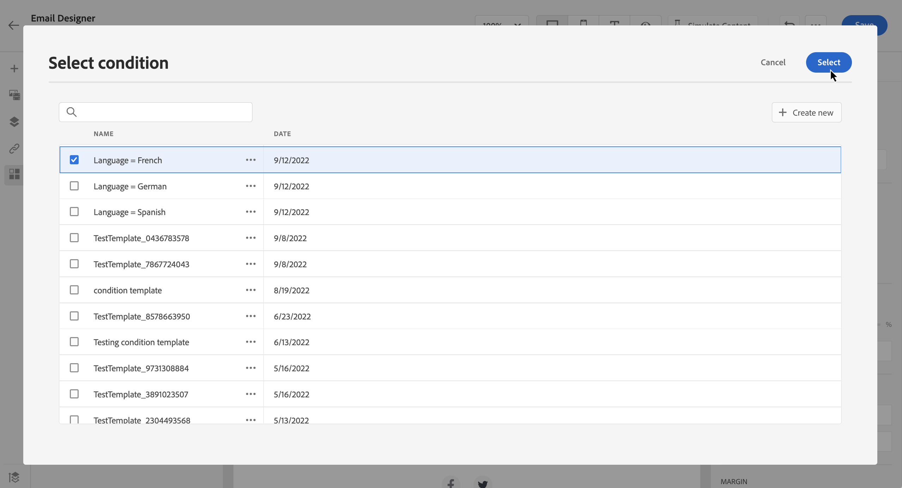

# Criar conteúdo dinâmico {#dynamic-content}

O Adobe Journey Optimizer permite aproveitar as regras condicionais criadas na biblioteca para adicionar conteúdo dinâmico às suas mensagens.

O conteúdo dinâmico pode ser criado em qualquer campo em que você pode adicionar personalização usando o editor de personalização. Isso inclui linha de assunto, links, conteúdo de notificações por push ou representações de ofertas do tipo texto. [Saiba mais sobre a personalização](personalize.md)

Além disso, você pode usar regras condicionais no Designer de email para criar várias variantes de um componente de conteúdo.

## Adicionar conteúdo dinâmico em expressões {#perso-expressions}

As etapas para adicionar conteúdo dinâmico nas expressões são as seguintes:

1. Navegue até o campo onde deseja adicionar conteúdo dinâmico e abra o editor de personalização.

1. Selecione o menu **[!UICONTROL Condições]** para exibir a lista de regras condicionais disponíveis. Clique no botão + ao lado de uma regra para adicioná-la à expressão atual.

   Você também pode criar uma nova regra selecionando **[!UICONTROL Criar novo]**. [Saiba como criar condições](create-conditions.md)

   

1. Adicione entre as marcas `{%if}` e `{%/if}` o conteúdo que você deseja exibir se a regra condicional for atendida. É possível adicionar quantas regras forem necessárias para criar várias variantes de uma expressão.

   No exemplo abaixo, duas variantes foram criadas para um conteúdo SMS, dependendo do idioma preferencial do recipient.

   

1. Quando o conteúdo estiver pronto, você poderá visualizar as diferentes variantes usando o botão **[!UICONTROL Simular conteúdo]**. [Saiba como testar e visualizar mensagens](../content-management/preview-test.md)

   

## Adicionar conteúdo dinâmico a emails {#emails}

>[!CONTEXTUALHELP]
>id="ac_conditional_content"
>title="Conteúdo condicional"
>abstract="Use regras condicionais para criar diversas variantes de um componente de conteúdo. Se nenhuma das condições for atendida ao enviar a mensagem, o conteúdo da variante padrão será exibido."

>[!CONTEXTUALHELP]
>id="ac_conditional_content_select"
>title="Conteúdo condicional"
>abstract="Use uma regra condicional salva na biblioteca ou crie uma nova."

As etapas para criar variantes de um componente de conteúdo no Designer de email são as seguintes:

1. No [Designer de Email](../email/content-from-scratch.md), selecione um componente de conteúdo e clique em **[!UICONTROL Habilitar conteúdo condicional]**.

   

1. O painel **[!UICONTROL Conteúdo Condicional]** é exibido à esquerda. Nesse painel, você pode criar várias variantes do componente de conteúdo selecionado usando condições.

   Configure sua primeira variante selecionando o botão **[!UICONTROL Selecionar condição]**.

   

1. A biblioteca de condições é exibida. Selecione a regra condicional a ser associada à variante e clique em **[!UICONTROL Selecionar]**. Neste exemplo, queremos adaptar o texto do componente dependendo do idioma preferencial do recipient.

   

   Você também pode criar uma nova regra clicando em **[!UICONTROL Criar novo]**. [Saiba como criar condições](create-conditions.md)

1. A regra condicional está associada à variante. Para facilitar a leitura, renomeie a variante selecionando a ação **[!UICONTROL Renomear]** do ícone Mais ações.

   

1. Configure como o componente deve ser exibido se a regra for atendida ao enviar a mensagem. Neste exemplo, queremos exibir o texto em francês se for o idioma preferencial do recipient.

   

1. Adicione quantas variantes forem necessárias para o componente de conteúdo. Você pode alternar a qualquer momento entre as diferentes variantes para verificar como o componente de conteúdo será exibido, dependendo das regras condicionais.

   >[!NOTE]
   >
   >* Se nenhuma das regras definidas nas variantes for atendida ao enviar a mensagem, o componente de conteúdo exibirá o conteúdo definido na **[!UICONTROL Variante padrão]**.
   >
   >* O conteúdo condicional será avaliado em relação às regras associadas na ordem em que as variantes forem exibidas. A variante padrão é sempre exibida se nenhuma outra condição for atendida.
   >
   >* Ao simular ou renderizar provas para emails que contêm diversas variantes condicionais, o Journey Optimizer pode exigir mais tempo de processamento. Se você observar falhas de tempo-limite ou mensagens de erro, considere reduzir o número total de variantes ou simplificar as regras condicionais. Saiba mais sobre como testar seu conteúdo [nesta página](../content-management/preview-test.md).

1. Para excluir uma variante, clique no ícone Mais ações ao lado da variante desejada e selecione **[!UICONTROL Excluir]**.

   
