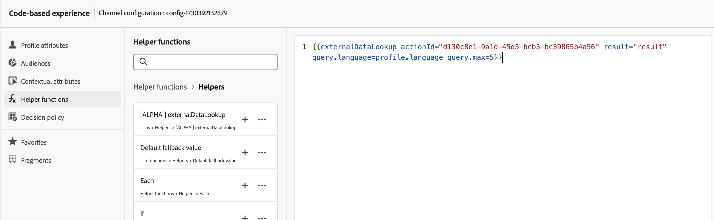
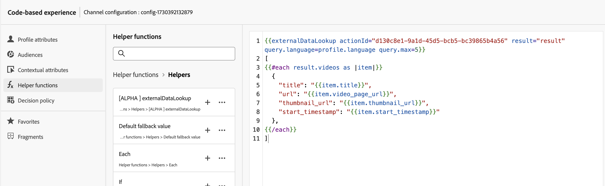
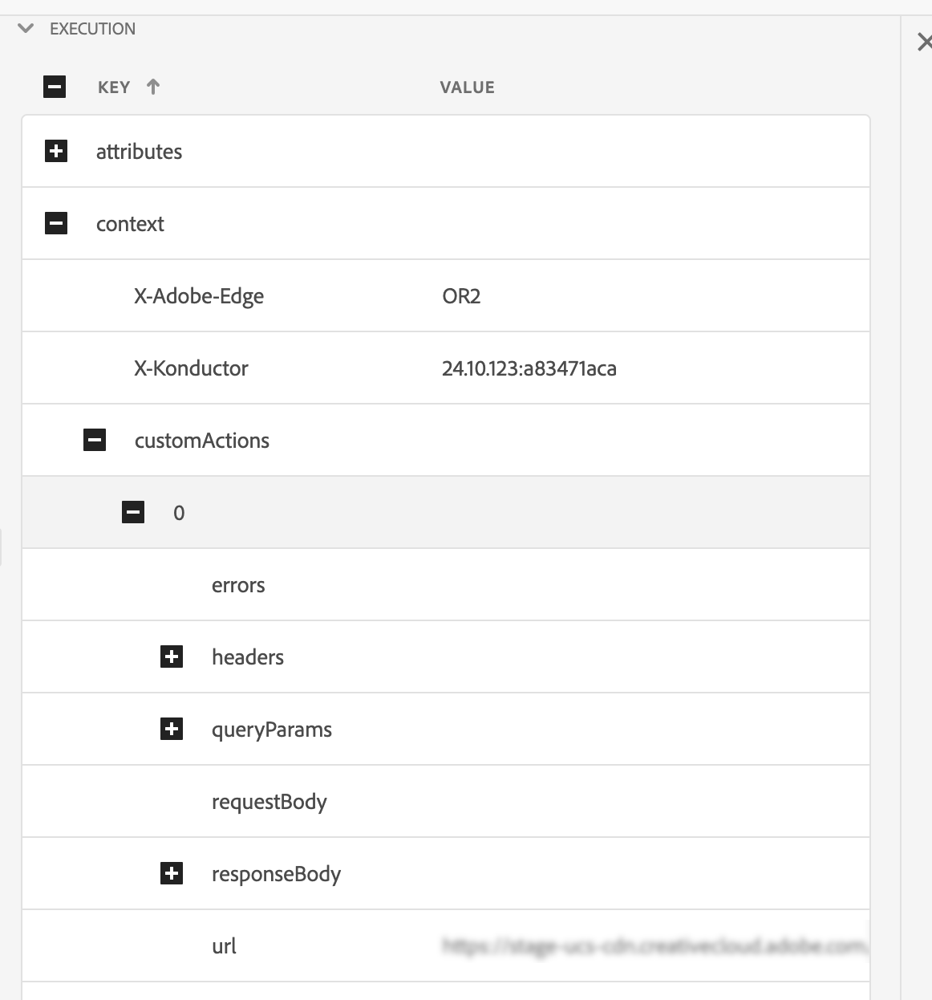

# Auxiliar de Pesquisa de Dados Externos

O auxiliar do `externalDataLookup` no Editor de personalização do [!DNL Journey Optmizer] pode ser usado para buscar dados dinamicamente de um terminal externo para uso na geração de conteúdo para canais de entrada, como os canais de Experiência baseada em Código, Web e Mensagens no Aplicativo.

>[!AVAILABILITY]
>
>Esse recurso só está disponível para algumas organizações (disponibilidade limitada).

Para usar o auxiliar, primeiro defina uma Ação no menu **[!UICONTROL Administração]** > **[!UICONTROL Configurações]**. Uma ação é onde você configura detalhes sobre um endpoint externo, como URL, GET vs. método POST, parâmetros de cabeçalho, parâmetros de consulta, esquema JSON de corpo POST e esquema JSON de resposta.

Depois que a Ação é definida, ela pode ser usada:

* No jornada, em uma atividade de Ação personalizada para buscar conteúdo,
* No jornada e em campanhas de entrada, em um auxiliar externalDataLookup para buscar dados em uma ação de entrada.

## Medidas de proteção e limitações

Consulte Ações personalizadas em [!DNL Journey Optimizer] Campanhas de canais de entrada e Jornada#GuardrailsandGuidelines também.

* Por padrão, [!DNL Journey Optimizer] usa um tempo limite de 300 ms ao chamar um ponto de extremidade externo. Contate a Engenharia do [!DNL Journey Optimizer] para aumentar este tempo limite para um ponto de extremidade.
* No Editor do Personalization, o [!DNL Journey Optimizer] não permite que você navegue pelo esquema da resposta do ponto de extremidade ao inserir expressões e não valida referências a atributos JSON da resposta usada em expressões.
* Os tipos de dados compatíveis com parâmetros de variáveis de carga útil a serem substituídos por meio do externalDataLookup helper são String, Integer, Decimal, Boolean, listString, listInt, listInteger, listDecimal.
* As alterações na configuração de uma Ação não são refletidas nas chamadas externalDataLookup correspondentes em campanhas e jornadas ativas. Para que uma alteração seja refletida, é necessário copiar ou modificar campanhas ou jornadas ativas que estejam usando a Ação em um auxiliar externalDataLookup.
* O uso de variáveis ainda não é suportado nos parâmetros auxiliares da pesquisa de dados externos.
* No momento, não há suporte para Caminho dinâmico de URL.  - Aprimoramentos de ações personalizadas de entrada#DynamicPathSegments.
* A renderização de várias passagens é suportada.
* Atualmente, as opções de autenticação na configuração Ação não são suportadas pelo auxiliar externalDataLookup. Enquanto isso, para a autenticação baseada em chave de API ou outras chaves de autorização de texto sem formatação, você pode especificá-las como campos de cabeçalho na configuração Ação.

## Configurar uma ação e usar o auxiliar

Para definir uma ação e usar o helper para personalização, siga estas etapas:

1. Crie uma Ação para configurar o endpoint para a pesquisa. Isso só precisa ser feito uma vez para cada endpoint e deve ser feito por um usuário técnico. [Saiba como configurar uma ação personalizada](../action/about-custom-action-configuration.md)

   Anote a ID de ação e copie-a.

   

1. Crie uma campanha de entrada ou ação de jornada. Neste exemplo, estamos mostrando como usar o auxiliar externalDataLookup em uma ação JSON da experiência baseada em código, mas ele pode ser usado em um campo de personalização em qualquer canal de entrada.

1. Edite o conteúdo da ação, vá para Funções de ajuda no editor de personalização e navegue até **[!UICONTROL Funções de ajuda]** > **[!UICONTROL Ajuda]**.

1. Clique no botão `+` para inserir o auxiliar externalDataLookup. A expressão auxiliar é inserida no editor, com valores de espaço reservado para `actionId` e `result`.

   

   Substitua os valores de espaço reservado da seguinte maneira:

   * `actionId`: Colar a ID de Ação copiada anteriormente.
   * `result`: Defina o nome de sua escolha. Você usará essa variável de resultado para acessar o conteúdo buscado.

1. Adicione quaisquer valores de parâmetro de variável que serão transmitidos como parte da chamada de endpoint. Por exemplo, veja como você pode passar um parâmetro de idioma e um parâmetro de número máximo de itens.

   

1. Use a variável result para acessar os dados buscados e inseri-los no conteúdo da ação de entrada. Por exemplo, veja como você pode retornar uma matriz JSON de itens buscados no endpoint.

   

## Como funciona

### Execução em tempo de execução

Quando uma ação de entrada inclui um auxiliar externalDataLookup, o ponto de extremidade é chamado dinamicamente no momento em que a solicitação de personalização [!DNL Journey Optimizer] é recebida e processada pelo AEP Edge Network.

Isso significa que o endpoint externo precisa ser capaz de lidar com pelo menos a mesma carga e taxa de transferência simultâneas que o cliente está enviando para a superfície específica para o AEP Edge Network.

### Sintaxe

`{{externalDataLookup actionId="d130c8e2-9a2d-45d5-bcb6-bc39865b4a56" result="result" optional-parameters...}}`

### Parâmetros de envio

Quando o endpoint externo é chamado, todos os valores de cabeçalho constantes, parâmetros de consulta e valor de carga de solicitação definidos na Ação serão enviados com os valores fornecidos na configuração da Ação.

Para quaisquer valores de cabeçalho de variável, parâmetros de consulta/caminho ou valores de carga de solicitação, você pode transmitir valores dinamicamente usando parâmetros para o auxiliar externalDataLookup.

Nomes dos parâmetros:

* Parâmetros de cabeçalho: cabeçalho.&lt;parameter-name>
* Parâmetros de consulta: consulta.&lt;parameter-name>
* Parâmetros de carga: carga.&lt;parameter-name>
* Parâmetros de caminho: dynamic_path.&lt;parameter-name>

Por exemplo:

`{{externalDataLookup actionId="..." result="result" header.myHeaderParameter="value1" query.myQueryParameter="value2" payload.myPayloadParameter="value3"}}`

Os valores de parâmetro podem ser valores fixos ou personalizados referenciando campos de perfil ou outros atributos contextuais, por exemplo:

`{{externalDataLookup actionId="..." result="result" query.myQueryParameter=profile.myProfileValue}}`

Parâmetros de carga podem ser fornecidos usando a notação de pontos para fazer referência a atributos JSON aninhados, por exemplo:

`{{externalDataLookup actionId="..." result="result" payload.context.channel="web"}}`

### Acessar o resultado

Para acessar os dados buscados de uma chamada de pesquisa de ponto de extremidade externo, você pode referenciar campos definidos na carga da resposta na definição Ação usando expressões de personalização e funções auxiliares.

Por exemplo, se a carga de resposta na Ação tiver esta aparência:

```
{
    "videos": [
        {
            "id": "integer",
            "title": "string",
            "description": "string",
            "thumbnail_url": "string",
            "video_page_url": "string",
            "url": "string",
            "video_type": "string",
            "start_timestamp": "dateOnly",
            "created_on": "dateOnly",
            ...
        }
    ]
}
```

Em seguida, por exemplo, você pode buscar e acessar a descrição do primeiro vídeo em uma ação do Experience HTML baseada em código, como esta:

```
{{externalDataLookup actionId="d130c8e2-9a2d-45d5-bcb6-bc39865b4a56" result="result"}}
 
First video description: <b>result.videos[0].description</b>
```

Por exemplo, você pode buscar e executar um loop pelos itens para retornar uma matriz de itens em uma ação JSON de experiência baseada em código, desta forma:

```
{{externalDataLookup actionId="d130c8e2-9a2d-45d5-bcb6-bc39865b4a56" result="result"}}
 
[
{{#each result.videos as |item|}}
    {                                                  
        "title": "{{item.title}}",
        "url": "{{item.video_page_url}}",
        "thumbnail_url": "{{item.thumbnail_url}}",
        "start_timestamp": "{{item.start_timestamp}}"
    },
{{/each}}
]
```

## Solução de problemas

### Tempos limite e tratamento de erros

[!DNL Journey Optimizer] usa um tempo limite estrito ao chamar o ponto de extremidade externo para manter as características de desempenho de alta taxa de transferência e baixa latência para o AEP Edge Network.

Se o ponto de extremidade atingir o tempo limite ou se houver qualquer outro tipo de erro que chegue ao ponto de extremidade, a variável resultante estará vazia. Nesse caso, todas as referências a atributos na variável result também estarão vazias. Se você estiver apenas exibindo o atributo no conteúdo, ele será exibido em branco. Se você estiver tentando percorrer um atributo de matriz no resultado, ele não retornará itens.

Se você quiser lidar com tempos limite ou erros de maneira mais adequada mostrando o conteúdo de fallback, poderá verificar se o resultado da pesquisa está vazio e exibir o conteúdo de fallback nesse caso.

Por exemplo, você pode mostrar um valor de fallback para um único atributo como este:

`First video description: `

ou você pode renderizar condicionalmente um bloco inteiro de conteúdo como este:

```
{{externalDataLookup actionId="d130c8e2-9a2d-45d5-bcb6-bc39865b4a56" result="result"}}
 

   ... do something with result ...

    ... return fallback content ...

```

### Depuração

Para ajudar na depuração, os detalhes de tempo limite e erro para pesquisas de dados externas são incluídos na visualização do Edge Delivery no AEP Assurance. Se você não estiver vendo os resultados esperados para um auxiliar externalDataLookup em uma ação de entrada, poderá iniciar uma sessão do Assurance, iniciar uma chamada do [!DNL Journey Optimizer] de uma implementação da Web ou móvel e usar o modo de exibição do Edge Delivery para verificar detalhes de tempo limite ou erro.

Por exemplo:

Na Seção Edge Delivery do rastreamento de garantia como parte dos detalhes de execução, um novo bloco customActions foi adicionado com detalhes de solicitação e resposta semelhantes ao abaixo. A seção de erros deve ajudar na depuração se houver problemas ao executar uma ação personalizada



## Perguntas frequentes

* Como passar um atributo contextual da solicitação como parâmetro para uma pesquisa de dados externa?

  Use o menu Atributos contextuais > Sequência de dados > Evento para navegar pelo esquema do Evento de experiência que você está usando e insira o atributo relevante como um valor de parâmetro como este:

  `{{externalDataLookup actionId="..." result="result" query.myQueryParameter=context.datastream.event.<schemaId>.my.xdm.attribute}}`

* [!DNL Journey Optimizer] faz algum armazenamento em cache de respostas do ponto de extremidade externo?

  No momento não. Esse recurso será compatível no futuro.
