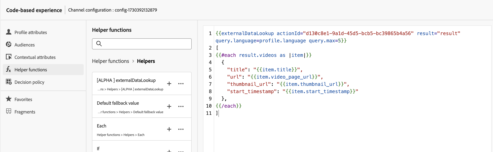

# Auxiliar de pesquisa de dados externos

>[!BEGINSHADEBOX]

**Nesta página:** Saiba como usar o auxiliar externalDataLookup para buscar dados de um ponto de extremidade externo dinamicamente e personalizar o conteúdo para canais de entrada no Adobe Journey Optimizer.

>[!ENDSHADEBOX]

O auxiliar do `externalDataLookup` no Editor de personalização do [!DNL Journey Optimizer] pode ser usado para buscar dados dinamicamente de um terminal externo para uso na geração de conteúdo para canais de entrada, como os canais de Experiência baseada em Código, Web e Mensagens no Aplicativo.

>[!AVAILABILITY]
>
>Esse recurso está disponível apenas para um conjunto de organizações (disponibilidade limitada).

Para usar o auxiliar, primeiro defina uma Ação no menu **[!UICONTROL Administração]** > **[!UICONTROL Configurações]**. Uma ação é onde você configura detalhes sobre um endpoint externo, como URL, método GET vs. POST, parâmetros de cabeçalho, parâmetros de consulta, esquema JSON de corpo POST e esquema JSON de resposta.

Depois que a Ação é definida, ela pode ser usada:

* No jornada, em uma atividade de Ação personalizada para buscar conteúdo,
* No jornada e em campanhas de entrada, em um auxiliar externalDataLookup para buscar dados em uma ação de entrada.

## Medidas de proteção e limitações

Consulte Ações personalizadas em [!DNL Journey Optimizer] Campanhas de canais de entrada e Jornada#GuardrailsandGuidelines também.

* **Tempo limite padrão** - Por padrão, [!DNL Journey Optimizer] usa um tempo limite de 300 ms ao chamar um ponto de extremidade externo. Entre em contato com seu representante da Adobe para aumentar esse tempo limite de um endpoint.
* **Navegação de esquema de resposta e validação de expressão** - No editor de personalização, não é possível navegar pelo esquema da resposta do ponto de extremidade ao inserir expressões. [!DNL Journey Optimizer] não valida referências a atributos JSON da resposta usada em expressões.
* **Tipos de dados com suporte para parâmetros** - Os tipos de dados com suporte para parâmetros variáveis de carga a serem substituídos por meio do auxiliar externalDataLookup são `String`, `Integer`, `Decimal`, `Boolean`, `listString`, `listInt`, `listInteger`, `listDecimal`.
* **Atualização automática para ações atualizadas** - As alterações em uma configuração Action não são refletidas nas chamadas externalDataLookup correspondentes em campanhas e jornadas ativas. Para que uma alteração seja refletida, é necessário copiar ou modificar campanhas ou jornadas ativas que estejam usando a Ação em um auxiliar externalDataLookup.
* **Substituição de variável** - Por enquanto, não há suporte para o uso de variáveis nos parâmetros auxiliares externalDataLookup.
* **Caminho dinâmico** - Por enquanto, não há suporte para o caminho de URL dinâmico.
* **Renderização de várias passagens** - Há suporte para a renderização de várias passagens.
* **Autenticação** - Por enquanto, o auxiliar externalDataLookup não oferece suporte às opções de autenticação na configuração Ação. Enquanto isso, para a autenticação baseada em chave de API ou outras chaves de autorização de texto sem formatação, você pode especificá-las como campos de cabeçalho na configuração Ação.

## Configurar uma ação e usar o auxiliar

Para definir uma ação e usar o helper para personalização, siga estas etapas:

1. Crie uma Ação para configurar o endpoint para a pesquisa. Isso só precisa ser feito uma vez para cada endpoint e deve ser feito por um usuário técnico. [Saiba como configurar uma ação personalizada](../action/about-custom-action-configuration.md)

   Anote a ID de ação e copie-a.

   

1. Crie uma campanha de entrada ou ação de jornada. Neste exemplo, estamos mostrando como usar o auxiliar externalDataLookup em uma ação JSON da experiência baseada em código, mas ele pode ser usado em um campo de personalização em qualquer canal de entrada.

1. Edite o conteúdo da ação, vá para Funções de ajuda no editor de personalização e navegue até **[!UICONTROL Funções de ajuda]** > **[!UICONTROL Ajuda]**.

1. Clique no botão `+` para inserir o auxiliar externalDataLookup. A expressão auxiliar é inserida no editor, com valores de espaço reservado para `actionId` e `result`.

   

   Substitua os valores de espaço reservado da seguinte maneira:

   * `actionId`: Colar a ID de Ação copiada anteriormente.
   * `result`: Defina o nome de sua escolha. Você usará essa variável de resultado para acessar o conteúdo buscado.

1. Adicione quaisquer valores de parâmetro de variável que serão transmitidos como parte da chamada de endpoint. Por exemplo, veja como você pode passar um parâmetro de idioma e um parâmetro de número máximo de itens.

   

1. Use a variável result para acessar os dados buscados e inseri-los no conteúdo da ação de entrada. Por exemplo, veja como você pode retornar uma matriz JSON de itens buscados no endpoint.

   

## Como funciona

### Execução em tempo de execução

Quando uma ação de entrada inclui um auxiliar externalDataLookup, o ponto de extremidade é chamado dinamicamente no momento em que a solicitação de personalização [!DNL Journey Optimizer] é recebida e processada pelo AEP Edge Network.

Isso significa que o endpoint externo precisa ser capaz de lidar com pelo menos a mesma carga e taxa de transferência simultâneas que o cliente está enviando para a superfície específica para o AEP Edge Network.

### Sintaxe

`{{externalDataLookup actionId="d130c8e2-9a2d-45d5-bcb6-bc39865b4a56" result="result" optional-parameters...}}`

### Parâmetros de envio

Quando o endpoint externo é chamado, todos os valores de cabeçalho constantes, parâmetros de consulta e valor de carga de solicitação definidos na Ação serão enviados com os valores fornecidos na configuração da Ação.

Para quaisquer valores de cabeçalho de variável, parâmetros de consulta/caminho ou valores de carga de solicitação, você pode transmitir valores dinamicamente usando parâmetros para o auxiliar externalDataLookup.

Nomes dos parâmetros:

* Parâmetros de cabeçalho: `header.<parameter-name>`
* Parâmetros de consulta: `query.<parameter-name>`
* Parâmetros de carga: `payload.<parameter-name>`
* Parâmetros de Caminho: `dynamic_path.<parameter-name>`

Por exemplo:

```
{{externalDataLookup actionId="..." result="result" header.myHeaderParameter="value1" query.myQueryParameter="value2" payload.myPayloadParameter="value3"}}`
```

Os valores de parâmetro podem ser valores fixos ou personalizados referenciando campos de perfil ou outros atributos contextuais, por exemplo:

```
{{externalDataLookup actionId="..." result="result" query.myQueryParameter=profile.myProfileValue}}
```

Parâmetros de carga podem ser fornecidos usando a notação de pontos para fazer referência a atributos JSON aninhados, por exemplo:

```
{{externalDataLookup actionId="..." result="result" payload.context.channel="web"}}
```

### Acessar o resultado

Para acessar os dados buscados de uma chamada de pesquisa de ponto de extremidade externo, você pode referenciar campos definidos na carga da resposta na definição Ação usando expressões de personalização e funções auxiliares.

Por exemplo, se a carga de resposta na Ação tiver esta aparência:

```
{
    "videos": [
        {
            "id": "integer",
            "title": "string",
            "description": "string",
            "thumbnail_url": "string",
            "video_page_url": "string",
            "url": "string",
            "video_type": "string",
            "start_timestamp": "dateOnly",
            "created_on": "dateOnly",
            ...
        }
    ]
}
```

Em seguida, por exemplo, você pode buscar e acessar a descrição do primeiro vídeo em uma ação do Experience HTML baseada em código, como esta:

```
{{externalDataLookup actionId="d130c8e2-9a2d-45d5-bcb6-bc39865b4a56" result="result"}}
 
First video description: <b>result.videos[0].description</b>
```

Por exemplo, você pode buscar e executar um loop pelos itens para retornar uma matriz de itens em uma ação JSON de experiência baseada em código, desta forma:

```
{{externalDataLookup actionId="d130c8e2-9a2d-45d5-bcb6-bc39865b4a56" result="result"}}
 
[
{{#each result.videos as |item|}}
    {                                                  
        "title": "{{item.title}}",
        "url": "{{item.video_page_url}}",
        "thumbnail_url": "{{item.thumbnail_url}}",
        "start_timestamp": "{{item.start_timestamp}}"
    },
{{/each}}
]
```

## Solução de problemas

### Tempo limite e tratamento de erros

[!DNL Journey Optimizer] usa um tempo limite estrito ao chamar o ponto de extremidade externo para manter as características de desempenho de alta taxa de transferência e baixa latência para o Adobe Experience Platform Edge Network.

Se o ponto de extremidade atingir o tempo limite ou se houver qualquer outro tipo de erro que chegue ao ponto de extremidade, a variável resultante estará vazia. Nesse caso, todas as referências a atributos na variável result também estarão vazias. Se você estiver apenas exibindo o atributo no conteúdo, ele será exibido em branco. Se você estiver tentando percorrer um atributo de matriz no resultado, ele não retornará itens.

Se você quiser lidar com tempos limite ou erros de maneira mais adequada mostrando o conteúdo de fallback, poderá verificar se o resultado da pesquisa está vazio e exibir o conteúdo de fallback nesse caso.

Por exemplo, você pode mostrar um valor de fallback para um único atributo como este:

```
First video description: 
```

ou você pode renderizar condicionalmente um bloco inteiro de conteúdo como este:

```
{{externalDataLookup actionId="d130c8e2-9a2d-45d5-bcb6-bc39865b4a56" result="result"}}
 

   ... do something with result ...

    ... return fallback content ...

```

### Depuração

Para ajudar na depuração, os detalhes de tempo limite e erro para pesquisas de dados externas são incluídos na exibição do Edge Delivery no Adobe Experience Platform Assurance. Se você não estiver vendo os resultados esperados para um auxiliar externalDataLookup em uma ação de entrada, poderá iniciar uma sessão do Assurance, iniciar uma chamada do [!DNL Journey Optimizer] de uma implementação da Web ou móvel e usar o modo de exibição do Edge Delivery para verificar detalhes de tempo limite ou erro.

Por exemplo:

Na Seção Edge Delivery do rastreamento de garantia como parte dos detalhes de execução, um novo bloco customActions foi adicionado com detalhes de solicitação e resposta semelhantes ao abaixo. A seção de erros deve ajudar na depuração se houver problemas ao executar uma ação personalizada


## Perguntas frequentes {#faq-external-data}

Você encontrará abaixo as Perguntas frequentes sobre o Auxiliar de pesquisa de dados externos.

Precisa de mais detalhes? Use as opções de feedback na parte inferior desta página para fazer a pergunta ou conecte-se à [comunidade Adobe Journey Optimizer](https://experienceleaguecommunities.adobe.com/t5/adobe-journey-optimizer/ct-p/journey-optimizer?profile.language=pt){target="_blank"}.

+++ Como passar um atributo contextual da solicitação como parâmetro para uma pesquisa de dados externa?

Use o menu Atributos contextuais > Sequência de dados > Evento para navegar pelo esquema do Evento de experiência que você está usando e insira o atributo relevante como um valor de parâmetro como este:

```
{{externalDataLookup actionId="..." result="result" query.myQueryParameter=context.datastream.event.<schemaId>.my.xdm.attribute}}
```

+++

+++ [!DNL Journey Optimizer] faz algum armazenamento em cache de respostas do ponto de extremidade externo?

No momento não. Esse recurso será compatível no futuro.

+++

## Referência rápida {#quick-reference}

Esta seção contém conhecimento estruturado destinado a oferecer suporte à interpretação, recuperação e resposta a perguntas relacionadas a este tópico.

Para uma compreensão completa, essas informações devem ser combinadas com a documentação desta página. Nenhuma das origens deve ser independente; a página descreve o recurso, enquanto esta seção fornece um contexto adicional que ajuda a desfazer a ambiguidade da terminologia, intenção, aplicabilidade e restrições.

>[!BEGINTABS]

>[!TAB Visão geral]

**TL;DR**

Esta página explica como configurar uma Ação para um ponto de extremidade externo e usar o auxiliar do `externalDataLookup` no editor de personalização para buscar dinamicamente esses dados no tempo de execução para personalizar o conteúdo do canal de entrada.

**Intenções**

* Configurar uma ação que define um endpoint externo (URL, método HTTP, parâmetros, esquemas de solicitação/resposta)
* Inserir o auxiliar `externalDataLookup` em uma expressão de personalização para uma ação de entrada
* Passar parâmetros de cabeçalho de variável, consulta, carga ou caminho para o endpoint externo no momento da chamada
* Acesse os dados buscados por meio do alias de resultados usando expressões de personalização e funções auxiliares
* Lidar com tempos limite e erros normalmente com padrões de conteúdo de fallback
* Depurar problemas de pesquisa externa usando o Adobe Experience Platform Assurance

>[!TAB Glossário]

* **externalDataLookup**: uma função auxiliar no editor de personalização que busca dinamicamente dados de um ponto de extremidade externo configurado no momento da solicitação, para uso na personalização do conteúdo do canal de entrada. *(específico do produto)*
* **Ação**: um objeto de configuração no Journey Optimizer (Administração > Configurações) que define um ponto de extremidade externo — URL, método HTTP, parâmetros de cabeçalho/consulta, esquema de corpo POST e esquema de resposta. Necessário antes de usar `externalDataLookup`. *(específico do produto)*
* **Variável de resultado**: um alias arbitrário atribuído na chamada `externalDataLookup`; usado para fazer referência a todos os campos da resposta buscada em expressões de personalização subsequentes.
* **Canais de entrada**: canais em que o conteúdo é entregue sob demanda quando um usuário abre uma superfície — Experiência baseada em código, Web, Mensagem no aplicativo. *(específico do produto)*
* **AEP Edge Network**: a infraestrutura que recebe solicitações de personalização e aciona a chamada de pesquisa de dados externos no tempo de execução.

>[!TAB Terminologia]

* **Nome canônico:** externalDataLookup — variantes: pesquisa de dados externos, auxiliar de pesquisa de dados externos, Auxiliar de pesquisa de dados externos
* **Sinônimos:** &quot;externalDataLookup&quot; = &quot;auxiliar de pesquisa de dados externos&quot;
* **Não confundir:** `actionId` (ID da Ação configurada, identificando o ponto de extremidade externo) ≠ `result` (alias para os dados de resposta obtidos) ≠ nomes de parâmetros (valores variáveis passados para o ponto de extremidade no momento da chamada)
* **Não confunda:** usando `externalDataLookup` em uma ação de personalização de entrada (busca dados dinamicamente no momento da solicitação do Edge Network) ≠ usando uma Ação personalizada em uma atividade de jornada (busca conteúdo em um fluxo de jornada)

>[!TAB Medidas de proteção e limitações]

* O recurso está em Disponibilidade Limitada — disponível somente para um conjunto de organizações.
* Tempo limite padrão para chamadas de endpoint externas: 300 ms (padrão; entre em contato com o representante da Adobe para aumentar esse tempo limite para um endpoint específico).
* A navegação pelo esquema de resposta não é suportada no editor de personalização; o Journey Optimizer não valida referências a atributos JSON da resposta usada em expressões.
* Tipos de dados com suporte para parâmetros de variáveis de carga: `String`, `Integer`, `Decimal`, `Boolean`, `listString`, `listInt`, `listInteger`, `listDecimal`.
* Atualmente, não há suporte para a substituição de variáveis em `externalDataLookup` parâmetros auxiliares.
* No momento, não há suporte para caminhos dinâmicos de URL.
* Atualmente, o `externalDataLookup` não oferece suporte às opções de autenticação na configuração Ação; use campos de cabeçalho para autorização baseada em chave de API ou texto sem formatação como solução alternativa.
* As alterações em uma configuração de Ação não são refletidas em campanhas ou jornadas ativas usando essa Ação; copie ou modifique campanhas/jornadas ativas para aplicar as alterações.
* A renderização de várias passagens é suportada.
* No momento, o Journey Optimizer não armazena em cache respostas de pontos de extremidade externos.
* O endpoint externo deve ser capaz de lidar com pelo menos a mesma carga e taxa de transferência simultâneas que o tráfego de entrada enviado ao AEP Edge Network para a superfície especificada.

>[!TAB Perguntas frequentes]

**P: O que acontece se o ponto de extremidade externo atingir o tempo limite ou retornar um erro?**

A variável de resultado estará vazia. As referências de atributo no resultado serão exibidas em branco, e as iterações de matriz não retornarão itens. Use padrões de conteúdo de fallback — como `?: "none found"` para atributos únicos ou `……` para blocos de conteúdo inteiros — para tratar esses casos normalmente.

**P: Como transfiro um atributo contextual da solicitação como parâmetro para uma pesquisa de dados externa?**

Use o menu Atributos contextuais > Sequência de dados > Evento no editor de personalização para procurar o esquema Evento de experiência e inserir o atributo relevante como um valor de parâmetro, por exemplo: `query.myQueryParameter=context.datastream.event.<schemaId>.my.xdm.attribute`.

**P: O Journey Optimizer armazena em cache as respostas do ponto de extremidade externo?**

No momento não. O armazenamento em cache será compatível no futuro.

**P: Como depurar problemas com externalDataLookup?**

Use o Adobe Experience Platform Assurance. Inicie uma sessão do Assurance, inicie uma chamada do Journey Optimizer a partir da implementação da Web ou móvel e use a exibição do Edge Delivery para inspecionar o bloco customActions para obter detalhes de tempo limite ou erro.

**P: Posso usar autenticação na configuração de Ação com externalDataLookup?**

Atualmente, não há suporte para as opções de autenticação na configuração Ação. Para autorização baseada em chave de API ou outra autorização de texto sem formatação, especifique as credenciais como campos de cabeçalho na configuração Ação.

>[!ENDTABS]

<!-- ai-section-version: 1 | source-hash: a3ce801a -->
