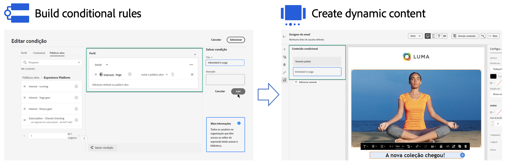

# Introdução ao conteúdo dinâmico {#start-dynamic-content}

>[!CONTEXTUALHELP]
>id="ajo_conditions_list"
>title="Condições"
>abstract="As regras condicionais permitem exibir várias variantes de conteúdo em suas mensagens com base em atributos de perfil, eventos contextuais ou segmentos de público-alvo."

O conteúdo dinâmico permite adaptar o conteúdo de suas mensagens com base em **regras condicionais** que pode ser composto de atributos de perfil, eventos contextuais ou segmentos de público-alvo. Regras condicionais são criadas usando um construtor de regras visuais no Editor de expressão, onde você pode armazená-las para reutilização adicional em suas jornadas e campanhas.

As regras condicionais podem ser aproveitadas no Email Designer e no editor de expressão para **criar conteúdo dinâmico** que se adaptará aos perfis direcionados em suas mensagens.

* [Saiba como trabalhar com regras condicionais](create-conditions.md)
* [Saiba como criar conteúdo dinâmico](dynamic-content.md)

## Vídeo tutorial {#video}

Saiba como Criar conteúdo dinâmico com o construtor de regras de condição.

>[!VIDEO](https://video.tv.adobe.com/v/3409815?quality=12)
