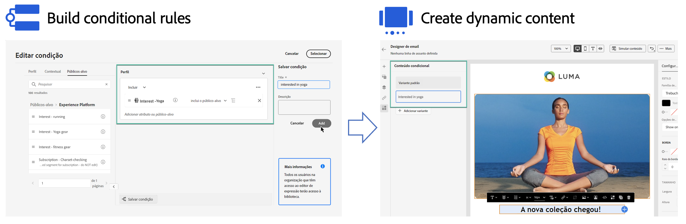

# Introdução ao conteúdo dinâmico {#start-dynamic-content}

>[!BEGINSHADEBOX]

**Nesta página:** Entenda como o conteúdo dinâmico usa regras condicionais criadas a partir de atributos de perfil, eventos contextuais e públicos-alvo para adaptar suas mensagens a perfis direcionados.

>[!ENDSHADEBOX]

>[!CONTEXTUALHELP]
>id="ajo_conditions_list"
>title="Condições"
>abstract="As regras condicionais permitem exibir diversas variantes de conteúdo em suas mensagens com base em atributos de perfil, eventos contextuais ou públicos-alvo."

O conteúdo dinâmico permite adaptar o conteúdo de suas mensagens com base em **regras condicionais** que podem ser compostas de atributos de perfil, eventos contextuais ou públicos-alvo. Regras condicionais são criadas usando um construtor visual de regras no editor de personalização, onde você pode armazená-las para reutilização em suas jornadas e campanhas.

As regras condicionais podem ser aproveitadas no Email Designer e no editor de personalização para **criar conteúdo dinâmico** que se adapte aos perfis direcionados em suas mensagens.

* [Saiba como trabalhar com regras condicionais](create-conditions.md)
* [Saiba como criar conteúdo dinâmico](dynamic-content.md)

## Vídeo tutorial {#video}

Saiba como Criar conteúdo dinâmico com o construtor de regras de condição.

>[!VIDEO](https://video.tv.adobe.com/v/3409815?quality=12)

## Referência rápida {#quick-reference}

Esta seção contém conhecimento estruturado destinado a oferecer suporte à interpretação, recuperação e resposta a perguntas relacionadas a este tópico.

Para uma compreensão completa, essas informações devem ser combinadas com a documentação desta página. Nenhuma das origens deve ser independente; a página descreve o recurso, enquanto esta seção fornece um contexto adicional que ajuda a desfazer a ambiguidade da terminologia, intenção, aplicabilidade e restrições.

>[!BEGINTABS]

>[!TAB Visão geral]

**TL;DR**

Esta página introduz o conteúdo dinâmico no Journey Optimizer — como as regras condicionais criadas a partir dos atributos do perfil, eventos contextuais e públicos-alvo permitem que as mensagens se adaptem aos perfis a que se destinam.

**Intenções**

* Entenda o que é conteúdo dinâmico e como ele difere do conteúdo estático de mensagens
* Identifique os dois pontos de entrada para conteúdo dinâmico: o Designer de email e o editor de personalização
* Navegue até o guia apropriado para criar regras condicionais ou conteúdo dinâmico

>[!TAB Glossário]

* **Conteúdo dinâmico**: conteúdo de mensagem que se adapta com base em regras condicionais; conteúdo diferente é mostrado a perfis diferentes dependendo se as condições definidas são atendidas. *(específico do produto)*
* **Regra condicional**: um conjunto de critérios — criados a partir de atributos de perfil, eventos contextuais ou públicos-alvo — que determina qual variante de conteúdo um perfil recebe. *(específico do produto)*
* **Construtor de regras visuais**: a tela interativa dentro do editor de personalização usada para criar e armazenar regras condicionais. *(específico do produto)*

>[!TAB Terminologia]

* **Nome canônico:** conteúdo dinâmico — variantes: conteúdo condicional, conteúdo personalizado
* **Sinônimos:** &quot;regras condicionais&quot; = &quot;condições&quot; (conforme rotulado na interface do usuário)
* **Não confunda:** conteúdo dinâmico (conteúdo que se adapta por perfil com base em regras condicionais) ≠ conteúdo estático (o mesmo conteúdo mostrado a todos os destinatários independentemente das condições)

>[!TAB Perguntas frequentes]

**P: Quais tipos de critérios as regras condicionais podem usar?**

Regras condicionais podem ser criadas a partir de atributos de perfil, eventos contextuais e associação de público-alvo.

**P: Onde as regras condicionais podem ser usadas para criar conteúdo dinâmico?**

No Designer de email (para criar variantes de componentes) e no editor de personalização (para envolver blocos de expressão com condições). Ambos os pontos de entrada são abordados em páginas vinculadas.

**P: As regras condicionais podem ser reutilizadas em jornadas e campanhas?**

Sim. As regras condicionais podem ser armazenadas para reutilização em jornadas e campanhas.

>[!ENDTABS]

<!-- ai-section-version: 1 | source-hash: 0f90f9b5 -->
