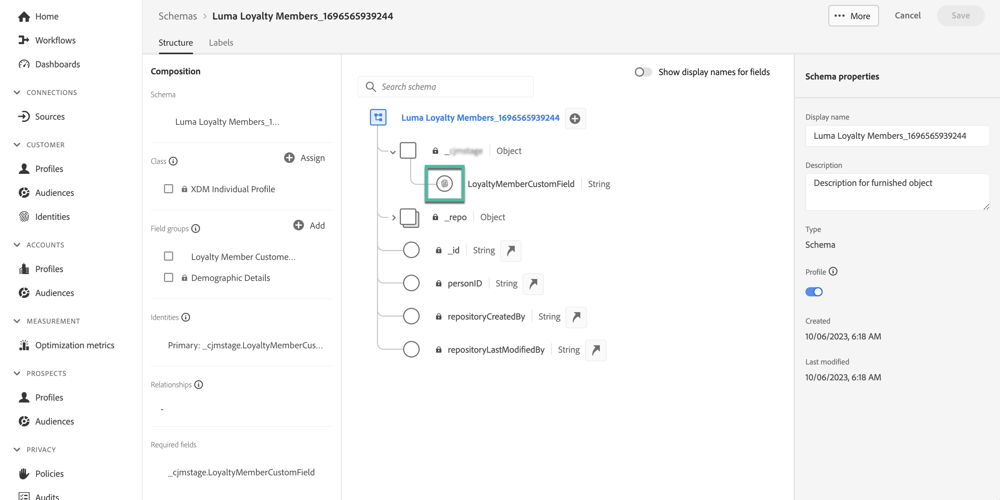

# Usar dados do Adobe Experience Platform para personalização (beta) {#aep-data}

>[!AVAILABILITY]
>
>No momento, esse recurso está disponível apenas como um beta privado.
>
>Por enquanto, ela só está disponível para fins de teste na sandbox de não produção fornecida para o Adobe e para os conjuntos de dados solicitados para o beta.

O Journey Optimizer permite aproveitar os dados do Adobe Experience Platform no editor de personalização para [personalizar seu conteúdo](../personalization/personalize.md). As etapas são as seguintes:

1. Abra o editor de personalização, que está disponível em todos os contextos, onde é possível definir personalização, como mensagens. [Saiba como trabalhar com o editor de personalização](../personalization/personalization-build-expressions.md)

1. Navegue até a lista de funções auxiliares e adicione a **datasetLookup** função auxiliar para o painel de código.

   

1. Essa função fornece uma sintaxe predefinida para permitir que você chame campos a partir de conjuntos de dados da Adobe Experience Platform. A sintaxe é a seguinte:

   ```
   {{entity.datasetId="datasetId" id="key" result="store"}}
   ```

   * **entity.datasetId** é a ID do conjunto de dados com o qual você está trabalhando,
   * **id** é o campo usado como identidade principal no conjunto de dados,

     >[!NOTE]
     >
     >O valor inserido para esse campo pode ser a ID do campo (*profile.couponValue*), um campo transmitido em um evento de jornada (*context.jornada.events.event_ID.couponValue*) ou um valor estático (*couponAbcd*). Em qualquer caso, o sistema usará o valor e pesquisará no conjunto de dados para verificar se ele corresponde a uma chave a).

   * **resultado** é um nome arbitrário que você precisa fornecer para fazer referência a todos os valores de campo que você vai recuperar do conjunto de dados. Esse valor será usado no código para chamar cada campo.

   +++Onde recuperar uma ID de conjunto de dados?

   As IDs dos conjuntos de dados podem ser recuperadas na interface do usuário do Adobe Experience Platform. Saiba como trabalhar com conjuntos de dados na [Documentação do Adobe Experience Platform](https://experienceleague.adobe.com/en/docs/experience-platform/catalog/datasets/user-guide#view-datasets){target="_blank"}.

   

+++

   +++Como identificar um campo de identidade principal em um conjunto de dados?

   O campo que foi definido como a identidade primária para um determinado conjunto de dados pode ser encontrado no esquema vinculado ao conjunto de dados. Saiba como trabalhar com campos de identidade na [Documentação do Adobe Experience Platform](https://experienceleague.adobe.com/en/docs/experience-platform/xdm/ui/fields/identity){target="_blank"}.

   

+++

1. Adapte a sintaxe de acordo com suas necessidades. Neste exemplo, queremos recuperar dados relacionados aos voos dos passageiros. A sintaxe é a seguinte:

   ```
   {{entity.datasetId="1234567890abcdtId" id="profile.personalEmail.address" result="flight"}}
   ```

   * Estamos trabalhando no conjunto de dados cuja ID é &quot;1234567890abcdtId&quot;,
   * O campo usado como chave primária neste conjunto de dados é o endereço de email,
   * Queremos incluir todos os valores de campo sob a referência &quot;flight&quot;.

1. Depois que a sintaxe a ser chamada no conjunto de dados do Adobe Experience Platform for configurada, você poderá especificar quais campos deseja recuperar. A sintaxe é a seguinte:

   ```
   {{result.fieldId}}
   ```

   * **resultado** é o valor atribuído à variável **resultado** parâmetro no **MultiEntidade** função auxiliar. Neste exemplo, &quot;voo&quot;.
   * **fieldID** é a ID do campo que você deseja recuperar. Essa ID é visível na interface do usuário do Adobe Experience Platform ao navegar no conjunto de dados. Expanda a seção abaixo para exibir um exemplo:

     +++Onde recuperar uma ID de campo?

     As IDs de campos podem ser recuperadas ao visualizar um conjunto de dados na interface do usuário do Adobe Experience Platform. Saiba como visualizar conjuntos de dados no [Documentação do Adobe Experience Platform](https://experienceleague.adobe.com/en/docs/experience-platform/catalog/datasets/user-guide#preview){target="_blank"}.

     

+++

   Neste exemplo, queremos usar informações relacionadas ao horário e ao portão de embarque dos passageiros. Portanto, adicionamos estas duas linhas:

   * `{{flight._myorg.booking.boardingTime}}`
   * `{{flight._myorg.booking.gate}}`

1. Agora que o código está pronto, você pode concluir o conteúdo como de costume e testá-lo usando o **Simular conteúdo** botão para verificar a personalização. [Saiba como visualizar e testar o conteúdo](../content-management/preview-test.md)


   
