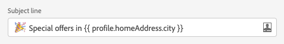

# Contexto e ferramenta de personalização {#personalization-areas}

O conteúdo e a exibição de mensagens entregues pelo Journey Optimizer podem ser personalizados de várias maneiras diferentes.

Todos os campos associados ao ícone do editor podem abrir o editor de personalização e receber conteúdo de personalização.

## Personalize seus emails

Ao criar um email, você pode adicionar personalização no campo **Email subject** da mensagem.

No Designer de email, é possível personalizar o conteúdo:

* Na **mensagem**: clique dentro de um bloco de texto, clique no ícone **Personalizar** na barra de ferramentas contextual e selecione **Inserir personalização** campo. Para obter mais informações sobre a interface do Designer de email, consulte esta [seção](../design-emails.md).

   

* Para um **link**: selecione algum texto ou imagem dentro de um bloco de texto, clique no ícone **Insert link** na barra de ferramentas contextual. Na janela , é possível adicionar um bloco de personalização clicando no ícone **Add personalization**.

   

## Personalizar notificações por push

Você também pode personalizar suas **Notificações por push** nos seguintes campos:

* **Title**
* **Corpo**
* **Som personalizado**
* **Etiquetas**
* **Dados personalizados**

Saiba mais sobre a configuração de notificação por push em [this section](../create-push.md).

## Usar o editor de expressão

O editor de expressão é a peça central da personalização no Journey Optimizer.

Ela está disponível em todos os contextos onde é necessário definir personalização como emails, push e ofertas.

Na interface do editor de expressão, você selecionará, organizará, personalizará e validará todos os dados para criar uma personalização personalizada para o seu conteúdo.

A parte esquerda da tela exibe um seletor de domínio que permite selecionar a fonte para personalização.

* **Perfil** : lista todas as referências associadas ao esquema de perfil descrito na documentação do  [Adobe Experience Platform Data Model (XDM)](https://experienceleague.adobe.com/docs/experience-platform/xdm/home.html?lang=pt-BR).
* **Associação**  de segmento: lista todos os segmentos criados no serviço de Segmentação da Adobe Experience Platform. Mais informações sobre segmentação disponíveis [aqui](https://experienceleague.adobe.com/docs/experience-platform/segmentation/home.html?lang=en)
* **Ofertas** : lista todas as ofertas associadas a uma disposição específica. Selecione a disposição e insira as ofertas no seu conteúdo. Para obter uma documentação completa sobre como gerenciar ofertas, consulte [esta seção](../deliver-personalized-offers.md)
* **Contexto** : quando a atividade  **** Messageactivity é usada em uma jornada, os campos de jornada contextual ficam disponíveis nesse menu. Consulte [esta seção](personalization-use-case.md)
* **Funções**  de ajuda: lista todas as funções auxiliares disponíveis para executar operações em dados, como cálculos, formatação de dados ou conversões, condições e manipulá-las no contexto de personalização. [Saiba mais](functions/functions.md)

Na seleção, a referência é adicionada no editor.

>[!NOTE]
>
>O ícone de informações ao lado do ícone &quot;+&quot; abre uma dica de ferramenta que fornece mais detalhes para cada variável.

No exemplo a seguir, o editor de expressão permite selecionar os perfis que fazem aniversário hoje e concluir a personalização inserindo uma oferta específica correspondente a este dia.

