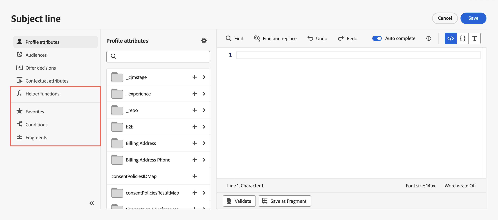

# Adicionar personalização {#build-personalization-expressions}

>[!BEGINSHADEBOX]

**Nesta página:** saiba como usar o editor de personalização para adicionar, personalizar e validar expressões de personalização de fontes como atributos de perfil, públicos, decisões de oferta e atributos contextuais.

>[!ENDSHADEBOX]

>[!CONTEXTUALHELP]
>id="ajo_perso_editor"
>title="Sobre o editor de personalização"
>abstract="O editor de personalização permite selecionar, organizar, personalizar e validar todos os dados para criar um conteúdo personalizado."

O editor de personalização é a peça central da personalização em [!DNL Journey Optimizer]. Ele está disponível em todos os contextos em que você precisa definir a personalização, como emails, push e ofertas.

Na interface do editor de personalização, você pode selecionar, organizar, personalizar e validar todos os dados para criar uma personalização personalizada para seu conteúdo.


## Onde posso adicionar personalização {#where}

Você pode adicionar personalização em **[!DNL Journey Optimizer]** em todos os campos com o ícone . Expanda as seções abaixo para obter mais detalhes.

+++Mensagens

Nas mensagens, a personalização pode ser adicionada em locais diferentes, como o campo **[!UICONTROL Linha de assunto]**.


Ele também pode ser adicionado em outras seções do seu conteúdo. Por exemplo, para [notificações por push](../push/push-gs.md), a personalização pode ser adicionada nos campos **Título**, **Corpo**, **Som personalizado**, **Medalhas** e **Dados personalizados**.

+++

+++Designer de email

Ao editar conteúdo de email na [Designer de email](../email/get-started-email-design.md), você pode adicionar personalização na maioria dos elementos de texto usando o ícone na barra de ferramentas contextual.


+++

+++URLs

O Journey Optimizer também permite personalizar **URLs** em suas mensagens. Os URLs personalizados levam os destinatários para páginas específicas de um site ou para um microsite personalizado, dependendo dos atributos do perfil. [Saiba mais](../email/url-personalization.md)

{width="50%"}

>[!NOTE]
>
>A personalização de URL está disponível para estes tipos de links: **Link externo**, **Link de unsubscription** e **Opt-Out**.

+++

+++Configuração de email

Ao criar uma configuração de canal de email, você pode definir valores personalizados para subdomínios, cabeçalhos e parâmetros de rastreamento de URL. [Saiba mais](../email/surface-personalization.md)

+++

+++Ofertas

Você pode adicionar personalização ao usar conteúdo do tipo texto em suas representações de **ofertas**. [Saiba como criar ofertas personalizadas](../offers/offer-library/creating-personalized-offers.md)

+++

## Fontes do Personalization {#sources}

O painel de navegação permite selecionar a origem para personalização. As fontes disponíveis são:

* **[!UICONTROL Atributos do perfil]** : lista todas as referências associadas ao esquema de perfil descrito na [documentação do Adobe Experience Platform Data Model (XDM)](https://experienceleague.adobe.com/docs/experience-platform/xdm/home.html?lang=pt-BR){target="_blank"}.
* **[!UICONTROL Atributos do público-alvo]**: esta pasta é específica para campanhas orquestradas. Ele contém atributos calculados diretamente na tela da campanha. [Saiba como adicionar personalização em campanhas orquestradas](../orchestrated/add-personalization.md)
* **[!UICONTROL Públicos-alvo]** : lista todos os públicos-alvo criados no serviço de Segmentação do Adobe Experience Platform. Saiba mais na [documentação de Segmentação do Adobe Experience Platform](https://experienceleague.adobe.com/docs/experience-platform/segmentation/home.html?lang=pt-BR){target="_blank"}.
* **[!UICONTROL Decisões de oferta]** : lista todas as ofertas associadas a uma disposição específica. Selecione o posicionamento e insira as ofertas no conteúdo. Para obter uma documentação completa sobre como gerenciar ofertas, consulte [esta seção](../offers/get-started/starting-offer-decisioning.md).
* **[!UICONTROL Atributos contextuais]**: quando uma atividade de ação de canal (email, push, SMS) é usada em uma jornada ou campanha, os atributos contextuais relacionados a eventos e propriedades ficam disponíveis para personalização. Um exemplo de personalização usando atributos contextuais é apresentado em [esta seção](personalization-use-case.md). Além disso, as respostas de ação personalizadas podem ser usadas para personalização. [Saiba como usar respostas de ação personalizadas em canais nativos](../action/action-response.md#response-in-channels).

>[!NOTE]
>
>Se você estiver direcionando um público-alvo com atributos de enriquecimento gerados usando um fluxo de trabalho de composição, poderá aproveitar esses atributos de enriquecimento para personalizar sua mensagem. [Saiba como usar atributos de enriquecimento de públicos-alvo](../audience/about-audiences.md#enrichment)

## Adicionar personalização {#add}

>[!CONTEXTUALHELP]
>id="ajo_perso_editor_autocomplete"
>title="Preenchimento automático"
>abstract="Ativar essa opção permite que o sistema sugira e conclua automaticamente o código à medida que você digita. Esse recurso está disponível somente para os formatos HTML e Texto e é compatível com os atributos de Perfil e Contexto. Se desabilitado por meio do botão de alternância, o editor fornecerá preenchimento automático do código HTML nativo."

O espaço de trabalho central é onde você cria sua sintaxe de personalização. Para usar um atributo para personalizar sua mensagem, localize-o no painel de navegação esquerdo e clique no botão `+` para adicioná-lo à expressão.


O menu de reticências ao lado do ícone `+` permite obter mais detalhes para cada atributo e adicionar os atributos usados com mais frequência aos favoritos. Os atributos adicionados aos favoritos podem ser acessados pelo menu **[!UICONTROL Favoritos]** no painel de navegação.

>[!NOTE]
>
>Por padrão, o painel de atributos mostra apenas atributos preenchidos. Para exibir todos os atributos, selecione o botão  localizado acima do campo de pesquisa e desative a opção **[!UICONTROL Mostrar apenas atributos preenchidos]**.

Além disso, você pode definir um texto de fallback padrão que será exibido se um atributo de perfil do tipo string estiver vazio. Para fazer isso, clique no botão de reticências ao lado do atributo e selecione **[!UICONTROL Inserir com texto alternativo]**. Escreva o texto que deve ser exibido por padrão se o valor do atributo estiver vazio para um perfil e clique em **[!UICONTROL Adicionar]**.


No exemplo a seguir, o editor de personalização permite selecionar os perfis que fazem aniversário hoje e, em seguida, concluir a personalização inserindo uma oferta específica correspondente a este dia.


## Opções para edição de expressão {#options}

O espaço de trabalho central fornece várias ferramentas para ajudar você a escrever sua expressão de personalização.


As opções disponíveis são:

1. **[!UICONTROL Localizar]** / **[!UICONTROL Localizar e substituir]**: pesquise pela expressão e substitua automaticamente partes do código.
1. **[!UICONTROL Desfazer]** / **[!UICONTROL Refazer]**: Desfazer / Refazer a última operação.
1. **[!UICONTROL Preenchimento automático]**: sugere e conclui automaticamente o código à medida que você digita. Esse recurso está disponível somente para os formatos HTML e Texto e é compatível com os atributos de Perfil e Contexto. Se desabilitado por meio do botão de alternância, o editor fornecerá preenchimento automático do código HTML nativo.

   {width="70%" align="center" zoomable="yes"}

1. **[!UICONTROL HTML]** / **[!UICONTROL JSON]** / **[!UICONTROL Text]**: identifique o formato do seu código. Isso permite que o sistema adapte a validação e o recurso de preenchimento automático com base no idioma selecionado.
1. **[!UICONTROL Validar]**: verifique a sintaxe da sua expressão. Saiba mais [nesta seção](../personalization/personalization-build-expressions.md).
1. **[!UICONTROL Salvar como fragmento]**: salve sua expressão como um fragmento de expressão. Saiba mais [nesta seção](../content-management/save-fragments.md#save-as-expression-fragment)
1. **[!UICONTROL Tamanho da fonte]**: ajusta o tamanho da fonte do conteúdo dentro do editor para melhorar a leitura.
1. **[!UICONTROL Quebra de texto]**: habilita ou desabilita a quebra automática de linha, permitindo que expressões longas sejam exibidas em uma única linha ou quebra automática no editor. As opções incluem:
   * **Desativado** (Padrão) - Sem quebra automática de linha. As linhas longas se estendem além da exibição do editor e exigem rolagem horizontal.
   * **Em** - Quebra linhas na largura do editor.
   * **Coluna de quebra automática de linha** - Quebra as linhas quando os caracteres de linha atingem 80 caracteres.
   * **Limitado** - Quebra as linhas na largura do editor ou em 80 caracteres, o que for menor.
1. **[!UICONTROL Pills]**: exibir atributos como &quot;pílulas&quot; compactas para melhorar a legibilidade, ocultando caminhos de atributos longos. Clique em um atributo para exibir seu caminho completo.

   >[!NOTE]
   >
   >Essa opção só está disponível para atributos de perfil, atributos contextuais e mídia dinâmica.

No painel de navegação, recursos adicionais estão disponíveis para ajudar você a criar sua expressão de personalização.



* **[!UICONTROL Funções auxiliares]** - As funções auxiliares permitem executar operações em dados, como cálculos, formatação de dados ou conversões, condições e manipulá-las no contexto da personalização. [Saiba mais sobre as funções auxiliares disponíveis](functions/functions.md)

* **[!UICONTROL Favoritos]** - Os atributos adicionados aos favoritos são exibidos nesta lista. Isso permite acessar rapidamente os itens usados com mais frequência. Para adicionar um atributo aos favoritos, clique no menu de reticências e escolha **[!UICONTROL Adicionar aos favoritos]**.

* **[!UICONTROL Condições]** - Aproveite as regras condicionais criadas na biblioteca para adicionar conteúdo dinâmico às suas mensagens. Isso permite criar várias variantes da mensagem com base em condições. [Saiba como criar conteúdo dinâmico](../personalization/get-started-dynamic-content.md)

* **[!UICONTROL Fragmentos]** - Aproveite fragmentos de expressão que foram criados ou salvos na sandbox atual. Um fragmento é um componente reutilizável que pode ser referenciado em [!DNL Journey Optimizer] campanhas e jornadas. Essa funcionalidade permite pré-construir vários blocos de conteúdo personalizado que podem ser usados por usuários de marketing para reunir conteúdo rapidamente em um processo de design aprimorado. [Saiba como usar fragmentos de expressão para personalização](../personalization/use-expression-fragments.md)

>[!TIP]
>
>Procurando expressões prontas para uso? A página **[Receitas do Personalization](personalization-recipes.md)** fornece padrões de copiar e colar para os casos de uso mais comuns: formatação de data, temporizadores de contagem regressiva, fallbacks condicionais, exibição somente de tempo e muito mais.

Quando a expressão de personalização estiver pronta, será necessário validá-la pelo editor de personalização. Saiba mais [nesta seção](../personalization/personalization-build-expressions.md).

## Mecanismos de validação {#validation-mechanisms}

A validação da sua expressão é executada automaticamente quando você clica no botão **Adicionar** para fechar a janela do editor. Você também pode usar o botão **Validar** para verificar sua sintaxe de personalização.


Expanda a seção abaixo para ver erros comuns que podem ocorrer ao validar a personalização.

+++Erros comuns

* **Caminho &quot;XYZ&quot; não encontrado**

Ao tentar referenciar um campo que não está definido no esquema.

Nesse caso, **firstName1** não está definido como atributo no esquema de perfil:

```
{{profile.person.name.firstName1}}
```

* **Incompatibilidade de tipo para a variável &quot;XYZ&quot;. Matriz esperada. Cadeia de caracteres encontrada.**

Ao tentar iterar sobre uma cadeia de caracteres em vez de uma matriz.

Neste caso, o **produto** não é uma matriz:

```
{{each profile.person.name.firstName as |product|}}
 {{product.productName}}
{{/each}}
```

* **Sintaxe de manipuladores inválida. Encontrado`'[XYZ}}'`**

Quando a sintaxe de manipuladores inválidos é usada.

Expressões Handlebars cercadas por **{{expression}}**

```
   {{[profile.person.name.firstName}}
```

* **Definição de segmento inválida**

```
No segment definition found for 988afe9f0-d4ae-42c8-a0be-8d90e66e151
```

+++

Para ofertas, podem ocorrer erros específicos. Expanda a seção abaixo para obter mais detalhes:

+++ Erros específicos relacionados às ofertas

Os erros relacionados à integração de ofertas em uma mensagem de email ou push têm o seguinte padrão:

```
Offer.<offerType>.[PlacementID].[ActivityID].<offer-attribute>
```

A validação é executada durante a validação do conteúdo de personalização no editor de personalização.

<table> 
 <thead> 
  <tr> 
   <th> Título de erro <br /> </th> 
   <th> Validação/Resolução <br /> </th> 
  </tr> 
 </thead> 
 <tbody> 
  <tr> 
   <td>Recurso com id placementID e tipo OfferPlacement não encontrado <br/>
Recurso com id activityID e tipo OfferActivity não encontrado<br/></td> 
   <td>Verificar se ActivityID e/ou PlacementID estão disponíveis</td> 
  </tr> 
   <tr> 
   <td>O recurso não pôde ser validado.</td> 
   <td>O componentType no Posicionamento deve corresponder à oferta offerType</td> 
  </tr> 
   <tr> 
   <td>O URL público não está presente em offerId.</td> 
   <td>As Ofertas de imagem (todas as Personalizadas e substitutas associadas ao par de decisão e posicionamento) devem ter o URL público preenchido (deliveryURL não deve estar vazio).</td> 
  </tr> 
  <tr> 
   <td>A decisão contém atributos que não são de perfil.</td> 
   <td>O uso do modelo de ofertas deve conter somente os atributos do perfil.</td> 
  </tr> 
  <tr> 
   <td>Ocorreu um erro ao buscar o uso de decisão.</td> 
   <td>Esse erro pode ocorrer quando a API está tentando buscar o modelo de oferta.</td> 
  </tr>
  <tr> 
   <td>Atributo de oferta atributo de oferta inválido.</td> 
   <td>Verifique se o atributo de oferta referenciado na queda da oferta é válido. A seguir estão os atributos válidos: <br/>
Imagem: deliveryURL, linkURL<br/>
Texto: conteúdo<br/>
HTML: content<br/></td> 
  </tr> 
 </tbody> 
</table>

+++

## Referência rápida {#quick-reference}

Esta seção contém conhecimento estruturado destinado a oferecer suporte à interpretação, recuperação e resposta a perguntas relacionadas a este tópico.

Para uma compreensão completa, essas informações devem ser combinadas com a documentação desta página. Nenhuma das origens deve ser independente; a página descreve o recurso, enquanto esta seção fornece um contexto adicional que ajuda a desfazer a ambiguidade da terminologia, intenção, aplicabilidade e restrições.

>[!BEGINTABS]

>[!TAB Visão geral]

**TL;DR**

Esta página explica como usar o editor de personalização do Journey Optimizer para selecionar, criar, personalizar e validar expressões de personalização de fontes, incluindo atributos de perfil, públicos, decisões de oferta e atributos contextuais.

**Intenções**

* Entenda onde a personalização pode ser adicionada no Journey Optimizer (mensagens, Designer de email, URLs, configuração de email, ofertas)
* Selecione a fonte de personalização apropriada para uma expressão
* Adicionar atributos e criar expressões no espaço de trabalho do editor
* Usar ferramentas do editor: Localizar/Substituir, Preenchimento automático, Validar, Pills, Salvar como fragmento
* Usar recursos do painel de navegação: funções auxiliares, Favoritos, Condições, Fragmentos
* Validar expressões e resolver erros comuns

>[!TAB Glossário]

* **Editor do Personalization**: a ferramenta de interface do usuário central no Journey Optimizer para criar, personalizar e validar expressões de personalização; disponível onde a personalização puder ser definida. *(específico do produto)*
* **Fontes do Personalization**: as categorias de dados disponíveis para criar expressões — atributos de perfil, atributos de destino, públicos-alvo, decisões de oferta e atributos contextuais.
* **Atributos contextuais**: dados específicos de Jornada ou campanha (eventos, propriedades, respostas de ação personalizadas) disponíveis para personalização somente quando uma ação de canal é usada em uma jornada ou campanha. *(específico do produto)*
* **Pills**: um modo de exibição do editor de personalização que renderiza caminhos de atributos longos como tokens compactos e clicáveis para facilitar a leitura. Disponível somente para atributos de perfil, atributos contextuais e mídia dinâmica. *(específico do produto)*
* **Preenchimento automático**: um recurso do editor que sugere e conclui automaticamente o código à medida que você digita; disponível somente para formatos de HTML e Texto, com suporte somente para atributos de Perfil e Contexto. *(específico do produto)*
* **Fragmento de expressão**: um componente de expressão de personalização reutilizável que pode ser referenciado em campanhas e jornadas. *(específico do produto)*
* **Texto de fallback**: uma cadeia de caracteres padrão exibida quando um atributo de perfil do tipo cadeia de caracteres está vazio para um determinado perfil; configurado por atributo via &quot;Inserir com texto de fallback&quot;.

>[!TAB Terminologia]

* **Nome canônico:** editor de personalização
* **Não confunda:** o editor do Personalization (usado para criar expressões de conteúdo em mensagens, emails, notificações por push e ofertas — suporta a sintaxe do Handlebars e do PQL) ≠ O editor de expressão avançado (usado na jornada para condições em fontes de dados e informações de eventos, atividades de espera personalizadas e mapeamento de parâmetros de ação — fornece funções e operadores integrados que diferem daqueles no editor de personalização)
* **Não confundir:** Atributos de perfil (baseado em esquema XDM, disponível em todos os contextos) ≠ Atributos contextuais (específico para jornada/campanha, disponível somente nesse contexto) ≠ Atributos de destino (somente campanhas orquestradas)
* **Não confunda:** Preenchimento automático para HTML/Text (sugere conclusões de atributo de personalização) ≠ autopreenchimento de código nativo do HTML (o padrão do editor quando a opção está desativada)

>[!TAB Medidas de proteção e limitações]

* O Preenchimento automático está disponível somente para formatos de HTML e Texto; ele é compatível apenas com atributos de Perfil e Contexto.
* O modo de exibição de pílulas está disponível apenas para atributos de perfil, atributos contextuais e mídia dinâmica.
* A personalização de URL está disponível somente para os tipos de link Link externo, Link de unsubscription e Link de recusa.
* Por padrão, o painel de atributos mostra apenas atributos preenchidos; desative a opção &quot;Mostrar apenas atributos preenchidos&quot; para exibir todos os atributos do esquema.
* O uso do modelo de ofertas deve conter somente atributos de perfil; atributos que não sejam de perfil em uma decisão causam um erro de validação.

>[!TAB Perguntas frequentes]

**P: Onde a personalização pode ser adicionada no Journey Optimizer?**

Em qualquer campo com o ícone de adicionar personalização — incluindo a linha de assunto do email, campos de notificação por push (Título, Corpo, som personalizado, Selos, dados personalizados), elementos de texto do Designer de email, URLs (Link externo, Link de cancelamento de assinatura, Recusa), subdomínios/cabeçalhos/parâmetros de rastreamento de URL de configuração de email e representações do tipo texto de oferta.

**P: Quais são as fontes de personalização disponíveis?**

Atributos do perfil, atributos do Target (somente campanhas orquestradas), públicos, decisões de oferta e atributos contextuais (eventos de jornada/campanha e respostas de ação personalizadas).

**P: Como uma expressão é validada?**

A validação é executada automaticamente ao clicar em Adicionar para fechar o editor. Também é possível acioná-lo manualmente com o botão Validate. Erros comuns incluem: caminho não encontrado (campo não no esquema), incompatibilidade de tipo (iterando uma cadeia de caracteres como matriz), sintaxe Handlebars inválida e definição de segmento inválida.

**P: O que a opção Comprimidos faz?**

Ele renderiza caminhos de atributos longos como tokens compactos e clicáveis para melhorar a leitura no editor. Disponível somente para atributos de perfil, atributos contextuais e mídia dinâmica.

**P: Por que vejo apenas alguns atributos no painel de atributos?**

Por padrão, o painel mostra apenas atributos preenchidos. Selecione o ícone de configurações acima do campo de pesquisa e desative a opção &quot;Mostrar apenas atributos preenchidos&quot; para exibir todos os atributos do esquema.

>[!ENDTABS]

<!-- ai-section-version: 1 | source-hash: 54973b31 -->
