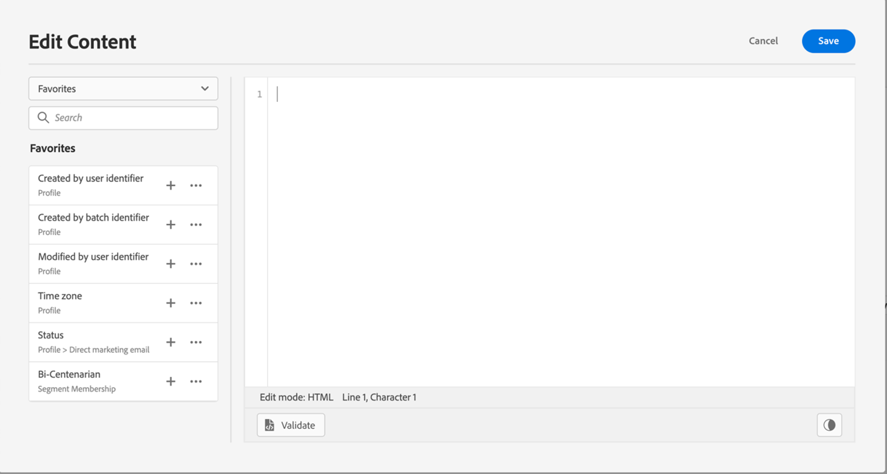
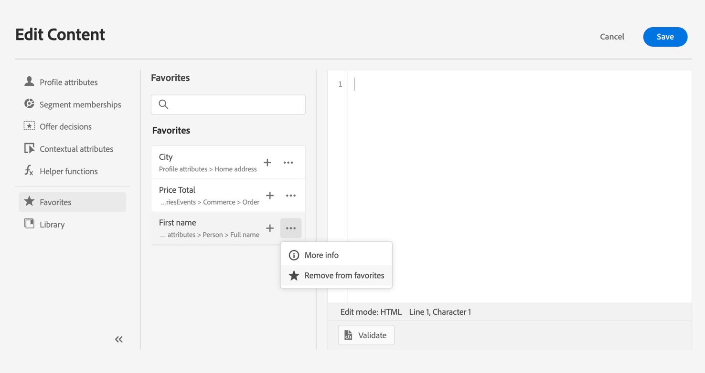

# Adicionar atributos aos favoritos {#fav}

Adicionar atributos diferentes ao menu de favoritos fornece acesso rápido aos itens usados com mais frequência. Para adicionar um atributo aos seus favoritos, clique no menu elipse e escolha **[!UICONTROL Adicionar aos favoritos]**.

Para acessar os itens que você adicionou como favorito, use o **[!UICONTROL Favoritos]** no painel esquerdo.

Nessa lista, é possível adicionar rapidamente o objeto de personalização à expressão atual.

Se você não quiser mais ver um item em sua lista de favoritos, é possível removê-lo dos favoritos.

