# Caso de uso do Personalization: email de abandono de carrinho {#personalization-use-case-helper-functions}

>[!BEGINSHADEBOX]

**Nesta página:** Siga um caso de uso de abandono de carrinho que personaliza um corpo de email usando upperCase, cada um e se as funções auxiliares no Adobe Journey Optimizer.

>[!ENDSHADEBOX]

Neste exemplo, você personalizará o corpo de uma mensagem de email. Essa mensagem é direcionada aos clientes que deixaram itens em seus carrinhos de compras, mas não concluíram a compra.

Você usará estes tipos de funções auxiliares:

* A função de sequência de caracteres `upperCase`, para inserir o nome do cliente em letras maiúsculas. [Saiba mais](functions/string.md#upper).
* O auxiliar `each`, para listar os itens que estão no carrinho. [Saiba mais](functions/helpers.md#each).
* O auxiliar do `if`, para inserir uma observação específica do produto se o produto relacionado estiver no carrinho. [Saiba mais](functions/helpers.md#if-function).
<!-- **Context**: personalization based on contextual data from the journey -->

➡️ [Saiba como usar funções auxiliares neste vídeo](#video)

Antes de começar, verifique se você sabe como configurar esses elementos:

* Um evento unitário. [Saiba mais](../event/about-events.md).
* Uma jornada que começa com um evento. [Saiba mais](../building-journeys/using-the-journey-designer.md).
* Uma mensagem de email na jornada. [Saiba mais](../email/create-email.md)
* O corpo de um email. [Saiba mais](../email/content-from-scratch.md).

Siga estas etapas:

1. [Crie o evento inicial e a jornada](#create-context).
1. [Criar uma mensagem de email](#configure-email).
1. [Insira o nome do cliente em letras maiúsculas](#uppercase-function).
1. [Adicionar o conteúdo do carrinho ao email](#each-helper).
1. [Insira uma observação específica do produto](#if-helper).
1. [Testar e publicar a jornada](#test-and-publish).

## Etapa 1: criar o evento inicial e a jornada relacionada {#create-context}

O conteúdo do carrinho é uma informação contextual da jornada. Portanto, você deve adicionar um evento inicial e o email a uma jornada antes de poder adicionar informações específicas do carrinho ao email.

1. Crie um evento cujo esquema inclua a matriz `productListItems`.
1. Defina todos os campos dessa matriz como campos de carga para esse evento.

   Saiba mais sobre o tipo de dados do item de lista de produtos na [documentação do Adobe Experience Platform](https://experienceleague.adobe.com/docs/experience-platform/xdm/data-types/product-list-item.html){target="_blank"}.

1. Crie uma jornada que comece com este evento.
1. Adicione uma atividade de **Email** à jornada.

   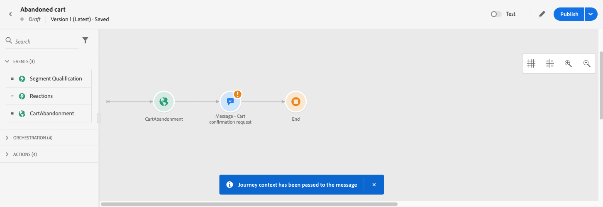

## Etapa 2: criar o email {#configure-email}

1. Na atividade de **Email**, clique em **[!UICONTROL Editar conteúdo]** e em **[!UICONTROL Email Designer]**.

   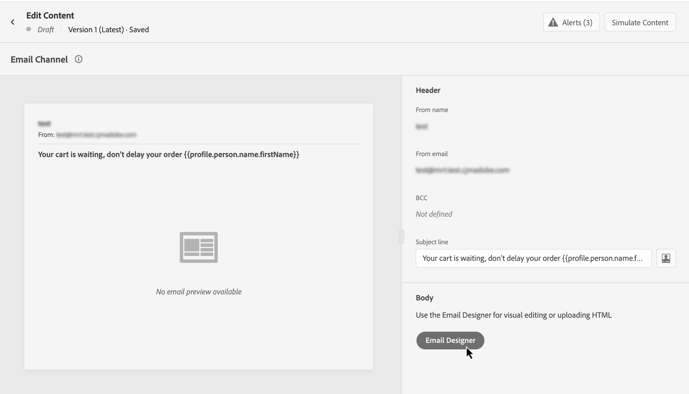

1. Na paleta esquerda da página inicial do Designer de email, arraste e solte três componentes de estrutura no corpo da mensagem.

1. Arraste e solte um componente de conteúdo do HTML em cada novo componente de estrutura.

   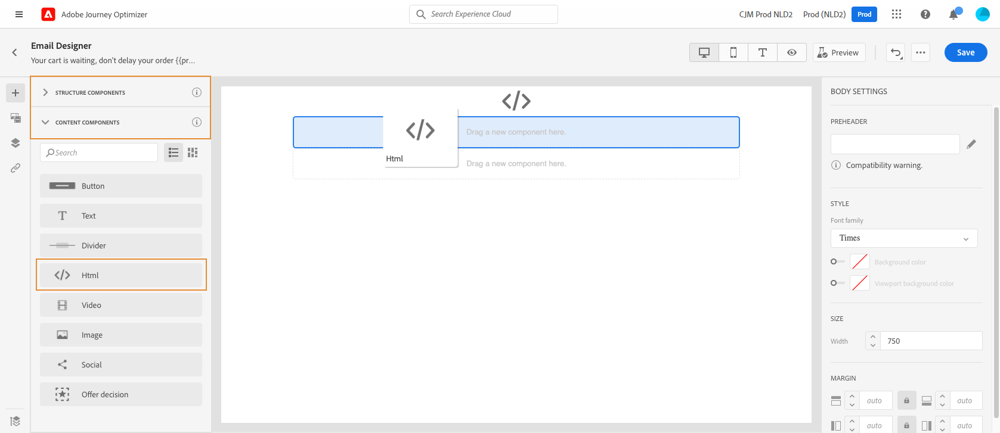

## Etapa 3: insira o nome do cliente em letras maiúsculas {#uppercase-function}

1. Na página inicial do Designer de email, clique no componente do HTML ao qual deseja adicionar o nome do cliente.
1. Na barra de ferramentas contextual, clique em **[!UICONTROL Mostrar o código-fonte]**.

   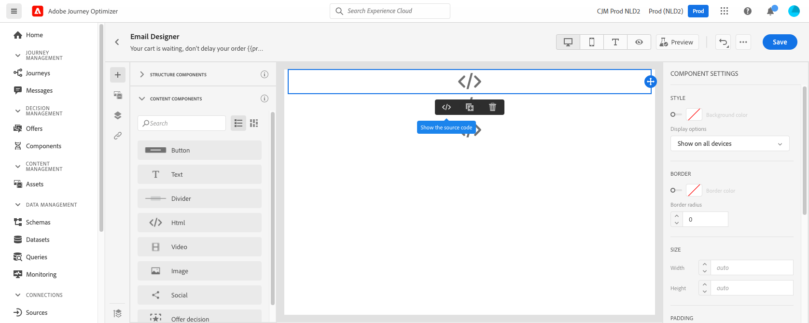

1. Na janela **[!UICONTROL Editar HTML]**, adicione a função de cadeia de caracteres `upperCase`:
   1. No menu esquerdo, selecione **[!UICONTROL funções auxiliares]**.
   1. Use o campo de pesquisa para localizar &quot;caixa alta&quot;.
   1. Nos resultados da pesquisa, adicione a função `upperCase`. Para fazer isso, clique no sinal de adição (+) ao lado de `: string`.

      O editor de expressão mostra esta expressão:

      ```handlebars
      
      ```

      

1. Remova o espaço reservado &quot;string&quot; da expressão.
1. Adicione o token de nome:
   1. No menu esquerdo, selecione **[!UICONTROL Atributos do perfil]**.
   1. Selecione **[!UICONTROL Pessoa]** > **[!UICONTROL Nome completo]**.
   1. Adicione o token **[!UICONTROL Nome]** à expressão.

      O editor de expressão mostra esta expressão:

      ```handlebars
      
      ```

      

      Saiba mais sobre o tipo de dados do nome da pessoa na [documentação do Adobe Experience Platform](https://experienceleague.adobe.com/docs/experience-platform/xdm/data-types/person-name.html){target="_blank"}.

1. Clique em **[!UICONTROL Validar]** e em **[!UICONTROL Salvar]**.

   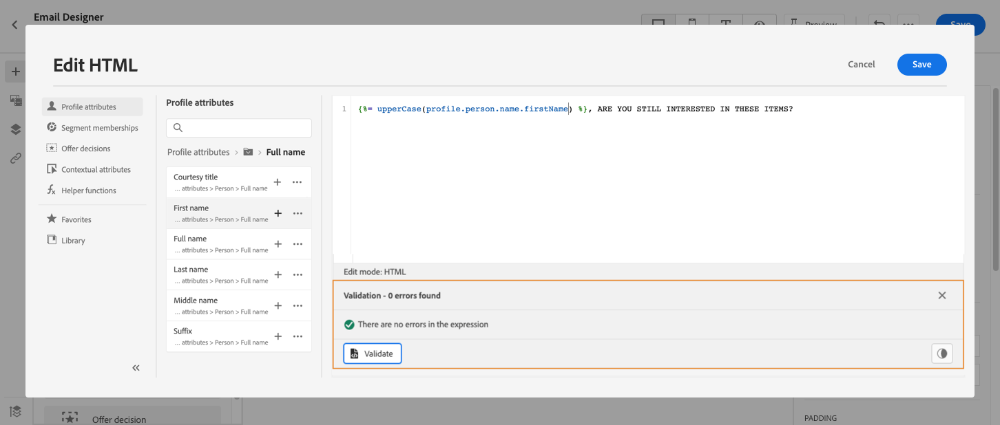

1. Salve a mensagem.

## Etapa 4: inserir a lista de itens do carrinho {#each-helper}

Esta etapa demonstra a iteração pelos dados do evento. Para obter exemplos abrangentes de iteração em diferentes fontes de dados (eventos, respostas de ação personalizadas e outros dados contextuais), consulte [Iterar dados contextuais com Handlebars](iterate-contextual-data.md).

1. Reabra o conteúdo da mensagem.

1. Na página inicial do Designer de email, clique no componente do HTML onde deseja listar o conteúdo do carrinho.
1. Na barra de ferramentas contextual, clique em **[!UICONTROL Mostrar o código-fonte]**.

   

1. Na janela **[!UICONTROL Editar HTML]**, adicione o auxiliar `each`:
   1. No menu esquerdo, selecione **[!UICONTROL funções auxiliares]**.
   1. Use o campo de pesquisa para localizar &quot;cada&quot;.
   1. Nos resultados da pesquisa, adicione o auxiliar do `each`.

      O editor de expressão mostra esta expressão:

      ```handlebars
      {{#each someArray as |variable|}} {{/each}}
      ```

      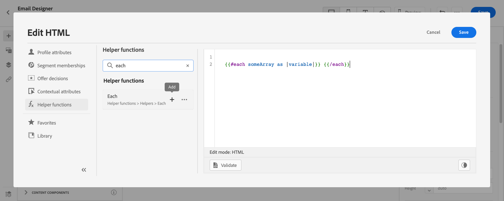

1. Adicionar a matriz `productListItems` à expressão:

   1. Remova o espaço reservado &quot;someArray&quot; da expressão.
   1. No menu esquerdo, selecione **[!UICONTROL Atributos contextuais]**.

      **[!UICONTROL Atributos contextuais]** só estão disponíveis depois que o contexto de jornada é passado para a mensagem.

   1. Selecione **[!UICONTROL Journey Optimizer]** > **[!UICONTROL Events]** > ***[!UICONTROL event_name]*** e expanda o nó **[!UICONTROL productListItems]**.

      Neste exemplo, *event_name* representa o nome do evento.

   1. Adicionar o token do **[!UICONTROL Produto]** à expressão.

      O editor de expressão mostra esta expressão:

      ```handlebars
      {{#each context.journey.events.event_ID.productListItems.product as |variable|}} {{/each}}
      ```

      Neste exemplo, *event_ID* representa a ID do evento.

      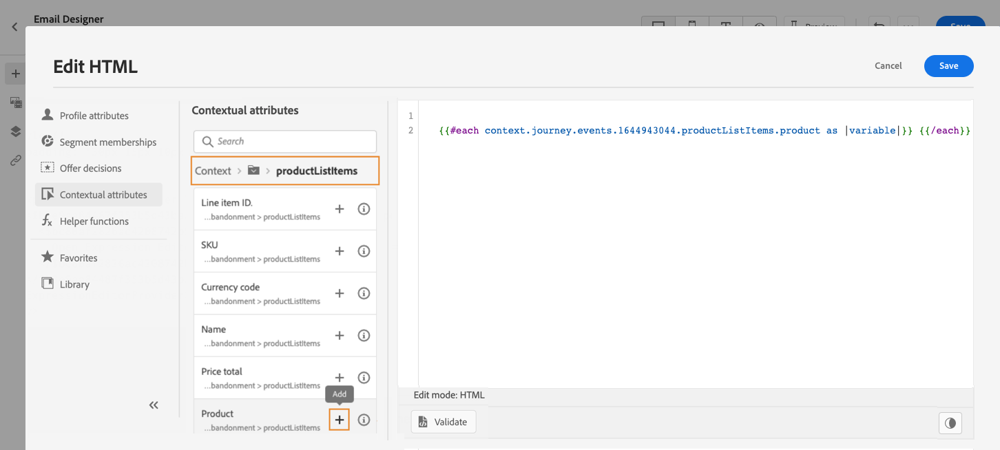

   1. Modifique a expressão:
      1. Remova a string &quot;.product&quot;.
      1. Substitua o espaço reservado &quot;variável&quot; por &quot;produto&quot;.

      Este exemplo mostra a expressão modificada:

      ```handlebars
      {{#each context.journey.events.event_ID.productListItems as |product|}}
      ```

1. Cole este código entre a tag de abertura `{{#each}}` e a tag de fechamento `{{/each}}`:

   ```html
   <table>
      <tbody>
         <tr>
            <td><b>#name</b></td>
            <td><b>#quantity</b></td>
            <td><b>$#priceTotal</b></td>
         </tr>
      </tbody>
   </table>
   ```

1. Adicione os tokens de personalização para o nome do item, a quantidade e o preço:

   1. Remova o espaço reservado &quot;#name&quot; da tabela do HTML.
   1. A partir dos resultados da pesquisa anterior, adicione o token **[!UICONTROL Name]** à expressão.

   Repita essas etapas duas vezes:

   * Substitua o espaço reservado &quot;#quantity&quot; pelo token de **[!UICONTROL Quantidade]**.
   * Substitua o espaço reservado &quot;#priceTotal&quot; pelo token de **[!UICONTROL Preço total]**.

   Este exemplo mostra a expressão modificada:

   ```handlebars
   {{#each context.journey.events.event_ID.productListItems as |product|}}
      <table>
         <tbody>
            <tr>
            <td><b>{{product.name}}</b></td>
            <td><b>{{product.quantity}}</b></td>
            <td><b>${{product.priceTotal}}</b></td>
            </tr>
         </tbody>
      </table>
   {{/each}}
   ```

1. Clique em **[!UICONTROL Validar]** e em **[!UICONTROL Salvar]**.

   

## Etapa 5: inserir uma observação específica do produto {#if-helper}

1. Na página inicial do Designer de email, clique no componente do HTML onde deseja inserir a nota.
1. Na barra de ferramentas contextual, clique em **[!UICONTROL Mostrar o código-fonte]**.

   

1. Na janela **[!UICONTROL Editar HTML]**, adicione o auxiliar `if`:
   1. No menu esquerdo, selecione **[!UICONTROL funções auxiliares]**.
   1. Use o campo de pesquisa para localizar &quot;if&quot;.
   1. Nos resultados da pesquisa, adicione o auxiliar do `if`.

      O editor de expressão mostra esta expressão:

      ```handlebars
       render_1
          render_2
          default_render
      
      ```

      

1. Remova essa condição da expressão:

   ```handlebars
    render_2
   ```

   Este exemplo mostra a expressão modificada:

   ```handlebars
    render_1
       default_render
   
   ```

1. Adicione o token do nome do produto à condição:
   1. Remova o espaço reservado &quot;condition1&quot; da expressão.
   1. No menu esquerdo, selecione **[!UICONTROL Atributos contextuais]**.
   1. Selecione **[!UICONTROL Journey Orchestration]** > **[!UICONTROL Events]** > ***[!UICONTROL event_name]*** e expanda o nó **[!UICONTROL productListItems]**.

      Neste exemplo, *event_name* representa o nome do evento.

   1. Adicione o token **[!UICONTROL Name]** à expressão.

      O editor de expressão mostra esta expressão:

      ```handlebars
      
         render_1
          default_render
      
      ```

      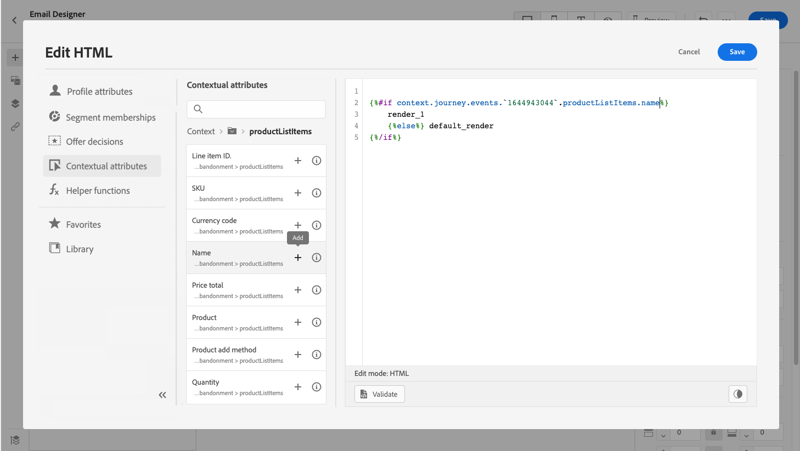

1. Modifique a expressão:
   1. No editor de expressão, especifique o nome do produto após o token `name`.

      Use esta sintaxe, onde *product_name* representa o nome do seu produto:

      ```javascript
      = "product_name"
      ```

      Neste exemplo, o nome do produto é &quot;Juno Jacket&quot;:

      ```handlebars
      
         render_1
          default_render
      
      ```

   1. Substitua o espaço reservado &quot;render_1&quot; pelo texto da nota.

      Exemplo:

      ```handlebars
      
         Due to longer than usual lead times on the Juno Jacket, please expect item to ship two weeks after purchase.
          default_render
      
      ```

   1. Remova o espaço reservado &quot;default_render&quot; da expressão.
1. Clique em **[!UICONTROL Validar]** e em **[!UICONTROL Salvar]**.

   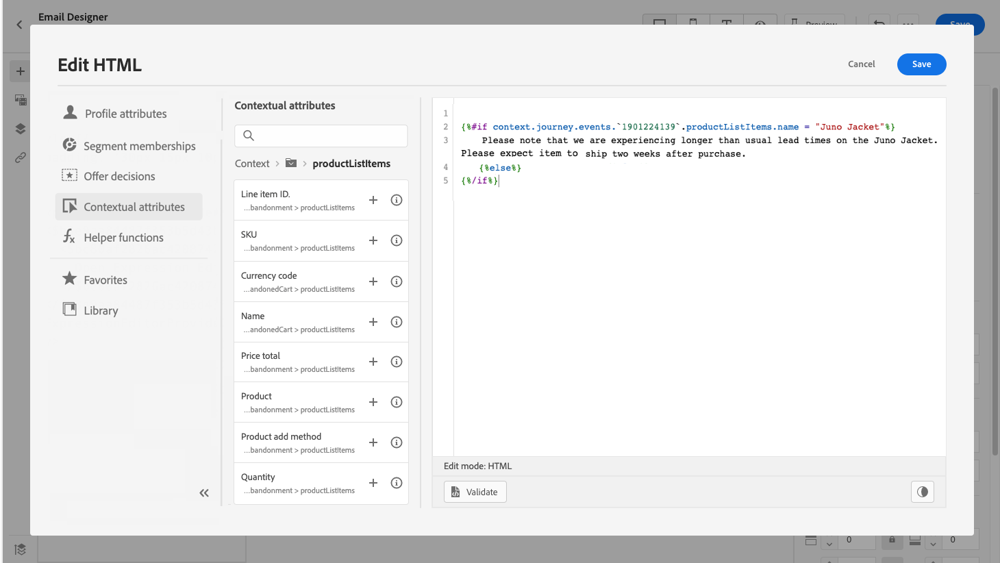

1. Salve a mensagem.

## Etapa 6: testar e publicar a jornada {#test-and-publish}

1. Ative a opção **[!UICONTROL Testar]** e clique em **[!UICONTROL Acionar um evento]**.

   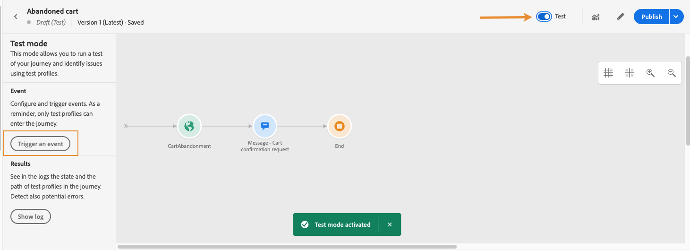

1. Na janela **[!UICONTROL Configuração de evento]**, digite os valores de entrada e clique em **[!UICONTROL Enviar]**.

   O modo de teste funciona somente com perfis de teste.

   

   O email é enviado para o endereço do perfil de teste.

   Neste exemplo, o email contém a observação sobre o Juno Jacket porque este produto está no carrinho:

   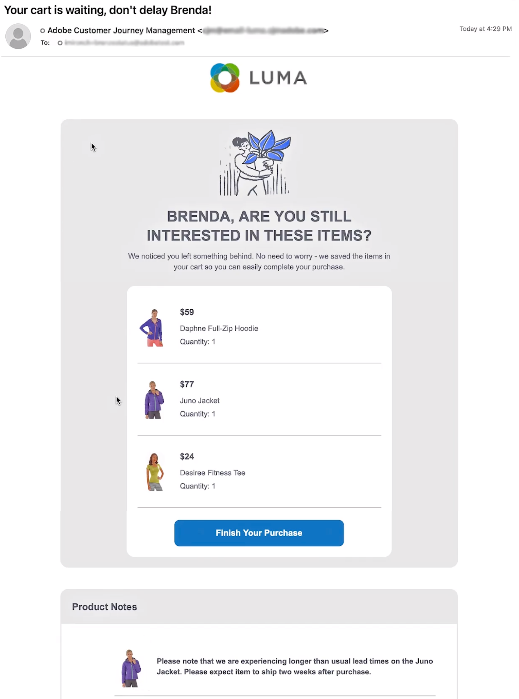

1. Verifique se não há erros e publique a jornada.


## Tópicos relacionados {#related-topics}

### Funções Handlebars {#handlebars}

* [Auxiliares](functions/helpers.md)

* [Funções de strings](functions/string.md)

### Casos de uso {#use-case}

* [Personalization com informações de perfil, contexto e oferta](personalization-use-case.md)

* [Personalization com oferta baseada em decisão](../offers/offers-e2e.md)

## Vídeo tutorial {#video}

Saiba como usar funções auxiliares.

>[!VIDEO](https://video.tv.adobe.com/v/334244?quality=12)

## Referência rápida {#quick-reference}

Esta seção contém conhecimento estruturado destinado a oferecer suporte à interpretação, recuperação e resposta a perguntas relacionadas a este tópico.

Para uma compreensão completa, essas informações devem ser combinadas com a documentação desta página. Nenhuma das origens deve ser independente; a página descreve o recurso, enquanto esta seção fornece um contexto adicional que ajuda a desfazer a ambiguidade da terminologia, intenção, aplicabilidade e restrições.

>[!BEGINTABS]

>[!TAB Visão geral]

**TL;DR**

Esta página aborda um caso de uso de email de abandono de carrinho usando três funções auxiliares — `upperCase`, `each` e `if` — para exibir o nome do cliente em maiúsculas, listar itens de carrinho e inserir uma nota de remessa específica do produto condicionalmente.

**Intenções**

* Criar um evento de jornada cujo esquema inclua a matriz `productListItems`
* Insira o nome de um cliente em maiúsculas usando ``
* Listar itens do carrinho iterando sobre `context.journey.events.event_ID.productListItems` com `{{#each}}`
* Exibir uma observação específica do produto condicionalmente usando ``
* Teste a jornada no modo de teste usando um perfil de teste com carga útil do evento e publique

>[!TAB Glossário]

* **`upperCase`**: Uma função de cadeia de caracteres do PQL que converte uma cadeia de caracteres em maiúsculas; chamada com ``. *(específico do produto)*
* **`each`auxiliar**: um auxiliar de bloco Handlebars (`{{#each array as |alias|}} ... {{/each}}`) que itera sobre uma matriz, como `productListItems`. *(específico do produto)*
* **`if`auxiliar**: um auxiliar de bloco condicional (` ...  ... `) que renderiza conteúdo somente quando a condição especificada é verdadeira.
* **`productListItems`**: uma matriz XDM padrão que representa o conteúdo do carrinho, com campos que incluem `name`, `quantity` e `priceTotal`. *(específico do produto)*
* **Modo de teste**: um recurso de jornada que permite o envio de mensagens de teste para endereços de perfil de teste a fim de verificar o comportamento da jornada e da mensagem antes da publicação. *(específico do produto)*

>[!TAB Terminologia]

* **Nome canônico:** email de abandono do carrinho — variantes: caso de uso de abandono do carrinho
* **Não confundir:** `context.journey.events.event_ID.productListItems` (matriz de origem de evento, acessada por atributos Contextuais) ≠ `profile.*` atributos (origem de perfil, sempre disponível)

>[!TAB Medidas de proteção e limitações]

* Os atributos contextuais (incluindo dados do evento de jornada) estão disponíveis no editor de personalização somente após a mensagem ter sido colocada em uma jornada que inclui o evento relevante.
* O modo de teste funciona somente com perfis de teste.

>[!TAB Perguntas frequentes]

**P: Quais funções auxiliares são usadas neste caso de uso?**

Três: `upperCase` (renderiza o nome em maiúsculas), `each` (itera sobre a matriz de itens do carrinho) e `if` (exibe condicionalmente uma nota de remessa específica do produto).

**P: De onde vêm os dados do item do carrinho na expressão de personalização?**

Da matriz `productListItems` do evento de jornada, acessada por atributos Contextuais em `context.journey.events.event_ID.productListItems`.

**P: Os atributos contextuais podem ser usados antes de colocar a mensagem dentro de uma jornada?**

Não. Os atributos contextuais estão disponíveis no editor de personalização somente após a mensagem ser colocada em uma jornada que inclui o evento relevante.

**P: Como faço para testar o email com dados do carrinho?**

Ative o botão de alternância **Teste** na jornada, clique em **Acionar um evento** e insira os valores de entrada na janela Configuração de evento e clique em **Enviar**. O email é enviado para o endereço do perfil de teste.

>[!ENDTABS]

<!-- ai-section-version: 1 | source-hash: 801d75d6 -->
