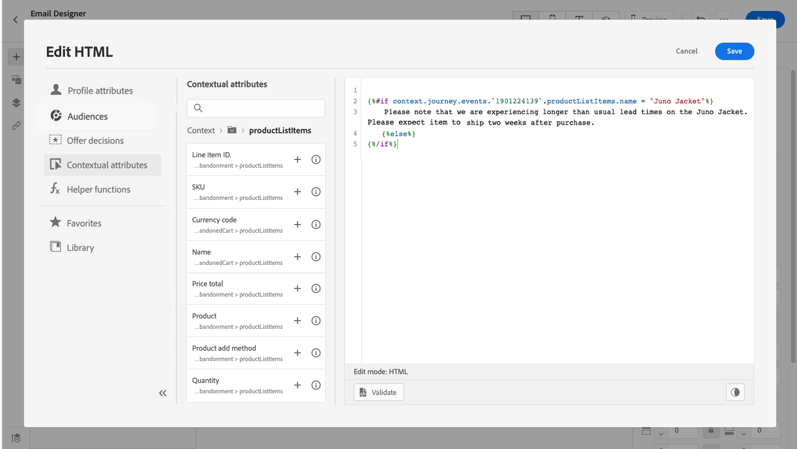
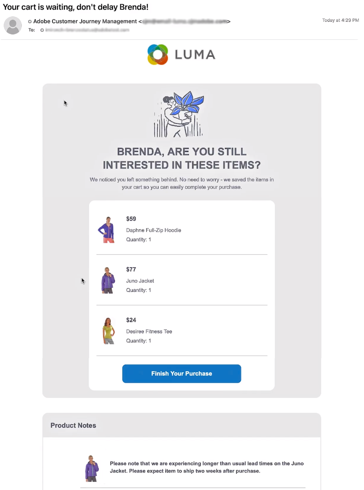

# Caso de uso de personalização: email de abandono do carrinho {#personalization-use-case-helper-functions}

Neste exemplo, você personalizará o corpo de uma mensagem de email. Essa mensagem direciona os clientes que deixaram itens em seu carrinho de compras, mas não concluíram a compra.

Você usará esses tipos de funções de ajuda:

* O `upperCase` função de string, para inserir o nome do cliente em letras maiúsculas. [Saiba mais](functions/string.md#upper).
* O `each` auxiliar, para listar os itens que estão no carrinho. [Saiba mais](functions/helpers.md#each).
* O `if` auxiliar, para inserir uma nota específica do produto se o produto relacionado estiver no carrinho. [Saiba mais](functions/helpers.md#if-function).

<!-- **Context**: personalization based on contextual data from the journey -->

Antes de começar, certifique-se de saber como configurar esses elementos:
* Uma mensagem de email. [Saiba mais](../messages/create-message.md)
* O corpo de um email. [Saiba mais](../messages/create-email-content.md).
* Um evento unitário. [Saiba mais](../event/about-events.md).
* Uma jornada que começa com um evento. [Saiba mais](../building-journeys/using-the-journey-designer.md).

Siga estas etapas:
1. [Criar uma mensagem de email](#configure-email).
1. [Inserir o nome do cliente em maiúsculas](#uppercase-function).
1. [Crie o evento inicial e a jornada](#create-context).
1. [Adicionar o conteúdo do carrinho ao email](#each-helper).
1. [Inserir uma nota específica do produto](#if-helper).
1. [Testar e publicar a jornada](#test-and-publish).

## Etapa 1: Criar o email{#configure-email}

1. Crie ou modifique uma mensagem de email, em seguida, clique em **[!UICONTROL Email Designer]**.
   

1. Na paleta esquerda da página inicial do Designer de email, arraste e solte três componentes da estrutura no corpo da mensagem.

1. Arraste e solte um componente de conteúdo HTML em cada novo componente de estrutura.

   

## Etapa 2: Inserir o nome do cliente em maiúsculas {#uppercase-function}

1. Na página inicial do Designer de email, clique no componente HTML, onde deseja adicionar o nome do cliente.
1. Na barra de ferramentas contextual, clique em **[!UICONTROL Show the source code]**.

   

1. No **[!UICONTROL Edit HTML]** , adicione a `upperCase` função de string:
   1. No menu esquerdo, selecione **[!UICONTROL Helper functions]**.
   1. Use o campo de pesquisa para localizar &quot;maiúsculas&quot;.
   1. Nos resultados da pesquisa, adicione o `upperCase` . Para fazer isso, clique no sinal de adição (+) ao lado de `: string`.

      O editor de expressão mostra esta expressão:

      ```handlebars
      
      ```

      

1. Remova o espaço reservado &quot;string&quot; da expressão.
1. Adicione o token de nome:
   1. No menu esquerdo, selecione **[!UICONTROL Profile attributes]**.
   1. Selecione **[!UICONTROL Person]** > **[!UICONTROL Full name]**.
   1. Adicione o **[!UICONTROL First name]** para a expressão.

      O editor de expressão mostra esta expressão:

      ```handlebars
      
      ```

      

      Saiba mais sobre o tipo de dados do nome da pessoa em [Documentação da Adobe Experience Platform](https://experienceleague.adobe.com/docs/experience-platform/xdm/data-types/person-name.html){target=&quot;_blank&quot;}.

1. Clique em **[!UICONTROL Validate]** e depois em **[!UICONTROL Save]**.

   
1. Salve a mensagem.

## Etapa 3: Crie o evento inicial e a jornada relacionada {#create-context}

O conteúdo do carrinho é uma informação contextual da jornada. Portanto, é necessário adicionar um evento inicial e o email a uma jornada antes de adicionar informações específicas do carrinho ao email.

1. Crie um evento cujo esquema inclua a variável `productListItems` matriz.
1. Defina todos os campos dessa matriz como campos de carga para esse evento.

   Saiba mais sobre o tipo de dados de item da lista de produtos [Documentação do Adobe Experience Platform](https://experienceleague.adobe.com/docs/experience-platform/xdm/data-types/product-list-item.html){target=&quot;_blank&quot;}.

1. Crie uma jornada que comece com esse evento.
1. Adicione a mensagem à jornada.
1. Encerre a jornada com uma atividade final.

   Como você ainda não publicou a mensagem, não é possível testar nem publicar a jornada.

   

1. Clique em **[!UICONTROL OK]**.

   Uma mensagem informa que o contexto da jornada foi passado para a mensagem.

   

## Etapa 4: Inserir a lista de itens do carrinho {#each-helper}

1. Reabra a mensagem.

   

1. Na página inicial do Designer de email, clique no componente HTML, onde deseja listar o conteúdo do carrinho.
1. Na barra de ferramentas contextual, clique em **[!UICONTROL Show the source code]**.

   

1. No **[!UICONTROL Edit HTML]** , adicione a `each` auxiliar:
   1. No menu esquerdo, selecione **[!UICONTROL Helper functions]**.
   1. Use o campo de pesquisa para localizar &quot;cada&quot;.
   1. Nos resultados da pesquisa, adicione o `each` auxiliar.

      O editor de expressão mostra esta expressão:

      ```handlebars
      {{#each someArray as |variable|}} {{/each}}
      ```

      

1. Adicione o `productListItems` para a expressão:

   1. Remova o espaço reservado &quot;someArray&quot; da expressão.
   1. No menu esquerdo, selecione **[!UICONTROL Contextual attributes]**.

      **[!UICONTROL Contextual attributes]** estão disponíveis somente após o contexto da jornada ter sido passado para a mensagem.

   1. Selecionar **[!UICONTROL Journey Orchestration]** > **[!UICONTROL Events]** > ***[!UICONTROL event_name]***, em seguida, expanda a **[!UICONTROL productListItems]** nó .

      Neste exemplo, *event_name* representa o nome do evento.

   1. Adicione o **[!UICONTROL Product]** para a expressão.

      O editor de expressão mostra esta expressão:

      ```handlebars
      {{#each context.journey.events.event_ID.productListItems.product as |variable|}} {{/each}}
      ```
      Neste exemplo, *event_ID* representa a ID do evento.

      

   1. Modifique a expressão:
      1. Remova a string &quot;.product&quot;.
      1. Substitua o espaço reservado &quot;variável&quot; por &quot;produto&quot;.

      Este exemplo mostra a expressão modificada:

      ```handlebars
      {{#each context.journey.events.event_ID.productListItems as |product|}}
      ```
1. Cole este código entre a opção de abertura `{{#each}}` e o fechamento `{/each}}` tag:

   ```html
   <table>
      <tbody>
         <tr>
            <td><b>#name</b></td>
            <td><b>#quantity</b></td>
            <td><b>$#priceTotal</b></td>
         </tr>
      </tbody>
   </table>
   ```

1. Adicione os tokens de personalização para o nome do item, a quantidade e o preço:

   1. Remova o espaço reservado &quot;#name&quot; da tabela HTML.
   1. Nos resultados da pesquisa anterior, adicione o **[!UICONTROL Name]** para a expressão.

   Repita estas etapas duas vezes:
   * Substitua o espaço reservado &quot;#quantity&quot; pelo **[!UICONTROL Quantity]** token.
   * Substitua o espaço reservado &quot;#priceTotal&quot; pelo **[!UICONTROL Total price]** token.

   Este exemplo mostra a expressão modificada:

   ```handlebars
   {{#each context.journey.events.event_ID.productListItems as |product|}}
      <table>
         <tbody>
            <tr>
               <td><b>{{context.journey.events.event_ID.productListItems.name}}</b></td>
               <td><b>{{context.journey.events.event_ID.productListItems.quantity}}</b></td>
               <td><b>${{context.journey.events.event_ID.productListItems.priceTotal}}</b></td>
            </tr>
         </tbody>
      </table>
   {{/each}}
   ```
1. Clique em **[!UICONTROL Validate]** e depois em **[!UICONTROL Save]**.
   

## Etapa 5: Inserir uma nota específica do produto {#if-helper}

1. Na página inicial do Designer de email, clique no componente HTML onde deseja inserir a nota.
1. Na barra de ferramentas contextual, clique em **[!UICONTROL Show the source code]**.

   

1. No **[!UICONTROL Edit HTML]** , adicione a `if` auxiliar:
   1. No menu esquerdo, selecione **[!UICONTROL Helper functions]**.
   1. Use o campo de pesquisa para localizar &quot;if&quot;.
   1. Nos resultados da pesquisa, adicione o `if` auxiliar.

      O editor de expressão mostra esta expressão:

      ```handlebars
       render_1
          render_2
          default_render
      
      ```
      

1. Remova essa condição da expressão:

   ```handlebars
    render_2
   ```

   Este exemplo mostra a expressão modificada:

   ```handlebars
    render_1
       default_render
   
   ```

1. Adicione o token de nome de produto à condição:
   1. Remova o espaço reservado &quot;condition1&quot; da expressão.
   1. No menu esquerdo, selecione **[!UICONTROL Contextual attributes]**.
   1. Selecionar **[!UICONTROL Journey Orchestration]** > **[!UICONTROL Events]** > ***[!UICONTROL event_name]***, em seguida, expanda a **[!UICONTROL productListItems]** nó .

      Neste exemplo, *event_name* representa o nome do evento.

   1. Adicione o **[!UICONTROL Name]** para a expressão.

      O editor de expressão mostra esta expressão:

      ```handlebars
      
         render_1
          default_render
      
      ```
      

1. Modifique a expressão:
   1. No Editor de expressão, especifique o nome do produto após a `name` token.

      Use essa sintaxe, em que *product_name* representa o nome do produto:

      ```javascript
      = "product_name"
      ```

      Neste exemplo, o nome do produto é &quot;Jaqueta de Juno&quot;:

      ```handlebars
      
         render_1
          default_render
      
      ```

   1. Substitua o espaço reservado &quot;render_1&quot; pelo texto da nota.

      Exemplo:

      ```handlebars
      
         Due to longer than usual lead times on the Juno Jacket, please expect item to ship two weeks after purchase.
          default_render
      
      ```
   1. Remova o espaço reservado &quot;default_render&quot; da expressão.
1. Clique em **[!UICONTROL Validate]** e depois em **[!UICONTROL Save]**.

   

1. Salve e publique a mensagem.

## Etapa 6: Testar e publicar a jornada {#test-and-publish}

1. Abra a jornada. Se a jornada já estiver aberta, atualize a página.
1. Ative o **[!UICONTROL Test]** alterne e clique em **[!UICONTROL Trigger an event]**.

   Você pode ativar o modo de teste somente depois de publicar a mensagem.

   

1. No **[!UICONTROL Event configuration]** , insira os valores de entrada e clique em **[!UICONTROL Send]**.

   O modo de teste funciona somente com perfis de teste.

   

   O email é enviado para o endereço do perfil de teste.

   Neste exemplo, o email contém a nota sobre a Jaqueta de Juno porque este produto está no carrinho:

   

1. Verifique se não há erro e publique a jornada.


## Tópicos relacionados {#related-topics}

### Funções de handlebars {#handlebars}

* [Auxiliares](functions/helpers.md)

* [Funções de string](functions/string.md)

### Casos de uso {#use-case}

* [Personalização com informações, contexto e oferta do perfil](personalization-use-case.md)

* [Personalização com oferta baseada em decisões](../offers/offers-e2e.md)

## Tutorial em vídeo{#helper-functions-video}

>[!VIDEO](https://video.tv.adobe.com/v/334244?quality=12)
