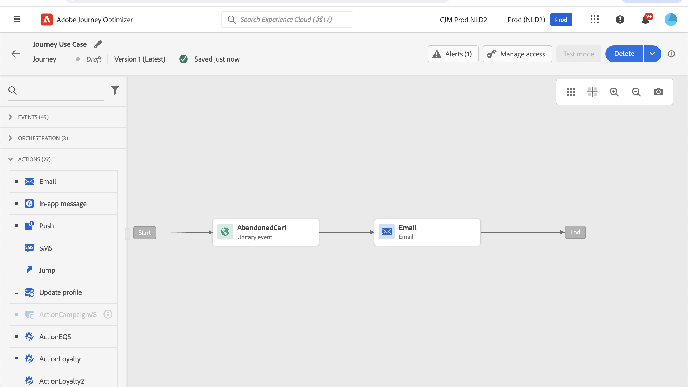
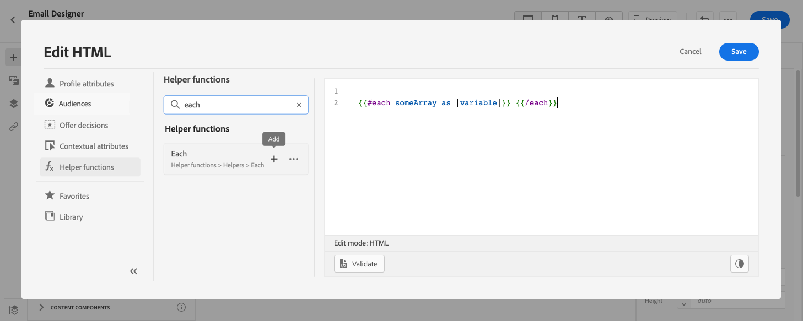
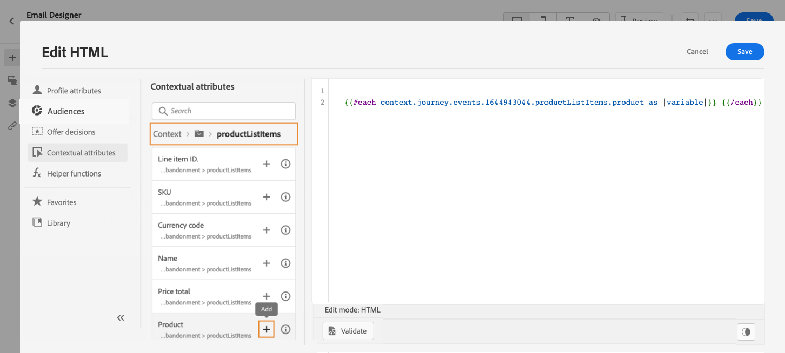
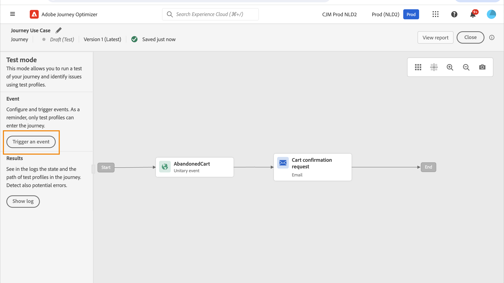

# Caso de uso de personalização: email de abandono de carrinho {#personalization-use-case-helper-functions}

Neste exemplo, você personalizará o corpo de uma mensagem de email. Essa mensagem é direcionada aos clientes que deixaram itens em seus carrinhos de compras, mas não concluíram a compra.

Você usará estes tipos de funções auxiliares:

* A variável `upperCase` função de sequência de caracteres, para inserir o nome do cliente em letras maiúsculas. [Saiba mais](functions/string.md#upper).
* A variável `each` auxiliar, para listar os itens que estão no carrinho. [Saiba mais](functions/helpers.md#each).
* A variável `if` auxiliar, para inserir uma observação específica do produto se o produto relacionado estiver no carrinho. [Saiba mais](functions/helpers.md#if-function).
<!-- **Context**: personalization based on contextual data from the journey -->

➡️ [Saiba como usar funções auxiliares neste vídeo](#video)

Antes de começar, verifique se você sabe como configurar esses elementos:

* Um evento unitário. [Saiba mais](../event/about-events.md).
* Uma jornada que começa com um evento. [Saiba mais](../building-journeys/using-the-journey-designer.md).
* Uma mensagem de email na jornada. [Saiba mais](../email/create-email.md)
* O corpo de um email. [Saiba mais](../email/content-from-scratch.md).

Siga estas etapas:

1. [Criar o evento inicial e a jornada](#create-context).
1. [Criar uma mensagem de email](#configure-email).
1. [Insira o nome do cliente em letras maiúsculas](#uppercase-function).
1. [Adicionar o conteúdo do carrinho ao email](#each-helper).
1. [Inserir uma observação específica do produto](#if-helper).
1. [Testar e publicar a jornada](#test-and-publish).

## Etapa 1: criar o evento inicial e a jornada relacionada {#create-context}

O conteúdo do carrinho é uma informação contextual da jornada. Portanto, você deve adicionar um evento inicial e o email a uma jornada antes de poder adicionar informações específicas do carrinho ao email.

1. Crie um evento cujo esquema inclua a variável `productListItems` matriz.
1. Defina todos os campos dessa matriz como campos de carga para esse evento.

   Saiba mais sobre o tipo de dados do item de lista de produtos no [Documentação do Adobe Experience Platform](https://experienceleague.adobe.com/docs/experience-platform/xdm/data-types/product-list-item.html){target="_blank"}.

1. Crie uma jornada que comece com este evento.
1. Adicionar um **E-mail** atividade para a jornada.

   

## Etapa 2: criar o email{#configure-email}

1. No **E-mail** atividade, clique em **[!UICONTROL Editar conteúdo]** e, em seguida, clique em **[!UICONTROL Email Designer]**.

   

1. Na paleta esquerda da página inicial do Email Designer, arraste e solte três componentes de estrutura no corpo da mensagem.

1. Arraste e solte um componente de conteúdo de HTML em cada novo componente de estrutura.

   

## Etapa 3: insira o nome do cliente em letras maiúsculas {#uppercase-function}

1. Na página inicial do Designer de email, clique no componente de HTML onde deseja adicionar o nome do cliente.
1. Na barra de ferramentas contextual, clique em **[!UICONTROL Mostrar o código-fonte]**.

   

1. No **[!UICONTROL Editar HTML]** adicione a `upperCase` função de sequência:
   1. No menu esquerdo, selecione **[!UICONTROL Funções auxiliares]**.
   1. Use o campo de pesquisa para localizar &quot;caixa alta&quot;.
   1. Nos resultados da pesquisa, adicione a variável `upperCase` função. Para fazer isso, clique no sinal de adição (+) ao lado de `: string`.

      O editor de expressão mostra esta expressão:

      ```handlebars
      
      ```

      

1. Remova o espaço reservado &quot;string&quot; da expressão.
1. Adicione o token de nome:
   1. No menu esquerdo, selecione **[!UICONTROL Atributos do perfil]**.
   1. Selecionar **[!UICONTROL Person]** > **[!UICONTROL Nome completo]**.
   1. Adicione o **[!UICONTROL Nome]** à expressão.

      O editor de expressão mostra esta expressão:

      ```handlebars
      
      ```

      

      Saiba mais sobre o tipo de dados do nome da pessoa no [Documentação da Adobe Experience Platform](https://experienceleague.adobe.com/docs/experience-platform/xdm/data-types/person-name.html){target="_blank"}.

1. Clique em **[!UICONTROL Validar]** e, em seguida, clique em **[!UICONTROL Salvar]**.

   

1. Salve a mensagem.

## Etapa 4: inserir a lista de itens do carrinho {#each-helper}

1. Reabra o conteúdo da mensagem.

1. Na página inicial do Designer de email, clique no componente HTML onde deseja listar o conteúdo do carrinho.
1. Na barra de ferramentas contextual, clique em **[!UICONTROL Mostrar o código-fonte]**.

   

1. No **[!UICONTROL Editar HTML]** adicione a `each` auxiliar:
   1. No menu esquerdo, selecione **[!UICONTROL Funções auxiliares]**.
   1. Use o campo de pesquisa para localizar &quot;cada&quot;.
   1. Nos resultados da pesquisa, adicione a variável `each` auxiliar.

      O editor de expressão mostra esta expressão:

      ```handlebars
      {{#each someArray as |variable|}} {{/each}}
      ```

      

1. Adicione o `productListItems` matriz para a expressão:

   1. Remova o espaço reservado &quot;someArray&quot; da expressão.
   1. No menu esquerdo, selecione **[!UICONTROL Atributos contextuais]**.

      **[!UICONTROL Atributos contextuais]** estão disponíveis somente após o contexto de jornada ter sido passado para a mensagem.

   1. Selecionar **[!UICONTROL Journey Optimizer]** > **[!UICONTROL Eventos]** > ***[!UICONTROL event_name]***, em seguida expanda a variável **[!UICONTROL productListItems]** nó.

      Neste exemplo, *event_name* representa o nome do evento.

   1. Adicione o **[!UICONTROL Produto]** à expressão.

      O editor de expressão mostra esta expressão:

      ```handlebars
      {{#each context.journey.events.event_ID.productListItems.product as |variable|}} {{/each}}
      ```

      Neste exemplo, *event_ID* representa a ID do evento.

      

   1. Modifique a expressão:
      1. Remova a string &quot;.product&quot;.
      1. Substitua o espaço reservado &quot;variável&quot; por &quot;produto&quot;.

      Este exemplo mostra a expressão modificada:

      ```handlebars
      {{#each context.journey.events.event_ID.productListItems as |product|}}
      ```

1. Cole esse código entre a tag de abertura `{{#each}}` e o fechamento `{/each}}` tag:

   ```html
   <table>
      <tbody>
         <tr>
            <td><b>#name</b></td>
            <td><b>#quantity</b></td>
            <td><b>$#priceTotal</b></td>
         </tr>
      </tbody>
   </table>
   ```

1. Adicione os tokens de personalização para o nome do item, a quantidade e o preço:

   1. Remova o espaço reservado &quot;#name&quot; da tabela de HTML.
   1. A partir dos resultados da pesquisa anterior, adicione o **[!UICONTROL Nome]** à expressão.

   Repita essas etapas duas vezes:

   * Substitua o espaço reservado &quot;#quantity&quot; pelo **[!UICONTROL Quantidade]** token.
   * Substitua o espaço reservado &quot;#priceTotal&quot; pelo **[!UICONTROL Preço total]** token.

   Este exemplo mostra a expressão modificada:

   ```handlebars
   {{#each context.journey.events.event_ID.productListItems as |product|}}
      <table>
         <tbody>
            <tr>
               <td><b>{{context.journey.events.event_ID.productListItems.name}}</b></td>
               <td><b>{{context.journey.events.event_ID.productListItems.quantity}}</b></td>
               <td><b>${{context.journey.events.event_ID.productListItems.priceTotal}}</b></td>
            </tr>
         </tbody>
      </table>
   {{/each}}
   ```

1. Clique em **[!UICONTROL Validar]** e, em seguida, clique em **[!UICONTROL Salvar]**.

   

## Etapa 5: inserir uma observação específica do produto {#if-helper}

1. Na página inicial do Designer de email, clique no componente de HTML onde deseja inserir a nota.
1. Na barra de ferramentas contextual, clique em **[!UICONTROL Mostrar o código-fonte]**.

   

1. No **[!UICONTROL Editar HTML]** adicione a `if` auxiliar:
   1. No menu esquerdo, selecione **[!UICONTROL Funções auxiliares]**.
   1. Use o campo de pesquisa para localizar &quot;if&quot;.
   1. Nos resultados da pesquisa, adicione a variável `if` auxiliar.

      O editor de expressão mostra esta expressão:

      ```handlebars
       render_1
          render_2
          default_render
      
      ```

      

1. Remova essa condição da expressão:

   ```handlebars
    render_2
   ```

   Este exemplo mostra a expressão modificada:

   ```handlebars
    render_1
       default_render
   
   ```

1. Adicione o token do nome do produto à condição:
   1. Remova o espaço reservado &quot;condition1&quot; da expressão.
   1. No menu esquerdo, selecione **[!UICONTROL Atributos contextuais]**.
   1. Selecionar **[!UICONTROL Journey Orchestration]** > **[!UICONTROL Eventos]** > ***[!UICONTROL event_name]***, em seguida expanda a variável **[!UICONTROL productListItems]** nó.

      Neste exemplo, *event_name* representa o nome do evento.

   1. Adicione o **[!UICONTROL Nome]** à expressão.

      O editor de expressão mostra esta expressão:

      ```handlebars
      
         render_1
          default_render
      
      ```

      

1. Modifique a expressão:
   1. No Editor de expressão, especifique o nome do produto após a tag `name` token.

      Use esta sintaxe, onde *product_name* representa o nome do seu produto:

      ```javascript
      = "product_name"
      ```

      Neste exemplo, o nome do produto é &quot;Juno Jacket&quot;:

      ```handlebars
      
         render_1
          default_render
      
      ```

   1. Substitua o espaço reservado &quot;render_1&quot; pelo texto da nota.

      Exemplo:

      ```handlebars
      
         Due to longer than usual lead times on the Juno Jacket, please expect item to ship two weeks after purchase.
          default_render
      
      ```

   1. Remova o espaço reservado &quot;default_render&quot; da expressão.
1. Clique em **[!UICONTROL Validar]** e, em seguida, clique em **[!UICONTROL Salvar]**.

   

1. Salve a mensagem.

## Etapa 6: testar e publicar a jornada {#test-and-publish}

1. Ativar o **[!UICONTROL Teste]** alterne e clique em **[!UICONTROL Acionar um evento]**.

   

1. No **[!UICONTROL Configuração do evento]** insira os valores de entrada e clique em **[!UICONTROL Enviar]**.

   O modo de teste funciona somente com perfis de teste.

   

   O email é enviado para o endereço do perfil de teste.

   Neste exemplo, o email contém a observação sobre o Juno Jacket porque este produto está no carrinho:

   

1. Verifique se não há erros e publique a jornada.


## Tópicos relacionados {#related-topics}

### Funções Handlebars {#handlebars}

* [Auxiliares](functions/helpers.md)

* [Funções de string](functions/string.md)

### Casos de uso {#use-case}

* [Personalização com informações de perfil, contexto e oferta](personalization-use-case.md)

* [Personalização com oferta baseada em decisão](../offers/offers-e2e.md)

## Vídeo tutorial{#video}

Saiba como usar funções auxiliares.

>[!VIDEO](https://video.tv.adobe.com/v/334244?quality=12)
