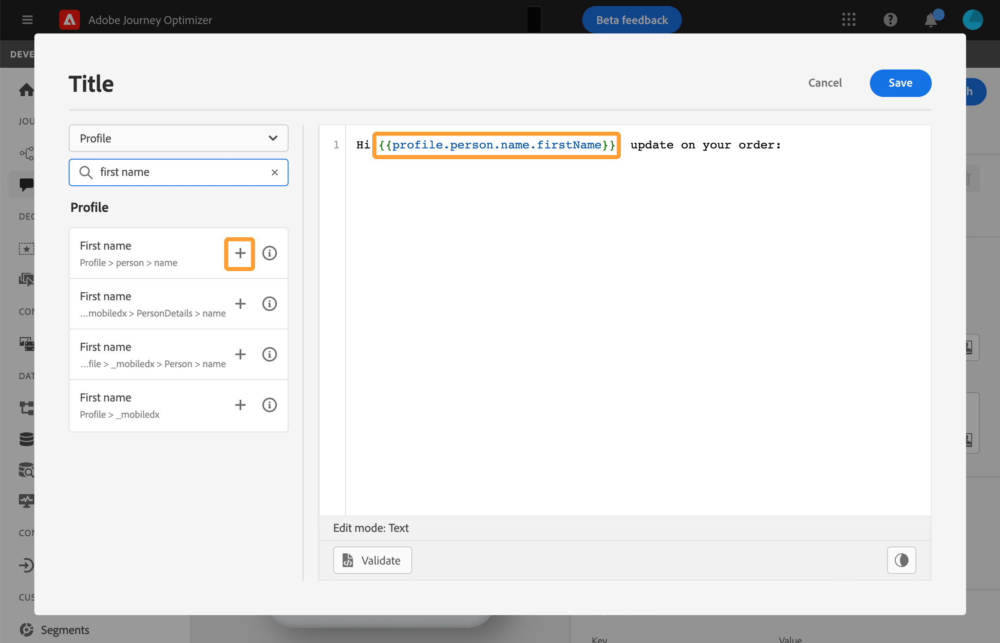
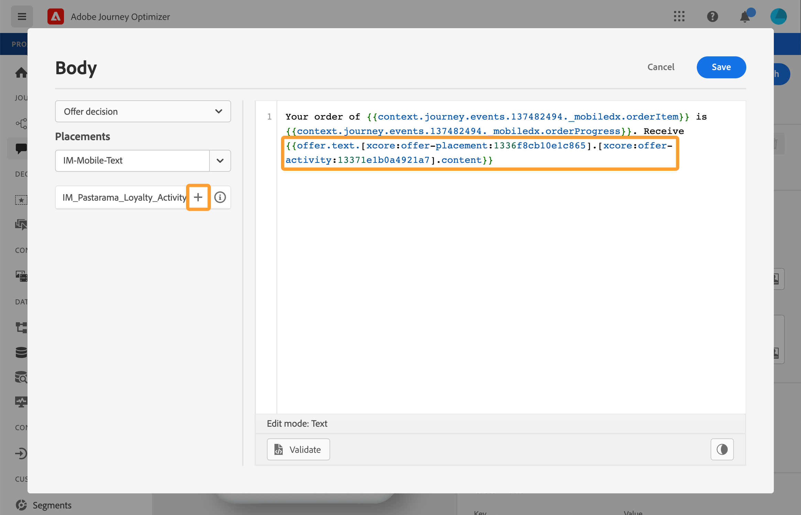
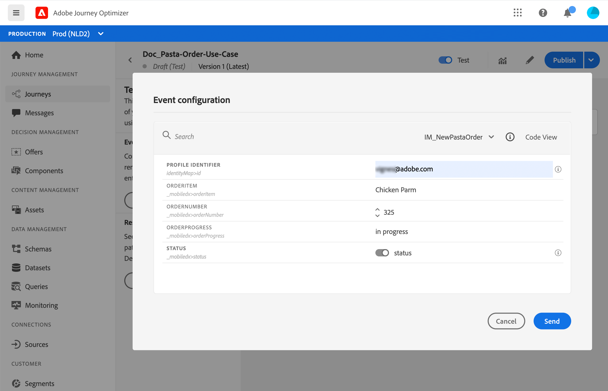

# Caso de uso do Personalization: notificação de status do pedido {#personalization-use-case}

>[!BEGINSHADEBOX]

**Nesta página:** siga um caso de uso de status de pedido que combine dados de perfil, decisão de oferta e jornada contextual para personalizar uma notificação por push no Adobe Journey Optimizer.

>[!ENDSHADEBOX]

Nesse caso de uso, você verá como usar vários tipos de personalização em uma única mensagem de notificação por push. Serão usados três tipos de personalização:

* **Perfil**: personalização da mensagem com base em um campo de perfil
* **Decisão de oferta**: personalização baseada em variáveis de gestão de decisões
* **Contexto**: personalização baseada em dados contextuais da jornada

O objetivo deste exemplo é encaminhar um evento para [!DNL Journey Optimizer] toda vez que um pedido de cliente for atualizado. Em seguida, uma notificação por push é enviada ao cliente com informações sobre o pedido e uma oferta personalizada.

Para esse caso de uso, os seguintes pré-requisitos são necessários:

* configurar um evento de pedido incluindo o número do pedido, o status e o nome do item. Consulte esta [seção](../event/about-events.md).
* crie uma decisão, consulte esta [seção](../offers/offer-activities/create-offer-activities.md).

➡️ [Descubra um caso de uso semelhante no vídeo](#video)

## Etapa 1 - Criar a jornada {#create-journey}

1. Clique no menu **[!UICONTROL Jornadas]** e crie uma nova jornada.

   

1. Adicione o evento de entrada e uma atividade de ação **Push**.

   

1. Configurar e projetar a mensagem de notificação por push. Consulte esta [seção](../push/create-push.md).

## Etapa 2 - Adicionar personalização ao perfil {#add-perso}

1. Na atividade **Push**, clique em **Editar conteúdo**.

1. Clique no campo **Título**.

   

1. Insira o assunto e adicione personalização do perfil. Use a barra de pesquisa para localizar o campo de nome do perfil. No texto do assunto, coloque o cursor onde deseja inserir o campo de personalização e clique no ícone **+**. Clique em **Salvar**.

   

## Etapa 3 - Adicionar personalização em dados contextuais {#add-perso-contextual-data}

1. Na atividade **Push**, clique em **Editar conteúdo** e no campo **Título**.

   

1. Selecione o menu **Atributos contextuais**. Os atributos contextuais só estarão disponíveis se uma jornada tiver passado dados contextuais para a mensagem. Clique em **Journey Orchestration**. As seguintes informações contextuais são exibidas:

   * **Eventos**: esta categoria reagrupa todos os campos dos eventos colocados antes da atividade de ação de canal na jornada.
   * **Propriedades da Jornada**: os campos técnicos relacionados à jornada para um determinado perfil, por exemplo, a ID da jornada ou os erros específicos encontrados. Saiba mais em [documentação do Journey Orchestration](../building-journeys/expression/journey-properties.md).

   

1. Expanda o item **Eventos** e procure o campo de número do pedido relacionado ao seu evento. Você também pode usar a caixa de pesquisa. Clique no ícone **+** para inserir o campo de personalização no texto do assunto. Clique em **Salvar**.

   

1. Agora clique no campo **Corpo**.

   

1. Digite a mensagem e insira, no menu **[!UICONTROL Atributos contextuais]**, o nome do item do pedido e o andamento do pedido.

   

1. No menu esquerdo, selecione **Offer Decisions** para inserir uma variável de decisão. Selecione o posicionamento e clique no ícone **+** ao lado da decisão de adicioná-lo ao corpo.

   

1. Clique em validar para verificar se não há erros e clique em **Salvar**.

   

## Etapa 4 — testar e publicar a jornada {#test-publish}

1. Clique no botão **Testar** e em **Acionar um evento**.

   

1. Insira os diferentes valores para passar no teste. O modo de teste funciona somente com perfis de teste. O identificador de perfil precisa corresponder a um perfil de teste. Clique em **Enviar**.

   

   A notificação por push é enviada e exibida no celular do perfil de teste.

   

1. Verifique se não há erros e publique a jornada.

## Vídeo tutorial {#video}

O vídeo abaixo mostra um caso de uso semelhante que utiliza dados contextuais de uma jornada para personalizar um email.

>[!VIDEO](https://video.tv.adobe.com/v/3425027?quality=12)

## Referência rápida {#quick-reference}

Esta seção contém conhecimento estruturado destinado a oferecer suporte à interpretação, recuperação e resposta a perguntas relacionadas a este tópico.

Para uma compreensão completa, essas informações devem ser combinadas com a documentação desta página. Nenhuma das origens deve ser independente; a página descreve o recurso, enquanto esta seção fornece um contexto adicional que ajuda a desfazer a ambiguidade da terminologia, intenção, aplicabilidade e restrições.

>[!BEGINTABS]

>[!TAB Visão geral]

**TL;DR**

Esta página aborda um caso de uso de notificação por push do status do pedido que combina três tipos de personalização — campo de perfil, decisão de oferta e dados de jornada contextuais — em uma única mensagem.

**Intenções**

* Criar uma jornada com um evento de pedido e uma atividade de ação de push
* Adicionar personalização baseada em perfil (nome do cliente) ao título de push
* Adicionar personalização de dados contextuais (número do pedido, nome do item, andamento do pedido) do evento de jornada
* Adicionar personalização da decisão de oferta ao corpo do push
* Testar a jornada no modo de teste e publicar

>[!TAB Glossário]

* **Personalização do perfil**: Personalization com base em um campo de perfil, como nome, acessado por meio de `profile.*` atributos. *(específico do produto)*
* **Offer decision**: Personalization com base em variáveis de gestão de decisões; inserido no menu Offer Decisions, no editor de personalização. *(específico do produto)*
* **Personalização contextual**: Personalization com base nos dados da jornada — campos de evento (por exemplo, número do pedido, nome do item, andamento do pedido) e propriedades da jornada (por exemplo, ID da jornada, erros). Disponível somente quando uma jornada tiver passado dados contextuais para a mensagem. *(específico do produto)*
* **Propriedades da Jornada**: campos técnicos relacionados à jornada de um determinado perfil, como ID da jornada ou erros encontrados, acessíveis em Atributos contextuais > Journey Orchestration. *(específico do produto)*

>[!TAB Terminologia]

* **Nome canônico:** personalização contextual — variantes: personalização baseada em contexto, personalização de contexto de jornada
* **Sinônimos:** &quot;Journey Orchestration&quot; (rótulo da interface do usuário no menu Atributos contextuais) = fonte de dados de jornada contextual
* **Não confunda:** Personalização de perfil (valores de campo de perfil estáticos, sempre disponíveis) ≠ Personalização contextual (dados de eventos e propriedades de jornada, disponíveis somente após o contexto de jornada ter sido passado para a mensagem) ≠ Personalização da decisão de oferta (variáveis de gestão de decisão)

>[!TAB Medidas de proteção e limitações]

* Os atributos contextuais estão disponíveis no editor de personalização somente se uma jornada tiver passado dados contextuais para a mensagem.
* O modo de teste funciona somente com perfis de teste; o identificador de perfil inserido na configuração do evento deve corresponder a um perfil de teste existente.

>[!TAB Perguntas frequentes]

**P: Quais são os três tipos de personalização combinados neste caso de uso?**

Personalização de perfil (nome do cliente de `profile.*`), personalização de dados contextuais (número do pedido, nome do item e progresso do pedido do evento de jornada) e personalização de decisões de oferta (uma oferta de gestão de decisões inserida no corpo).

**P: De onde vêm os atributos contextuais no editor de personalização?**

Os atributos contextuais vêm de eventos colocados antes da atividade de ação de canal na jornada e das propriedades técnicas da jornada. Eles aparecem no editor de personalização em Atributos contextuais > Journey Orchestration > Eventos (campos de evento) ou Propriedades da Jornada (metadados da jornada).

**P: Quais são os pré-requisitos para este caso de uso?**

Um evento de pedido deve ser configurado com campos de número do pedido, status e nome do item, e uma decisão deve existir na gestão de decisões.

**P: Como faço para testar a notificação por push neste caso de uso?**

Clique no botão Testar na jornada, em seguida, clique em &quot;Acionar um evento&quot; e insira os valores do evento na janela Configuração do evento. O modo de teste funciona somente com perfis de teste; o identificador do perfil deve corresponder a um perfil de teste existente.

>[!ENDTABS]

<!-- ai-section-version: 1 | source-hash: ae5284c7 -->
