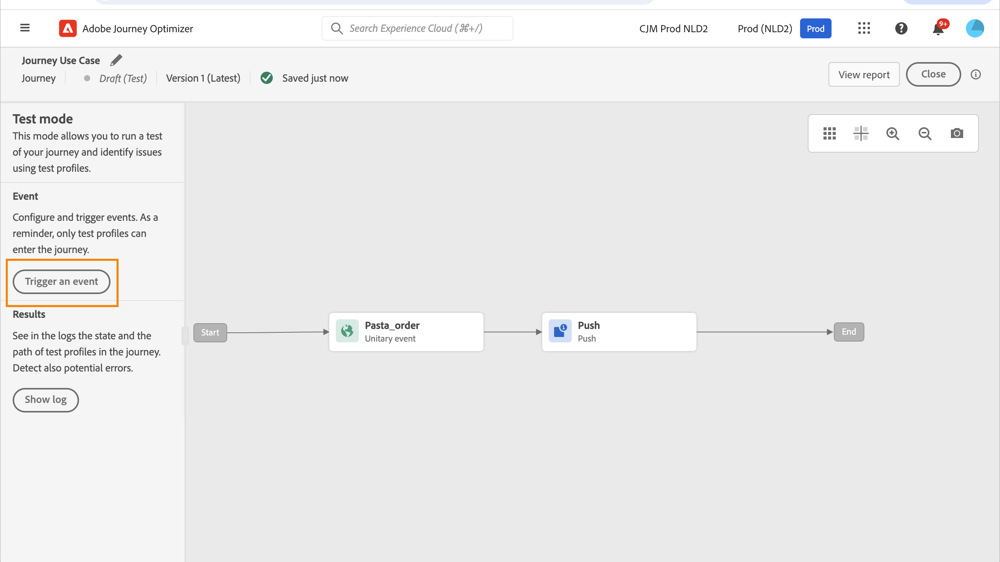

# Caso de uso de personalização: notificação de status do pedido {#personalization-use-case}

Nesse caso de uso, você verá como usar vários tipos de personalização em uma única mensagem de notificação por push. Serão usados três tipos de personalização:

* **Perfil**: personalização da mensagem com base em um campo de perfil
* **Decisão de oferta**: personalização com base em variáveis de gestão de decisões
* **Contexto**: personalização com base em dados contextuais da jornada

O objetivo deste exemplo é enviar um evento para [!DNL Journey Optimizer] toda vez que um pedido de cliente é atualizado. Em seguida, uma notificação por push é enviada ao cliente com informações sobre o pedido e uma oferta personalizada.

Para esse caso de uso, os seguintes pré-requisitos são necessários:

* configurar um evento de pedido incluindo o número do pedido, o status e o nome do item. Consulte esta [seção](../event/about-events.md).
* criar uma decisão, consulte esta [seção](../offers/offer-activities/create-offer-activities.md).

## Etapa 1 - Criar a jornada {#create-journey}

1. Clique em **[!UICONTROL Jornadas]** e crie uma nova jornada.

   

1. Adicione o evento de entrada e uma **Push** atividade de ação.

   

1. Configurar e projetar a mensagem de notificação por push. Consulte esta [seção](../push/create-push.md).

## Etapa 2 - Adicionar personalização ao perfil {#add-perso}

1. No **Push** atividade, clique em **Editar conteúdo**.

1. Clique em **Título** campo.

   

1. Insira o assunto e adicione personalização do perfil. Use a barra de pesquisa para localizar o campo de nome do perfil. No texto do assunto, coloque o cursor onde deseja inserir o campo de personalização e clique no **+** ícone. Clique em **Salvar**.

   

## Etapa 3 - Adicionar personalização em dados contextuais {#add-perso-contextual-data}

1. No **Push** atividade, clique em **Editar conteúdo** e clique no link **Título** campo.

   

1. Selecione o **Atributos contextuais** menu. Os atributos contextuais só estarão disponíveis se uma jornada tiver passado dados contextuais para a mensagem. Clique em **Journey Orchestration**. As seguintes informações contextuais são exibidas:

   * **Eventos**: esta categoria reagrupa todos os campos do(s) evento(s) colocado(s) antes da atividade de ação de canal na jornada.
   * **Jornada propriedades**: os campos técnicos relacionados à jornada para um determinado perfil, por exemplo, a ID da jornada ou os erros específicos encontrados. Saiba mais em [Documentação do Journey Orchestration](../building-journeys/expression/journey-properties.md).

   

1. Expanda a **Eventos** e procure o campo de número do pedido relacionado ao seu evento. Você também pode usar a caixa de pesquisa. Clique em **+** ícone para inserir o campo de personalização no texto do assunto. Clique em **Salvar**.

   

1. Em seguida, clique no link **Corpo** campo.

   

1. Digite a mensagem e insira, no campo **[!UICONTROL Atributos contextuais]** o nome do item da ordem e o andamento da ordem.

   

1. No menu esquerdo, selecione **Decisões de oferta** para inserir uma variável de decisão. Selecione o posicionamento e clique no botão **+** ícone ao lado da decisão de adicioná-lo ao corpo.

   

1. Clique em validar para verificar se não há erros e clique em **Salvar**.

   

## Etapa 4 — testar e publicar a jornada {#test-publish}

1. Clique em **Teste** e clique em **Acionar um evento**.

   

1. Insira os diferentes valores para passar no teste. O modo de teste funciona somente com perfis de teste. O identificador de perfil precisa corresponder a um perfil de teste. Clique em **Enviar**.

   

   A notificação por push é enviada e exibida no celular do perfil de teste.

   

1. Verifique se não há erros e publique a jornada.
