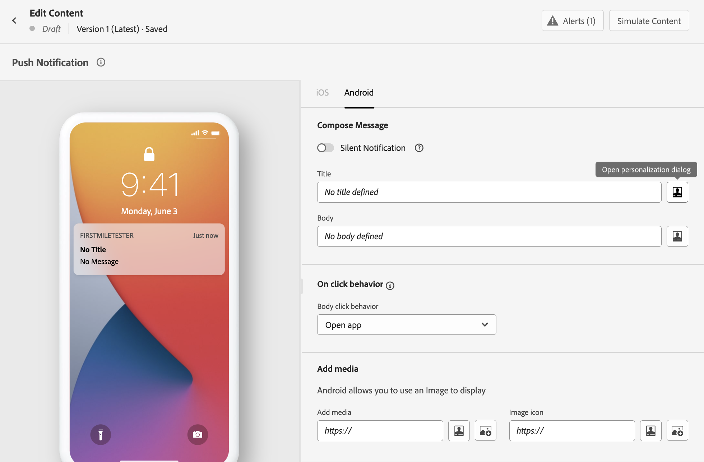

# Caso de uso de personalização {#personalization-use-case}

Nesse caso de uso, você verá como usar vários tipos de personalização em uma única mensagem de notificação por push. Serão usados três tipos de personalização:

* Perfil: personalização de mensagem com base em um campo de perfil
* Decisão da oferta: personalização com base em variáveis de decisão de oferta
* Contexto: personalização com base em dados contextuais da jornada

O objetivo deste exemplo é enviar um evento para a Journey Optimizer sempre que um pedido de cliente for atualizado. Em seguida, uma notificação por push é enviada ao cliente com informações sobre o pedido e uma oferta personalizada.

Para esse caso de uso, os seguintes pré-requisitos são necessários:

* crie e crie uma mensagem de notificação por push, sem publicá-la. Consulte esta [seção](../create-message.md).
* configure um evento de pedido incluindo o número do pedido, o status e o nome do item. Consulte esta [seção](../event/about-events.md).
* crie uma decisão (anteriormente conhecida como &quot;atividade de oferta&quot;), consulte esta [seção](../offers/offer-activities/create-offer-activities.md).

## Etapa 1 - Adicionar personalização ao perfil

1. Clique no menu **[!UICONTROL Message]** e selecione a mensagem.

   

1. Clique no campo **Title**.

   

1. Digite o assunto e adicione a personalização do perfil. Use a barra de pesquisa para localizar o campo de nome do perfil. No texto do assunto, coloque o cursor onde deseja inserir o campo de personalização e clique no ícone **+**. Clique em **Salvar**.

   

   >[!NOTE]
   >
   >Deixe a mensagem em rascunho. Não o publique ainda.

## Etapa 2 - Criar a jornada

1. Clique no menu **[!UICONTROL Journeys]** e crie uma nova jornada.

   

1. Adicione o evento de entrada, uma atividade **Message** e uma atividade **End**.

   

1. Na atividade **Message**, selecione a mensagem criada anteriormente. Clique em **Ok**.

   

   Uma mensagem é exibida para informá-lo que os dados do evento de entrada e as propriedades da jornada foram passados para a mensagem.

   

   >[!NOTE]
   >
   >A mensagem é exibida com um ícone de aviso. Isso ocorre porque a mensagem ainda não foi publicada.

## Etapa 3 - Adicionar personalização aos dados contextuais

1. Na atividade **Message**, clique no ícone **Open the message**. A mensagem é aberta em uma nova guia.

   

1. Clique no campo **Title**.

   

1. Selecione a categoria **Contexto**. Esse item só estará disponível se uma jornada tiver passado dados contextuais para a mensagem. Clique em **Journey Orchestration**. As seguintes informações contextuais são exibidas:

   * **Eventos**: esta categoria agrupa todos os campos do(s) evento(s) colocado(s) antes da atividade  **** Mensagem na jornada.
   * **Propriedades** da Jornada: os campos técnicos relacionados à jornada de um determinado perfil, por exemplo, a ID da jornada ou os erros específicos encontrados. Consulte a [documentação do Journey Orchestration](https://experienceleague.adobe.com/docs/journeys/using/building-advanced-conditions-journeys/syntax/journey-properties.html#building-advanced-conditions-journeys).

   

1. Expanda o item **Events** e procure o campo do número do pedido relacionado ao seu evento. Também é possível usar a caixa de pesquisa. Clique no ícone **+** para inserir o campo de personalização no texto do assunto. Clique em **Salvar**.

   

1. Em seguida, clique no campo **Body**.

   

1. Digite a mensagem e insira, na categoria **Contexto**, o nome do item da ordem e o andamento da ordem.

   

1. Na lista suspensa , selecione **Offer decision** para inserir uma variável de offer decisioning. Selecione a disposição e clique no ícone **+** ao lado da decisão (anteriormente conhecida como &#39;atividade de oferta&#39;) para adicioná-la ao corpo.

   

1. Clique em validar para garantir que não haja erros e clique em **Salvar**.

   

1. Agora, publique a mensagem.

   

## Etapa 4 - Testar e publicar a jornada

1. Abra a jornada novamente. Se a jornada já estiver aberta, atualize a página. Agora que a mensagem foi publicada, você pode ver que não há erro na jornada. Clique no botão **Testar** e, em seguida, clique em **Acionar um evento**.

   

1. Insira os diferentes valores a serem aprovados no teste. O modo de teste só funciona com perfis de teste. O identificador de perfil precisa corresponder a um perfil de teste. Clique em **Enviar**.

   

   A notificação por push é enviada e exibida no celular do perfil de teste.

   

1. Verifique se não há erro e publique a jornada.

