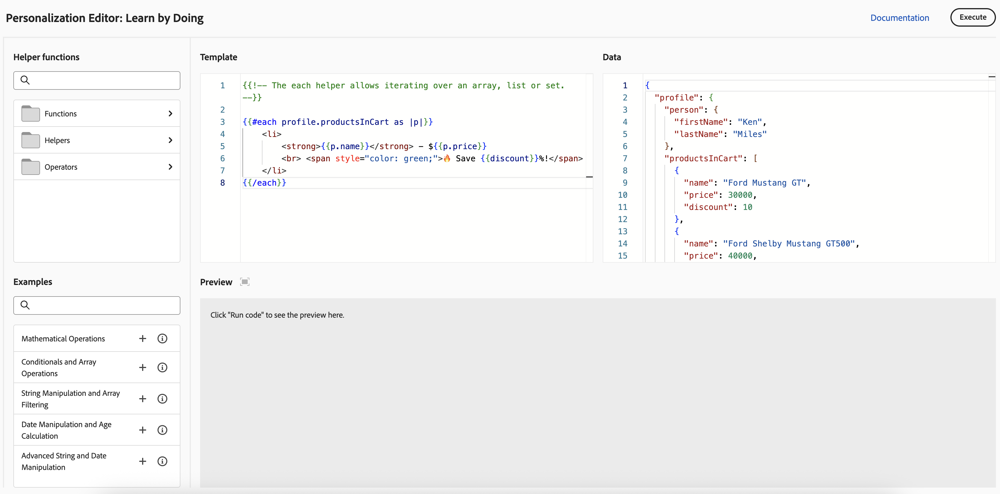

# Introdução à personalização{#add-personalization}

>[!BEGINSHADEBOX]

**Nesta página:** Introdução à personalização no Adobe Journey Optimizer, incluindo como o editor de personalização funciona, os dados de perfil que você pode usar, o playground de aprendizado e a edição em linha.

>[!ENDSHADEBOX]

>[!CONTEXTUALHELP]
>id="ajo_homepage_card5"
>title="Personalizar experiências"
>abstract="Use o **Adobe Journey Optimizer** para adaptar as mensagens a cada destinatário, aproveitando seus dados e informações. Esses dados podem ser: nome, interesses, onde vivem, o que compraram etc."

Os recursos de personalização do [!DNL Adobe Journey Optimizer] permitem que você adapte suas mensagens a cada recipient específico, aproveitando os dados e as informações que você tem sobre eles. Esses dados podem ser: nome, interesses, onde vivem, o que compraram etc.

## Como a personalização funciona

Usando o **editor de personalização**, você pode selecionar, organizar, personalizar e validar todos os dados para criar uma personalização personalizada para o seu conteúdo e aproveitar várias ferramentas, como funções auxiliares ou expressões predefinidas, para personalizar mensagens com eficiência.

O Journey Optimizer emprega uma sintaxe de personalização em linha com base em Handlebars que permite criar expressões com conteúdo delimitado por chaves duplas **`{{}}`**.

Ao processar a mensagem, o Journey Optimizer substitui a expressão pelos dados contidos no conjunto de dados do Experience Platform. Por exemplo, `Hello {{profile.person.name.firstName}} {{profile.person.name.lastName}}` torna-se dinamicamente `Hello John Doe`. Usando essa sintaxe, você pode personalizar mensagens em vários campos, incluindo linhas de assunto de email, corpos de mensagens, notificações por push ou URLs.

## Dados usados para personalização

O Personalization é baseado nos dados de perfil gerenciados pelo esquema **Perfil Individual XDM** definido no Adobe Experience Platform. O esquema **Perfil Individual XDM** é o único esquema que você pode usar para personalizar conteúdo em [!DNL Journey Optimizer]. Saiba mais na [documentação do Adobe Experience Platform Data Model (XDM)](https://experienceleague.adobe.com/docs/experience-platform/xdm/home.html?lang=pt-BR){target="_blank"}.

Você também pode aproveitar os **atributos computados** para personalizar seu conteúdo. Os atributos computados permitem resumir eventos comportamentais individuais em atributos de perfil computados disponíveis no Adobe Experience Platform. [Saiba como trabalhar com atributos computados](../audience/computed-attributes.md)

Além disso, o [!DNL Journey Optimizer] permite que você aproveite os dados do Adobe Experience Platform no editor de personalização para personalizar seu conteúdo. Para fazer isso, os conjuntos de dados necessários para a personalização da pesquisa devem primeiro ser habilitados por meio de uma chamada de API. Depois de concluído, você pode usar os dados para personalizar o conteúdo no Journey Optimizer. No momento, esse recurso está disponível na versão beta. [Saiba mais](../personalization/aep-data-perso.md)

## Aprender e experimentar com personalização {#playground}

O **[!DNL Adobe Journey Optimizer]** inclui uma ferramenta interativa projetada para ajudá-lo a aprender e experimentar os recursos de personalização.

Esse playground fornece um ambiente simulado para gravar e testar o código de personalização usando dados de amostra sem exigir conjuntos de dados em tempo real. Você pode aproveitar amostras de código predefinidas, editar cargas de perfil fictícias e visualizar a saída do seu código de personalização em tempo real.

➡️ [Acessar o playground de personalização](https://experienceleague.adobe.com/en/apps/journey-optimizer/ajo-personalization){target="_blank"}

## Assistente de IA para expressões de personalização {#ai-personalization-expressions}

No **[!UICONTROL Editor do Personalization]** ou na barra de ferramentas do Designer de email (**[!UICONTROL Adicionar expressão]**), o **[!UICONTROL Assistente de IA]** ajuda a gerar novas expressões a partir da linguagem natural, explicar o que o código existente faz, corrigir problemas em uma seleção e, em seguida, aplicar a saída quando ela corresponder à sua intenção.

➡️ [Saiba como trabalhar com o Assistente de IA para expressões Personalization](../content-management/generative-personalization-expressions.md)

## Edição em linha de atributos de perfil {#inline-personalization}

Você pode inserir expressões de atributo de perfil diretamente ao editar conteúdo no **Designer de email** ou no editor do **canal de push**, sem abrir o editor de personalização completo.

Para fazer isso, siga estes passos:

1. Digite `{{` em qualquer campo de texto. Uma lista suspensa de preenchimento automático em linha é aberta na posição do cursor.
1. Comece a digitar para filtrar os atributos de perfil disponíveis.
1. Selecione o atributo necessário — ele é inserido como um token de personalização na posição do cursor.

## Vamos nos aprofundar um pouco mais

Agora que você conhece a personalização no **[!DNL Journey Optimizer]**, é hora de se aprofundar nessas seções de documentação para começar a trabalhar com o recurso.

<table style="table-layout:fixed"><tr style="border: 0;">
<td>

<a href="personalization-build-expressions.md"><strong>Adicionar personalização</strong></a>

</td>
<td>

<a href="../personalization/personalization-syntax.md"><strong>Sintaxe do Personalization</strong>

</td>
<td>

<a href="../personalization/functions/functions.md"><strong>Lista de funções auxiliares</strong></a>

</td>
<td>

<a href="../personalization/personalization-recipes.md"><strong>Receitas do Personalization</strong></a>

</td>
<td>

<a href="../personalization/personalization-use-case.md"><strong>Casos de uso do Personalization</strong></a>

</td>
</tr></table>

## Vídeos tutoriais{#video-perso}

Saiba como usar informações de evento contextual de uma jornada para personalizar uma mensagem.

>[!VIDEO](https://video.tv.adobe.com/v/334165?quality=12)

Saiba como adicionar personalização baseada em perfil a uma mensagem e como usar a associação de público-alvo como pré-condição para um bloco de personalização.

>[!VIDEO](https://video.tv.adobe.com/v/334078?quality=12)

Saiba como aproveitar o playground do editor de personalização para gravar e testar o código de personalização usando dados de amostra.

>[!VIDEO](https://video.tv.adobe.com/v/3457868?quality=12)

Explore mais tutoriais em vídeo sobre recursos de personalização e práticas recomendadas nos [tutoriais do Personalization](https://experienceleague.adobe.com/pt-br/docs/journey-optimizer-learn/tutorials/personalize-content/personalization-editor-overview){target="_blank"}

## Referência rápida {#quick-reference}

Esta seção contém conhecimento estruturado destinado a oferecer suporte à interpretação, recuperação e resposta a perguntas relacionadas a este tópico.

Para uma compreensão completa, essas informações devem ser combinadas com a documentação desta página. Nenhuma das origens deve ser independente; a página descreve o recurso, enquanto esta seção fornece um contexto adicional que ajuda a desfazer a ambiguidade da terminologia, intenção, aplicabilidade e restrições.

>[!BEGINTABS]

>[!TAB Visão geral]

**TL;DR**

Esta página apresenta personalização no Journey Optimizer — como o editor de personalização baseado em Handlebars funciona, quais dados ele usa, o playground interativo, o assistente de IA para expressões e a edição de atributos em linha no editor de email Designer e push.

**Intenções**

* Entenda como a personalização do Journey Optimizer funciona (Sintaxe de Handlebars com chaves duplas)
* Identifique as fontes de dados disponíveis para personalização (esquema do Perfil individual XDM, atributos calculados, pesquisa de conjunto de dados do AEP na versão beta)
* Experimente a personalização usando o playground interativo sem uma sandbox ativa
* Use o AI Assistant para gerar, explicar ou corrigir expressões de personalização da linguagem natural
* Insira os atributos do perfil em linha no Designer de email ou no editor de push digitando `{{`

>[!TAB Glossário]

* **Editor do Personalization**: a ferramenta completa para criar, personalizar e validar expressões de personalização; disponível em qualquer campo do Journey Optimizer que ofereça suporte à personalização. *(específico do produto)*
* **Esquema de perfil individual XDM**: o único esquema que pode ser usado para personalizar conteúdo no Journey Optimizer; define todos os atributos de perfil disponíveis para personalização. *(específico do produto)*
* **Atributos computados**: atributos de perfil pré-calculados resumindo eventos comportamentais individuais em valores de nível de perfil; disponíveis como dados de personalização junto a campos de perfil XDM padrão. *(específico do produto)*
* **Personalization playground**: um ambiente interativo e simulado no Experience League para gravação e teste de código de personalização com dados de amostra — não são necessários conjuntos de dados dinâmicos nem sandbox. *(específico do produto)*
* **Edição em linha**: a capacidade de digitar `{{` em qualquer campo de texto no Designer de email ou no editor do canal de push para acionar uma lista suspensa de preenchimento automático e inserir atributos de perfil sem abrir o editor de personalização completo. *(específico do produto)*
* **Assistente de IA (expressões de personalização)**: uma ferramenta de IA no editor de personalização e no Email Designer que gera expressões de personalização de linguagem natural, explica o código existente e corrige problemas em uma seleção. *(específico do produto)*

>[!TAB Terminologia]

* **Nome canônico:** personalização — variantes: personalização de conteúdo, personalização de mensagens, personalização de expressão
* **Nome canônico:** editor de personalização — variantes: recursos de personalização
* **Não confunda:** o editor do Personalization (usado para criar expressões de conteúdo em mensagens e ofertas — suporta Handlebars e PQL) ≠ Editor de expressão avançado (usado na jornada para condições em fontes de dados e informações de eventos, atividades de espera personalizadas e mapeamento de parâmetros de ação — fornece funções e operadores integrados que diferem daqueles no editor de personalização)
* **Não confunda:** edição em linha (digite `{{` em Email Designer ou Push para inserção rápida de atributo sem abrir o editor completo) ≠ editor de personalização (ferramenta completa para expressões complexas, funções auxiliares, regras condicionais e fragmentos)
* **Não confunda:** esquema do Perfil Individual XDM (o único esquema utilizável para personalização no Journey Optimizer) ≠ outros esquemas do AEP (não utilizável para personalização a menos que exposto por meio de pesquisa de conjunto de dados)

>[!TAB Medidas de proteção e limitações]

* O esquema do Perfil individual XDM é o único esquema que pode ser usado para personalizar conteúdo no Journey Optimizer.
* A pesquisa de conjunto de dados do AEP para personalização requer que os conjuntos de dados sejam habilitados por meio de uma chamada de API antes de serem usados; no momento, esse recurso está na versão beta.
* A edição em linha (digitando `{{` no Designer de email ou no editor de push) dá suporte apenas a atributos de perfil.

>[!TAB Perguntas frequentes]

**P: Quais dados podem ser usados para personalização no Journey Optimizer?**

Dados de perfil do esquema de Perfil individual XDM, atributos computados (eventos comportamentais resumidos no nível do perfil) e pesquisa de conjunto de dados de registro do AEP (atualmente beta — requer que os conjuntos de dados sejam habilitados por meio da API).

**P: Qual é o playground de personalização?**

Um ambiente interativo e simulado no Experience League, onde você pode gravar e testar o código de personalização usando dados de amostra, sem precisar de uma sandbox ativa do Journey Optimizer ou conjuntos de dados reais.

**P: Como funciona a edição de atributos em linha?**

Digite `{{` em qualquer campo de texto no Designer de email ou no editor do canal de push para abrir uma lista suspensa de preenchimento automático na posição do cursor. Comece a digitar para filtrar atributos de perfil, em seguida, selecione um para inseri-lo como um token de personalização. Somente atributos de perfil estão disponíveis em linha.

**P: O que o Assistente de IA pode fazer no editor de personalização?**

Ele pode gerar novas expressões de personalização a partir de descrições de linguagem natural, explicar o que o código existente faz e corrigir problemas em uma expressão selecionada. Em seguida, aplicar a saída quando ela corresponder à sua intenção.

>[!ENDTABS]

<!-- ai-section-version: 1 | source-hash: 248b894f -->
