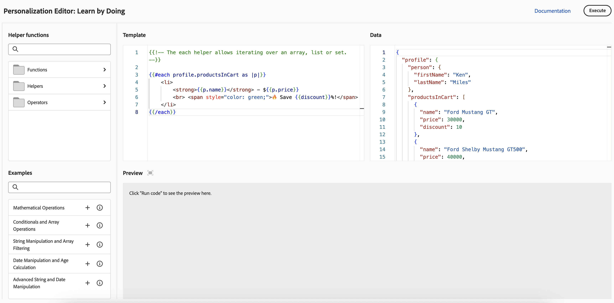

# Introdução à personalização{#add-personalization}

>[!CONTEXTUALHELP]
>id="ajo_homepage_card5"
>title="Personalizar experiências"
>abstract="Use o **Adobe Journey Optimizer** para adaptar as mensagens a cada destinatário, aproveitando seus dados e informações. Esses dados podem ser: nome, interesses, onde vivem, o que compraram etc."

Os recursos de personalização do [!DNL Adobe Journey Optimizer] permitem que você adapte suas mensagens a cada recipient específico, aproveitando os dados e as informações que você tem sobre eles. Esses dados podem ser: nome, interesses, onde vivem, o que compraram etc.

## Como a personalização funciona

Usando o **editor de personalização**, você pode selecionar, organizar, personalizar e validar todos os dados para criar uma personalização personalizada para o seu conteúdo e aproveitar várias ferramentas, como funções auxiliares ou expressões predefinidas, para personalizar mensagens com eficiência.

O Journey Optimizer emprega uma sintaxe de personalização em linha com base em Handlebars que permite criar expressões com conteúdo delimitado por chaves duplas **{{}}{{}}**.

Ao processar a mensagem, o Journey Optimizer substitui a expressão pelos dados contidos no conjunto de dados do Experience Platform. Por exemplo, `Hello {{profile.person.name.firstName}} {{profile.person.name.lastName}}` torna-se dinamicamente `Hello John Doe`.

Usando essa sintaxe, você pode personalizar mensagens em vários campos, incluindo linhas de assunto de email, corpos de mensagens, notificações por push ou URLs.

## Dados usados para personalização

O Personalization é baseado nos dados de perfil gerenciados pelo esquema **Perfil Individual XDM** definido no Adobe Experience Platform. O esquema **Perfil Individual XDM** é o único esquema que você pode usar para personalizar conteúdo em [!DNL Journey Optimizer]. Saiba mais na [documentação do Adobe Experience Platform Data Model (XDM)](https://experienceleague.adobe.com/docs/experience-platform/xdm/home.html?lang=pt-BR){target="_blank"}.

Você também pode aproveitar os **atributos computados** para personalizar seu conteúdo. Os atributos computados permitem resumir eventos comportamentais individuais em atributos de perfil computados disponíveis no Adobe Experience Platform. [Saiba como trabalhar com atributos computados](../audience/computed-attributes.md)

Além disso, o [!DNL Journey Optimizer] permite que você aproveite os dados do Adobe Experience Platform no editor de personalização para personalizar seu conteúdo. Para fazer isso, os conjuntos de dados necessários para a personalização da pesquisa devem primeiro ser habilitados por meio de uma chamada de API. Depois de concluído, você pode usar os dados para personalizar o conteúdo no Journey Optimizer. No momento, esse recurso está disponível na versão beta. [Saiba mais](../personalization/lookup-aep-data.md)

## Aprender e experimentar com personalização {#playground}

O **[!DNL Adobe Journey Optimizer]** inclui uma ferramenta interativa projetada para ajudá-lo a aprender e experimentar os recursos de personalização.

Esse playground fornece um ambiente simulado para gravar e testar o código de personalização usando dados de amostra sem exigir conjuntos de dados em tempo real. Você pode aproveitar amostras de código predefinidas, editar cargas de perfil fictícias e visualizar a saída do seu código de personalização em tempo real.

➡️ [Acessar o playground de personalização](https://experienceleague.adobe.com/pt-br/apps/journey-optimizer/ajo-personalization){target="_blank"}

## Vamos nos aprofundar um pouco mais

Agora que você conhece a personalização no **[!DNL Journey Optimizer]**, é hora de se aprofundar nessas seções de documentação para começar a trabalhar com o recurso.

<table style="table-layout:fixed"><tr style="border: 0;">
<td>

<a href="personalization-build-expressions.md"><strong>Adicionar personalização</strong></a>

</td>
<td>

<a href="../personalization/personalization-syntax.md"><strong>Sintaxe do Personalization</strong>

</td>
<td>

<a href="../personalization/functions/functions.md"><strong>Lista de funções auxiliares</strong></a>

</td>
<td>

<a href="../personalization/personalization-use-case.md"><strong>Casos de uso do Personalization</strong></a>

</td>
</tr></table>

## Vídeos tutoriais{#video-perso}

Saiba como usar informações de evento contextual de uma jornada para personalizar uma mensagem.

>[!VIDEO](https://video.tv.adobe.com/v/334165?quality=12)

Saiba como adicionar personalização baseada em perfil a uma mensagem e como usar a associação de público-alvo como pré-condição para um bloco de personalização.

>[!VIDEO](https://video.tv.adobe.com/v/334078?quality=12)

Saiba como aproveitar o playground do editor de personalização para gravar e testar o código de personalização usando dados de amostra.

>[!VIDEO](https://video.tv.adobe.com/v/3457868?quality=12)
