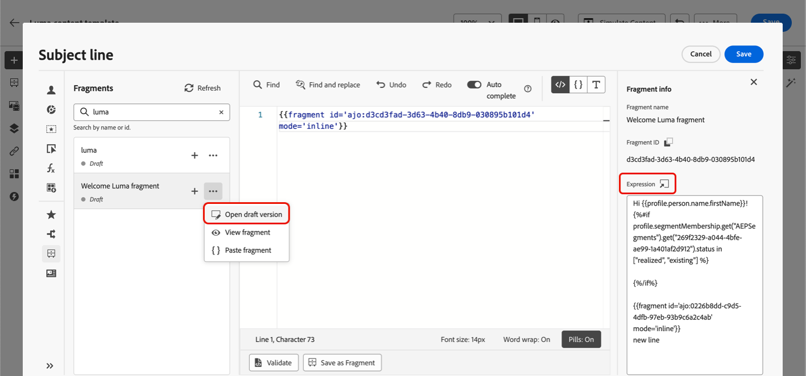
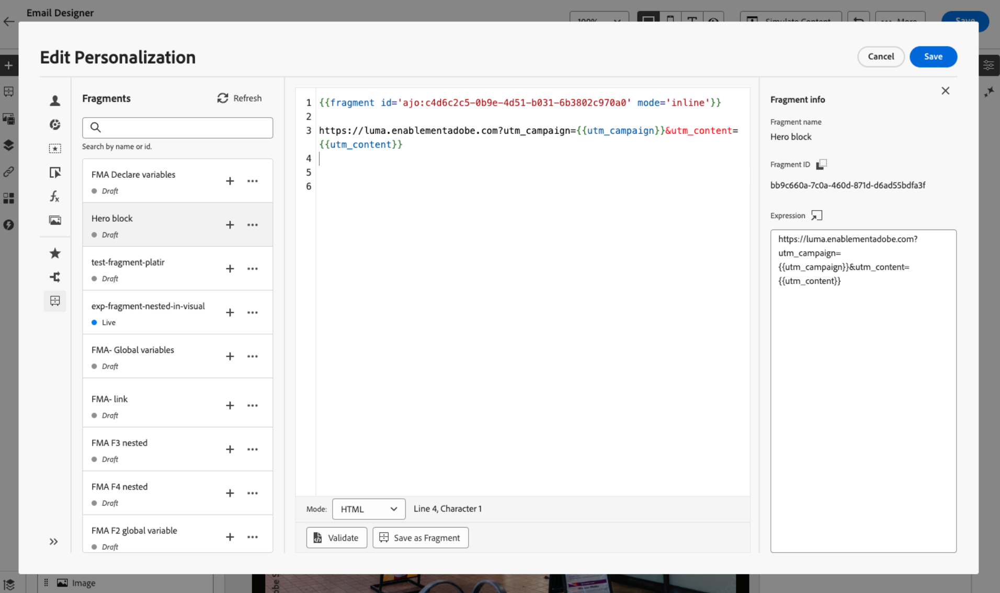

# Aproveitar fragmentos de expressão {#use-expression-fragments}

>[!BEGINSHADEBOX]

**Nesta página:** saiba como inserir e reutilizar fragmentos de expressão no editor de personalização, trabalhar com variáveis implícitas, usar fragmentos dentro de loops, personalizar campos editáveis e interromper herança no Adobe Journey Optimizer.

>[!ENDSHADEBOX]

Ao usar o **editor de personalização**, você pode aproveitar todos os fragmentos de expressão criados ou salvos na sandbox atual.

Um fragmento é um componente reutilizável que pode ser referenciado em [!DNL Journey Optimizer] campanhas e jornadas. Essa funcionalidade permite pré-construir vários blocos de conteúdo personalizado que podem ser usados por usuários de marketing para reunir conteúdo rapidamente em um processo de design aprimorado. [Saiba mais sobre fragmentos](../content-management/fragments.md)

➡️ [Saiba como gerenciar, criar e usar fragmentos neste vídeo](../content-management/fragments.md#video-fragments)

## Usar um fragmento de expressão {#use-expression-fragment}

Para adicionar fragmentos de expressão ao seu conteúdo, siga as etapas abaixo.

>[!NOTE]
>
>Você pode adicionar até 30 fragmentos em um determinado delivery. Os fragmentos só podem ser aninhados até um nível.

1. Abra o [editor de personalização](personalization-build-expressions.md) e selecione o botão **[!UICONTROL Fragmentos]** no painel esquerdo.

   A lista exibe todos os fragmentos de expressão criados ou salvos como fragmentos na sandbox atual. [Saiba como criar fragmentos](../content-management/create-fragments.md)
Eles são classificados por data de criação: os fragmentos de expressão adicionados recentemente são mostrados primeiro na lista.

   

   Você também pode atualizar esta lista.

   >[!NOTE]
   >
   >Se alguns fragmentos foram modificados ou adicionados enquanto você está editando o conteúdo, a lista será atualizada com as alterações mais recentes.

1. Clique no ícone + ao lado de um fragmento de expressão para inserir a ID do fragmento correspondente no editor.

   

   >[!CAUTION]
   >
   >Você pode adicionar qualquer fragmento do **Rascunho** ou do **Live** ao seu conteúdo. No entanto, você não poderá ativar sua jornada ou campanha se um fragmento com o status **Rascunho** estiver sendo usado nele. Na publicação do jornada ou da campanha, os fragmentos de rascunho mostrarão um erro e você precisará aprová-los para poder publicar.

1. Depois que a ID do fragmento for adicionada, se você abrir o fragmento de expressão correspondente e [editá-lo](../content-management/manage-fragments.md#edit-fragments) na interface, as alterações serão sincronizadas. Eles são propagados automaticamente para todas as jornadas/campanhas de rascunho ou ativas que contêm essa ID de fragmento.

1. Clique no botão **[!UICONTROL Mais ações]** ao lado de um fragmento. No menu contextual que é aberto, selecione **[!UICONTROL Exibir fragmento]** para obter mais informações sobre esse fragmento. A **[!UICONTROL ID do Fragmento]** também é exibida e pode ser copiada daqui.

   

1. Você pode abrir o fragmento de expressão em outra janela para editar seu conteúdo e propriedades, usando a opção **[!UICONTROL Abrir fragmento]** no menu contextual ou no painel **[!UICONTROL Informações do fragmento]**. [Saiba como editar um fragmento](../content-management/manage-fragments.md#edit-fragments)

   

1. Em seguida, você pode personalizar e validar o conteúdo como de costume, usando todos os recursos de personalização e criação do [editor de personalização](personalization-build-expressions.md).

1. Em alguns casos, só é necessário calcular variáveis, de modo que talvez você queira ocultar o conteúdo do fragmento da expressão. Para fazer isso, use o atributo `render` e defina-o como `false`. Por exemplo:

   ```
   Hi {{profile.person.name.firstName|fragment id='ajo:fragmentId/variantId' mode ='inline' render=false}}
   ```

>[!NOTE]
>
>Se você criar um fragmento de expressão que contenha várias quebras de linha e usá-lo no conteúdo de [SMS](../mobile/create-mobile-message.md#sms-content) ou [push](../push/design-push.md), as quebras de linha serão preservadas. Portanto, teste sua mensagem [SMS](../mobile/send-mobile-message.md) ou [push](../push/send-push.md) antes de enviá-la.

## Usar variáveis implícitas {#implicit-variables}

As variáveis implícitas aprimoram a funcionalidade do fragmento existente para melhorar a eficiência da reutilização de conteúdo e dos casos de uso de script. Os fragmentos podem usar variáveis de entrada e criar variáveis de saída que podem ser usadas no conteúdo da campanha e da jornada.

Esse recurso pode, por exemplo, ser usado para inicializar parâmetros de rastreamento de seus emails, com base na campanha ou jornada atual, e usar esses parâmetros nos links personalizados adicionados ao conteúdo do email.

Os seguintes casos de uso são possíveis:

1. **Usar variáveis de entrada em um fragmento.**

   Quando um fragmento é usado em um conteúdo de ação de campanha/jornada, ele pode aproveitar as variáveis declaradas fora do fragmento. Veja um exemplo abaixo:

   

   Podemos ver acima que a variável `utm_content` está declarada no conteúdo da campanha. Quando o fragmento **Hero block** for usado, ele mostrará um link ao qual o valor do parâmetro `utm_content` será anexado. O resultado final é: `https://luma.enablementadobe.com?utm_campaign= Product_launch&utm_content= start_shopping`.

1. **Usar variáveis de saída de um fragmento.**

   As variáveis calculadas ou definidas dentro de um fragmento estão disponíveis para uso no conteúdo. No exemplo a seguir, um fragmento **F1** declara um conjunto de variáveis:

   

   Em um conteúdo de email, você pode ter a seguinte personalização:

   

   O fragmento F1 inicializa as seguintes variáveis: `utm_campaign`e `utm_content`. Em seguida, o link no conteúdo da mensagem terá esses parâmetros anexados. O resultado final é: `https://luma.enablementadobe.com?utm_campaign= Product_launch&utm_content= start_shopping`.

>[!NOTE]
>
>No tempo de execução, o sistema expande o que está dentro dos fragmentos e interpreta o código de personalização de cima para baixo. Tendo isso em mente, é possível obter casos de uso mais complexos. Por exemplo, você pode fazer com que um fragmento F1 transmita variáveis para outro fragmento F2 abaixo. Você também pode ter um fragmento visual F1 transmitindo variáveis para um fragmento de expressão aninhado F2.

## Usar fragmentos de expressão dentro de loops {#fragments-in-loops}

Ao usar fragmentos de expressão em loops `{{#each}}`, é importante entender como funciona o escopo de variáveis. Os fragmentos de expressão podem acessar variáveis globais definidas no conteúdo da mensagem, mas não podem receber variáveis específicas de loop como parâmetros.

### Padrão compatível: usar variáveis globais {#global-variables-in-loops}

Os fragmentos de expressão podem fazer referência a variáveis globais definidas fora do fragmento, mesmo quando o fragmento é chamado de dentro de um loop. Essa é a abordagem recomendada quando você precisa usar fragmentos em contextos iterativos.

**Exemplo: usando um fragmento com variáveis globais dentro de um loop**

No conteúdo da mensagem, defina uma variável global e use um fragmento que faça referência a ela:

```handlebars


{{#each context.journey.actions.GetProducts.items as |product|}}
  <div class="product">
    <h3>{{product.name}}</h3>
    <p>Price: ${{product.price}}</p>
    {{fragment id='ajo:fragment123/variant456' mode='inline'}}
  </div>
{{/each}}
```

No fragmento de expressão (fragment123), é possível fazer referência à variável `globalDiscount`:

```handlebars
<p class="discount-info">Save {{globalDiscount}}% on all items!</p>
```

Esse padrão funciona porque a variável global pode ser acessada em toda a mensagem, incluindo em fragmentos, independentemente do contexto do loop.

### Não suportado: transmitir variáveis de loop como parâmetros de fragmento {#loop-variables-limitations}

Você não pode passar o item de iteração atual (por exemplo, `product` no exemplo acima) como um parâmetro para um fragmento de expressão. O fragmento não pode acessar diretamente variáveis de escopo de loop do bloco `{{#each}}` ao redor.

**Exemplo: o que NÃO funciona**

```handlebars
{{#each context.journey.actions.GetProducts.items as |product|}}
  <!-- This will NOT work as expected -->
  {{fragment id='ajo:fragment123/variant456' mode='inline' currentProduct=product}}
{{/each}}
```

O fragmento não pode receber `product` como parâmetro e usá-lo internamente porque a passagem de parâmetro para variáveis específicas de loop não tem suporte na implementação atual.

### Soluções alternativas recomendadas {#fragments-in-loops-workarounds}

Quando precisar usar fragmentos de expressão com dados de um loop, considere estas abordagens:

1. **Incluir lógica diretamente na mensagem**: em vez de usar um fragmento para lógica específica de loop, adicione o código de personalização diretamente no bloco `{{#each}}`.

   ```handlebars
   {{#each context.journey.actions.GetProducts.items as |product|}}
     <div class="product">
       <h3>{{product.name}}</h3>
       <p>Price: ${{product.price}}</p>
       {{#if product.price > 100}}
         <span class="premium-badge">Premium Product</span>
       {{/if}}
     </div>
   {{/each}}
   ```

2. **Usar fragmentos fora de loops**: se o conteúdo do fragmento não for dependente de loop, chame o fragmento antes ou depois do bloco de iteração.

   ```handlebars
   {{fragment id='ajo:fragment123/variant456' mode='inline'}}
   
   {{#each context.journey.actions.GetProducts.items as |product|}}
     <div class="product">
       <h3>{{product.name}}</h3>
       <p>Price: ${{product.price}}</p>
     </div>
   {{/each}}
   ```

3. **Definir várias variáveis globais**: se você precisar passar valores diferentes para um fragmento nas iterações, defina variáveis globais antes de cada chamada de fragmento (embora isso limite a flexibilidade).

>[!NOTE]
>
>Para iterar sobre dados contextuais e trabalhar com loops, consulte o manual abrangente sobre [iterar sobre dados contextuais](iterate-contextual-data.md), que inclui práticas recomendadas, dicas de solução de problemas e padrões avançados.

## Personalizar campos editáveis {#customize-fields}

Se determinadas partes de um fragmento de expressão se tornaram editáveis usando variáveis, é possível substituir os valores padrão usando uma sintaxe específica. [Saiba como tornar seus fragmentos personalizáveis](../content-management/customizable-fragments.md)

Para personalizar os campos, siga estas etapas:

1. Insira o fragmento no código do menu **[!UICONTROL Fragmentos]**.

1. Use o código `<fieldId>="<value>"` no final da sintaxe para substituir o valor padrão da variável.

   No exemplo abaixo, estamos substituindo o valor de uma variável cuja ID é &quot;esportes&quot; pelo valor &quot;ioga&quot;. Isso exibirá &quot;yoga&quot; no conteúdo do fragmento em todos os locais em que a variável &quot;sport&quot; for referenciada.

   

Um exemplo mostrando como adicionar campos editáveis em fragmentos de expressão e substituir seus valores ao criar um email está disponível em [esta seção](../content-management/customizable-fragments.md#example).

## Usar a resolução dinâmica do fragmento {#dynamic-resolution}

Em vez de incorporar estaticamente uma ID de fragmento no tempo de design, você pode resolver a ID do fragmento dinamicamente no tempo de execução por recipient. Isso permite que perfis diferentes recebam blocos de conteúdo totalmente diferentes na mesma campanha ou jornada, com base em atributos de perfil, pesquisas de conjunto de dados ou dados de contexto.

[Saiba como usar fragmentos dinâmicos](../content-management/dynamic-fragments.md)

## Interromper herança {#break-inheritance}

Ao adicionar uma ID de fragmento ao editor de personalização, as alterações feitas no fragmento de expressão original são sincronizadas.

No entanto, também é possível colar o conteúdo de um fragmento de expressão no editor. No menu contextual, selecione **[!UICONTROL Colar fragmento]** para inserir esse conteúdo.


Nesse caso, a herança do fragmento original é quebrada. O conteúdo do fragmento é copiado para o editor e as alterações não são mais sincronizadas.

Ele se torna um elemento independente que não está mais vinculado ao fragmento original; você pode editá-lo como qualquer outro elemento no seu código.

## Referência rápida {#quick-reference}

Esta seção contém conhecimento estruturado destinado a oferecer suporte à interpretação, recuperação e resposta a perguntas relacionadas a este tópico.

Para uma compreensão completa, essas informações devem ser combinadas com a documentação desta página. Nenhuma das origens deve ser independente; a página descreve o recurso, enquanto esta seção fornece um contexto adicional que ajuda a desfazer a ambiguidade da terminologia, intenção, aplicabilidade e restrições.

>[!BEGINTABS]

>[!TAB Visão geral]

**TL;DR**

Esta página explica como inserir, personalizar e gerenciar fragmentos de expressão no editor de personalização, incluindo variáveis implícitas, usando fragmentos dentro de loops, campos editáveis, resolução dinâmica e quebrando a herança.

**Intenções**

* Insira um fragmento de expressão no menu Fragmentos e entenda a propagação automática de alterações
* Usar variáveis implícitas: variáveis de entrada (declaradas fora do fragmento, usadas dentro) e variáveis de saída (declaradas dentro do fragmento, usadas no conteúdo da mensagem ao redor)
* Usar fragmentos de expressão dentro de loops — aproveite variáveis globais para acessar fragmentos; entenda a limitação de transmitir variáveis com escopo de loop como parâmetros
* Substituir campos editáveis em um fragmento personalizável usando a sintaxe `<fieldId>="<value>"`
* Resolver IDs de fragmento dinamicamente no tempo de execução com base em atributos de perfil, pesquisas de conjunto de dados ou dados de contexto
* Interromper a herança colando o conteúdo do fragmento diretamente no editor

>[!TAB Glossário]

* **Fragmento de expressão**: um componente de expressão de personalização reutilizável referenciado por ID em campanhas e jornadas; as alterações no fragmento são propagadas automaticamente para todo o conteúdo que faz referência a ele. *(específico do produto)*
* **Variáveis implícitas**: variáveis que estendem a funcionalidade do fragmento — variáveis de entrada (declaradas no conteúdo da campanha/jornada, consumidas dentro do fragmento) e variáveis de saída (declaradas dentro do fragmento, disponíveis no conteúdo da mensagem ao redor). *(específico do produto)*
* **Variável de entrada**: uma variável declarada fora do fragmento (no conteúdo de campanha ou jornada) que o fragmento pode referenciar e usar internamente.
* **Variável de saída**: uma variável declarada ou calculada dentro de um fragmento que se torna disponível para uso no conteúdo da mensagem ao redor depois que o fragmento é chamado.
* **Campos editáveis**: variáveis de fragmento expostas para permitir que o usuário que está inserindo substitua valores padrão usando a sintaxe `<fieldId>="<value>"`, sem editar a origem do fragmento. *(específico do produto)*
* **Resolução dinâmica de fragmento**: a capacidade de resolver uma ID de fragmento em tempo de execução (com base em atributos de perfil, pesquisas de conjunto de dados ou dados de contexto) em vez de incorporar uma ID de fragmento estática em tempo de design. *(específico do produto)*
* **Interromper herança**: usar &quot;Colar fragmento&quot; no menu contextual copia o conteúdo do fragmento para o editor como um elemento autônomo que não é mais sincronizado com o fragmento original. *(específico do produto)*

>[!TAB Terminologia]

* **Fragmento de expressão de nome canônico:** — variantes: fragmento, fragmento de expressão
* **Sinônimos:** &quot;ID do fragmento&quot; = o identificador usado para fazer referência ao fragmento em expressões
* **Não confunda:** inserir um fragmento por ID (referenciado; as alterações propagam-se automaticamente para todo o conteúdo) ≠ quebrar a herança / colar fragmento (conteúdo copiado no editor; elemento independente, não mais vinculado ao original)
* **Não confundir:** variáveis de entrada (declaradas fora do fragmento, consumidas dentro) ≠ variáveis de saída (declaradas dentro do fragmento, consumidas fora no conteúdo da mensagem ao redor)
* **Não confunda:** Fragmento de rascunho (pode ser adicionado ao conteúdo, mas bloqueia a publicação do jornada/campanha até ser aprovado) ≠ Fragmento ao vivo (totalmente publicado; seguro para jornadas e campanhas ativas)

>[!TAB Medidas de proteção e limitações]

* Um máximo de 30 fragmentos pode ser adicionado em um determinado delivery.
* Os fragmentos só podem ser aninhados até um nível.
* Uma jornada ou campanha não pode ser ativada ou publicada se contiver um fragmento com status de Rascunho; fragmentos de rascunho devem ser aprovados antes da publicação.
* Os fragmentos de expressão não podem receber variáveis de escopo de loop (o item de iteração `{{#each}}` atual) como parâmetros — essa é uma limitação conhecida. Use variáveis globais ou lógica em linha como uma solução alternativa.
* Se um fragmento que contém várias quebras de linha for usado no conteúdo de SMS ou push, as quebras de linha serão preservadas; teste o conteúdo antes de enviar.

>[!TAB Perguntas frequentes]

**P: Quantos fragmentos podem ser adicionados em uma única entrega?**

Até 30 fragmentos.

**P: Os fragmentos podem ser aninhados dentro de outros fragmentos?**

Sim, mas somente até 1 nível de aninhamento.

**P: O que acontece se eu usar um fragmento de Rascunho em uma jornada ou campanha?**

Você pode adicionar um fragmento de rascunho ao conteúdo, mas não pode ativar ou publicar a jornada ou campanha até que o fragmento seja aprovado e seu status seja alterado para Live.

**P: Um fragmento de expressão pode receber o item de loop atual (por exemplo, `product` em `{{#each}}`) como um parâmetro?**

Não. Fragmentos de expressão não podem receber variáveis de escopo de loop como parâmetros. Use variáveis globais declaradas fora do loop (que o fragmento pode acessar) ou inclua a lógica de personalização diretamente no loop, em vez de usar um fragmento.

**P: O que é quebra de herança e quando devo usá-la?**

Interromper a herança significa usar &quot;Colar fragmento&quot; no menu contextual para copiar o conteúdo do fragmento diretamente para o editor. O conteúdo colado se torna um elemento independente que não é mais sincronizado com o fragmento original — use isso quando precisar personalizar o conteúdo além do que os campos editáveis permitem, sabendo que alterações futuras no fragmento original não serão propagadas para essa cópia.

>[!ENDTABS]

<!-- ai-section-version: 1 | source-hash: 64745ff0 -->

