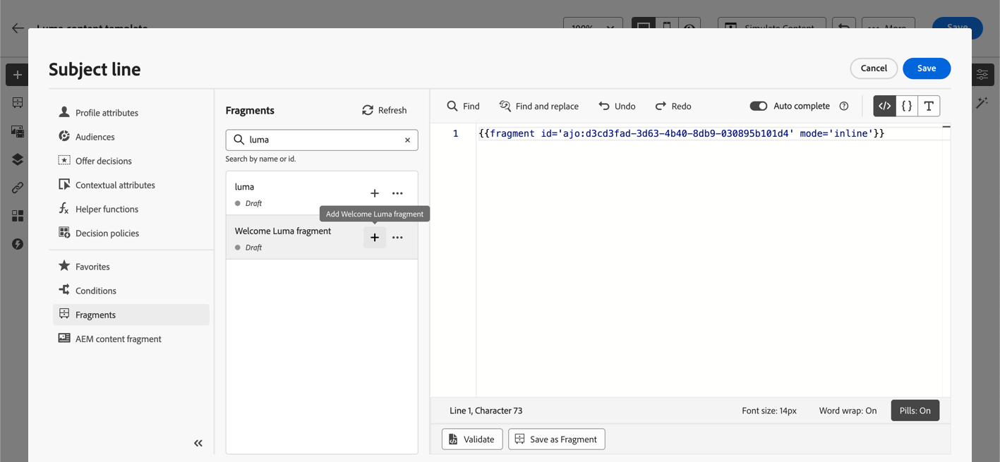

# Aproveitar fragmentos de expressão {#use-expression-fragments}

Ao usar o **editor de personalização**, você pode aproveitar todos os fragmentos de expressão criados ou salvos na sandbox atual.

Um fragmento é um componente reutilizável que pode ser referenciado em [!DNL Journey Optimizer] campanhas e jornadas. Essa funcionalidade permite pré-construir vários blocos de conteúdo personalizado que podem ser usados por usuários de marketing para reunir conteúdo rapidamente em um processo de design aprimorado. [Saiba como criar e gerenciar fragmentos](../content-management/fragments.md).

➡️ [Saiba como gerenciar, criar e usar fragmentos neste vídeo](../content-management/fragments.md#video-fragments)

## Usar um fragmento de expressão {#use-expression-fragment}

Para adicionar fragmentos de expressão ao seu conteúdo, siga as etapas abaixo.

>[!NOTE]
>
>Você pode adicionar até 30 fragmentos em um determinado delivery. Os fragmentos só podem ser aninhados até um nível.

1. Abra o [editor de personalização](personalization-build-expressions.md) e selecione o botão **[!UICONTROL Fragmentos]** no painel esquerdo.

   A lista exibe todos os fragmentos de expressão criados ou salvos como fragmentos na sandbox atual. Eles são classificados por data de criação: os fragmentos de expressão adicionados recentemente são mostrados primeiro na lista. [Saiba mais](../content-management/fragments.md#create-expression-fragment)

   

   Você também pode atualizar esta lista.

   >[!NOTE]
   >
   >Se alguns fragmentos foram modificados ou adicionados enquanto você está editando o conteúdo, a lista será atualizada com as alterações mais recentes.

1. Clique no ícone + ao lado de um fragmento de expressão para inserir a ID do fragmento correspondente no editor.

   

   >[!CAUTION]
   >
   >Você pode adicionar qualquer fragmento do **Rascunho** ou do **Live** ao seu conteúdo. No entanto, você não poderá ativar sua jornada ou campanha se um fragmento com o status Rascunho estiver sendo usado nele. Na publicação do jornada ou da campanha, os fragmentos de rascunho mostrarão um erro e você precisará aprová-los para poder publicar.

1. Depois que a ID do fragmento for adicionada, se você abrir o fragmento de expressão correspondente e [editá-lo](../content-management/fragments.md#edit-fragments) na interface, as alterações serão sincronizadas. Eles são propagados automaticamente para todas as jornadas/campanhas de rascunho ou ativas que contêm essa ID de fragmento.

1. Clique no botão **[!UICONTROL Mais ações]** ao lado de um fragmento. No menu contextual que é aberto, selecione **[!UICONTROL Exibir fragmento]** para obter mais informações sobre esse fragmento. A **[!UICONTROL ID do Fragmento]** também é exibida e pode ser copiada daqui.

   

1. Você pode abrir o fragmento de expressão em outra janela para editar seu conteúdo e propriedades, usando a opção **[!UICONTROL Abrir fragmento]** no menu contextual ou no painel **[!UICONTROL Informações do fragmento]**. [Saiba como editar um fragmento](../content-management/fragments.md#edit-fragments)

   

1. Em seguida, você pode personalizar e validar o conteúdo como de costume, usando todos os recursos de personalização e criação do [editor de personalização](personalization-build-expressions.md).

>[!NOTE]
>
>Se você criar um fragmento de expressão que contenha várias quebras de linha e usá-lo no conteúdo de [SMS](../sms/create-sms.md#sms-content) ou [push](../push/design-push.md), as quebras de linha serão preservadas. Portanto, teste sua mensagem [SMS](../sms/send-sms.md) ou [push](../push/send-push.md) antes de enviá-la.

## Usar variáveis implícitas {#implicit-variables}

As variáveis implícitas aprimoram a funcionalidade do fragmento existente para melhorar a eficiência da reutilização de conteúdo e dos casos de uso de script. Os fragmentos podem usar variáveis de entrada e criar variáveis de saída que podem ser usadas no conteúdo da campanha e da jornada.

Esse recurso pode, por exemplo, ser usado para inicializar parâmetros de rastreamento de seus emails, com base na campanha ou jornada atual, e usar esses parâmetros nos links personalizados adicionados ao conteúdo do email.

Os seguintes casos de uso são possíveis:

1. Usar variáveis de entrada em um fragmento

   Quando um fragmento é usado em um conteúdo de ação de Campanha/jornada, ele pode aproveitar as variáveis declaradas fora do fragmento. Veja um exemplo abaixo:

   

   Podemos ver acima que a variável `utm_content` está declarada no conteúdo da campanha. Quando o fragmento **Hero block** for usado, ele mostrará um link ao qual o valor do parâmetro `utm_content` será anexado. O resultado final é: `https://luma.enablementadobe.com?utm_campaign= Product_launch&utm_content= start_shopping`.

1. Usar variáveis de saída de um fragmento

   As variáveis calculadas ou definidas dentro de um fragmento estão disponíveis para uso no conteúdo. No exemplo a seguir, um fragmento **F1** declara um conjunto de variáveis:

   

   Em um conteúdo de email, podemos ter a seguinte personalização:

   

   O fragmento F1 inicializa as seguintes variáveis: `utm_campaign`e `utm_content`. Em seguida, o link no conteúdo da mensagem terá esses parâmetros anexados. O resultado final é: `https://luma.enablementadobe.com?utm_campaign= Product_launch&utm_content= start_shopping`.

>[!NOTE]
>
>No tempo de execução, o sistema expande o que está dentro dos fragmentos e interpreta o código de personalização de cima para baixo. Tendo isso em mente, é possível obter casos de uso mais complexos. Por exemplo, você pode fazer com que um fragmento F1 transmita variáveis para outro fragmento F2 abaixo. Você também pode ter um fragmento visual F1 transmitindo variáveis para um fragmento de expressão aninhado F2.

## Personalizar campos editáveis {#customize-fields}

Se determinadas partes de um fragmento de expressão se tornaram editáveis usando variáveis, é possível substituir os valores padrão usando uma sintaxe específica. [Saiba como tornar seus fragmentos personalizáveis](../content-management/customizable-fragments.md)

Para personalizar os campos, siga estas etapas:

1. Insira o fragmento no código do menu **Fragmentos**.

1. Use o código `<fieldId>="<value>"` no final da sintaxe para substituir o valor padrão da variável.

   No exemplo abaixo, estamos substituindo o valor de uma variável cuja ID é &quot;esportes&quot; pelo valor &quot;ioga&quot;. Isso exibirá &quot;yoga&quot; no conteúdo do fragmento em todos os locais em que a variável &quot;sport&quot; for referenciada.

   

Um exemplo mostrando como adicionar campos editáveis em fragmentos de expressão e substituir seus valores ao criar um email está disponível em [esta seção](../content-management/customizable-fragments.md#example).

## Interromper herança {#break-inheritance}

Ao adicionar uma ID de fragmento ao editor de personalização, as alterações feitas no fragmento de expressão original são sincronizadas.

No entanto, também é possível colar o conteúdo de um fragmento de expressão no editor. No menu contextual, selecione **[!UICONTROL Colar fragmento]** para inserir esse conteúdo.

Nesse caso, a herança do fragmento original é quebrada. O conteúdo do fragmento é copiado para o editor e as alterações não são mais sincronizadas.

Ele se torna um elemento independente que não está mais vinculado ao fragmento original; você pode editá-lo como qualquer outro elemento no seu código.

