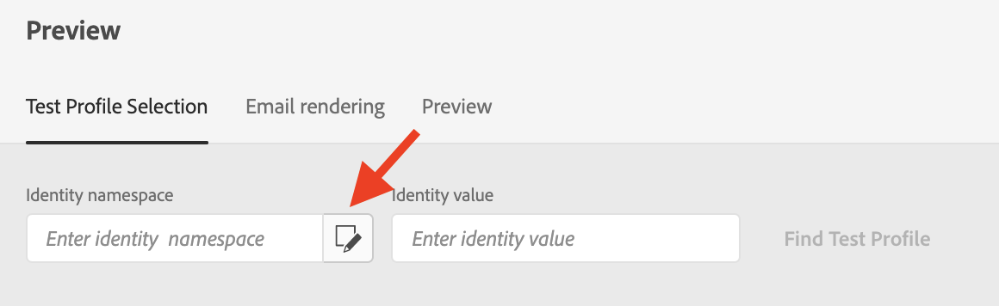
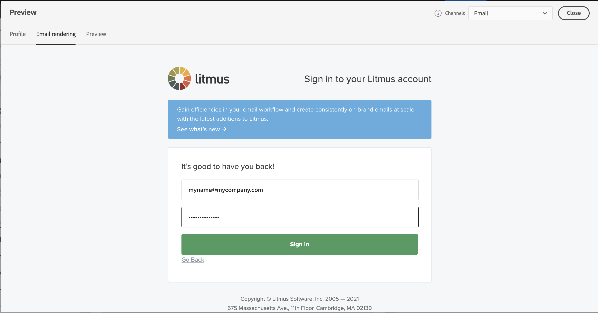

# Visualizar e testar suas mensagens{#preview-and-proof}

Após definir o conteúdo da mensagem, é possível usar perfis de teste para pré-visualizá-lo e testá-lo. Se você inseriu [conteúdo personalizado](personalization/personalize.md), será possível verificar como esse conteúdo é exibido na mensagem, aproveitando os dados de perfil de teste.

Para detectar possíveis erros no conteúdo do email ou nas configurações de personalização, envie provas para testar perfis. Uma prova deve ser enviada sempre que uma alteração for feita, para validar o conteúdo mais recente.

>[!CAUTION]
>
>Você precisa ter perfis de teste disponíveis para pré-visualizar suas mensagens e enviar provas.
>
>Saiba como criar perfis de teste em [esta página](building-journeys/creating-test-profiles.md).

Para testar o conteúdo da mensagem, é necessário:

* [selecionar perfis de teste](#select-test-profiles)
* [verificar a pré-visualização da mensagem](#preview-your-messages)

Você poderá [enviar provas](#send-proofs) para seus perfis de teste.

Além disso, aproveite sua conta **Litmus** em [!DNL Journey Optimizer] para visualizar instantaneamente sua **renderização de email** em clientes de email populares. Em seguida, você pode garantir que seu conteúdo de email fique ótimo e funcione corretamente em cada caixa de entrada. Saiba como desbloquear visualizações de email do Litmus em [esta seção](#email-rendering)

>[!CAUTION]
>
>Ao visualizar uma mensagem ou enviar provas, somente os dados de personalização de perfil são exibidos. A personalização com base em dados de contexto, como informações de evento, só pode ser testada no contexto de uma jornada. Saiba como testar a personalização em [este caso de uso](personalization/personalization-use-case.md).

 [Saiba como visualizar, provar e publicar seu email neste vídeo](#video-preview)

## Selecionar perfis de teste{#select-test-profiles}

Use [Test profiles](building-journeys/creating-test-profiles.md) para direcionar recipients adicionais que não correspondam aos critérios de direcionamento definidos.

Para selecionar perfis de teste, siga as etapas abaixo:

1. Na interface da mensagem ou no designer de email, clique no botão **[!UICONTROL Show preview]** para acessar a seleção do perfil de teste.

   

1. Selecione o namespace a ser usado para identificar perfis de teste clicando no ícone de seleção **[!UICONTROL Identity namespace]**.

   

   Saiba mais sobre os namespaces de identidade do Adobe Experience Platform [nesta seção](https://experienceleague.adobe.com/docs/experience-platform/identity/namespaces.html?lang=en#getting-started).

   No exemplo abaixo, usaremos o namespace **Email**.

1. Use o campo de pesquisa para localizar o namespace, selecione-o e clique em **[!UICONTROL Select]**

   

1. Insira o valor para identificar o perfil de teste e clique em **[!UICONTROL Find test profile]**.

   

1. Se você tiver adicionado personalização à mensagem, adicione outros perfis para poder testar diferentes variantes da mensagem, dependendo dos dados do perfil. Depois de adicionados, os perfis são listados nos campos de seleção.

   

   Com base nos elementos de personalização da mensagem, essa lista exibe os dados para cada perfil de teste nas colunas relacionadas.

## Visualizar mensagens{#preview-your-messages}

Depois que [test profiles](#select-test-profiles) forem selecionados, você poderá visualizar suas mensagens e verificar o conteúdo.

1. Clique na guia **[!UICONTROL Preview]** para testar a mensagem.

1. Selecione um perfil de teste. Você pode verificar os valores disponíveis nas colunas. Use as setas para a direita/esquerda para navegar pelos dados.

   

1. Clique no ícone **[!UICONTROL Select data]** acima da lista para adicionar ou remover colunas.

   

   Você pode ver campos de personalização específicos da mensagem atual no final da lista. Neste exemplo, a cidade do perfil, o nome e o sobrenome. Selecione esses campos e verifique se esses valores estão preenchidos nos perfis de teste.

1. Na visualização da mensagem, os elementos personalizados são substituídos pelos dados de perfil de teste selecionados.

   Por exemplo, para essa mensagem, o conteúdo do email e o assunto do email são personalizados:

   

1. Selecione outros perfis de teste para visualizar a renderização de email para cada variante da mensagem.

Para uma pré-visualização de notificação por push:

1. Alterne para o canal **[!UICONTROL Push]** da lista suspensa **[!UICONTROL Channels]** na parte superior esquerda da tela **[!UICONTROL Preview]**.

   

1. Siga as mesmas etapas descritas acima para selecionar um perfil de teste e selecione o tipo de dispositivo para visualizar o conteúdo: **[!UICONTROL iOS]** ou **[!UICONTROL Android]**

   

1. Na visualização por push, os dados do perfil de teste são aproveitados no conteúdo da mensagem.

   Por exemplo, para esta notificação por push, o título e o corpo são personalizados:

   

## Enviar provas{#send-proofs}

Uma prova é uma mensagem específica que permite testar uma mensagem antes de enviá-la para o público principal. Os recipients da prova são responsáveis pela aprovação da mensagem: renderização, conteúdo, configurações de personalização, configuração.

Depois que [test profiles](#select-test-profiles) forem selecionados, você poderá enviar provas.

1. Na tela **[!UICONTROL Preview]**, clique no botão **[!UICONTROL Send proof]**.

   

1. Selecione os perfis de teste que receberão a prova e clique em **[!UICONTROL Send proof]**. Você pode adicionar um prefixo à linha de assunto da prova, se necessário.

   

1. De volta à tela **[!UICONTROL Preview]**, clique no botão **[!UICONTROL View proofs]** para verificar o status.

   

Você precisa enviar provas após qualquer modificação no conteúdo da mensagem.

>[!NOTE]
>
> Na prova enviada aos perfis de teste, o link para a mirror page não está ativo. Ela só é ativada nas mensagens finais.

## Renderização de email{#email-rendering}

Você pode aproveitar sua conta **Litmus** em [!DNL Journey Optimizer] para visualizar instantaneamente sua **renderização de email** em clientes de email populares.

Para acessar os recursos de renderização de email, é necessário:

* Ter uma conta Litmus
* [Selecionar perfis de teste](#select-test-profiles)

Em seguida, siga as etapas abaixo:

1. No Designer de email, clique no botão **[!UICONTROL Preview]** e selecione a guia **[!UICONTROL Email rendering]**.

1. Clique em **Connect your Litmus account** na seção superior direita.

   

1. Insira suas credenciais e faça logon.

   

1. Clique no botão **Executar teste** para gerar visualizações de email.

1. Verifique seu conteúdo de email em clientes populares de desktop, dispositivos móveis e baseados na Web.

   

>[!CAUTION]
>
>Ao conectar sua conta **Litmus** com [!DNL Journey Optimizer], você concorda que as mensagens de teste são enviadas ao Litmus: depois de enviados, esses emails não são mais gerenciados pelo Adobe. Como consequência, a política de email de retenção de dados Litmus se aplica a esses emails, incluindo dados de personalização que podem ser incluídos nessas mensagens de teste.

## Vídeo tutorial{#video-preview}

Saiba como testar a renderização de email nas caixas de entrada, como visualizar seus emails personalizados em relação a perfis de teste, enviar provas e publicar seu email.

>[!VIDEO](https://video.tv.adobe.com/v/334239?quality=12)
