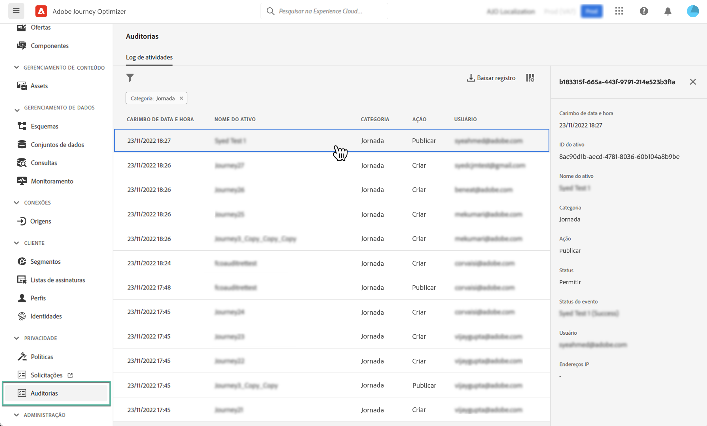

# Ações de auditoria em recursos do Journey Optimizer {#track-changes}

## Sobre logs de auditoria {#audit-logs}

>[!IMPORTANT]
>
>Para exibir e exportar o log de auditoria, você deve ter a permissão **[!DNL View User Activity Log]** concedida. [Saiba mais](../administration/ootb-product-profiles.md)

Com o Journey Optimizer, você pode identificar as ações executadas pelos usuários no sistema em vários serviços e recursos como jornadas, mensagens, páginas de destino etc.

Isso permite aumentar a visibilidade das atividades realizadas no sistema, solucionar problemas e ajudar seu negócio a cumprir os regulamentos e as políticas corporativas de gerenciamento de dados.

Cada ação é registrada com metadados em “logs de auditoria”, que são acessíveis na Adobe Experience Platform. Para obter mais informações sobre logs de auditoria, incluindo como visualizá-los e gerenciá-los na interface ou na API, consulte a [documentação da Adobe Experience Platform](https://experienceleague.adobe.com/docs/experience-platform/landing/governance-privacy-security/audit-logs/overview.html?lang=pt-BR).

## Tipos de evento capturados por logs de auditoria {#events}

A tabela a seguir descreve quais ações de recursos do Journey Optimizer são registradas por logs de auditoria. A lista completa de ações capturadas nos logs de auditoria está disponível na [documentação da Adobe Experience Platform](https://experienceleague.adobe.com/docs/experience-platform/landing/governance-privacy-security/audit-logs/overview.html?lang=pt-BR#category).

>[!NOTE]
>
>Logs de auditoria relacionados à **gestão de decisões** são visíveis apenas no arquivo CSV que pode ser baixado usando o botão **[!UICONTROL Baixar log]**.

| Recurso | Ação |
|-----------|------------------|
| Campanha do AJO | Criar / Excluir / Atualizar / Ativar / Interromper |
| Configuração geral do canal do AJO | Criar / Excluir / Atualizar |
| Pool de IP do AJO | Criar / Excluir / Atualizar |
| Páginas de destino do AJO | Criar / Excluir / Atualizar / Publicar / Desfazer a publicação |
| Modelo HTML da página de destino do AJO | Criar / Excluir / Atualizar |
| Predefinição da página de destino do AJO | Criar / Excluir / Atualizar |
| Subdomínio da página de destino do AJO | Criar / Excluir / Atualizar |
| Predefinição de mensagem do AJO | Criar / Excluir / Atualizar |
| Registro PTR do AJO | Criar / Excluir / Atualizar |
| Modelo de expressão salva do AJO | Criar / Excluir / Atualizar |
| Credenciais da API de SMS do AJO | Criar / Excluir / Atualizar |
| Subdomínio do AJO | Criar / Excluir / Atualizar |
| Lista de supressão do AJO | Criar / Excluir / Baixar CSV |
| Grupo de campos | Criar / Excluir / Atualizar |
| Jornada | Criar / Excluir / Atualizar / Interromper / Publicar |
| Ação personalizada da jornada | Criar / Excluir / Atualizar |
| Fonte de dados da jornada | Criar / Excluir / Atualizar |
| Evento da jornada | Criar / Excluir / Atualizar |
| Regra de frequência de mensagens | Criar / Excluir / Atualizar |
| Estratégia de classificação | Criar / Excluir / Atualizar |
