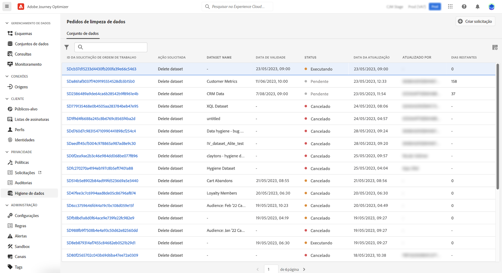

# Executar operações de ciclo de vida de dados {#data-hygiene}

>[!AVAILABILITY]
>
>Os recursos de ciclo de vida dos dados estão disponíveis atualmente apenas para organizações que adquiriram as ofertas complementares **Healthcare Shield** e **Privacy and Security Shield**.

À medida que os dados são assimilados continuamente na Adobe Experience Platform, é fundamental garantir que eles sejam usados conforme planejado, atualizados quando necessário e excluídos de acordo com as políticas organizacionais.

Essas tarefas podem ser realizadas usando o menu **[!UICONTROL Ciclo de vida de dados]**, que permite configurar e agendar operações de ciclo de vida de dados, garantindo que seus registros sejam mantidos adequadamente.

## Recomendações {#data-hygiene-recommendations}

Ao executar operações de higiene de dados (como excluir identidades ou conjuntos de dados), esteja ciente de que os eventos de entrega históricos associados às identidades excluídas não aparecerão mais nos relatórios padrão ou nas consultas do datalake. Isso pode resultar em discrepâncias entre o número de emails relatados como **Entregues** e o número de emails **Recebidos** nas caixas de entrada dos destinatários, especialmente em jornadas mais antigas.

Antes de realizar exclusões em grande escala, valide e exporte quaisquer dados de entrega ou relatório necessários. Se a reconciliação for necessária após a higiene de dados, entre em contato com o suporte da Adobe para acessar logs arquivados ou usar consultas do conjunto de dados do evento de feedback de mensagem para dados recentes.

## Saiba mais {#data-hygiene-learn-more}

Para obter mais informações sobre o Privacy Service e como executar operações de ciclo de vida de dados, consulte a documentação da Adobe Experience Platform:

* [Visão geral do Privacy Service](https://experienceleague.adobe.com/docs/experience-platform/privacy/home.html?lang=pt-BR)
* [Ciclo de vida de dados na Adobe Experience Platform](https://experienceleague.adobe.com/docs/experience-platform/hygiene/home.html?lang=pt-BR)
