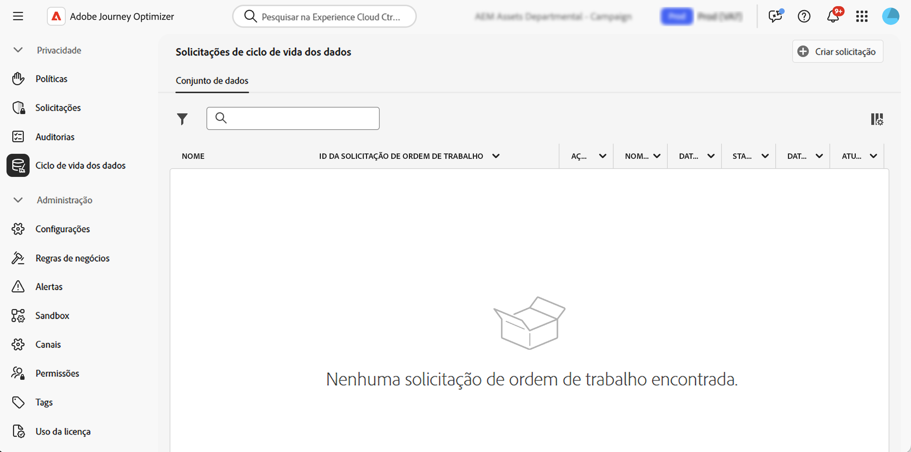

# Executar operações de ciclo de vida de dados {#data-hygiene}

>[!AVAILABILITY]
>
>Os recursos de ciclo de vida dos dados estão disponíveis atualmente apenas para organizações que adquiriram as ofertas complementares **Healthcare Shield** e **Privacy and Security Shield**.

À medida que os dados são assimilados continuamente na Adobe Experience Platform, é fundamental garantir que eles sejam usados conforme planejado, atualizados quando necessário e excluídos de acordo com as políticas organizacionais.

Essas tarefas podem ser realizadas usando o menu **[!UICONTROL Ciclo de vida de dados]**, que permite configurar e agendar operações de ciclo de vida de dados, garantindo que seus registros sejam mantidos adequadamente.

Para obter mais informações sobre o Privacy Service e como executar operações de ciclo de vida de dados, consulte a documentação da Adobe Experience Platform:

* [Visão geral do Privacy Service](https://experienceleague.adobe.com/docs/experience-platform/privacy/home.html?lang=pt-BR)
* [Ciclo de vida de dados na Adobe Experience Platform](https://experienceleague.adobe.com/docs/experience-platform/hygiene/home.html?lang=pt-BR)
