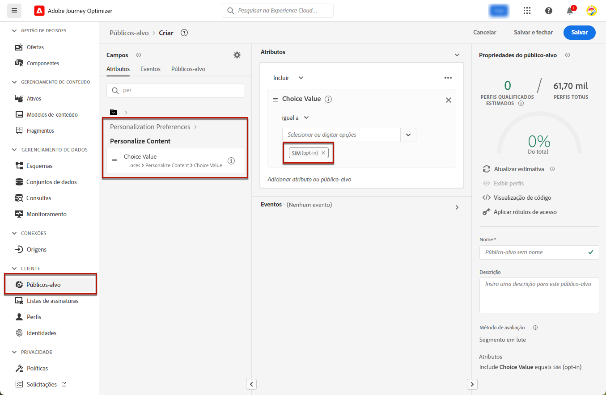
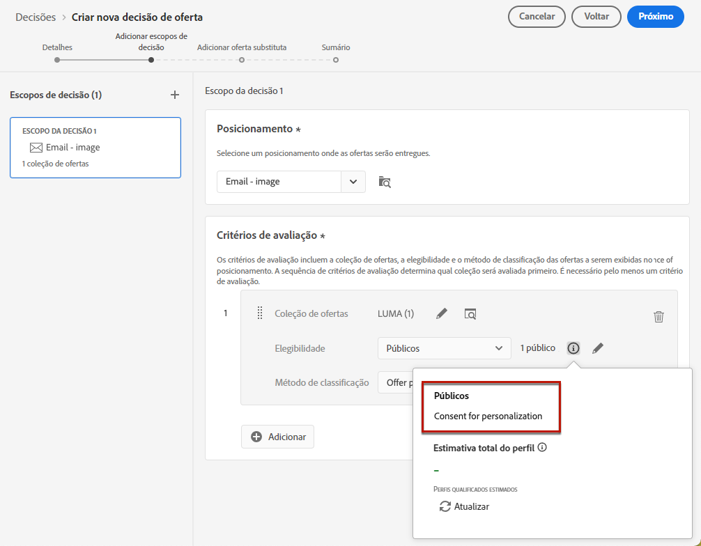
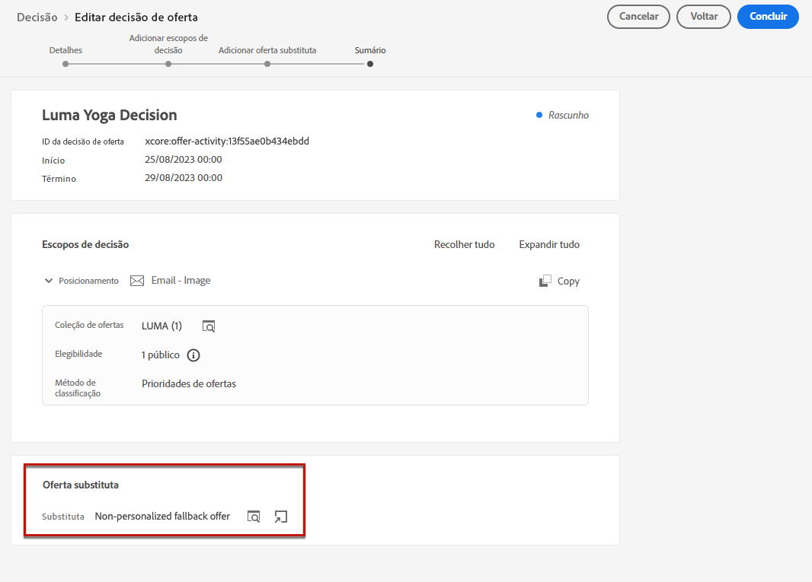
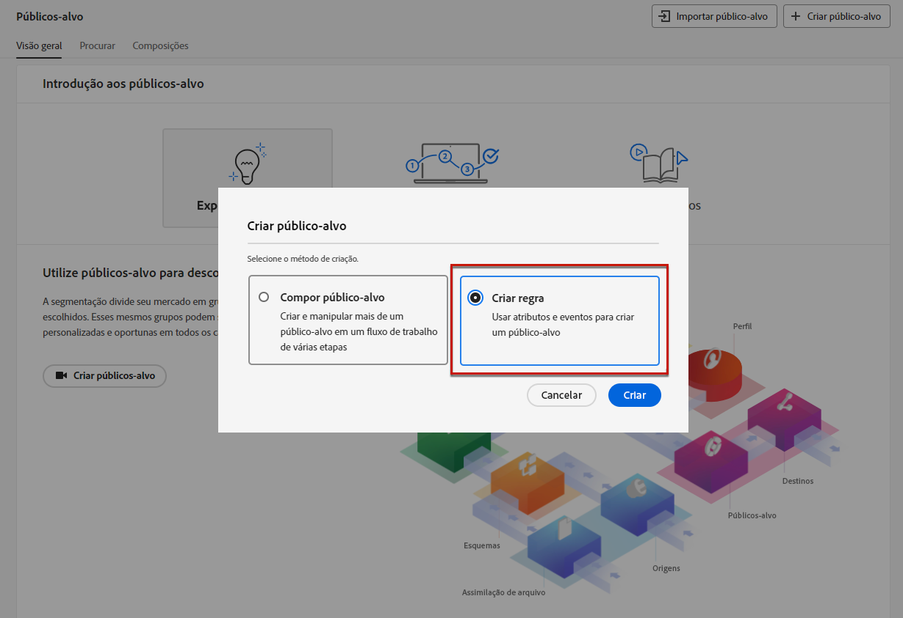
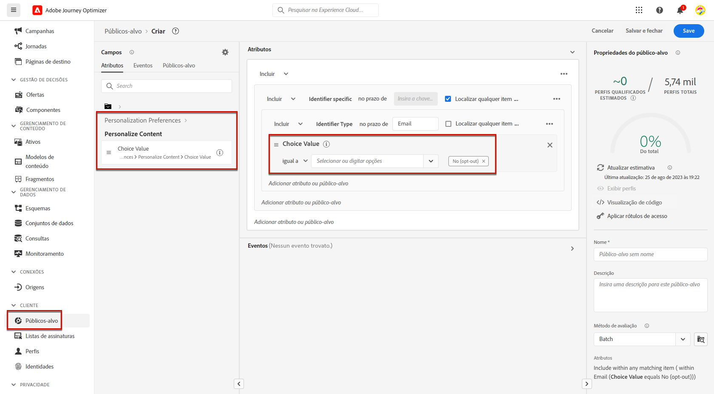
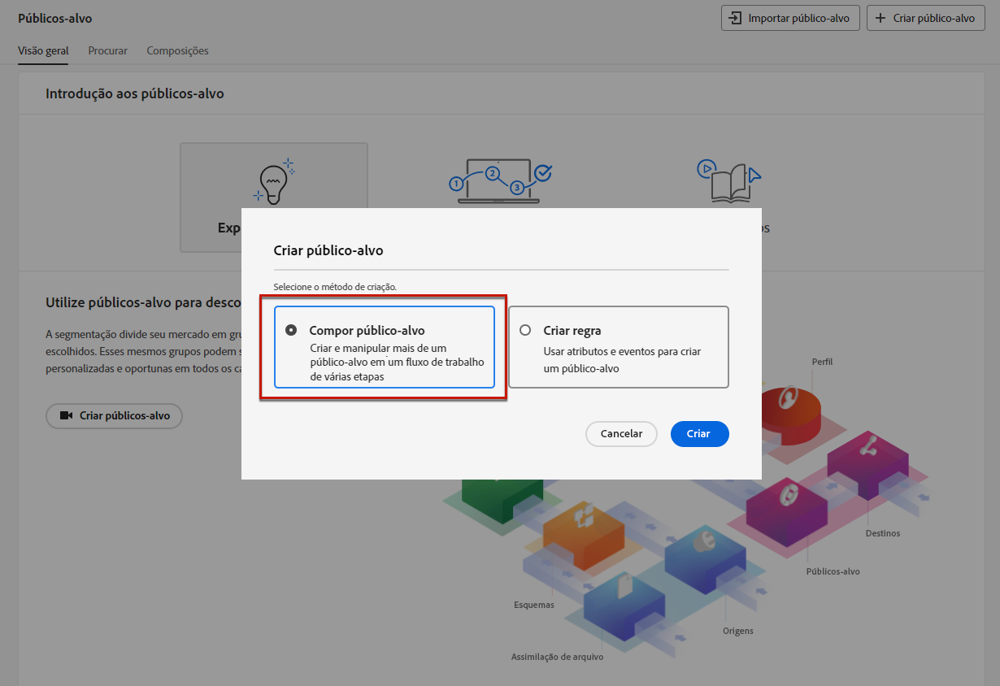
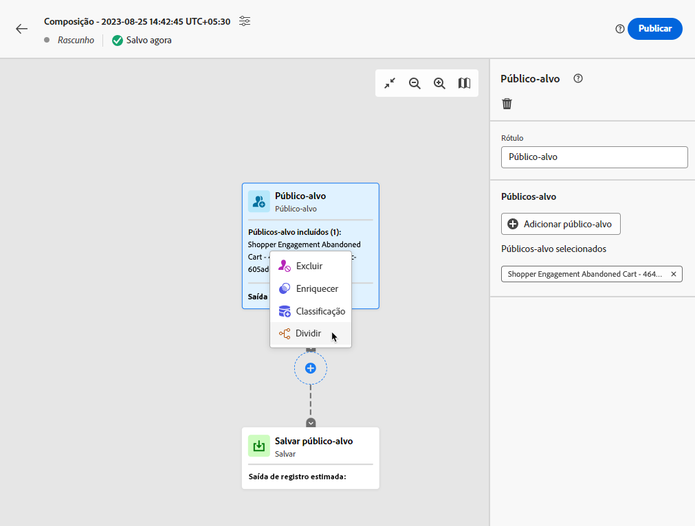
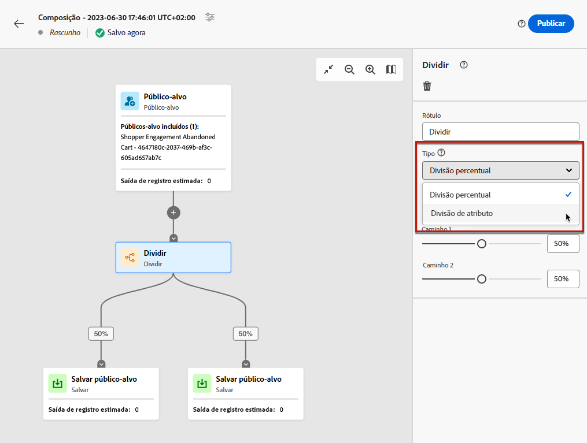
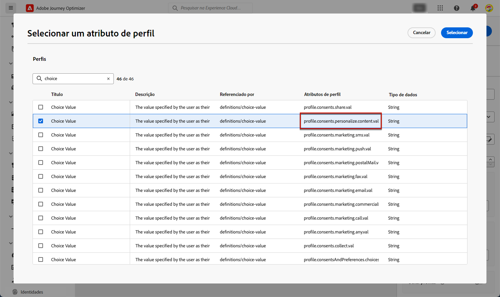
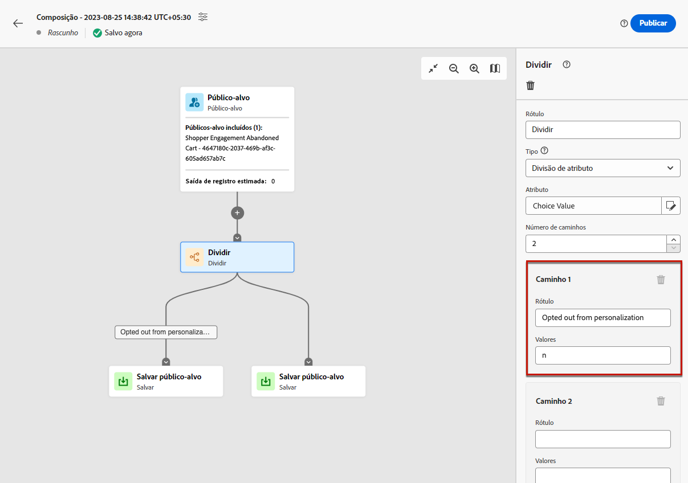

# Gerenciar recusa {#consent}

Fornecer aos destinatários a capacidade de cancelar inscrição do recebimento de comunicações de uma marca é um requisito legal, bem como garantir que essa escolha seja respeitada. O não cumprimento desses regulamentos traz riscos legais normativos para sua marca. Os regulamentos ajudam a evitar o envio de comunicações não solicitadas para seus destinatários, o que pode fazer com que eles marquem suas mensagens como spam e prejudiquem sua reputação.

Saiba mais sobre a legislação aplicável na [documentação da Experience Platform](https://experienceleague.adobe.com/docs/experience-platform/privacy/regulations/overview.html?lang=pt-BR#regulations){target="_blank"}.

## Gerenciar cancelamentos de inscrições em jornadas e campanhas {#opt-out-ajo}

Ao enviar mensagens de jornadas ou campanhas, você deve sempre garantir que os clientes possam cancelar a inscrição de comunicações futuras. Após o cancelamento da assinatura, os perfis serão removidos automaticamente do público-alvo de futuras mensagens de marketing.

Embora o **[!DNL Journey Optimizer]** forneça maneiras de gerenciar a opção de não participação em emails e mensagens SMS, as notificações por push não exigem nenhuma ação da sua parte, pois os destinatários podem cancelar a inscrição por meio dos seus próprios dispositivos. Por exemplo, ao baixar ou ao usar seu aplicativo, eles podem optar por parar as notificações. Da mesma forma, é possível alterar as configurações de notificação por meio do sistema operacional móvel.

>[!NOTE]
>
>Além disso, é possível aproveitar a **API REST de supressão** do Journey Optimizer para controlar as mensagens enviadas usando listas de supressão e de permissões. [Aprenda a trabalhar com a API REST de supressão](https://developer.adobe.com/journey-optimizer-apis/references/suppression/){target="_blank"}

Saiba como gerenciar a opção de não participação em emails e mensagens SMS do Journey Optimizer nestas seções:

<table style="table-layout:fixed"><tr style="border: 0;">
<td>

<a href="../email/email-opt-out.md"><strong>Gerenciamento de opção de não participação de email</strong>

</td>
<td>

<a href="../sms/sms-opt-out.md"><strong>Gerenciamento de opção de não participação de SMS</strong></a>

</td>
</tr></table>

>[!NOTE]
>
>No [!DNL Journey Optimizer], o consentimento é tratado pelo [Esquema de consentimento](https://experienceleague.adobe.com/docs/experience-platform/xdm/field-groups/profile/consents.html?lang=pt-BR) da Experience Platform{target="_blank"}. Por padrão, o valor do campo de consentimento fica vazio e é tratado como consentimento para receber suas comunicações. Durante a integração, é possível modificar esse valor padrão para um dos valores possíveis listados [aqui](https://experienceleague.adobe.com/docs/experience-platform/xdm/data-types/consents.html?lang=pt-BR#choice-values){target="_blank"}.

## Implementar consentimento de personalização {#opt-out-personalization}

Seus clientes também podem recusar a apresentação de conteúdo personalizado. Depois que um perfil recusar a personalização, será necessário garantir que seus dados não sejam usados para personalização, e qualquer conteúdo personalizado deve ser substituído por uma variante de fallback.

### Na Gestão de decisões {#opt-out-decision-management}

Ao usar ofertas, as preferências de personalização não são implementadas automaticamente nos [escopos de decisão](../offers/offer-activities/create-offer-activities.md#add-decision-scopes) usados a partir de uma solicitação de API de [decisão](../offers/api-reference/offer-delivery-api/decisioning-api.md) ou de [decisão de borda](../offers/api-reference/offer-delivery-api/edge-decisioning-api.md). Nesse caso, é necessário impor manualmente o consentimento da personalização. Para isso, siga as etapas abaixo.

>[!NOTE]
>
>Os escopos de decisão usados em canais de criação do [!DNL Journey Optimizer] atendem a esse requisito da jornada ou campanha a qual pertencem.

1. Crie um [Público-alvo da Adobe Experience Platform](../audience/access-audiences.md) usando o [Serviço de segmentação](https://experienceleague.adobe.com/docs/experience-platform/segmentation/ui/overview.html?lang=pt-BR){target="_blank"} e use um atributo de perfil, como **[!UICONTROL Personalizar conteúdo = Sim (aceitação)]** para direcionar usuários que consentiram com a personalização.

   

1. Ao criar uma [decisão](../offers/offer-activities/create-offer-activities.md), adicione um escopo de decisão e defina uma restrição de elegibilidade com base nesse público-alvo para cada coleção de critérios de avaliação que contenha ofertas personalizadas.

   

1. Crie uma [oferta substituta](../offers/offer-library/creating-fallback-offers.md) que não inclua conteúdo personalizado.

1. [Atribua](../offers/offer-activities/create-offer-activities.md#add-fallback) a oferta substituta não personalizada à decisão.

   

1. [Revise e salve](../offers/offer-activities/create-offer-activities.md#review) a decisão.

Se um usuário:

* tiver consentido a personalização, o escopo da decisão determinará a melhor oferta para esse perfil.

* não tiver consentido a personalização, o perfil correspondente não será qualificado para nenhuma das ofertas que estão nos critérios de avaliação e, portanto, receberá a oferta substituta não personalizada.

>[!NOTE]
>
>O consentimento para que os dados do perfil sejam usados na [modelagem de dados](../offers/ranking/ai-models.md) ainda não é aceito no [!DNL Journey Optimizer].

### No editor de personalização {#opt-out-expression-editor}

O [Editor de personalização](../personalization/personalization-build-expressions.md) em si não executa a aplicação nem verificações de consentimento, pois não está envolvido na entrega de mensagens.

No entanto, o uso de rótulos de controle de acesso baseados em direitos permite restringir quais campos podem ser usados na personalização. O serviço de [visualização de mensagens](../content-management/preview.md) e [renderização de email](../content-management/rendering.md) mascarará os campos identificados com informações confidenciais.

>[!NOTE]
>
>Saiba mais sobre o Controle de acesso no nível do objeto (OLAC) [nesta seção](../administration/object-based-access.md).

Nas campanhas do [!DNL Journey Optimizer], a política de consentimento é aplicada da seguinte maneira:

* Você pode incluir definições de política de consentimento como parte da criação do público-alvo para garantir que o público-alvo selecionado para a campanha já tenha **filtrado os perfis que não correspondem aos critérios de consentimento**.

* O [!DNL Journey Optimizer] executará uma verificação de consentimento geral no nível do canal para **garantir que os perfis tenham aceitado** receber comunicações de marketing no canal correspondente.

  >[!NOTE]
  >
  >O objeto da campanha do [!DNL Journey Optimizer] em si não executa verificações adicionais de aplicação de política de consentimento no momento.

Para impor manualmente o consentimento da personalização em campanhas, siga uma das opções abaixo.

### Utilizando do construtor de regras de segmentos

É possível usar o construtor de regras de segmentos para criar um público-alvo contendo perfis de recusa.

1. Criar um [Público-alvo da Adobe Experience Platform](../audience/access-audiences.md) usando o [Serviço de segmentação](https://experienceleague.adobe.com/docs/experience-platform/segmentation/ui/overview.html?lang=pt-BR){target="_blank"}.

   

1. Selecione um atributo de perfil, como **[!UICONTROL Personalizar conteúdo = Não (recusa)]** para excluir usuários que não consentiram com a personalização.

   

1. Clique em **[!UICONTROL Salvar]**.

Agora você pode usar esse público-alvo em suas campanhas para filtrar os perfis que não consentiram com a personalização.

### Uso de uma atividade de divisão em um fluxo de trabalho de composição

Também é possível adicionar uma verificação de consentimento de personalização a um público-alvo adicionando uma atividade de divisão a um fluxo de trabalho de composição.

1. Criar um público-alvo usando a opção **[!UICONTROL Compor público-alvo]**. [Saiba mais sobre como criar um fluxo de trabalho de composição](../audience/create-compositions.md)

   

1. Adicione seu público-alvo inicial usando o botão dedicado à direita.

1. Clique no ícone **+** e selecione a atividade de **[!UICONTROL Divisão]** para criar um público-alvo dividido. [Saiba mais sobre a atividade de divisão](../audience/composition-canvas.md#split)

   

1. No painel direito, selecione **[!UICONTROL Divisão de atributo]** como o tipo de divisão.

   

1. Clique no ícone de lápis ao lado do campo **[!UICONTROL Atributo]** para exibir a janela **[!UICONTROL Selecionar um atributo de perfil]**.

1. Pesquise o atributo de consentimento de personalização (`profile.consents.personalize.content.val`) e selecione-o.

   

1. **[!UICONTROL Caminho 1]** será o público-alvo não personalizado. Escolha um rótulo relevante.

1. Escolha o valor apropriado nesta [lista](https://experienceleague.adobe.com/docs/experience-platform/xdm/data-types/consents.html?lang=pt-BR#choice-values){target="_blank"}.

   Nesse caso, usaremos `n` para indicar que os usuários não consentiram com o uso de seus dados para personalização.

   

1. É possível criar um caminho separado para outros valores de escolha. Você também pode optar por excluir os caminhos restantes e ativar **[!UICONTROL Outros perfis]** para incluir todos os outros perfis que não tinham um valor de escolha de `n`.

1. Quando terminar, clique em **[!UICONTROL Salvar público-alvo]** para cada caminho para salvar o resultado do fluxo de trabalho em um novo público-alvo. Um público-alvo será salvo na Adobe Experience Platform para cada caminho.

1. Depois de concluído, publique o fluxo de trabalho de composição.

Agora você pode usar esse público-alvo em suas campanhas para filtrar os perfis que não consentiram com a personalização.

>[!NOTE]
>
>Se você criar um público-alvo que não consentiu com a personalização e selecionar esse público-alvo em uma campanha, as ferramentas de personalização permanecerão disponíveis. Cabe à equipe de marketing entender que ao trabalhar com um público-alvo que não pode receber personalização, o uso de ferramentas de personalização não deve ser feito.
