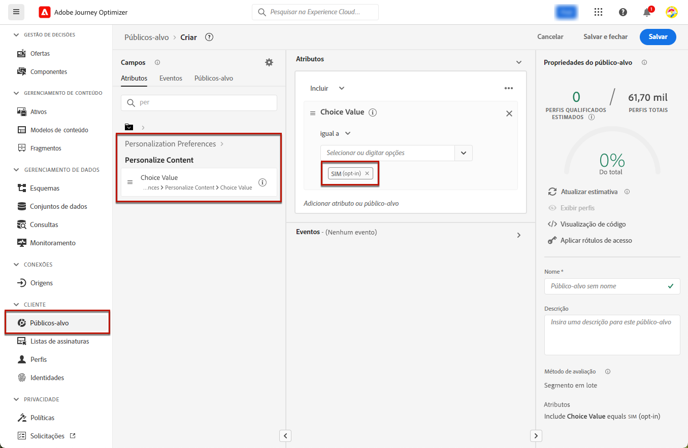
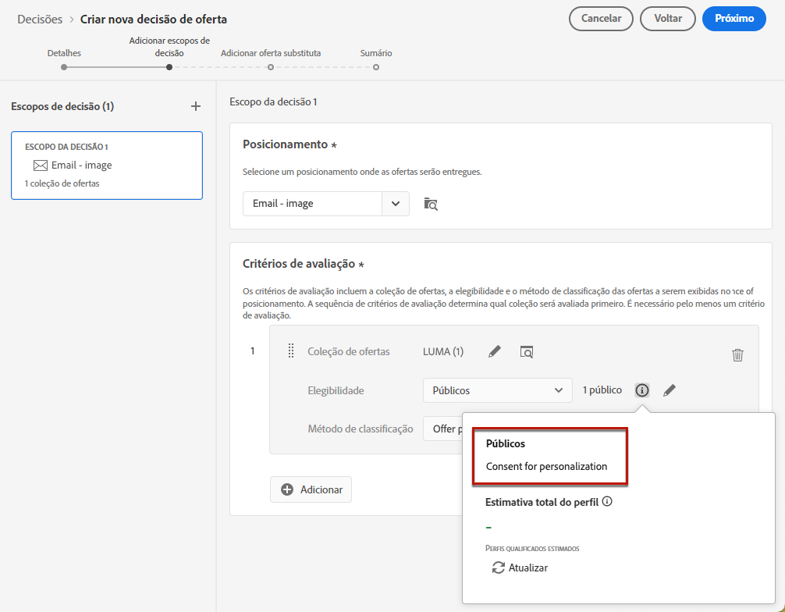
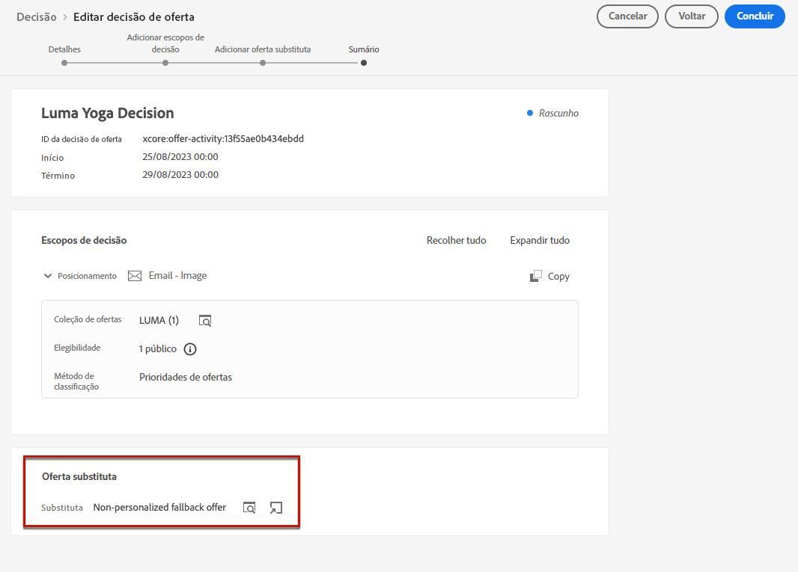
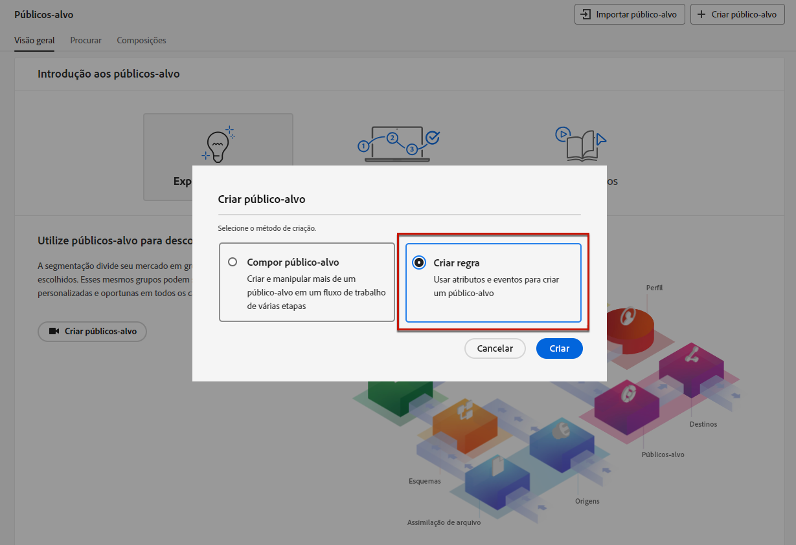
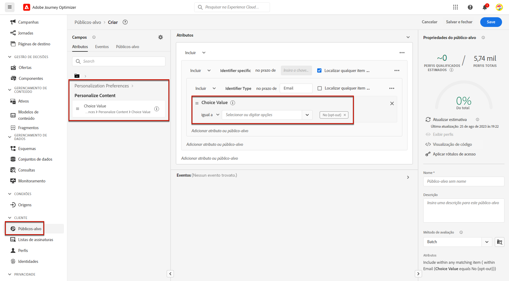
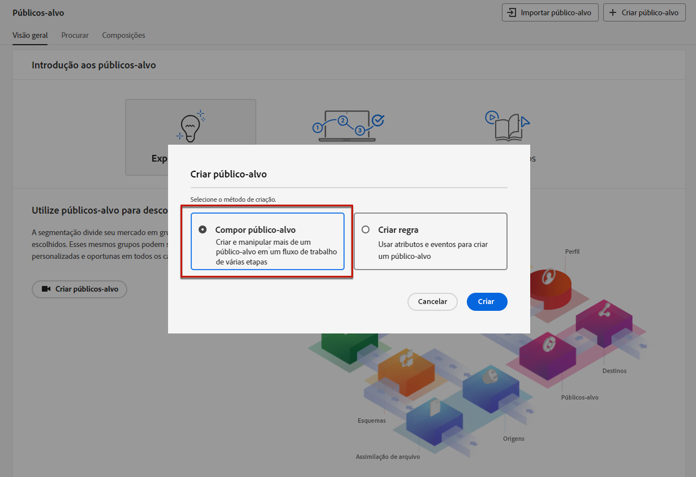
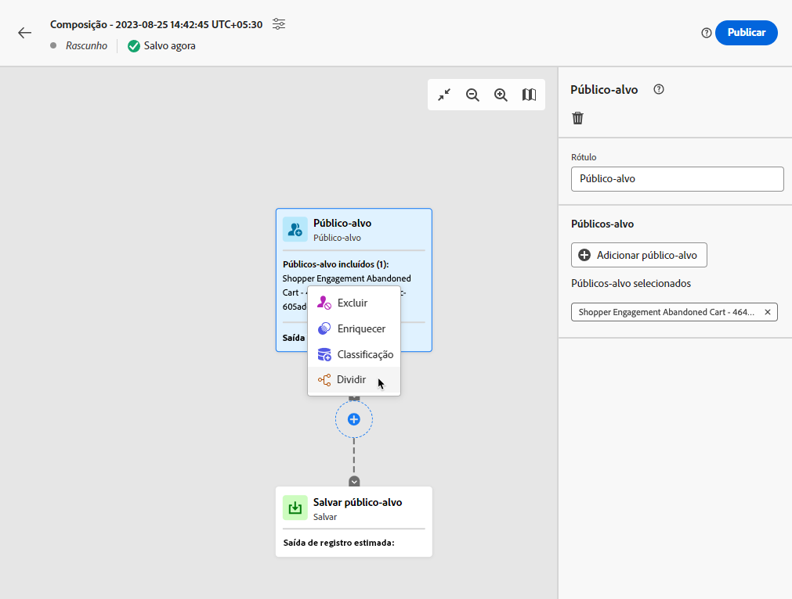
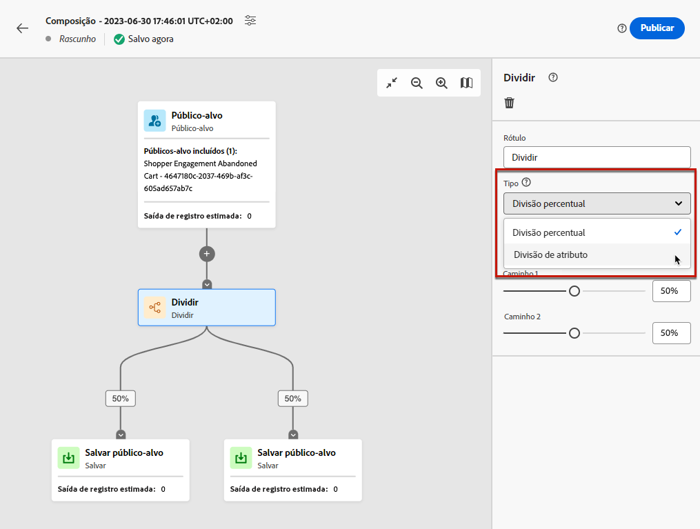
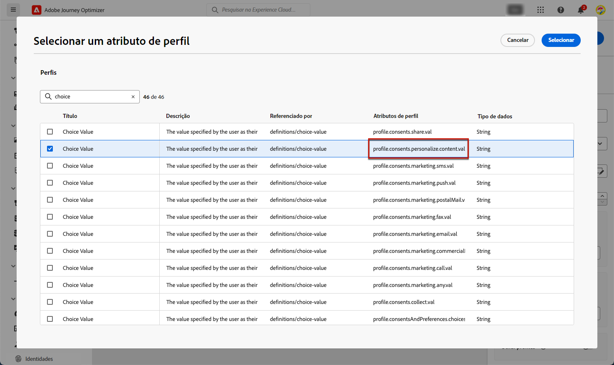
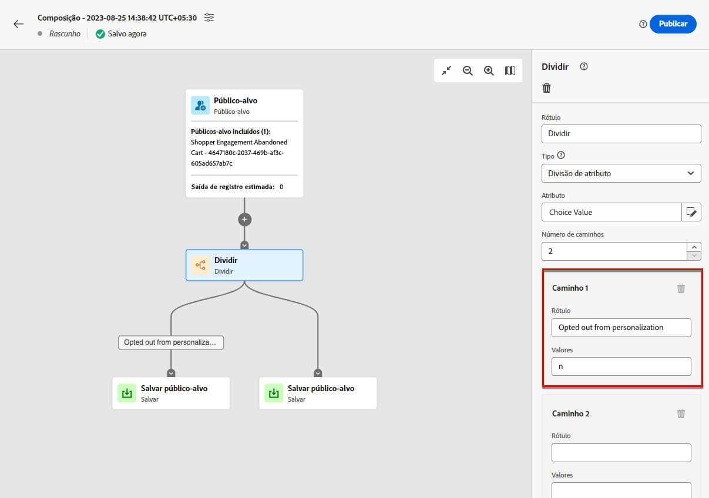

# Gerenciar recusa {#consent}

Fornecer aos recipients a capacidade de cancelar a inscrição para receber comunicações de uma marca é um requisito legal, bem como garantir que essa escolha seja respeitada. O não cumprimento desses regulamentos traz riscos legais normativos para sua marca. Ele ajuda a evitar o envio de comunicações não solicitadas para seus recipients, o que pode fazer com que eles marquem suas mensagens como spam e prejudiquem sua reputação.

Saiba mais sobre a legislação aplicável na [documentação do Experience Platform](https://experienceleague.adobe.com/docs/experience-platform/privacy/regulations/overview.html?lang=pt-BR#regulations){target="_blank"}.

## Gerenciar cancelamentos de subscrições em jornadas e campanhas {#opt-out-ajo}

Ao enviar mensagens de jornadas ou campanhas, você deve sempre garantir que os clientes possam cancelar a inscrição de comunicações futuras. Após o cancelamento da assinatura, os perfis serão removidos automaticamente do público-alvo de futuras mensagens de marketing.

Embora o **[!DNL Journey Optimizer]** forneça maneiras de gerenciar a opção de não participação em emails e mensagens SMS, as notificações por push não exigem nenhuma ação da sua parte, pois os destinatários podem cancelar a inscrição por meio dos seus próprios dispositivos. Por exemplo, ao baixar ou ao usar seu aplicativo, eles podem optar por parar as notificações. Da mesma forma, é possível alterar as configurações de notificação por meio do sistema operacional móvel.

>[!NOTE]
>
>Além disso, você pode usar a **API REST de Supressão** do Journey Optimizer para controlar mensagens de saída usando supressão e listas de permissões. [Saiba como trabalhar com a API REST de Supressão](https://developer.adobe.com/journey-optimizer-apis/references/suppression){target="_blank"}

### Verificar status de recusa por push {#push-opt-out-status}

A recusa por push para aplicativos móveis é tratada no nível do dispositivo: quando um usuário desativa notificações no dispositivo, o token de push é removido do perfil. A **presença de um token de push** em um perfil é, portanto, o indicador de consentimento de push implícito.

Para verificar o status de consentimento por push de um perfil no Adobe Experience Platform:

1. Abra o perfil na seção **[!UICONTROL Perfis]** do Adobe Experience Platform.
1. Vá para a guia **[!UICONTROL Atributos]** e procure o grupo de campos **[!UICONTROL Detalhes da Notificação por Push]**.
1. Se um token de push estiver presente, o perfil consentiu implicitamente em receber notificações por push. Se nenhum token for encontrado, o usuário optou por não participar no nível do dispositivo.

>[!NOTE]
>
>Para casos de uso de conformidade que exigem rastreamento explícito de consentimento por push, use o atributo **`consents.marketing.push.val`** do [grupo de campos Consentimentos e Preferências](https://experienceleague.adobe.com/docs/experience-platform/xdm/field-groups/profile/consents.html?lang=pt-BR){target="_blank"}. Um valor de `y` indica aceitação explícita; `n` indica recusa explícita.

Saiba como gerenciar a opção de não participação em emails e mensagens SMS do Journey Optimizer nestas seções:

<table style="table-layout:fixed"><tr style="border: 0;">
<td>

<a href="../email/email-opt-out.md"><strong>Gerenciamento de opção de não participação de email</strong>

</td>
<td>

<a href="../sms/sms-opt-out.md"><strong>Gerenciamento de recusa de SMS</strong></a>

</td>
</tr></table>

>[!NOTE]
>
>Em [!DNL Journey Optimizer], o consentimento é gerido pelo [Esquema de consentimento](https://experienceleague.adobe.com/docs/experience-platform/xdm/field-groups/profile/consents.html?lang=pt-BR){target="_blank"} da Experience Platform. Por padrão, o valor do campo de consentimento fica vazio e é tratado como consentimento para receber suas comunicações. Durante a integração, é possível modificar este valor padrão para um dos valores possíveis listados [aqui](https://experienceleague.adobe.com/docs/experience-platform/xdm/data-types/consents.html?lang=pt-BR#choice-values){target="_blank"} ou usar [políticas de consentimento](../action/consent.md) para substituir a lógica padrão.

## Implementar consentimento de personalização {#opt-out-personalization}

Seus clientes também podem recusar a apresentação de conteúdo personalizado. Depois que um perfil optar por não ser personalizado, você precisará garantir que os dados dele não sejam usados para personalização e substituir qualquer conteúdo personalizado por uma variante de fallback.

### Na gestão de decisões {#opt-out-decision-management}

Ao aproveitar ofertas, as preferências de personalização não são implementadas automaticamente nos [escopos de decisão](../offers/offer-activities/create-offer-activities.md#add-decision-scopes) usados a partir de uma solicitação de API de [decisão](../offers/api-reference/offer-delivery-api/decisioning-api.md) ou de [decisão de borda](../offers/api-reference/offer-delivery-api/edge-decisioning-api.md). Nesse caso, é necessário impor manualmente o consentimento da personalização. Para fazer isso, siga as etapas abaixo.

>[!NOTE]
>
>Os escopos de decisão usados em [!DNL Journey Optimizer] canais criados atendem a esse requisito da jornada ou campanha à qual pertencem.

1. Crie um [público-alvo do Adobe Experience Platform](../audience/about-audiences.md) usando o [Serviço de Segmentação](https://experienceleague.adobe.com/docs/experience-platform/segmentation/ui/overview.html?lang=pt-BR){target="_blank"} e use um atributo de perfil como **[!UICONTROL Personalizar Conteúdo = Sim (aceitar)]** para direcionar usuários que consentiram com a personalização.

   

1. Ao criar uma [decisão](../offers/offer-activities/create-offer-activities.md), adicione um escopo de decisão e defina uma restrição de qualificação com base nesse público-alvo para cada coleção de critérios de avaliação que contenha ofertas personalizadas.

   

1. Crie uma [oferta substituta](../offers/offer-library/creating-fallback-offers.md) que não inclua conteúdo personalizado.

1. [Atribuir](../offers/offer-activities/create-offer-activities.md#add-fallback) a oferta substituta não personalizada à decisão.

   

1. [Revise e salve](../offers/offer-activities/create-offer-activities.md#review) a decisão.

Se um usuário tiver:

* consentido para personalização, o escopo da decisão determinará a melhor oferta para esse perfil.

* não consentido para personalização, o perfil correspondente não será qualificado para nenhuma das ofertas que estão nos critérios de avaliação e, portanto, receberá a oferta substituta não personalizada.

>[!NOTE]
>
>O consentimento para ter dados de perfil usados em [modelagem de dados](../offers/ranking/ai-models.md) ainda não tem suporte em [!DNL Journey Optimizer].

### No editor de personalização {#opt-out-expression-editor}

O próprio [editor de personalização](../personalization/personalization-build-expressions.md) não executa nenhuma verificação de consentimento ou imposição, pois não está envolvido na entrega de mensagens.

No entanto, o uso de rótulos de controle de acesso baseados na direita permite restringir quais campos podem ser usados para personalização. O [serviço de visualização de mensagens](../content-management/preview.md) e o [serviço de renderização de emails](../content-management/rendering.md) mascararão os campos identificados com informações confidenciais.

>[!NOTE]
>
>Saiba mais sobre OLAC (Controle de acesso em nível de objeto) em [esta seção](../administration/object-based-access.md).

Em [!DNL Journey Optimizer] campanhas, a política de consentimento é imposta da seguinte maneira:

* Você pode incluir definições de política de consentimento como parte da criação de público para garantir que o público selecionado para a campanha já tenha **perfis filtrados que não correspondem aos critérios de consentimento**.

* O [!DNL Journey Optimizer] executará uma verificação de consentimento geral no nível do canal para **garantir que os perfis optaram por** receber comunicações de marketing no canal correspondente.

  >[!NOTE]
  >
  >O próprio objeto de campanha [!DNL Journey Optimizer] não executa nenhuma verificação de aplicação de política de consentimento adicional no momento.

Para aplicar manualmente o consentimento de personalização em campanhas, siga uma das opções abaixo.

### Uso do construtor de regras de segmento

Você pode usar o construtor de regras de segmento para criar um público-alvo contendo perfis de recusa.

1. Crie um [público-alvo do Adobe Experience Platform](../audience/about-audiences.md) usando o [Serviço de Segmentação](https://experienceleague.adobe.com/docs/experience-platform/segmentation/ui/overview.html?lang=pt-BR){target="_blank"}.

   

1. Selecione um atributo de perfil, como **[!UICONTROL Personalizar conteúdo = Não (recusar)]**, para excluir usuários que não consentiram com a personalização.

   

1. Clique em **[!UICONTROL Salvar]**.

Agora você pode usar esse público para filtrar os perfis que não consentiram com a personalização de suas campanhas.

### Uso de uma atividade Split em um fluxo de trabalho de composição

Você também pode adicionar uma verificação de consentimento de personalização a um público-alvo adicionando uma atividade dividida a um fluxo de trabalho de composição.

1. Crie um público usando a opção **[!UICONTROL Compor público-alvo]**. [Saiba mais sobre como criar um fluxo de trabalho de composição](../audience/get-started-audience-orchestration.md)

   

1. Adicione o público inicial usando o botão dedicado à direita.

1. Clique no ícone **+** e selecione uma atividade **[!UICONTROL Split]** para criar uma divisão de público.

   

1. No painel direito, selecione **[!UICONTROL Divisão de atributo]** como o tipo de divisão.

   

1. Clique no ícone de lápis ao lado do campo **[!UICONTROL Atributo]** para abrir a janela **[!UICONTROL Selecionar um atributo de perfil]**.

1. Procure o atributo de consentimento de personalização (`profile.consents.personalize.content.val`) e selecione-o.

   

1. **[!UICONTROL Caminho 1]** será o público não personalizado. Escolha um rótulo relevante.

1. Escolha o valor apropriado nesta [lista](https://experienceleague.adobe.com/docs/experience-platform/xdm/data-types/consents.html?lang=pt-BR#choice-values){target="_blank"}.

   Nesse caso, usaremos `n` para indicar que os usuários não consentirão com o uso de seus dados para personalização.

   

1. Você pode criar um caminho separado para outros valores de escolha. Você também pode optar por excluir os caminhos restantes e ativar **[!UICONTROL Outros perfis]** para incluir todos os outros perfis que não tinham um valor de opção de `n`.

1. Depois de concluído, clique em **[!UICONTROL Salvar público-alvo]** para cada caminho para salvar o resultado do fluxo de trabalho em um novo público-alvo. Um público-alvo será salvo no Adobe Experience Platform para cada caminho.

1. Depois de concluído, publique o fluxo de trabalho de composição.

Agora você pode usar esse público para filtrar os perfis que não consentiram com a personalização de suas campanhas.

>[!NOTE]
>
>Se você criar um público-alvo que não consentiu com a personalização e depois selecionar esse público-alvo em uma campanha, as ferramentas de personalização permanecerão disponíveis. Cabe aos usuários de marketing entender que, se estiverem trabalhando com um público-alvo que não deve receber personalização, eles não devem usar ferramentas de personalização.
