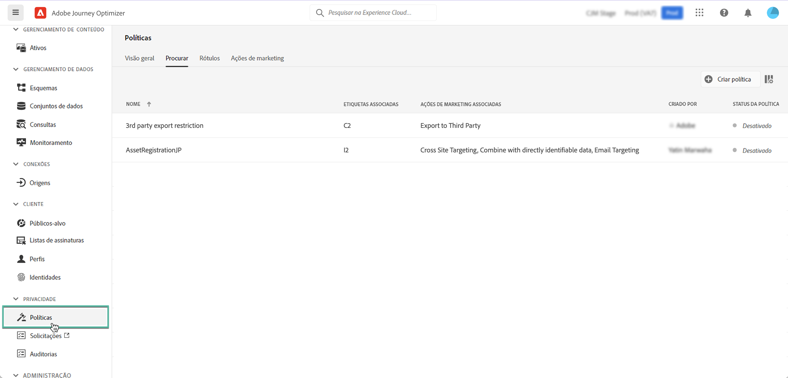

# Políticas de uso de dados {#Policies}

Com o **serviço de governança de dados** da Adobe Experience Platform, é possível aplicar restrições de uso de dados por meio de rótulos, ações de marketing e políticas.

Para fazer isso, o serviço de governança de dados permite aplicar rótulos de uso de dados a conjuntos de dados e campos, categorizando cada um de acordo com as políticas de uso de dados relacionadas.

As políticas de uso de dados são regras que descrevem os tipos de ações de marketing que você tem permissão ou restrição para executar em dados dentro da Experience Platform. Elas podem ser acessados pelo menu **[!UICONTROL Policies]**.

Para obter mais informações sobre a estrutura de governança de dados e como trabalhar com rótulos e políticas, consulte a documentação da Adobe Experience Platform:

* [Visão geral do serviço de governança de dados](https://experienceleague.adobe.com/docs/experience-platform/data-governance/home.html?lang=pt-BR)
* [Visão geral dos rótulos de uso de dados](https://experienceleague.adobe.com/docs/experience-platform/data-governance/labels/overview.html?lang=pt-BR)
* [Políticas de uso de dados](https://experienceleague.adobe.com/docs/experience-platform/data-governance/policies/overview.html?lang=pt-BR)
