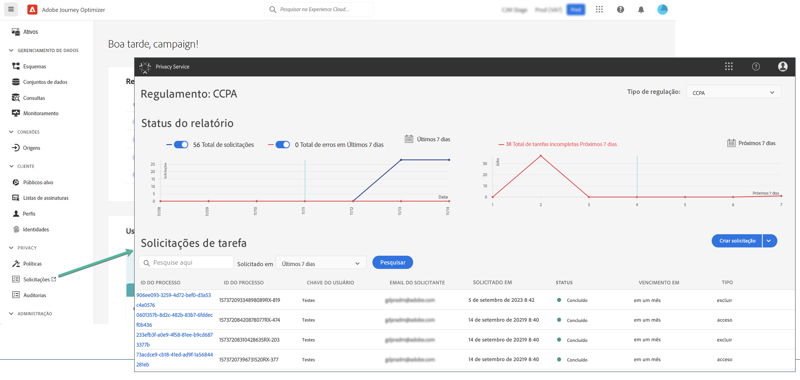

# Solicitações de privacidade {#track-changes}

Adobe Experience Platform **Privacy Service** O fornece uma RESTful API e interface do usuário para ajudar você a gerenciar solicitações de dados do cliente. Com o Privacy Service, você pode enviar solicitações para acessar e excluir dados pessoais de clientes dos aplicativos da Adobe Experience Cloud, facilitando a conformidade automatizada com as regulamentações legais e organizacionais de privacidade.

As solicitações de privacidade podem ser criadas e gerenciadas no **[!UICONTROL Requests]** menu.

Para obter mais informações sobre o Privacy Service e como criar e gerenciar solicitações de privacidade, consulte a documentação da Adobe Experience Platform:

* [Visão geral do Privacy Service](https://experienceleague.adobe.com/docs/experience-platform/privacy/home.html)
* [Gerenciamento de tarefas de privacidade na interface do usuário do Privacy Service](https://experienceleague.adobe.com/docs/experience-platform/privacy/ui/user-guide.html)
