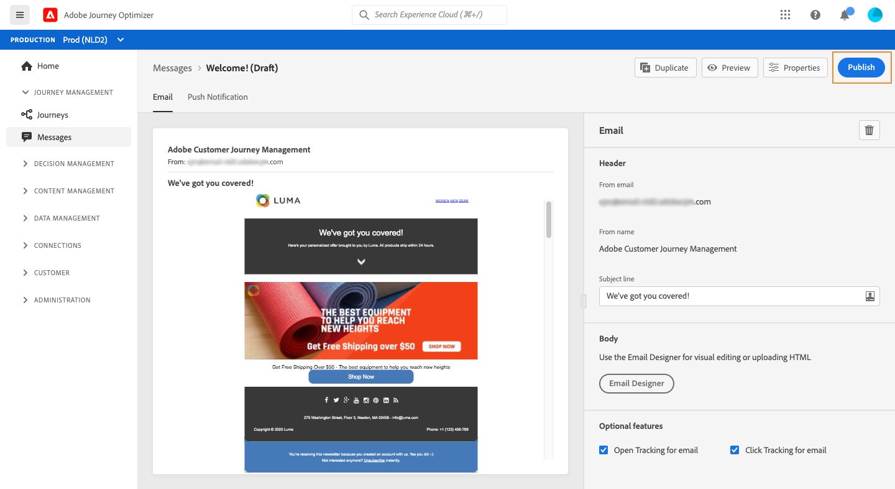

# Publicar suas mensagens {#publish-manage-messages}

## Publicar uma mensagem {#publish-message}

Depois que a mensagem tiver sido criada, você poderá publicá-la para disponibilizá-la para execução.

>[!CAUTION]
>
>Antes de publicar, verifique e resolva os alertas. [Saiba mais](alerts.md)

Depois que a mensagem é publicada, ela é adicionada à lista de mensagens com o status **[!UICONTROL Published]** .

Agora ele está pronto para ser acionado por um ou mais [jornada](building-journeys/journey.md).

## Atualizar uma mensagem só de leitura {#modify-message}

Após a publicação, uma mensagem fica no modo somente leitura. Você ainda pode atualizá-la criando um novo rascunho dessa mensagem.

Isso permite atualizar o conteúdo ou corrigir um problema, por exemplo, sem republicar a jornada inteira em que a mensagem é usada.

>[!NOTE]
>
>A versão de rascunho pode ser editada enquanto a versão publicada ainda estiver publicada e ativa.

Para atualizar uma mensagem publicada:

1. Na lista de mensagens, selecione a mensagem para abri-la.

1. Clique em **[!UICONTROL Modify]**.

   

1. Confirme sua escolha. Uma versão de rascunho da mensagem é criada.

   

1. Edite o conteúdo ou altere as configurações conforme desejado.
1. Clique em **[!UICONTROL Publish]**. Esta ação publicará a nova versão da mensagem que será usada para as próximas execuções.

Assim que a nova versão for publicada, após a próxima chamada da API, uma nova execução de mensagem será gerada. O próximo perfil de entrada receberá a nova versão.

<!--For batch messages, the audience/segment being processed in the previous execution will not be affected by the new version. Only the next incoming API call with an audience/segment will generate a new message execution with the new version. -->
