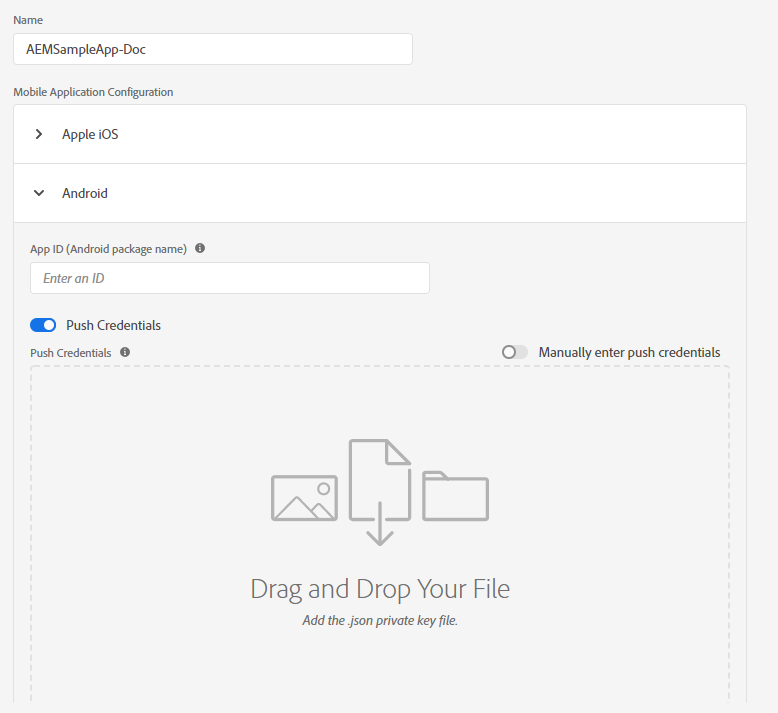
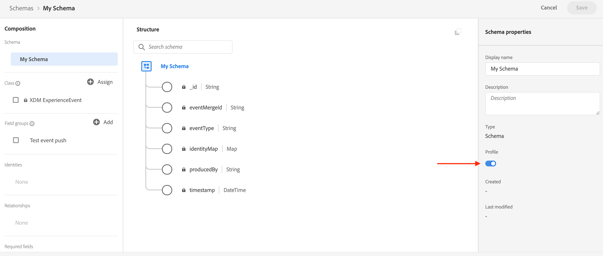
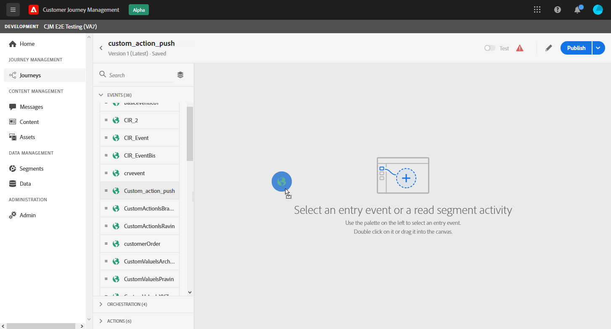
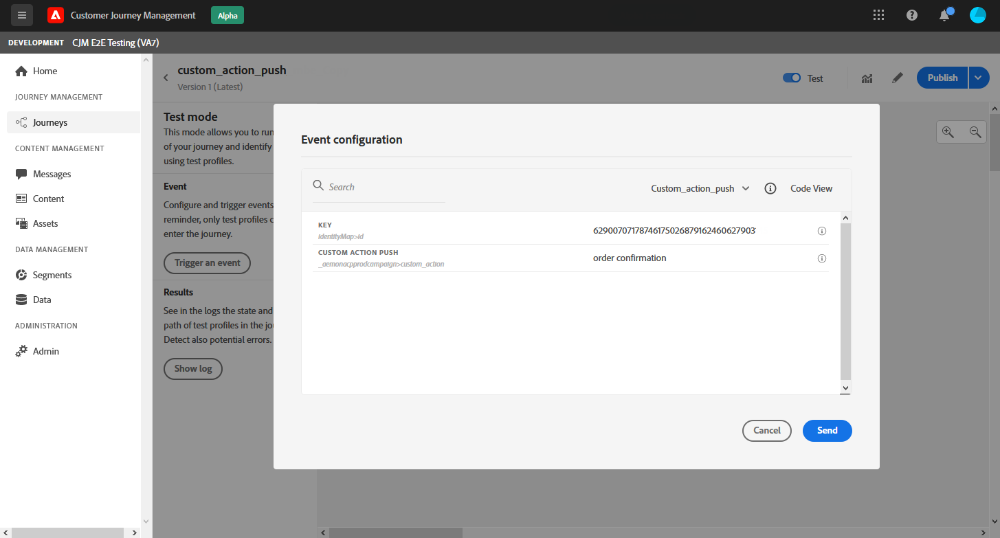

# Configurar canal de notificação por push {#push-notification-configuration}

[!DNL Journey Optimizer] O permite criar suas jornadas e enviar mensagens para o público-alvo. Antes de começar a enviar notificações por push com [!DNL Journey Optimizer], é necessário garantir que as configurações e integrações estejam em vigor no aplicativo móvel e em [!DNL Adobe Experience Platform] e [!DNL Adobe Experience Platform Launch]. Para entender o fluxo de dados das Notificações por push em [!DNL Adobe Journey Optimizer], consulte [esta página](push-gs.md).

## Antes de começar

<!--
### Check provisioning

Your Adobe Experience Platform account must be provisioned to contain following schemas and datasets for push notification data flow to function correctly:

| Schema <br>Dataset                                                                       | Group of fields                                                                                                                                                                         | Operation                                                |
| -------------------------------------------------------------------------------------- | --------------------------------------------------------------------------------------------------------------------------------------------------------------------------------------- | -------------------------------------------------------- |
| CJM Push Profile Schema <br>CJM Push Profile Dataset                                     | Push Notification Details<br>Adobe CJM ExperienceEvent - Message Profile Details<br>Adobe CJM ExperienceEvent - Message Execution Details<br>Application Details<br>Environment Details | Register Push Token                                      |
| CJM Push Tracking Experience Event Schema<br>CJM Push Tracking Experience Event Dataset | Push Notification Tracking                                                                                                                                                              | Track interactions and provide data for the reporting UI |
-->

### Configurar permissões

Antes de criar um aplicativo móvel, primeiro verifique se você tem ou atribui as permissões de usuário corretas em **Adobe Experience Platform Launch**. Saiba mais em [Documentação do Adobe Experience Platform Launch](https://experienceleague.adobe.com/docs/experience-platform/tags/admin/user-permissions.html){target=&quot;_blank&quot;}.

>[!CAUTION]
>
>A configuração de push deve ser executada por um usuário especialista. Dependendo do modelo de implementação e das pessoas envolvidas nesta implementação, talvez seja necessário atribuir o conjunto completo de permissões a um único perfil de produto ou compartilhar permissões entre o desenvolvedor do aplicativo e o administrador do **Adobe Journey Optimizer**. Saiba mais sobre as permissões do **Adobe Experience Platform Launch** em [esta documentação](https://experienceleague.adobe.com/docs/experience-platform/tags/admin/user-permissions.html#platform-launch-permissions){target=&quot;_blank&quot;}.

<!--ou need to your have access to perform following roles :

* Manage Datastreams
* Manage Client-side Properties
* Manage App Configurations
-->

Para atribuir direitos de **Propriedade** e **Empresa**, siga as etapas abaixo:

1. Acesse o **[!DNL Admin Console]**.

1. Na guia **[!UICONTROL Products]**, selecione o cartão **[!UICONTROL Adobe Experience Platform Launch]**.

   

1. Selecione um **[!UICONTROL Product Profile]** existente ou crie um novo com o botão **[!UICONTROL New profile]**. Saiba como criar um novo **[!UICONTROL New profile]** na [documentação do Admin Console](https://experienceleague.adobe.com/docs/experience-platform/access-control/ui/create-profile.html#ui){target=&quot;_blank&quot;}.

1. Na guia **[!UICONTROL Permissions]**, selecione **[!UICONTROL Property rights]**.

   

1. Clique em **[!UICONTROL Add all]**. Isso adicionará o seguinte direito ao perfil de produto:
   * **[!UICONTROL Approve]**
   * **[!UICONTROL Develop]**
   * **[!UICONTROL Manage Environments]**
   * **[!UICONTROL Manage Extensions]**
   * **[!UICONTROL Publish]**

   Essas permissões são necessárias para instalar e publicar a extensão do Adobe Journey Optimizer e publicar a propriedade do aplicativo no Adobe Experience Platform Mobile SDK.

1. Em seguida, selecione **[!UICONTROL Company rights]** no menu à esquerda.

   

1. Adicione os seguintes direitos:

   * **[!UICONTROL Manage App Configurations]**
   * **[!UICONTROL Manage Properties]**

   Essas permissões são necessárias para que o desenvolvedor do aplicativo móvel configure credenciais de push em **Adobe Experience Launch** e defina predefinições de Notificação por push em **Adobe Journey Optimizer**.

   

1. Clique em **[!UICONTROL Save]**.

Para atribuir esse **[!UICONTROL Product profile]** aos usuários, siga as etapas abaixo:

1. Acesse o **[!DNL Admin Console]**.

1. Na guia **[!UICONTROL Products]**, selecione o cartão **[!UICONTROL Adobe Experience Platform Launch]**.

1. Selecione o **[!UICONTROL Product profile]** configurado anteriormente.

1. Na guia **[!UICONTROL Users]**, clique em **[!UICONTROL Add user]**.

   

1. Digite o nome do usuário ou endereço de email e selecione o usuário. Em seguida, clique em **[!UICONTROL Save]**.

   >[!NOTE]
   >
   >Se o usuário não tiver sido criado anteriormente no Admin Console, consulte a [Documentação Adicionar usuários](https://helpx.adobe.com/enterprise/admin-guide.html/enterprise/using/manage-users-individually.ug.html#add-users).

   

### Configurar seu aplicativo

A configuração técnica envolve uma estreita colaboração entre o desenvolvedor do aplicativo e o administrador comercial. Antes de começar a enviar notificações por push com [!DNL Journey Optimizer], é necessário definir configurações no Adobe Experience Platform Launch e integrar seu aplicativo móvel aos SDKs do Adobe Experience Platform Mobile.

Siga as etapas de implementação detalhadas nos links abaixo:

* Para **Apple iOS**: Saiba como registrar seu aplicativo com APNs em [Documentação da Apple](https://developer.apple.com/documentation/usernotifications/registering_your_app_with_apns){target=&quot;_blank&quot;}
* Para **Google Android**: Saiba como configurar um aplicativo cliente Firebase Cloud Messaging no Android em [Documentação do Google](https://firebase.google.com/docs/cloud-messaging/android/client){target=&quot;_blank&quot;}

### Integrar seu aplicativo móvel ao SDK do Adobe Experience Platform

O Adobe Experience Platform Mobile SDK fornece APIs de integração do lado do cliente para dispositivos móveis por meio de SDKs compatíveis com Android e iOS. Siga [Documentação do SDK do Adobe Experience Platform Mobile](https://aep-sdks.gitbook.io/docs/getting-started/overview){target=&quot;_blank&quot;} para obter a configuração com os SDKs do Adobe Experience Platform Mobile em seu aplicativo.

Ao final disso, você também deve ter criado e configurado uma propriedade móvel no Adobe Experience Platform Launch. Normalmente, você cria uma propriedade móvel para cada aplicativo móvel que deseja gerenciar. Saiba como criar e configurar uma propriedade móvel na [documentação do Adobe Experience Platform Launch](https://aep-sdks.gitbook.io/docs/getting-started/create-a-mobile-property){target=&quot;_blank&quot;}.


## Etapa 1: Adicionar suas credenciais de push do aplicativo no Adobe Experience Platform Launch {#push-credentials-launch}

Após conceder as permissões de usuário corretas, agora é necessário adicionar suas credenciais de push do aplicativo móvel em [!DNL Adobe Experience Platform Launch].

O registro de credenciais de push do aplicativo móvel é necessário para autorizar o Adobe a enviar notificações por push em seu nome. Consulte as etapas detalhadas abaixo:

1. Em [!DNL Adobe Experience Platform Launch], verifique se **[!UICONTROL Client Side]** está selecionado no menu suspenso.

1. Selecione a guia **[!UICONTROL App Configurations]** no painel esquerdo e clique em **[!UICONTROL App Configuration]** para criar uma nova configuração.

1. Insira um **[!UICONTROL Name]** para a configuração.

1. No menu suspenso **[!UICONTROL Messaging Service Type]**, selecione o **[!UICONTROL Messaging service type]** a ser usado para essas credenciais.

   * **Para Android**

      

      1. Forneça o **[!UICONTROL App ID (Android package name)]**: geralmente, o nome do pacote é a id do aplicativo em seu arquivo `build.gradle`.

      1. Arraste e solte as credenciais de push do FCM. Para obter mais detalhes sobre como obter as credenciais de push, consulte [Documentação do Google](https://firebase.google.com/docs/admin/setup#initialize-sdk){target=&quot;_blank&quot;}.
   * **Para iOS**

      

      1. Insira o aplicativo móvel **ID do pacote** no campo **[!UICONTROL App ID (iOS Bundle ID)]**. A ID do pacote de aplicativos pode ser encontrada na guia **General** do destino principal em **XCode**.

      1. Arraste e solte a **Chave de autenticação da notificação por push da Apple** para sua conta de desenvolvedor da Apple. Essa chave pode ser adquirida na página **Certificados**, **Identificadores** e **Perfis**.

      1. Forneça o **Key ID**. Esta é uma string de 10 caracteres atribuída durante a criação da chave de autenticação p8. Ela pode ser encontrada na guia **Keys** em **Certificados**, **Identificadores** e **Perfis**.

      1. Forneça o **ID da equipe**. Este é um valor de string que pode ser encontrado na guia Membership .


1. Clique em **[!UICONTROL Save]** para criar a configuração do aplicativo.

<!--
## Step 2: Set up a mobile property in Adobe Experience Platform Launch {#launch-property}

Setting up a mobile property allows the mobile app developer or marketer to configure the mobile SDKs attributes such as Session Timeouts, the [!DNL Adobe Experience Platform] sandbox to be targeted and the **[!UICONTROL Adobe Experience Platform Datasets]** to be used for mobile SDK to send data to.

For further details and procedures on how to set up a **[!UICONTROL Platform Launch property]**, refer to the steps detailed in [Adobe Experience Platform Mobile SDK documentation](https://aep-sdks.gitbook.io/docs/getting-started/create-a-mobile-property#create-a-mobile-property).


To get the SDKs needed for push notification to work you will need the following SDK extensions, for both Android and iOS:

* **[!UICONTROL Mobile Core]** (installed automatically)
* **[!UICONTROL Profile]** (installed automatically)
* **[!UICONTROL Adobe Experience Platform Edge]**
* **[!UICONTROL Adobe Experience Platform Assurance]**, optional but recommended to debug the mobile implementation.

Learn more about [!DNL Adobe Experience Platform Launch] extensions in [Adobe Experience Platform Launch documentation](https://experienceleague.adobe.com/docs/launch-learn/implementing-in-mobile-android-apps-with-launch/configure-launch/launch-add-extensions.html).
-->

## Etapa 2: Configurar a extensão Adobe Journey Optimizer na propriedade móvel

A **extensão do Adobe Journey Optimizer** para SDKs do Adobe Experience Platform Mobile ativa as notificações por push de seus aplicativos móveis e ajuda a coletar tokens por push do usuário e gerencia a medição de interação com os serviços da Adobe Experience Platform.

Saiba como configurar a extensão Journey Optimizer em [Documentação do SDK do Adobe Experience Platform Mobile](https://aep-sdks.gitbook.io/docs/using-mobile-extensions/adobe-journey-optimizer){target=&quot;_blank&quot;}.


<!-- 
**[!UICONTROL Edge configuration]** is used by **[!UICONTROL Edge]** extension to send custom data from mobile device to [!DNL Adobe Experience Platform]. 
To configure [!DNL Adobe Experience Platform], you must provide the **[!UICONTROL Sandbox]** name and **[!UICONTROL Event Dataset]**.

For further details and procedures on how to create **[!UICONTROL Edge configuration]**, refer to the steps detailed in [Adobe Experience Platform Mobile SDK documentation](https://aep-sdks.gitbook.io/docs/getting-started/configure-datastreams).

1. From [!DNL Adobe Experience Platform Launch], select the **[!UICONTROL Edge Configurations]** tab and click **[!UICONTROL Edge Configurations]**.
    
1. Select **[!UICONTROL New Edge Configuration]** to add a new **[!UICONTROL Edge Configuration]**.
1. Enter a **[!UICONTROL Name]** and click **[!UICONTROL Save]**

1. Click the **[!UICONTROL Adobe Experience Platform]** toggle to enable it.

1. Fill in the **[!UICONTROL Sandbox]**, **[!UICONTROL Event dataset]** and **[!UICONTROL Profile Dataset]** fields. Then, click **[!UICONTROL Save]**.
    
    


1. From [!DNL Adobe Experience Platform Launch], ensure that **[!UICONTROL Client Side]** is selected in the drop-down menu.

1. select the **[!UICONTROL Properties]** tab and click **[!UICONTROL New Property]**.

    

1. Enter a **[!UICONTROL Name]** for your new property.

1. Select **[!UICONTROL Mobile]** as **[!UICONTROL Platform]**.

    

1. Click **[!UICONTROL Save]** to create your new property.

To configure **[!UICONTROL Adobe Experience Platform Edge Extension]** to send custom data from mobile devices to [!DNL Adobe Experience Platform].

1. Select your previously created property and select the **[!UICONTROL Extensions]** tab to view the extensions for this property.

    

1. Click **[!UICONTROL Configure]** under the **[!UICONTROL Adobe Experience Platform Edge]** Network' extension.

1. From the **[!UICONTROL Edge Configuration]** drop-down list, select the **[!UICONTROL Edge Configuration]** created in the previous steps. For more information on **[!UICONTROL Edge Configuration]**, refer to this [section](#edge-configuration).

1. Click **[!UICONTROL Save]**.

To configure **[!UICONTROL Adobe Experience Platform Messaging]** extension to send push profile and push interactions to the correct datasets, follow the same steps as above. Use **[!UICONTROL Sandbox]**, **[!UICONTROL Event dataset]** and **[!UICONTROL Profile Dataset]** created in the [Adobe Experience Platform setup](#edge-configuration).
-->

<!--
## Step 4: Publish the Property {#publish-property}

You now need to publish the property to integrate your configuration and to use it in the mobile app. 

To publish your property, refer to the steps detailed in [Adobe Experience Platform Mobile SDK documentation](https://aep-sdks.gitbook.io/docs/getting-started/create-a-mobile-property#publish-the-configuration)

## Step 5: Configure the ProfileDataSource {#configure-profiledatasource}

To configure the `ProfileDataSource`, use the `ProfileDCInletURL` from [!DNL Adobe Experience Platform] setup and add the following in the mobile app:

```
    MobileCore.updateConfiguration(
    mutableMapOf("messaging.dccs" to <ProfileDCSInletURL>)
```

-->

## Etapa 3: Teste seu aplicativo móvel com um evento {#mobile-app-test}

Depois de configurar seu aplicativo móvel no Adobe Experience Platform e no Adobe Launch, você pode testá-lo antes de enviar notificações por push aos seus perfis. Nesse caso de uso, criaremos uma jornada para direcionar nosso aplicativo móvel e definiremos um evento que acionará a notificação por push.

<!--
You can use a test mobile app for this use case. For more on this, refer to this [page](https://wiki.corp.adobe.com/pages/viewpage.action?spaceKey=CJM&title=Details+of+setting+the+mobile+test+app) (internal use only).
-->

Para que essa jornada funcione, é necessário criar um esquema XDM. Para obter mais informações, consulte a [documentação XDM](https://experienceleague.adobe.com/docs/experience-platform/xdm/schema/composition.html#schemas-and-data-ingestion){target=&quot;_blank&quot;}.

1. No menu esquerdo, navegue até **[!UICONTROL Schemas]**.

1. Clique em **[!UICONTROL Create schema]** e selecione **[!UICONTROL XDM ExperienceEvent]**.

   

1. Selecione **[!UICONTROL Create a new field group]**.

1. Insira um **[!UICONTROL Display Name]** e um **[!UICONTROL Description]**. Clique em **[!UICONTROL Add field groups]** ao concluir. Para obter mais informações sobre como criar grupos de campos, consulte a [documentação do Sistema XDM](https://experienceleague.adobe.com/docs/experience-platform/xdm/tutorials/create-schema-ui.html?lang=pt-BR){target=&quot;_blank&quot;}.


   

1. No lado esquerdo, selecione o schema . No painel direito, insira o nome do esquema e a descrição. Ative este esquema para **[!UICONTROL Profile]**.

   


1. No lado esquerdo, selecione o grupo de campos e clique no ícone + para criar um novo campo. No **[!UICONTROL Field groups properties]**, no lado direito, digite um **[!UICONTROL Field name]**, **[!UICONTROL Display name]** e selecione **[!UICONTROL String]** como **[!UICONTROL Type]**.

   

1. Marque **[!UICONTROL Required]** e clique em **[!UICONTROL Apply]**.

1. Clique em **[!UICONTROL Save]**. Seu esquema agora é criado e pode ser usado em um evento.

Em seguida, é necessário configurar um evento .

1. No menu esquerdo da página inicial, em ADMINISTRATION, selecione **[!UICONTROL Configurations]**. Clique em **[!UICONTROL Manage]** na seção **[!UICONTROL Events]** para criar seu novo evento.

1. Clique em **[!UICONTROL Create Event]**, o painel de configuração do evento será aberto no lado direito da tela.

   

1. Insira o nome do evento. Você também pode adicionar uma descrição.

1. No campo **[!UICONTROL Event ID type]**, selecione **[!UICONTROL Rule Based]**.

1. No **[!UICONTROL Parameters]**, selecione o esquema criado anteriormente.

   

1. Na lista de campos, verifique se o campo criado no grupo de campos do schema está selecionado.

   

1. Clique em **[!UICONTROL Edit]** no campo **[!UICONTROL Event ID condition]**. Arraste e solte o campo adicionado anteriormente para definir a condição que será usada pelo sistema para identificar os eventos que acionarão sua jornada.

   

1. Digite a sintaxe que será necessária para acionar a notificação por push no aplicativo de teste, neste exemplo **order confirmation**.

   

1. Selecione **[!UICONTROL ECID]** como seu **[!UICONTROL Namespace]**.

1. Clique em **[!UICONTROL Ok]** e em **[!UICONTROL Save]**.

Seu evento foi criado e agora pode ser usado em uma jornada.

1. No menu esquerdo, clique em **[!UICONTROL Journeys]**.

1. Clique em **[!UICONTROL Create Journey]** para criar uma nova jornada.

1. Edite as propriedades da jornada no painel de configuração exibido no lado direito. Saiba mais nesta [seção](building-journeys/journey-gs.md#change-properties).

1. Comece arrastando e soltando o evento criado nas etapas anteriores da lista suspensa **[!UICONTROL Events]**.

   

1. Na lista suspensa **[!UICONTROL Actions]** , arraste e solte uma atividade **[!UICONTROL Message]** em sua jornada.

1. Selecione uma mensagem criada anteriormente. Para obter mais informações sobre como criar notificações por push, consulte esta [página](create-message.md).

1. Arraste e solte uma atividade **[!UICONTROL End]** em sua jornada.

1. Clique no botão **[!UICONTROL Test]** para iniciar o teste das notificações por push e clique em **[!UICONTROL Trigger an event]**.

   

1. Insira seu ECID no campo **[!UICONTROL Key]** e digite **confirmação de pedido** no segundo campo.

   

1. Clique em **[!UICONTROL Send]**.

O evento será acionado e você receberá a notificação por push para o aplicativo móvel.

## Etapa 4: Criar uma predefinição de mensagem para push{#message-preset}

Depois que o aplicativo móvel for configurado em [!DNL Adobe Experience Platform Launch], é necessário criar uma predefinição de mensagem para enviar notificações por push de **[!DNL Journey Optimizer]**.

Saiba como criar e configurar uma predefinição de mensagem em [this section](configuration/message-presets.md).

Agora você está pronto para enviar notificações por push com o Journey Optimizer.

* Saiba como criar uma mensagem de push em [this page](create-push.md).
* Saiba como enviar adicionar uma mensagem em uma jornada em [this section](building-journeys/journeys-message.md).
