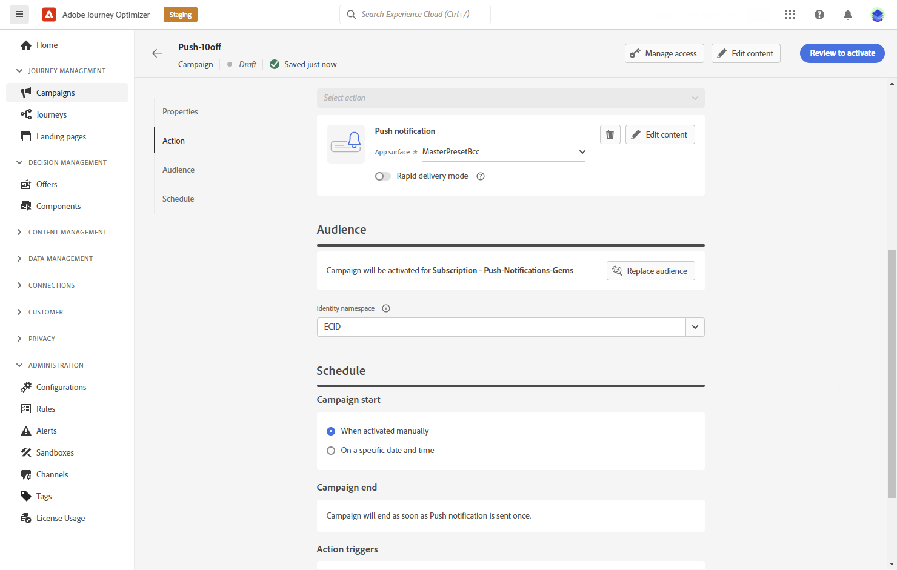

# Criar uma notificação por push {#create-push-notification}

>[!CONTEXTUALHELP]
>id="ajo_message_push"
>title="Criação de mensagens por push"
>abstract="Adicione sua mensagem por push e comece a personalizá-la com o editor de expressão."

## Criar a notificação por push em uma jornada ou campanha {#create}

Para criar uma notificação por push, siga as etapas abaixo:

>[!BEGINTABS]

>[!TAB Adicionar push a uma Jornada]

1. Abra a jornada e arraste e solte uma atividade de push da seção Ações da paleta.

   

1. Forneça informações básicas sobre a mensagem (rótulo, descrição, categoria) e escolha a superfície de mensagem a ser usada. A variável **[!UICONTROL Superficial]** é pré-preenchido, por padrão, com a última superfície usada para esse canal pelo usuário.

   

   >[!NOTE]
   >
   >Se você estiver enviando uma notificação por push de uma jornada, poderá aproveitar o recurso de Otimização de hora de envio da Adobe Journey Optimizer para prever o melhor momento para enviar a mensagem e maximizar o engajamento com base no histórico de taxas de abertura e de cliques. [Saiba como trabalhar com a Otimização de tempo de envio](../building-journeys/journeys-message.md#send-time-optimization)

   Para obter mais informações sobre como configurar uma jornada, consulte [esta página](../building-journeys/journey-gs.md)

1. Na tela de configuração do jornada, clique na guia **[!UICONTROL Editar conteúdo]** botão para configurar o conteúdo de push. [Criar uma notificação por push](design-push.md)

1. Depois que o conteúdo da mensagem for definido, você poderá usar perfis de teste para visualizar seu conteúdo.

1. Quando o push estiver pronto, conclua a configuração de [jornada](../building-journeys/journey-gs.md) para enviá-lo.

   Para rastrear o comportamento dos recipients por meio de aberturas e/ou interações de push, verifique se as opções dedicadas na seção de rastreamento estão ativadas no [atividade de email](../building-journeys/journeys-message.md).

>[!TAB Adicionar uma notificação por push a uma campanha]

1. Crie uma nova campanha programada ou acionada por API, selecione **[!UICONTROL Notificação por push]** como sua ação e escolha a opção **[!UICONTROL Superfície do aplicativo]** para usar. [Saiba mais sobre configuração de push](push-configuration.md).

   

1. Clique em **[!UICONTROL Criar]**.

1. No **[!UICONTROL Propriedades]** edite o da sua campanha **[!UICONTROL Título]** e **[!UICONTROL Descrição]**.

   

1. Clique em **[!UICONTROL Selecionar público]** botão para definir o público-alvo a ser direcionado na lista de públicos-alvo disponíveis do Adobe Experience Platform. [Saiba mais](../audience/about-audiences.md).

1. No **[!UICONTROL Namespace de identidade]** escolha o namespace a ser usado para identificar os indivíduos do público-alvo selecionado. [Saiba mais](../event/about-creating.md#select-the-namespace).

   

1. Clique em **[!UICONTROL Criar experimento]** para começar a configurar seu experimento de conteúdo e criar tratamentos para medir seu desempenho e identificar a melhor opção para seu público-alvo. [Saiba mais](../campaigns/content-experiment.md)

1. As campanhas são projetadas para serem executadas em uma data específica ou em uma frequência recorrente. Saiba como configurar o **[!UICONTROL Agendar]** da sua campanha no [nesta seção](../campaigns/create-campaign.md#schedule).

1. No **[!UICONTROL Acionadores de ação]** selecione o **[!UICONTROL Frequência]** da sua notificação por push:

   * Uma vez
   * Diariamente
   * Semanalmente
   * Mensalmente

1. Na tela de configuração da campanha, clique no link **[!UICONTROL Editar conteúdo]** botão para configurar o conteúdo de push. [Criar uma notificação por push](design-push.md)

1. Depois que o conteúdo da mensagem for definido, você poderá usar perfis de teste para visualizar seu conteúdo.

1. Quando o push estiver pronto, conclua a configuração de [campaign](../campaigns/create-campaign.md) para enviá-lo.

   Para rastrear o comportamento dos recipients por meio de aberturas e/ou interações de push, verifique se as opções dedicadas na seção de rastreamento estão ativadas no [campaign](../campaigns/create-campaign.md).

>[!ENDTABS]

**Tópicos relacionados**

* [Configurar canal por push](push-gs.md)
* [Adicionar uma mensagem em uma jornada](../building-journeys/journeys-message.md)

## Modo de entrega rápida {#rapid-delivery}

>[!CONTEXTUALHELP]
>id="ajo_campaigns_rapid_delivery"
>title="Modo de entrega rápida"
>abstract="O modo de entrega rápida permite que você execute o envio de mensagens de alta velocidade no canal de push para um tamanho de público inferior a 30 milhões."

O modo de entrega rápida é um [!DNL Journey Optimizer] complemento que permite o envio muito rápido de mensagens por push em grandes volumes por meio de campanhas.

A entrega rápida é usada quando o atraso na entrega da mensagem é essencial para os negócios, quando você deseja enviar um alerta de push urgente em telefones celulares, por exemplo, notícias de última hora para usuários que instalaram seu aplicativo de canal de notícias.

Para obter mais informações sobre desempenho ao usar o modo de entrega rápida, consulte [Descrição do produto Adobe Journey Optimizer](https://helpx.adobe.com/br/legal/product-descriptions/adobe-journey-optimizer.html).

### Pré-requisitos {#prerequisites}

As mensagens de delivery rápido vêm com os seguintes requisitos:

* A entrega rápida está disponível para **[!UICONTROL Agendado]** somente campanhas, e não está disponível para campanhas acionadas por API,
* Nenhuma personalização é permitida na mensagem de push,
* O público-alvo deve conter menos de 30 milhões de perfis,
* Você pode executar até 5 campanhas simultaneamente usando o modo de entrega rápida.

### Ativar modo de entrega rápida

1. Crie uma campanha de notificação por push e alterne para a **[!UICONTROL Entrega rápida]** opção.

1. Configure o conteúdo da mensagem e selecione o público-alvo a ser direcionado. [Saiba como criar uma campanha](#create)

   >[!IMPORTANT]
   >
   >Verifique se o conteúdo da mensagem não inclui personalização e se o público-alvo contém menos de 30 milhões de perfis.

1. Revise e ative sua campanha como de costume. Observe que, no modo de teste, as mensagens não são enviadas pelo modo de delivery rápido.